# Aqua0 Cross-Chain AMM - Mermaid Sequence Diagrams

## Phase 1: LP Strategy Setup (Cross-Chain Shipping)

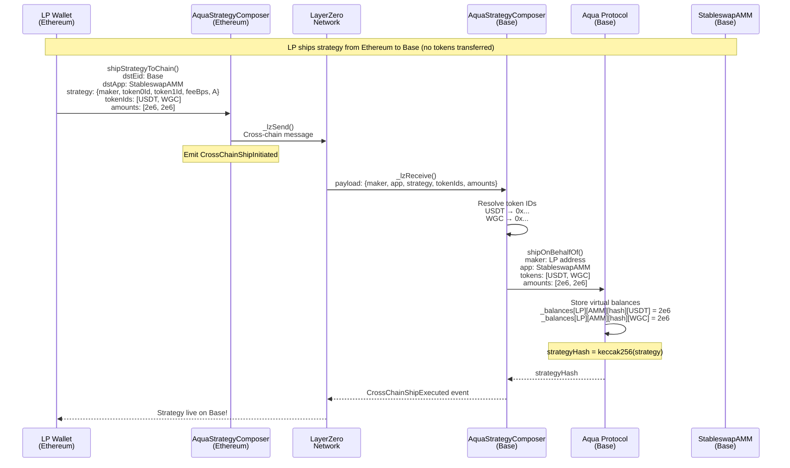

---

## Phase 2: Intent Submission (World Chain)

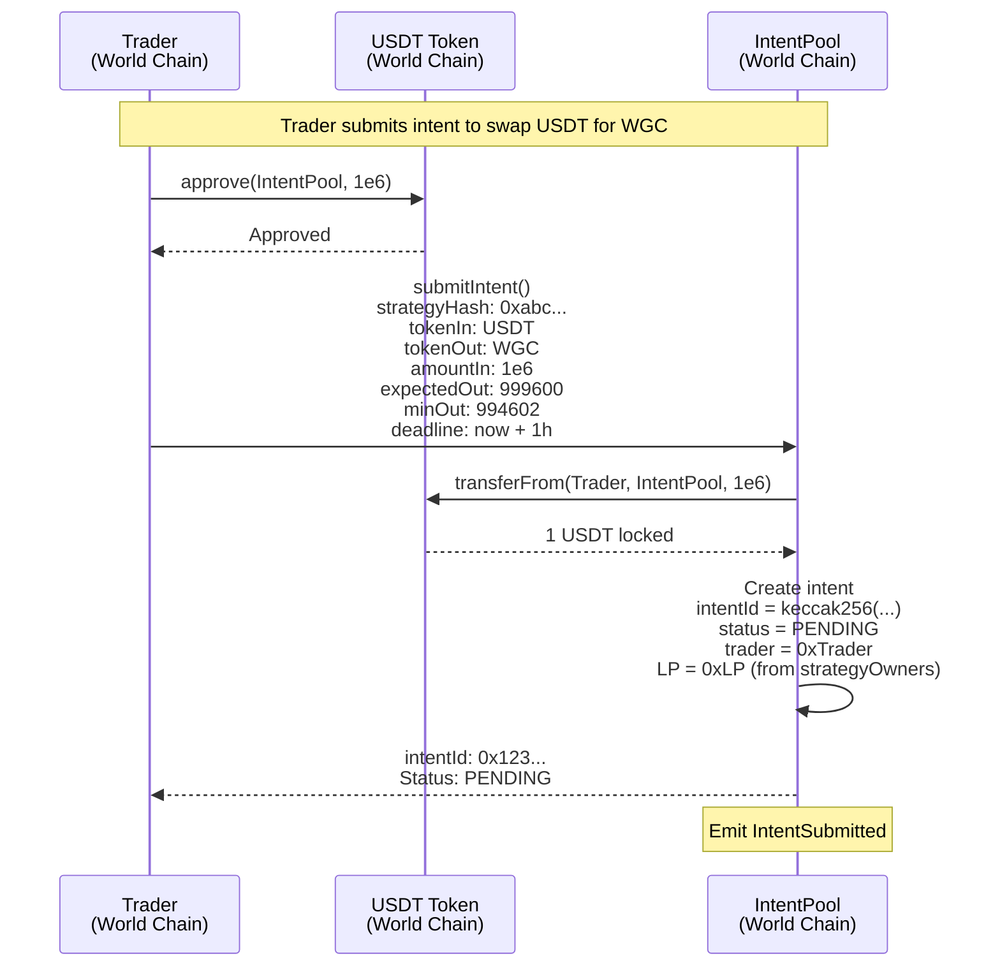

---

## Phase 3: Intent Fulfillment (World Chain)

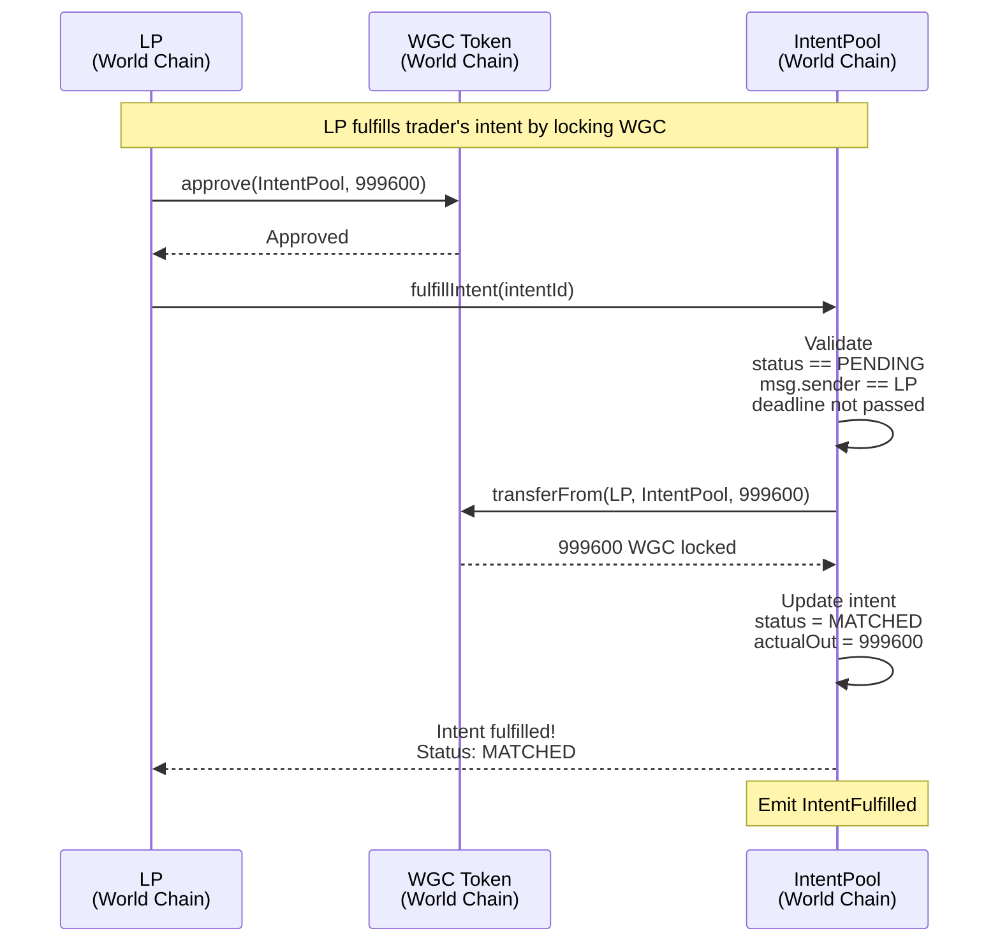

---

## Phase 4: Settlement - Dual Token Bridge (World → Base)

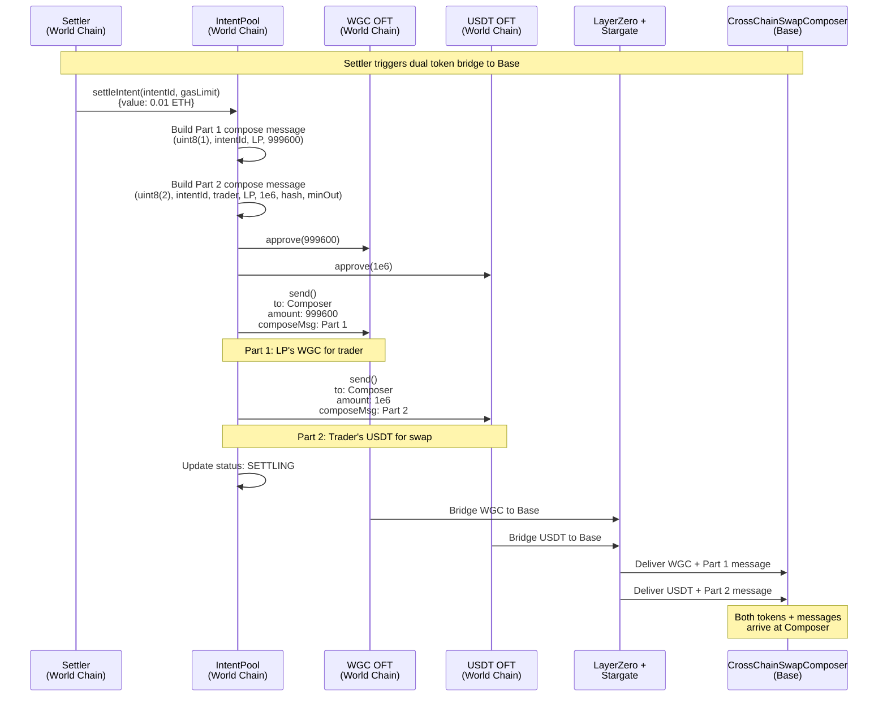

---

## Phase 5: Swap Execution on Base

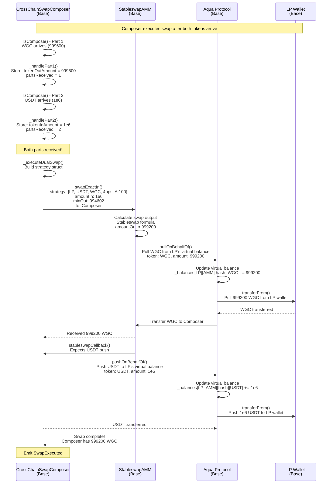

---

## Phase 6: Bridge Tokens Back to World Chain

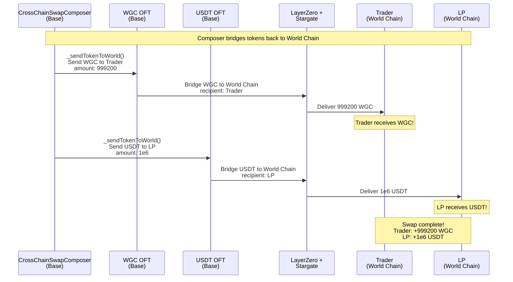

---

## Complete End-to-End Flow (Simplified)

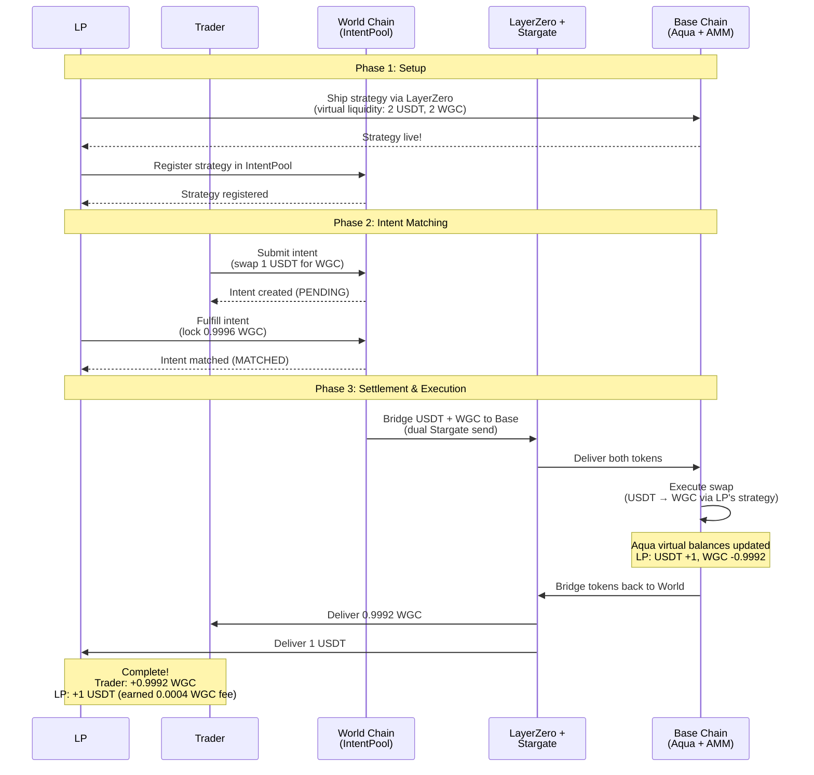

---

## Aqua Virtual Balance State Changes

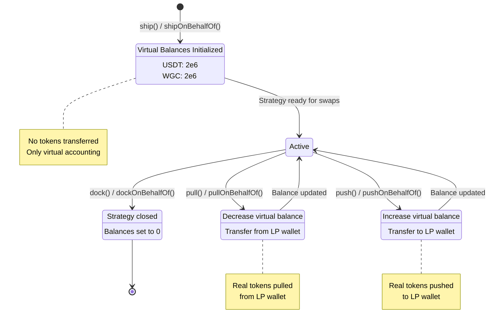

---

## Intent State Machine

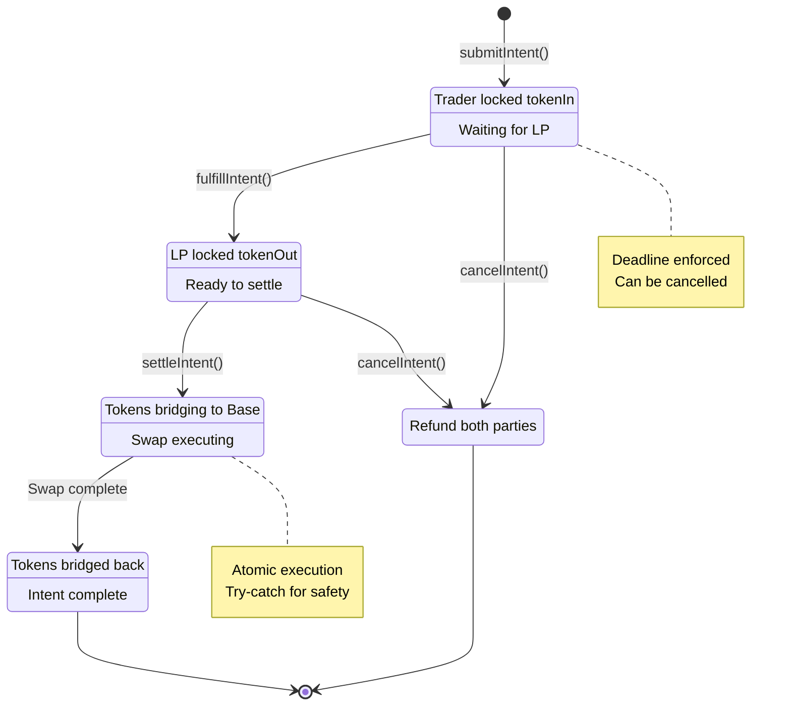

---

## Architecture Overview

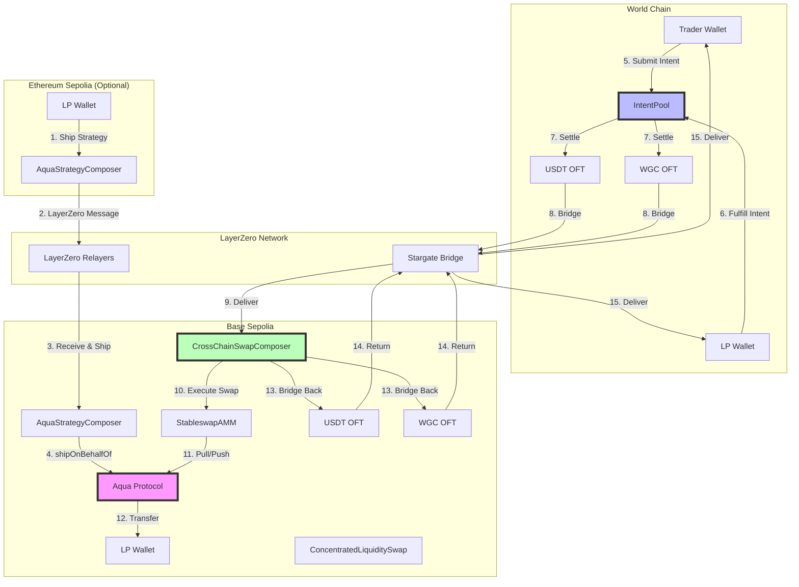

---

## Token Flow Diagram

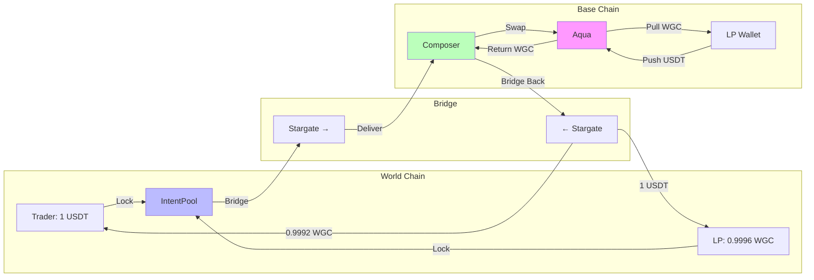

---

## Key Formulas

### Stableswap AMM (Curve-style)

**Invariant:**
```
An^n ∑x_i + D = An^n D + D^(n+1)/(n^n ∏x_i)
```

**Simplified Output Calculation:**
```
weight = (A * PRECISION) / (A + 1)
amountOut = (weight * constantSumOut + (1 - weight) * constantProductOut)
```

Where:
- `A = 100` (high amplification for stablecoins)
- `constantSumOut = amountIn` (1:1 swap)
- `constantProductOut = (amountIn * balanceOut) / (balanceIn + amountIn)`

### Concentrated Liquidity (Uniswap V3-style)

**Virtual Reserves:**
```
x_virtual × y_virtual = L²
```

**Range Multiplier:**
```
if rangeWidth ≤ 10%: multiplier = 2x
if rangeWidth ≤ 50%: multiplier = 1.5x
else: multiplier = 1x
```

**Effective Output:**
```
effectiveBalanceIn = balanceIn * rangeMultiplier
effectiveBalanceOut = balanceOut * rangeMultiplier
amountOut = (amountIn * effectiveBalanceOut) / (effectiveBalanceIn + amountIn)
```

---

## Summary

This accurate sequence diagram shows:

1. **Virtual Liquidity**: LPs ship strategies without transferring tokens
2. **Intent Matching**: Traders and LPs lock tokens on World Chain
3. **Dual Bridge**: Both tokens bridge to Base via Stargate
4. **Atomic Execution**: Swap executes on Base using Aqua's virtual balances
5. **Return Bridge**: Output tokens bridge back to World Chain

**Key Innovation**: Aqua's virtual balance system allows LPs to provide liquidity without locking tokens in pools, enabling cross-chain AMM strategies with minimal capital requirements.


