# Aqua0 Complete Flow - Single Mermaid Sequence Diagram

## Complete End-to-End Cross-Chain Swap Flow

This diagram shows the entire Aqua0 flow from LP setup to trader receiving tokens, all in one comprehensive sequence diagram.

```mermaid
sequenceDiagram
    autonumber
    
    participant LP_ETH as LP Wallet<br/>(Ethereum)
    participant Composer_ETH as AquaStrategyComposer<br/>(Ethereum)
    participant LZ as LayerZero<br/>Network
    participant Composer_Base as AquaStrategyComposer<br/>(Base)
    participant Aqua as Aqua Protocol<br/>(Base)
    participant AMM as StableswapAMM<br/>(Base)
    participant LP_Base as LP Wallet<br/>(Base)
    participant Trader_World as Trader<br/>(World Chain)
    participant LP_World as LP<br/>(World Chain)
    participant IntentPool as IntentPool<br/>(World Chain)
    participant USDT_World as USDT Token<br/>(World Chain)
    participant WGC_World as WGC Token<br/>(World Chain)
    participant Stargate as Stargate<br/>Bridge
    participant SwapComposer as CrossChainSwapComposer<br/>(Base)
    participant USDT_Base as USDT Token<br/>(Base)
    participant WGC_Base as WGC Token<br/>(Base)
    
    rect rgb(240, 248, 255)
        Note over LP_ETH,Aqua: PHASE 1: LP Strategy Setup (Cross-Chain Shipping)
        
        LP_ETH->>Composer_ETH: shipStrategyToChain()<br/>dstEid: Base, app: StableswapAMM<br/>strategy: {maker, token0Id, token1Id, feeBps:4, A:100}<br/>tokenIds: [USDT, WGC], amounts: [2e6, 2e6]
        Note over Composer_ETH: No tokens transferred!<br/>Only LayerZero message
        
        Composer_ETH->>LZ: _lzSend(payload)<br/>Cross-chain message
        Note over Composer_ETH: Emit CrossChainShipInitiated
        
        LZ->>Composer_Base: _lzReceive()<br/>payload: {maker, app, strategy, tokenIds, amounts}
        
        Composer_Base->>Composer_Base: Resolve token IDs to addresses<br/>USDT_ID → 0xUSDT_Base<br/>WGC_ID → 0xWGC_Base
        
        Composer_Base->>Aqua: shipOnBehalfOf()<br/>maker: LP, app: AMM<br/>tokens: [USDT, WGC]<br/>amounts: [2e6, 2e6]
        
        Aqua->>Aqua: Record virtual balances<br/>_balances[LP][AMM][hash][USDT] = 2e6<br/>_balances[LP][AMM][hash][WGC] = 2e6<br/>strategyHash = keccak256(strategy)
        Note over Aqua: Tokens stay in LP wallet!<br/>Only virtual accounting
        
        Aqua-->>Composer_Base: strategyHash: 0xabc...
        Composer_Base-->>LZ: CrossChainShipExecuted event
        LZ-->>LP_ETH: Strategy live on Base!
    end
    
    rect rgb(255, 250, 240)
        Note over LP_World,IntentPool: PHASE 2: LP Registers Strategy on World Chain
        
        LP_World->>IntentPool: registerStrategy()<br/>strategyHash: 0xabc...<br/>LP: 0xLP_address
        
        IntentPool->>IntentPool: Store mapping<br/>strategyOwners[0xabc...] = 0xLP
        
        IntentPool-->>LP_World: Strategy registered!<br/>Ready to fulfill intents
    end
    
    rect rgb(240, 255, 240)
        Note over Trader_World,IntentPool: PHASE 3: Trader Submits Intent
        
        Trader_World->>USDT_World: approve(IntentPool, 1e6)
        USDT_World-->>Trader_World: Approved
        
        Trader_World->>IntentPool: submitIntent()<br/>strategyHash: 0xabc...<br/>tokenIn: USDT, tokenOut: WGC<br/>amountIn: 1e6 (1 USDT)<br/>expectedOut: 999600 (0.04% fee)<br/>minOut: 994602 (0.5% slippage)<br/>deadline: now + 1h
        
        IntentPool->>USDT_World: transferFrom(Trader, IntentPool, 1e6)
        USDT_World-->>IntentPool: 1 USDT locked
        
        IntentPool->>IntentPool: Create intent<br/>intentId = keccak256(...)<br/>status = PENDING<br/>trader = 0xTrader<br/>LP = 0xLP (from strategyOwners)
        Note over IntentPool: Emit IntentSubmitted
        
        IntentPool-->>Trader_World: intentId: 0x123...<br/>Status: PENDING
    end
    
    rect rgb(255, 240, 245)
        Note over LP_World,IntentPool: PHASE 4: LP Fulfills Intent
        
        LP_World->>WGC_World: approve(IntentPool, 999600)
        WGC_World-->>LP_World: Approved
        
        LP_World->>IntentPool: fulfillIntent(intentId: 0x123...)
        
        IntentPool->>IntentPool: Validate<br/>status == PENDING<br/>msg.sender == LP<br/>deadline not passed
        
        IntentPool->>WGC_World: transferFrom(LP, IntentPool, 999600)
        WGC_World-->>IntentPool: 999600 WGC locked
        
        IntentPool->>IntentPool: Update intent<br/>status = MATCHED<br/>actualOut = 999600
        Note over IntentPool: Emit IntentFulfilled
        
        IntentPool-->>LP_World: Intent fulfilled!<br/>Status: MATCHED
    end
    
    rect rgb(245, 245, 255)
        Note over Trader_World,SwapComposer: PHASE 5: Settlement - Dual Token Bridge (World → Base)
        
        Note over IntentPool: Anyone can trigger settlement
        Trader_World->>IntentPool: settleIntent(intentId, gasLimit: 500000)<br/>{value: 0.01 ETH for LayerZero fees}
        
        IntentPool->>IntentPool: Build Part 1 compose message<br/>(uint8(1), intentId, LP, 999600)
        IntentPool->>IntentPool: Build Part 2 compose message<br/>(uint8(2), intentId, trader, LP, 1e6, hash, minOut)
        
        IntentPool->>WGC_World: approve(WGC_OFT, 999600)
        IntentPool->>USDT_World: approve(USDT_OFT, 1e6)
        
        IntentPool->>Stargate: IOFT(WGC_OFT).send()<br/>Part 1: LP's WGC for trader<br/>to: SwapComposer<br/>amount: 999600<br/>composeMsg: Part 1
        Note over IntentPool,Stargate: First token send
        
        IntentPool->>Stargate: IOFT(USDT_OFT).send()<br/>Part 2: Trader's USDT for swap<br/>to: SwapComposer<br/>amount: 1e6<br/>composeMsg: Part 2
        Note over IntentPool,Stargate: Second token send
        
        IntentPool->>IntentPool: Update status: SETTLING
        
        Stargate->>SwapComposer: Bridge WGC to Base<br/>(LayerZero + Stargate)
        Stargate->>SwapComposer: Bridge USDT to Base<br/>(LayerZero + Stargate)
        Note over Stargate,SwapComposer: Both tokens bridging...
    end
    
    rect rgb(255, 245, 238)
        Note over SwapComposer,LP_Base: PHASE 6: Swap Execution on Base
        
        SwapComposer->>SwapComposer: lzCompose() - Part 1<br/>WGC arrives: 999600
        SwapComposer->>SwapComposer: _handlePart1()<br/>Store: tokenOutAmount = 999600<br/>partsReceived = 1
        Note over SwapComposer: Waiting for Part 2...
        
        SwapComposer->>SwapComposer: lzCompose() - Part 2<br/>USDT arrives: 1e6
        SwapComposer->>SwapComposer: _handlePart2()<br/>Store: tokenInAmount = 1e6<br/>partsReceived = 2
        Note over SwapComposer: Both parts received!<br/>Emit BothPartsReceived
        
        SwapComposer->>SwapComposer: _executeDualSwap()<br/>Build strategy struct
        
        SwapComposer->>AMM: swapExactIn()<br/>strategy: {LP, USDT, WGC, feeBps:4, A:100}<br/>zeroForOne: true<br/>amountIn: 1e6<br/>minOut: 994602<br/>to: SwapComposer
        
        AMM->>AMM: Calculate swap output<br/>Stableswap formula:<br/>weight = (A*1e18)/(A+1)<br/>amountOut = blend(constantSum, constantProduct)<br/>Result: amountOut ≈ 999200
        
        AMM->>Aqua: pullOnBehalfOf()<br/>maker: LP, app: AMM<br/>token: WGC, amount: 999200
        Note over AMM,Aqua: Pull WGC from LP's virtual balance
        
        Aqua->>Aqua: Update virtual balance<br/>_balances[LP][AMM][hash][WGC]<br/>2e6 → 1000800 (-999200)
        
        Aqua->>LP_Base: transferFrom(LP, SwapComposer, 999200)
        Note over Aqua,LP_Base: Real tokens pulled from LP wallet
        LP_Base-->>Aqua: 999200 WGC transferred
        
        Aqua->>WGC_Base: Transfer to SwapComposer
        WGC_Base-->>AMM: WGC delivered
        AMM-->>SwapComposer: Received 999200 WGC
        
        AMM->>SwapComposer: stableswapCallback()<br/>Expects USDT push<br/>tokenIn: USDT, amountIn: 1e6
        Note over AMM,SwapComposer: AMM expects trader's USDT
        
        SwapComposer->>Aqua: pushOnBehalfOf()<br/>maker: LP, app: AMM<br/>token: USDT, amount: 1e6<br/>payer: SwapComposer
        Note over SwapComposer,Aqua: Push USDT to LP's virtual balance
        
        Aqua->>Aqua: Update virtual balance<br/>_balances[LP][AMM][hash][USDT]<br/>2e6 → 3e6 (+1e6)
        
        Aqua->>USDT_Base: transferFrom(SwapComposer, LP, 1e6)
        Note over Aqua,USDT_Base: Real tokens pushed to LP wallet
        USDT_Base->>LP_Base: 1e6 USDT transferred
        
        Aqua-->>SwapComposer: Push complete
        SwapComposer-->>AMM: Callback complete
        AMM-->>SwapComposer: Swap complete!<br/>SwapComposer has 999200 WGC
        Note over SwapComposer: Emit SwapExecuted
    end
    
    rect rgb(240, 255, 255)
        Note over SwapComposer,LP_World: PHASE 7: Bridge Tokens Back to World Chain
        
        SwapComposer->>WGC_Base: _sendTokenToWorld()<br/>token: WGC<br/>recipient: Trader<br/>amount: 999200
        
        WGC_Base->>Stargate: Bridge WGC to World Chain<br/>(LayerZero + Stargate)
        
        Stargate->>WGC_World: Deliver to Trader
        WGC_World->>Trader_World: Receive 999200 WGC
        Note over Trader_World: ✅ Trader receives WGC!
        
        SwapComposer->>USDT_Base: _sendTokenToWorld()<br/>token: USDT<br/>recipient: LP<br/>amount: 1e6
        
        USDT_Base->>Stargate: Bridge USDT to World Chain<br/>(LayerZero + Stargate)
        
        Stargate->>USDT_World: Deliver to LP
        USDT_World->>LP_World: Receive 1e6 USDT
        Note over LP_World: ✅ LP receives USDT!
    end
    
    rect rgb(245, 255, 245)
        Note over Trader_World,LP_World: SWAP COMPLETE! 🎉
        Note over Trader_World: Trader Result:<br/>Paid: 1e6 USDT<br/>Received: 999200 WGC<br/>Cost: 800 USDT (fees + slippage)
        Note over LP_World: LP Result:<br/>Locked: 999600 WGC<br/>Received: 1e6 USDT<br/>Profit: 400 WGC (earned from fees)
        Note over Aqua: LP's Virtual Balances on Base:<br/>USDT: 2e6 → 3e6 (+1e6)<br/>WGC: 2e6 → 1000800 (-999200)<br/>Net: +1e6 USDT, -999200 WGC
    end
```



---

## Flow Summary

### Timeline

| Step | Phase | Duration | Key Action |
|------|-------|----------|------------|
| 1-12 | Setup | 5-10 min | LP ships strategy (Ethereum → Base) |
| 13-15 | Registration | Instant | LP registers on World Chain |
| 16-22 | Intent | Instant | Trader submits intent |
| 23-30 | Fulfillment | Instant | LP fulfills intent |
| 31-41 | Settlement | 5-10 min | Dual bridge (World → Base) |
| 42-69 | Execution | Instant | Swap executes on Base |
| 70-78 | Return | 5-10 min | Bridge back (Base → World) |
| **Total** | **End-to-End** | **10-20 min** | **Complete swap** |

---

## Key Insights from the Diagram

### 1. Virtual Liquidity (Steps 9-11)
```
Aqua records: _balances[LP][AMM][hash][USDT] = 2e6
                            [WGC] = 2e6
```
**No tokens transferred!** Only virtual accounting.

### 2. Dual Token Bridge (Steps 36-41)
```
Part 1: LP's WGC (999600) → SwapComposer
Part 2: Trader's USDT (1e6) → SwapComposer
```
**Both must arrive before swap executes.**

### 3. Pull & Push Mechanism (Steps 50-67)
```
Pull: Aqua → LP Wallet → SwapComposer (WGC out)
Push: SwapComposer → LP Wallet → Aqua (USDT in)
```
**Tokens move through LP wallet, not locked in pools.**

### 4. Atomic Execution (Steps 42-69)
```
Receive Part 1 → Receive Part 2 → Execute Swap → Bridge Back
```
**All or nothing: If swap fails, both parties refunded.**

---

## Participant Roles

| Participant | Role | Key Responsibility |
|------------|------|-------------------|
| **LP (Ethereum)** | Strategy Provider | Ships strategy cross-chain |
| **LP (World Chain)** | Intent Fulfiller | Locks tokenOut for traders |
| **LP (Base)** | Token Holder | Holds real tokens, provides liquidity |
| **Trader (World)** | Intent Submitter | Locks tokenIn, receives tokenOut |
| **IntentPool** | Intent Matcher | Matches traders with LPs |
| **AquaStrategyComposer** | Strategy Shipper | Ships strategies via LayerZero |
| **CrossChainSwapComposer** | Swap Coordinator | Coordinates dual bridge & execution |
| **Aqua** | Virtual Balance Tracker | Tracks virtual balances, pull/push tokens |
| **StableswapAMM** | Swap Executor | Executes Curve-style swaps |
| **Stargate** | Token Bridge | Bridges tokens cross-chain |
| **LayerZero** | Message Layer | Delivers cross-chain messages |

---

## Token Movements

### USDT Flow
```
Trader (World) → IntentPool → Stargate → SwapComposer (Base)
                                              ↓
                                    Aqua → LP Wallet (Base)
                                              ↓
                                    Stargate → LP (World)
```

### WGC Flow
```
LP (World) → IntentPool → Stargate → SwapComposer (Base)
                                          ↓
                              LP Wallet (Base) → Aqua → SwapComposer
                                          ↓
                              Stargate → Trader (World)
```

---

## Virtual Balance Changes

### LP's Virtual Balances on Base

| Stage | USDT | WGC | Change |
|-------|------|-----|--------|
| After ship | 2e6 | 2e6 | Initial |
| After pull | 2e6 | 1000800 | -999200 WGC |
| After push | 3e6 | 1000800 | +1e6 USDT |
| **Net** | **+1e6** | **-999200** | **Swap executed** |

---

## Critical Points

### ⚠️ Must Understand

1. **No tokens transferred during strategy shipping** (Steps 1-12)
   - Only LayerZero message sent
   - Virtual balances recorded in Aqua

2. **Dual token bridge is required** (Steps 36-41)
   - Both LP's tokenOut and Trader's tokenIn must arrive
   - SwapComposer waits for `partsReceived == 2`

3. **Tokens stay in LP wallet** (Steps 50-67)
   - Aqua pulls from LP wallet when needed
   - Aqua pushes to LP wallet after swap

4. **AMM callback is critical** (Steps 62-67)
   - AMM expects SwapComposer to push trader's tokens
   - Without push, swap fails

5. **Atomic execution with refund** (Steps 42-69)
   - Try-catch wrapper around swap
   - On failure, both tokens refunded to original owners

---

## Formulas Used

### Stableswap Output Calculation (Step 48)
```
weight = (A * PRECISION) / (A + 1)
constantSumOut = amountIn
constantProductOut = (amountIn * balanceOut) / (balanceIn + amountIn)
amountOut = (weight * constantSumOut + (1 - weight) * constantProductOut) / PRECISION
```

Where:
- `A = 100` (high amplification for stablecoins)
- `PRECISION = 1e18`

### Fee Calculation
```
amountInWithFee = amountIn * (10000 - feeBps) / 10000
                = 1e6 * 9996 / 10000
                = 999600
```

Where:
- `feeBps = 4` (0.04% fee)

---

## Error Handling

### Swap Failure (Step 43)
```solidity
try this.handleDualSwap(intentId, transfer) {
    // Success path (Steps 44-69)
} catch {
    // Failure path
    _refundBothParties(transfer);
    emit SwapFailed(intentId, trader, amountIn);
}
```

### Refund Logic
```
If swap fails:
  - Refund WGC to LP on World Chain
  - Refund USDT to Trader on World Chain
```

---

## Monitoring Points

### Events to Watch

| Event | Contract | Meaning |
|-------|----------|---------|
| `CrossChainShipInitiated` | AquaStrategyComposer | Strategy shipping started |
| `CrossChainShipExecuted` | AquaStrategyComposer | Strategy live on Base |
| `IntentSubmitted` | IntentPool | Trader submitted intent |
| `IntentFulfilled` | IntentPool | LP fulfilled intent |
| `IntentSettling` | IntentPool | Settlement triggered |
| `PartReceived` | CrossChainSwapComposer | Token part arrived |
| `BothPartsReceived` | CrossChainSwapComposer | Ready to execute |
| `SwapExecuted` | CrossChainSwapComposer | Swap successful |
| `SwapFailed` | CrossChainSwapComposer | Swap failed, refunding |

---

## Gas Costs

| Operation | Chain | Estimated Gas |
|-----------|-------|---------------|
| Ship strategy | Ethereum | ~200k + LZ fee |
| Register strategy | World | ~50k |
| Submit intent | World | ~100k |
| Fulfill intent | World | ~80k |
| Settle intent | World | ~150k + bridge fees |
| Swap execution | Base | ~150k |
| Return bridge | Base | ~100k + bridge fees |

**Total**: ~830k gas + ~3 bridge fees (~0.03 ETH total)

---

## Success Criteria

### ✅ Swap Successful When:

1. Strategy shipped and registered
2. Intent submitted and fulfilled
3. Both tokens bridged to Base
4. Swap executed (amountOut >= minOut)
5. Tokens bridged back to World Chain
6. Trader receives WGC
7. LP receives USDT

### ❌ Swap Fails When:

1. Intent expires before settlement
2. Insufficient virtual balance
3. Slippage too high (amountOut < minOut)
4. LayerZero message fails
5. Bridge fails

---

## Next Steps

### For Implementation:
1. Deploy all contracts (see [CORRECT_DEPLOYMENT_ORDER.md](./CORRECT_DEPLOYMENT_ORDER.md))
2. Register tokens in AquaStrategyComposer
3. Set CrossChainSwapComposer as trusted delegate in Aqua
4. Test with small amounts first

### For Testing:
1. Run [QUICK_TEST_COMMANDS.sh](./QUICK_TEST_COMMANDS.sh)
2. Monitor events on LayerZero Scan
3. Verify virtual balances after each step
4. Confirm token receipts on World Chain

### For Debugging:
1. Check virtual balances: `aqua.safeBalances(...)`
2. Check intent status: `intentPool.getIntent(intentId)`
3. Monitor events: `cast logs --address $COMPOSER`
4. Track LayerZero: https://layerzeroscan.com

---

**This single diagram captures the entire Aqua0 flow from start to finish!** 🚀


