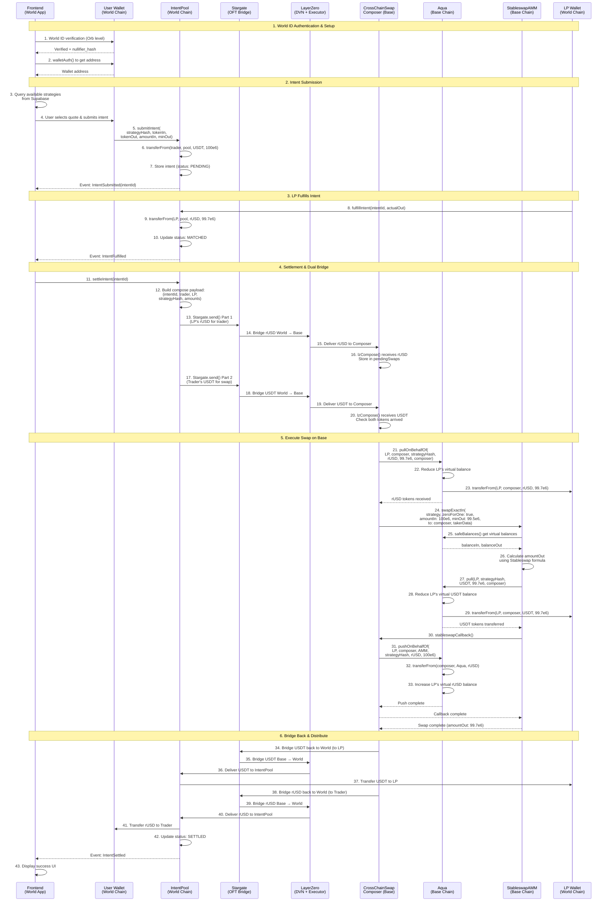
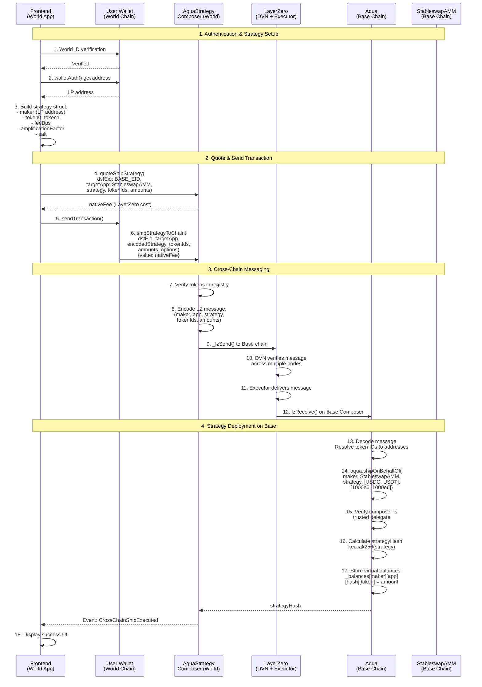
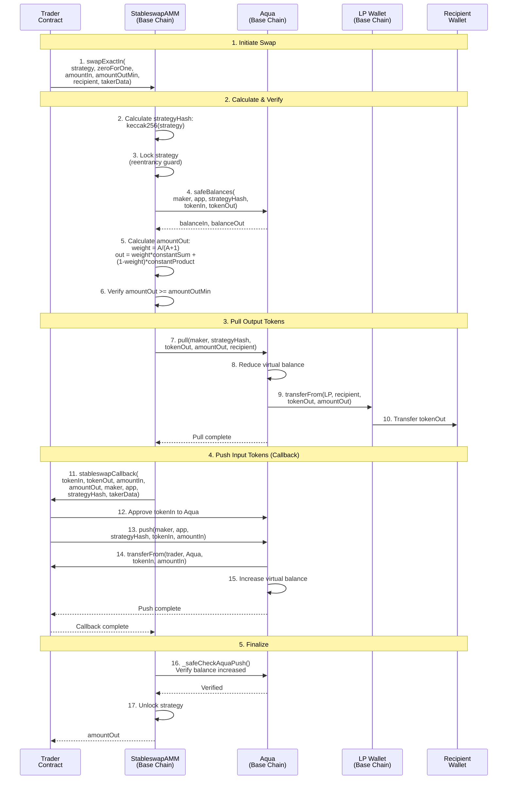
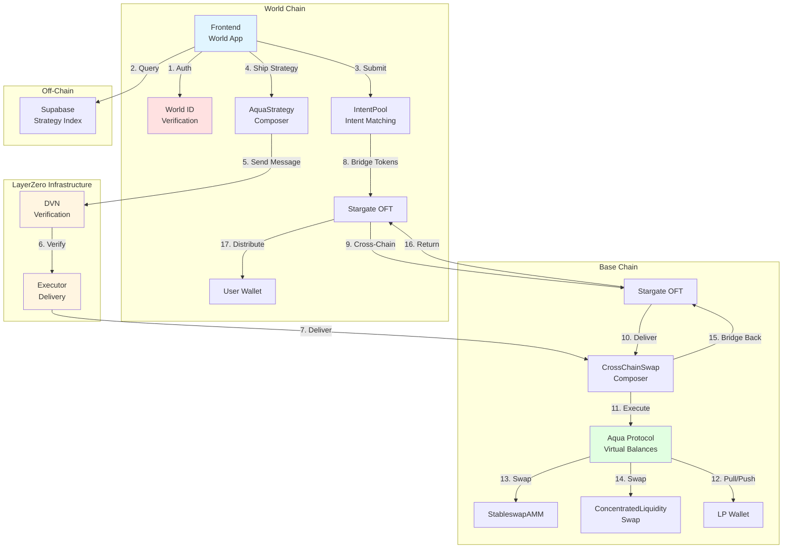
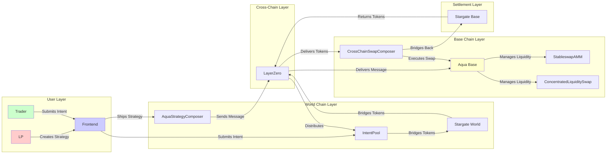

# Aqua0 Cross-Chain Swap - Mermaid Sequence Diagram

## Complete Cross-Chain Swap Flow (World → Base → World)

## LP Creates Cross-Chain Strategy Flow

## Direct Swap on Base Chain (Local)

## Architecture Overview

## Component Interaction Matrix

---

## Key Features

- **No Token Custody**: LP tokens stay in wallets, only virtual balances tracked
- **Cross-Chain Liquidity**: Single LP position serves traders on multiple chains
- **Intent-Based Architecture**: Async matching between traders and LPs
- **Trusted Delegates**: Composers can act on behalf of LPs
- **Atomic Execution**: All-or-nothing swaps with reentrancy protection
- **Immutable Strategies**: Parameters locked after deployment for safety

---

*Generated for Aqua0 Protocol - Cross-Chain Liquidity Infrastructure*

