# Aqua0 Simple Walkthrough - Easy to Follow

## 🎯 The Big Picture (30 seconds)

**What happens**: Trader on World Chain swaps USDT for WGC using LP's strategy that lives on Base Chain.

**Key insight**: Tokens bridge to Base, swap happens there, then bridge back.

---

## 📖 Simple Walkthrough Diagram

```mermaid
sequenceDiagram
    autonumber
    
    participant LP as 💼 LP
    participant Trader as 👤 Trader
    participant World as 🌍 World Chain
    participant Bridge as 🌉 LayerZero Bridge
    participant Base as ⚡ Base Chain<br/>(Aqua + AMM)
    
    Note over LP,Base: 🔧 SETUP (One-time, ~10 min)
    
    LP->>Base: 1. Ship strategy via message<br/>"I'll provide USDT/WGC swaps"<br/>Virtual liquidity: 2 USDT, 2 WGC
    Note over Base: Strategy recorded ✅<br/>No tokens sent!
    
    LP->>World: 2. Register strategy<br/>"I'm the LP for strategy 0xabc..."
    Note over World: LP registered ✅
    
    rect rgb(240, 255, 240)
        Note over Trader,Base: 💱 SWAP FLOW (Per trade, ~15 min)
        
        Note over Trader,World: Step 1: Submit Intent
        Trader->>World: 3. "I want to swap 1 USDT for WGC"<br/>Lock 1 USDT in IntentPool
        Note over World: Intent created<br/>Status: PENDING ⏳
        
        Note over LP,World: Step 2: Fulfill Intent
        LP->>World: 4. "I'll fulfill this!"<br/>Lock 0.9996 WGC in IntentPool
        Note over World: Intent matched<br/>Status: MATCHED ✅
        
        Note over World,Base: Step 3: Bridge to Base
        World->>Bridge: 5. Send BOTH tokens to Base:<br/>• LP's 0.9996 WGC<br/>• Trader's 1 USDT
        Bridge->>Base: 6. Deliver both tokens
        Note over Base: Both arrived! ✅
        
        Note over Base: Step 4: Execute Swap
        Base->>Base: 7. Execute swap on AMM<br/>1 USDT → 0.9992 WGC<br/>(using LP's strategy)
        Note over Base: LP's virtual balances updated:<br/>USDT: +1<br/>WGC: -0.9992
        
        Note over Base,World: Step 5: Bridge Back
        Base->>Bridge: 8. Send results back:<br/>• 0.9992 WGC to Trader<br/>• 1 USDT to LP
        Bridge->>Trader: 9. Deliver 0.9992 WGC
        Bridge->>LP: 10. Deliver 1 USDT
        
        Note over Trader,LP: ✅ COMPLETE!<br/>Trader: Got WGC<br/>LP: Got USDT + fees
    end
```



---

## 🚶 Step-by-Step Walkthrough

### 🔧 Setup Phase (One-time)

#### Step 1: LP Ships Strategy to Base
```
LP: "I want to provide USDT/WGC swaps on Base"
→ Sends LayerZero message (no tokens!)
→ Base records: "LP has virtual 2 USDT + 2 WGC"
→ Tokens stay in LP's wallet ✨
```

**Key point**: No tokens transferred, only virtual accounting!

#### Step 2: LP Registers on World Chain
```
LP: "I'm the LP for strategy 0xabc..."
→ World Chain records: "Strategy 0xabc belongs to LP"
→ Now traders can submit intents against this strategy
```

---

### 💱 Swap Phase (Per trade)

#### Step 3: Trader Submits Intent
```
Trader: "I want to swap 1 USDT for WGC"
→ Locks 1 USDT in IntentPool
→ Intent created (ID: 0x123...)
→ Status: PENDING ⏳
```

**What trader specifies**:
- Input: 1 USDT
- Expected output: 0.9996 WGC (0.04% fee)
- Min output: 0.9946 WGC (0.5% slippage)
- Deadline: 1 hour

#### Step 4: LP Fulfills Intent
```
LP: "I'll take this trade!"
→ Locks 0.9996 WGC in IntentPool
→ Intent updated
→ Status: MATCHED ✅
```

**Now both parties have locked tokens**:
- Trader: 1 USDT locked
- LP: 0.9996 WGC locked

#### Step 5: Bridge to Base (Anyone triggers)
```
Settler: "Let's execute this!"
→ IntentPool bridges BOTH tokens to Base:
  • LP's 0.9996 WGC (for trader)
  • Trader's 1 USDT (for swap)
→ Takes ~5 minutes (LayerZero)
```

**Why both tokens?**
- LP's WGC: What trader will receive
- Trader's USDT: What gets swapped

#### Step 6: Both Tokens Arrive on Base
```
Base receives:
✅ 0.9996 WGC from LP
✅ 1 USDT from Trader

CrossChainSwapComposer: "Both parts received, let's swap!"
```

#### Step 7: Execute Swap on Base
```
Swap execution:
1. AMM pulls 0.9992 WGC from LP's wallet (using virtual balance)
2. AMM calculates: 1 USDT → 0.9992 WGC
3. AMM pushes 1 USDT to LP's wallet
4. Composer receives 0.9992 WGC

Result: Swap complete! ✅
```

**LP's virtual balances on Base**:
- Before: 2 USDT, 2 WGC
- After: 3 USDT, 1.0008 WGC
- Change: +1 USDT, -0.9992 WGC

#### Step 8: Bridge Back to World Chain
```
Composer sends back:
→ 0.9992 WGC to Trader
→ 1 USDT to LP
→ Takes ~5 minutes (LayerZero)
```

#### Step 9-10: Tokens Delivered
```
✅ Trader receives: 0.9992 WGC on World Chain
✅ LP receives: 1 USDT on World Chain

Swap complete! 🎉
```

---

## 💰 Who Gets What?

### Trader's View
```
Paid:     1 USDT
Received: 0.9992 WGC
Cost:     0.0008 USDT (fees + slippage)
```

### LP's View
```
Locked:   0.9996 WGC
Received: 1 USDT
Profit:   0.0004 WGC (fees earned)
```

### LP's Virtual Balance on Base
```
Before swap:
  USDT: 2
  WGC:  2

After swap:
  USDT: 3      (+1)
  WGC:  1.0008 (-0.9992)

Net: Swapped 0.9992 WGC for 1 USDT
```

---

## ⏱️ Timeline

| Step | Action | Time |
|------|--------|------|
| 1-2 | Setup | 10 min (one-time) |
| 3 | Submit intent | Instant |
| 4 | Fulfill intent | Instant |
| 5 | Bridge to Base | ~5 min |
| 6-7 | Execute swap | Instant |
| 8 | Bridge back | ~5 min |
| 9-10 | Receive tokens | Instant |
| **Total** | **Per swap** | **~10-15 min** |

---

## 🎨 Visual Token Flow

```
TRADER'S USDT:
World (Trader) → IntentPool → Bridge → Base (Swap) → Bridge → World (LP)
   [Lock]                                [Execute]              [Receive]

LP'S WGC:
World (LP) → IntentPool → Bridge → Base (Swap) → Bridge → World (Trader)
  [Lock]                            [Execute]              [Receive]
```

---

## 🔑 Key Concepts (Simple)

### 1. Virtual Liquidity
```
Traditional AMM: LP deposits tokens into pool contract
Aqua: LP keeps tokens in wallet, Aqua tracks "virtual" amounts

Benefits:
✅ No tokens locked
✅ LP keeps custody
✅ More flexible
```

### 2. Intent-Based Trading
```
Traditional: Trader → Swap (immediate)
Aqua0: Trader → Intent → LP fulfills → Execute

Benefits:
✅ Cross-chain execution
✅ Better pricing (LP competition)
✅ Flexible settlement
```

### 3. Dual Token Bridge
```
Why send both tokens?
• LP's WGC: For trader's output
• Trader's USDT: For swap input

Both needed on Base to execute swap!
```

---

## 🎯 Quick Test

Want to try it? Run these commands:

```bash
# 1. LP ships strategy (one-time)
forge script scripts/shipStrategyToChain.s.sol --broadcast

# 2. LP registers on World Chain (one-time)
forge script scripts/intent/RegisterStrategy.s.sol --broadcast

# 3. Trader submits intent
forge script scripts/intent/Step1_SubmitIntent.s.sol --broadcast

# 4. LP fulfills intent
forge script scripts/intent/Step2_FulfillIntent.s.sol --broadcast

# 5. Anyone settles (triggers bridge + swap)
forge script scripts/intent/Step3_SettleIntent.s.sol --broadcast

# 6. Wait ~10 minutes, check balances!
```

---

## 🤔 Common Questions

### Q: Where are LP's tokens during all this?

**A**: In LP's wallet on Base! They never leave. Aqua just tracks virtual balances and pulls/pushes as needed.

### Q: What if the swap fails?

**A**: Both tokens are automatically refunded:
- Trader gets USDT back
- LP gets WGC back

### Q: Why not just swap on World Chain?

**A**: Because the AMM strategy lives on Base (where Aqua is). This allows:
- LP to provide liquidity from one chain
- Traders to swap from any chain
- Better capital efficiency

### Q: How does LP make money?

**A**: From swap fees! In this example:
- LP locked: 0.9996 WGC
- LP received: 1 USDT
- If 1 USDT = 1 WGC, LP earned 0.0004 WGC

---

## 🎓 Next Steps

### Want to learn more?

1. **Visual learner?** See the detailed Mermaid diagram:
   - [COMPLETE_FLOW_SINGLE_DIAGRAM.md](./COMPLETE_FLOW_SINGLE_DIAGRAM.md)

2. **Developer?** Check the quick reference:
   - [DEVELOPER_QUICK_REFERENCE.md](./DEVELOPER_QUICK_REFERENCE.md)

3. **Deep dive?** Read the full technical docs:
   - [ACCURATE_SEQUENCE_DIAGRAM.md](./ACCURATE_SEQUENCE_DIAGRAM.md)

4. **Want to understand what was wrong before?**
   - [CORRECTIONS_SUMMARY.md](./CORRECTIONS_SUMMARY.md)

---

## 📊 Comparison: Traditional vs Aqua0

| Aspect | Traditional AMM | Aqua0 |
|--------|----------------|-------|
| **Liquidity** | Locked in pool | Stays in LP wallet |
| **Cross-chain** | Separate pools per chain | One strategy, many chains |
| **Capital efficiency** | ~10% utilized | ~90% utilized |
| **LP custody** | Pool holds tokens | LP holds tokens |
| **Execution** | Immediate | Intent-based (~15 min) |
| **Flexibility** | Fixed pools | Dynamic strategies |

---

## ✅ Summary

**Aqua0 in 3 sentences**:
1. LP ships a strategy to Base (virtual liquidity, no tokens sent)
2. Trader submits intent on World Chain, LP fulfills it
3. Tokens bridge to Base → Swap executes → Results bridge back

**Key innovation**: Virtual liquidity + cross-chain intents = Better capital efficiency! 🚀

---

**That's it! You now understand Aqua0! 🎉**

Questions? Check the other docs or the code in `/packages`.


