# Brainstorming app store for AMMs
_Exported on 22/11/2025 at 15:47:53 GMT-3 from Cursor (2.0.43)_

---

**User**

Taking reference from @README.md, can you figure out how to make sort of an app store for AMMs where anyone can deploy the strategies and not worry about LPing as the funds can come from any chain since we can utilise LZ composers using https://docs.layerzero.network/llms-full.txt 


do not code anything out, just brainstorming for now

---

**Cursor**

This is a fascinating concept! Let me brainstorm how we could create an omnichain AMM app store leveraging Aqua's shared liquidity layer with LayerZero's cross-chain messaging. Here's my thinking:

## Core Concept: Omnichain Aqua Strategy Marketplace

### The Vision
An "app store" where:
1. **Strategy Developers** deploy AMM strategies (XYC, concentrated liquidity, dynamic fees, etc.) on any chain
2. **Liquidity Providers** can fund strategies from ANY chain without bridging tokens themselves
3. **Traders** can execute swaps cross-chain, with liquidity automatically sourced from the optimal chain

### Architecture Components

#### 1. **Strategy Registry (Multi-chain)**
- Each chain has its own Aqua deployment with local strategy apps
- Strategies are indexed with metadata: `(chainId, appAddress, strategyHash, params)`
- Off-chain indexer aggregates all strategies across chains into a searchable marketplace
- Think: "Uniswap V3 pool on Arbitrum", "Custom volatility AMM on Base", etc.

#### 2. **Omnichain Liquidity Sourcing via LZ Composer**

The key innovation: **LPs don't need to be on the same chain as the strategy**

```
LP on Ethereum wants to fund a strategy on Arbitrum:

[LP Wallet - Ethereum]
         │
         │ 1. Approve tokens to OmnichainAquaRouter
         │ 2. Call: shipCrossChain(arbChainId, appAddress, strategy, tokens, amounts)
         │
         ▼
[OmnichainAquaRouter - Ethereum] (OApp)
         │
         │ 3. Locks tokens in escrow
         │ 4. Sends LZ message to Arbitrum
         │
         ▼ (LayerZero)
         │
[OmnichainAquaRouter - Arbitrum] (OApp)
         │
         │ 5. lzReceive() triggers lzCompose()
         │ 6. Mints synthetic/wrapped tokens OR uses local liquidity pool
         │
         ▼
[Aqua.ship() - Arbitrum]
         │
         │ 7. Strategy now active with "virtual" liquidity
         │
         ▼
[Strategy App - Arbitrum]
    (Ready for traders!)
```

#### 3. **Cross-Chain Liquidity Mechanisms**

**Option A: Synthetic Balances**
- OmnichainAquaRouter mints "IOU tokens" on destination chain
- Backed 1:1 by locked tokens on source chain
- When strategy earns fees/rebalances, sync back via LZ messages
- LP can `dock()` and withdraw to original chain

**Option B: Liquidity Pools**
- Pre-deployed liquidity pools on each chain (like Stargate)
- Cross-chain `ship()` borrows from pool, repays with fees
- More capital efficient but requires pool bootstrapping

**Option C: Hybrid**
- Use pools for major tokens (USDC, ETH, USDT)
- Use synthetic minting for long-tail assets

#### 4. **LayerZero Composer Integration**

The Composer pattern is perfect here because we need **multi-step execution**:

```solidity
// On source chain (Ethereum)
function shipCrossChain(
    uint32 dstEid,
    address dstApp,
    bytes calldata strategy,
    address[] calldata tokens,
    uint256[] calldata amounts
) external payable {
    // Lock tokens in escrow
    for (uint i = 0; i < tokens.length; i++) {
        IERC20(tokens[i]).transferFrom(msg.sender, address(this), amounts[i]);
    }
    
    // Send LZ message with compose option
    bytes memory payload = abi.encode(msg.sender, dstApp, strategy, tokens, amounts);
    bytes memory options = OptionsBuilder
        .newOptions()
        .addExecutorLzComposeOption(0, 500000, 0); // Gas for compose call
    
    _lzSend(dstEid, payload, options, MessagingFee(msg.value, 0), payable(msg.sender));
}

// On destination chain (Arbitrum)
function lzCompose(
    address _from,
    bytes32 _guid,
    bytes calldata _message,
    address _executor,
    bytes calldata _extraData
) external payable override {
    // Decode cross-chain ship request
    (address maker, address app, bytes memory strategy, address[] memory tokens, uint256[] memory amounts) = 
        abi.decode(_message, (address, address, bytes, address[], uint256[]));
    
    // Mint/source local tokens
    address[] memory localTokens = _sourceLiquidity(tokens, amounts);
    
    // Ship strategy on behalf of maker
    bytes32 strategyHash = aqua.ship(app, strategy, localTokens, amounts);
    
    // Register cross-chain ownership
    crossChainStrategies[maker][strategyHash] = SourceChain({
        chainId: _sourceEid,
        originalTokens: tokens
    });
}
```

### 5. **App Store Features**

#### For Strategy Developers:
- **Deploy once, available everywhere**: Deploy your AMM on one chain, it's discoverable globally
- **No liquidity bootstrapping needed**: LPs can fund from any chain
- **Revenue sharing**: Earn fees from cross-chain LP deposits (e.g., 0.05% of cross-chain ships)

#### For Liquidity Providers:
- **Chain abstraction**: Fund strategies on cheap chains (Arbitrum, Base) while keeping assets on Ethereum
- **Diversification**: Allocate to multiple strategies across chains without bridging
- **Unified dashboard**: Manage all positions from one interface, regardless of chain
- **Gas optimization**: Ship to multiple strategies in one LZ batch

#### For Traders:
- **Best execution**: Router finds optimal strategy across ALL chains
- **Cross-chain swaps**: Swap ETH on Ethereum for USDC on Arbitrum using Aqua strategies
- **Unified liquidity**: All strategies appear as one deep liquidity pool

### 6. **Off-Chain Components**

**Indexer Service** (like your `OffChainIndexer.ts` example):
- Listens to `PacketSent` events from all OmnichainAquaRouters
- Indexes all strategies with metadata: TVL, APY, chain, tokens, parameters
- Provides GraphQL/REST API for marketplace UI
- Tracks cross-chain strategy ownership

**Relayer/Keeper Network**:
- Monitors strategy health across chains
- Triggers rebalancing via LZ messages if needed
- Handles fee distribution back to source chains
- Could use Gelato/Chainlink Automation

### 7. **Security Considerations**

**Challenges:**
- **Liquidity fragmentation**: What if LP wants to withdraw but destination chain lacks tokens?
  - Solution: Maintain reserve pools, or queue withdrawals
  
- **Cross-chain MEV**: Arbitrage between chains during message propagation
  - Solution: Use price oracles, add slippage protection
  
- **Strategy manipulation**: Malicious strategies could drain cross-chain liquidity
  - Solution: Strategy verification/auditing, reputation system, insurance pools

- **LZ message failures**: What if `lzCompose` reverts?
  - Solution: Implement retry logic, refund mechanisms

### 8. **Novel Use Cases**

1. **Yield Aggregation**: LP on Ethereum earns fees from strategies on 5 different chains simultaneously

2. **Chain-Specific Strategies**: Deploy volatility AMM on Arbitrum (cheap execution) funded by Ethereum whales

3. **Governance Tokens**: Strategy developers issue tokens, LPs earn based on strategy performance across all chains

4. **Liquidity-as-a-Service**: Protocols pay LPs to provide liquidity to their strategies on specific chains

5. **Cross-Chain Limit Orders**: Place limit order on Optimism, funded from Base, executed when conditions met

### 9. **Comparison to Existing Solutions**

| Solution | Limitation | Aqua + LZ Approach |
|----------|-----------|-------------------|
| Stargate | Only supports bridging, not strategy deployment | Full AMM app store with custom strategies |
| Uniswap V3 | Liquidity fragmented per chain | Unified liquidity across chains |
| THORChain | Limited to specific assets, centralized nodes | Permissionless, any EVM chain |
| Across | Bridge-focused, no AMM strategies | Native strategy marketplace |

### 10. **Monetization & Incentives**

- **Platform fees**: 0.01% on cross-chain ships
- **Strategy marketplace fees**: 1% of strategy developer fees
- **Premium features**: Advanced analytics, MEV protection, priority routing
- **Governance token**: Vote on supported chains, strategy curation, fee parameters

---

## Key Innovation

The magic is combining:
1. **Aqua's virtual balance system** (no token custody, just accounting)
2. **LayerZero Composer** (multi-step cross-chain execution)
3. **Strategy immutability** (safer for cross-chain coordination)

This creates a **truly omnichain liquidity layer** where:
- Strategies live on optimal execution chains
- Liquidity sources from anywhere
- Traders get best prices globally
- Developers build once, deploy everywhere

The "app store" aspect means anyone can publish strategies, and the marketplace naturally surfaces the best ones through TVL, volume, and LP returns.

**Does this align with your vision? What aspects would you like to explore deeper?**

```plaintext
LP on Ethereum wants to fund a strategy on Arbitrum:

[LP Wallet - Ethereum]
         │
         │ 1. Approve tokens to OmnichainAquaRouter
         │ 2. Call: shipCrossChain(arbChainId, appAddress, strategy, tokens, amounts)
         │
         ▼
[OmnichainAquaRouter - Ethereum] (OApp)
         │
         │ 3. Locks tokens in escrow
         │ 4. Sends LZ message to Arbitrum
         │
         ▼ (LayerZero)
         │
[OmnichainAquaRouter - Arbitrum] (OApp)
         │
         │ 5. lzReceive() triggers lzCompose()
         │ 6. Mints synthetic/wrapped tokens OR uses local liquidity pool
         │
         ▼
[Aqua.ship() - Arbitrum]
         │
         │ 7. Strategy now active with "virtual" liquidity
         │
         ▼
[Strategy App - Arbitrum]
    (Ready for traders!)
```

```solidity
// On source chain (Ethereum)
function shipCrossChain(
    uint32 dstEid,
    address dstApp,
    bytes calldata strategy,
    address[] calldata tokens,
    uint256[] calldata amounts
) external payable {
    // Lock tokens in escrow
    for (uint i = 0; i < tokens.length; i++) {
        IERC20(tokens[i]).transferFrom(msg.sender, address(this), amounts[i]);
    }
    
    // Send LZ message with compose option
    bytes memory payload = abi.encode(msg.sender, dstApp, strategy, tokens, amounts);
    bytes memory options = OptionsBuilder
        .newOptions()
        .addExecutorLzComposeOption(0, 500000, 0); // Gas for compose call
    
    _lzSend(dstEid, payload, options, MessagingFee(msg.value, 0), payable(msg.sender));
}

// On destination chain (Arbitrum)
function lzCompose(
    address _from,
    bytes32 _guid,
    bytes calldata _message,
    address _executor,
    bytes calldata _extraData
) external payable override {
    // Decode cross-chain ship request
    (address maker, address app, bytes memory strategy, address[] memory tokens, uint256[] memory amounts) = 
        abi.decode(_message, (address, address, bytes, address[], uint256[]));
    
    // Mint/source local tokens
    address[] memory localTokens = _sourceLiquidity(tokens, amounts);
    
    // Ship strategy on behalf of maker
    bytes32 strategyHash = aqua.ship(app, strategy, localTokens, amounts);
    
    // Register cross-chain ownership
    crossChainStrategies[maker][strategyHash] = SourceChain({
        chainId: _sourceEid,
        originalTokens: tokens
    });
}
```

---

**User**

Did you go through the @README.md, make sure to correct your understanding

---

**Cursor**

You're absolutely right - let me correct my understanding after carefully reading the README. I made some critical errors:

## Key Corrections to My Understanding

### ❌ **What I Got Wrong:**

1. **Tokens DON'T move to Aqua or strategies**
   - I kept talking about "locking tokens in escrow" and "minting synthetic tokens"
   - **Reality**: Aqua is just an **accounting/registry system**. Tokens ALWAYS stay in LP's wallet with approval to Aqua
   - The `_balances` mapping only tracks **virtual balance allocations**, not actual token custody

2. **Misunderstood `pull()` and `push()`**
   - I suggested using these for liquidity management
   - **Reality**: These are **ONLY for swap execution**
   - `pull()`: App withdraws tokens from maker's wallet to trader during swap
   - `push()`: Trader deposits tokens into maker's virtual balance during swap

3. **Confused liquidity management**
   - **Add liquidity**: Use `ship()` to create strategy with initial virtual allocations
   - **Remove liquidity**: Use `dock()` to withdraw virtual allocations
   - **Change parameters**: `dock()` then `ship()` new strategy (no actual token transfers, just accounting changes!)

### ✅ **Corrected Architecture for Omnichain AMM App Store**

Now with proper understanding:

## The Real Innovation: Cross-Chain Virtual Balance Coordination

```
LP on Ethereum with 1000 USDC wants to provide liquidity to a strategy on Arbitrum:

Current Reality (Without Cross-Chain):
━━━━━━━━━━━━━━━━━━━━━━━━━━━━━━━━━━━━━━━━
[LP - Ethereum]
   1000 USDC in wallet
   ❌ Cannot participate in Arbitrum strategies
   ❌ Must bridge tokens to Arbitrum first
   ❌ Liquidity fragmented


With Omnichain Aqua (Proposed):
━━━━━━━━━━━━━━━━━━━━━━━━━━━━━━━━━━━━━━━━
[LP - Ethereum]
   1000 USDC in wallet
   ↓
   Approve USDC to OmnichainAquaRouter (Ethereum)
   ↓
   Call: shipCrossChain(arbChainId, strategyApp, strategy, [USDC], [1000])
   ↓
[OmnichainAquaRouter - Ethereum]
   ✅ Tokens STAY in LP's wallet on Ethereum
   ✅ Sends LZ message to Arbitrum with strategy params
   ↓ (LayerZero messaging)
   ↓
[OmnichainAquaRouter - Arbitrum] 
   Receives message via lzCompose()
   ↓
[Aqua.ship() - Arbitrum]
   ✅ Creates virtual balance entry: balances[LP][app][strategyHash][USDC] = 1000
   ✅ NO tokens on Arbitrum! Just accounting entry
   ↓
[Strategy Active on Arbitrum]
   Traders can now swap against this "virtual" liquidity
```

## The Critical Problem to Solve

**How do swaps execute when tokens are on a different chain?**

### Option 1: **Liquidity Pools as Bridges** (Most Practical)

```
Trader on Arbitrum wants to swap using LP's Ethereum-backed strategy:

[Trader - Arbitrum]
   Wants to swap 100 USDC → DAI
   ↓
[Strategy App - Arbitrum]
   Checks: balances[LP][app][strategyHash][USDC] = 1000 ✅
   Calculates: amountOut = 99 DAI
   ↓
   Needs to pull() 99 DAI for trader...
   But DAI is on Ethereum in LP's wallet!
   ↓
[OmnichainAquaRouter - Arbitrum]
   Has pre-deployed liquidity pool with DAI
   Lends 99 DAI to complete the swap
   ↓
   Updates virtual balance: balances[LP][app][strategyHash][DAI] -= 99
   Updates debt: poolDebt[LP] += 99 DAI (owed to pool)
   ↓
   Sends LZ message to Ethereum: "LP owes 99 DAI"
   ↓ (LayerZero messaging)
   ↓
[OmnichainAquaRouter - Ethereum]
   Receives debt notification
   Pulls 99 DAI from LP's wallet
   Sends back to Arbitrum pool via Stargate/native bridge
   ↓
   Pool repaid, cycle complete
```

### Option 2: **Just-In-Time Bridging** (Slower but No Pool Needed)

```
[Strategy App - Arbitrum]
   Swap requested: 100 USDC → 99 DAI
   ↓
   Sends LZ message to Ethereum: "Need 99 DAI for swap"
   ↓ (LayerZero messaging)
   ↓
[OmnichainAquaRouter - Ethereum]
   pull() 99 DAI from LP's wallet
   Bridge to Arbitrum via Stargate
   ↓ (Wait for bridge confirmation ~10 min)
   ↓
[OmnichainAquaRouter - Arbitrum]
   Receives 99 DAI
   Completes swap execution
   Updates virtual balances
```

### Option 3: **Intent-Based Settlement** (Most Scalable)

```
[Strategy App - Arbitrum]
   Virtual balance shows LP has 1000 USDC (on Ethereum)
   Trader wants 99 DAI
   ↓
   Creates "intent": LP owes 99 DAI to trader
   Emits event: SwapIntent(LP, trader, 99 DAI, Arbitrum)
   ↓
[Solver Network - Off-chain]
   Solver on Arbitrum has 99 DAI
   Fulfills swap immediately to trader
   ↓
   Solver now has claim: "LP owes me 99 DAI"
   ↓
[Settlement - Ethereum]
   Solver submits proof via LZ
   OmnichainAquaRouter pulls 99 DAI from LP's wallet
   Sends to solver's address on Ethereum (or bridges back)
```

## Corrected App Store Architecture

### 1. **Strategy Marketplace** (Unchanged)
- Developers deploy AMM apps on any chain
- Strategies indexed globally
- But now understanding: **strategies don't hold tokens, they reference virtual balances**

### 2. **Cross-Chain Virtual Balance Registry**

```solidity
// On each chain's OmnichainAquaRouter
mapping(address maker => 
    mapping(address app => 
        mapping(bytes32 strategyHash => 
            CrossChainBalance))) public crossChainBalances;

struct CrossChainBalance {
    uint32 sourceChainId;        // Where tokens actually are
    address sourceToken;          // Token address on source chain
    uint256 virtualAmount;        // Amount allocated to this strategy
    uint256 pendingDebts;         // Owed to liquidity pools/solvers
}
```

### 3. **The Real Value Proposition**

**For LPs:**
- ✅ Keep tokens on preferred chain (Ethereum for security, etc.)
- ✅ Participate in strategies on cheap execution chains (Arbitrum, Base)
- ✅ `ship()` and `dock()` are just accounting - no gas-heavy token transfers
- ✅ Earn fees from strategies on multiple chains without bridging

**For Traders:**
- ✅ Access deep liquidity even if tokens are on other chains
- ✅ Swaps execute locally (via pools/solvers)
- ✅ Settlement happens async in background

**For Strategy Developers:**
- ✅ Deploy on optimal chain for execution costs
- ✅ Access global liquidity without bootstrapping
- ✅ LPs can fund from anywhere

## Key Technical Challenges (Now Correctly Understood)

1. **Liquidity Pool Bootstrapping**
   - Need initial pools on each chain to "front" swaps
   - Pools earn fees from cross-chain LPs
   - Similar to Stargate's model

2. **Virtual Balance Synchronization**
   - When swap executes on Arbitrum using Ethereum-backed liquidity
   - Must update virtual balances on both chains
   - LZ messages keep registries in sync

3. **Debt Management**
   - Track what LPs owe to pools/solvers
   - Settle periodically or on `dock()`
   - Could batch settlements for gas efficiency

4. **Strategy Immutability Across Chains**
   - Strategy parameters are immutable (good!)
   - But virtual balances change with swaps
   - Need reliable cross-chain state sync

## The Actual Innovation

**Aqua already solves single-chain liquidity sharing.**

**Adding LayerZero enables:**
- Virtual balances backed by tokens on ANY chain
- Strategies deployed on optimal execution chains
- LPs never bridge tokens themselves
- Settlement layer handles cross-chain coordination

It's not about moving tokens - it's about **coordinating virtual balance accounting across chains** while tokens stay put!

---

**Is this more aligned with the actual Aqua architecture? What did I still miss?**

```plaintext
LP on Ethereum with 1000 USDC wants to provide liquidity to a strategy on Arbitrum:

Current Reality (Without Cross-Chain):
━━━━━━━━━━━━━━━━━━━━━━━━━━━━━━━━━━━━━━━━
[LP - Ethereum]
   1000 USDC in wallet
   ❌ Cannot participate in Arbitrum strategies
   ❌ Must bridge tokens to Arbitrum first
   ❌ Liquidity fragmented


With Omnichain Aqua (Proposed):
━━━━━━━━━━━━━━━━━━━━━━━━━━━━━━━━━━━━━━━━
[LP - Ethereum]
   1000 USDC in wallet
   ↓
   Approve USDC to OmnichainAquaRouter (Ethereum)
   ↓
   Call: shipCrossChain(arbChainId, strategyApp, strategy, [USDC], [1000])
   ↓
[OmnichainAquaRouter - Ethereum]
   ✅ Tokens STAY in LP's wallet on Ethereum
   ✅ Sends LZ message to Arbitrum with strategy params
   ↓ (LayerZero messaging)
   ↓
[OmnichainAquaRouter - Arbitrum] 
   Receives message via lzCompose()
   ↓
[Aqua.ship() - Arbitrum]
   ✅ Creates virtual balance entry: balances[LP][app][strategyHash][USDC] = 1000
   ✅ NO tokens on Arbitrum! Just accounting entry
   ↓
[Strategy Active on Arbitrum]
   Traders can now swap against this "virtual" liquidity
```

```plaintext
Trader on Arbitrum wants to swap using LP's Ethereum-backed strategy:

[Trader - Arbitrum]
   Wants to swap 100 USDC → DAI
   ↓
[Strategy App - Arbitrum]
   Checks: balances[LP][app][strategyHash][USDC] = 1000 ✅
   Calculates: amountOut = 99 DAI
   ↓
   Needs to pull() 99 DAI for trader...
   But DAI is on Ethereum in LP's wallet!
   ↓
[OmnichainAquaRouter - Arbitrum]
   Has pre-deployed liquidity pool with DAI
   Lends 99 DAI to complete the swap
   ↓
   Updates virtual balance: balances[LP][app][strategyHash][DAI] -= 99
   Updates debt: poolDebt[LP] += 99 DAI (owed to pool)
   ↓
   Sends LZ message to Ethereum: "LP owes 99 DAI"
   ↓ (LayerZero messaging)
   ↓
[OmnichainAquaRouter - Ethereum]
   Receives debt notification
   Pulls 99 DAI from LP's wallet
   Sends back to Arbitrum pool via Stargate/native bridge
   ↓
   Pool repaid, cycle complete
```

```plaintext
[Strategy App - Arbitrum]
   Swap requested: 100 USDC → 99 DAI
   ↓
   Sends LZ message to Ethereum: "Need 99 DAI for swap"
   ↓ (LayerZero messaging)
   ↓
[OmnichainAquaRouter - Ethereum]
   pull() 99 DAI from LP's wallet
   Bridge to Arbitrum via Stargate
   ↓ (Wait for bridge confirmation ~10 min)
   ↓
[OmnichainAquaRouter - Arbitrum]
   Receives 99 DAI
   Completes swap execution
   Updates virtual balances
```

```plaintext
[Strategy App - Arbitrum]
   Virtual balance shows LP has 1000 USDC (on Ethereum)
   Trader wants 99 DAI
   ↓
   Creates "intent": LP owes 99 DAI to trader
   Emits event: SwapIntent(LP, trader, 99 DAI, Arbitrum)
   ↓
[Solver Network - Off-chain]
   Solver on Arbitrum has 99 DAI
   Fulfills swap immediately to trader
   ↓
   Solver now has claim: "LP owes me 99 DAI"
   ↓
[Settlement - Ethereum]
   Solver submits proof via LZ
   OmnichainAquaRouter pulls 99 DAI from LP's wallet
   Sends to solver's address on Ethereum (or bridges back)
```

```solidity
// On each chain's OmnichainAquaRouter
mapping(address maker => 
    mapping(address app => 
        mapping(bytes32 strategyHash => 
            CrossChainBalance))) public crossChainBalances;

struct CrossChainBalance {
    uint32 sourceChainId;        // Where tokens actually are
    address sourceToken;          // Token address on source chain
    uint256 virtualAmount;        // Amount allocated to this strategy
    uint256 pendingDebts;         // Owed to liquidity pools/solvers
}
```

---

**User**

Refer to this on how we can use composers to achieve this, but also explain in terms of the user flow

---

**Cursor**

Ah yes! Now let me explain how LayerZero Composers enable this with actual user flows. Let me break down the Composer pattern and map it to concrete scenarios.

## Understanding LayerZero Composer Pattern

From the docs, the Composer pattern enables **multi-step execution after message delivery**:

```
Standard OApp Flow:
Source Chain → LZ Message → Destination Chain → lzReceive() → Done

Composer Flow:
Source Chain → LZ Message → Destination Chain → lzReceive() → lzCompose() → Additional Calls
```

The key: **`lzCompose()` allows triggering additional contract calls AFTER the message is received**, perfect for complex operations like calling `Aqua.ship()`.

## User Flow 1: LP Ships Strategy Cross-Chain

### Scenario
Alice (LP) has 10,000 USDC on **Ethereum**. She wants to provide liquidity to a new volatility AMM strategy on **Arbitrum** (cheaper gas for frequent rebalancing).

### Step-by-Step Flow

```
┌─────────────────────────────────────────────────────────────────┐
│ STEP 1: Alice on Ethereum (Source Chain)                       │
└─────────────────────────────────────────────────────────────────┘

Alice's Wallet (Ethereum):
  - 10,000 USDC balance
  
Alice calls:
  OmnichainAquaRouter.shipCrossChain(
    dstEid: 42161,              // Arbitrum
    app: 0xVolatilityAMM,       // Strategy app on Arbitrum
    strategy: {
      maker: Alice,
      token0: USDC,
      token1: ETH,
      volatilityParam: 2.5,
      ...
    },
    tokens: [USDC, ETH],
    amounts: [10000e6, 5e18]
  ) payable                      // Pays LZ fees

What happens:
  ✅ USDC stays in Alice's wallet (just needs approval)
  ✅ OmnichainAquaRouter encodes strategy params
  ✅ Sends LZ message with COMPOSE option


┌─────────────────────────────────────────────────────────────────┐
│ STEP 2: LayerZero Message in Flight                            │
└─────────────────────────────────────────────────────────────────┘

Message payload:
  {
    maker: Alice (0x123...),
    sourceChainId: 1,
    app: 0xVolatilityAMM,
    strategy: <encoded>,
    tokens: [USDC, ETH],
    amounts: [10000e6, 5e18],
    sourceTokenAddresses: [0xUSDC_ETH, 0xWETH_ETH]
  }

Options include:
  addExecutorLzComposeOption(
    index: 0,
    gas: 500000,        // Gas for compose call
    value: 0
  )

DVNs verify → Executor commits → Ready for delivery


┌─────────────────────────────────────────────────────────────────┐
│ STEP 3: Arbitrum Receives Message (Destination Chain)          │
└─────────────────────────────────────────────────────────────────┘

OmnichainAquaRouter.lzReceive() called by Endpoint:
  - Validates message
  - Stores payload temporarily
  - Returns success

THEN Endpoint automatically calls:

OmnichainAquaRouter.lzCompose() with the payload:
  
  function lzCompose(
    address _from,
    bytes32 _guid,
    bytes calldata _message,
    address _executor,
    bytes calldata _extraData
  ) external payable {
    
    // Decode the cross-chain ship request
    (address maker, uint32 srcChainId, address app, 
     bytes memory strategy, address[] memory tokens, 
     uint256[] memory amounts, address[] memory sourceTokens) = 
        abi.decode(_message, (...));
    
    // Map source chain tokens to local chain tokens
    address[] memory localTokens = new address[](tokens.length);
    localTokens[0] = 0xUSDC_ARB;  // USDC on Arbitrum
    localTokens[1] = 0xWETH_ARB;  // WETH on Arbitrum
    
    // Register cross-chain virtual balance
    crossChainBalances[maker][app][strategyHash] = CrossChainBalance({
      sourceChainId: 1,              // Ethereum
      sourceTokens: sourceTokens,    // Original token addresses
      localTokens: localTokens,      // Arbitrum token addresses
      amounts: amounts,              // Virtual amounts
      pendingDebts: 0
    });
    
    // THIS IS THE MAGIC: Call Aqua.ship() on Arbitrum
    // Creates virtual balance entry WITHOUT needing actual tokens
    bytes32 strategyHash = aqua.ship(
      app,
      strategy,
      localTokens,
      amounts
    );
    
    emit CrossChainStrategyShipped(
      maker,
      srcChainId,
      strategyHash,
      localTokens,
      amounts
    );
  }


┌─────────────────────────────────────────────────────────────────┐
│ STEP 4: Strategy Now Active on Arbitrum                        │
└─────────────────────────────────────────────────────────────────┘

Aqua on Arbitrum now has:
  balances[Alice][VolatilityAMM][strategyHash][USDC_ARB] = 10000e6
  balances[Alice][VolatilityAMM][strategyHash][WETH_ARB] = 5e18

But remember: 
  ❌ These tokens don't exist on Arbitrum
  ✅ They're in Alice's wallet on Ethereum
  ✅ It's just virtual accounting

Alice's actual tokens:
  - Still on Ethereum in her wallet
  - Approval given to OmnichainAquaRouter
  - Can be pulled when needed for settlements
```

---

## User Flow 2: Trader Executes Swap Against Cross-Chain Liquidity

### Scenario
Bob (Trader) on **Arbitrum** wants to swap 1000 USDC → ETH using Alice's strategy (backed by Ethereum tokens).

### Step-by-Step Flow

```
┌─────────────────────────────────────────────────────────────────┐
│ STEP 1: Bob Initiates Swap on Arbitrum                         │
└─────────────────────────────────────────────────────────────────┘

Bob calls:
  VolatilityAMM.swapExactIn(
    strategy: Alice's strategy,
    zeroForOne: true,        // USDC → ETH
    amountIn: 1000e6,
    amountOutMin: 0.4e18,
    recipient: Bob,
    takerData: ""
  )


┌─────────────────────────────────────────────────────────────────┐
│ STEP 2: Strategy App Executes Swap Logic                       │
└─────────────────────────────────────────────────────────────────┘

VolatilityAMM.swapExactIn() internal logic:

  bytes32 strategyHash = keccak256(abi.encode(strategy));
  
  // Check virtual balances on Arbitrum
  (uint256 usdcBalance, uint256 ethBalance) = 
    AQUA.safeBalances(
      Alice,
      address(this),
      strategyHash,
      USDC_ARB,
      WETH_ARB
    );
  // Returns: (10000e6, 5e18) ✅
  
  // Calculate output using AMM formula
  uint256 ethOut = calculateSwap(1000e6, usdcBalance, ethBalance);
  // Returns: 0.45e18 ETH
  
  // Now need to pull() 0.45 ETH for Bob
  // But ETH is on Ethereum, not Arbitrum!


┌─────────────────────────────────────────────────────────────────┐
│ STEP 3: Liquidity Pool Fronts the Swap                         │
└─────────────────────────────────────────────────────────────────┘

Strategy app checks if this is cross-chain liquidity:

  CrossChainBalance memory ccBalance = 
    omnichainRouter.crossChainBalances(Alice, address(this), strategyHash);
  
  if (ccBalance.sourceChainId != 0) {
    // Cross-chain liquidity! Need to use pool
    
    // Borrow from liquidity pool on Arbitrum
    omnichainRouter.borrowFromPool(
      token: WETH_ARB,
      amount: 0.45e18,
      recipient: Bob
    );
    
    // Update virtual balances in Aqua
    AQUA.pull(Alice, strategyHash, WETH_ARB, 0.45e18, Bob);
    // This updates: balances[Alice][...][WETH_ARB] -= 0.45e18
    
    // Record debt that Alice owes to pool
    omnichainRouter.recordDebt(
      Alice,
      strategyHash,
      WETH_ARB,
      0.45e18,
      ccBalance.sourceChainId
    );
    
    // Callback for Bob to send USDC
    IVolatilityAMMCallback(msg.sender).volatilitySwapCallback(...);
    
    // Verify Bob sent USDC
    AQUA.push(Alice, address(this), strategyHash, USDC_ARB, 1000e6);
    // This updates: balances[Alice][...][USDC_ARB] += 1000e6
  }

Result:
  ✅ Bob receives 0.45 ETH immediately (from pool)
  ✅ Bob sends 1000 USDC to Alice's virtual balance
  ✅ Alice now owes 0.45 ETH to the pool
  ✅ Swap completes in ~1 block on Arbitrum


┌─────────────────────────────────────────────────────────────────┐
│ STEP 4: Settlement Back to Ethereum (Async)                    │
└─────────────────────────────────────────────────────────────────┘

OmnichainAquaRouter on Arbitrum (triggered by keeper/cron):

  function settleDebts(address maker, bytes32 strategyHash) external {
    
    CrossChainBalance memory ccBalance = 
      crossChainBalances[maker][address(this)][strategyHash];
    
    // Alice owes 0.45 ETH to pool
    uint256 debt = ccBalance.pendingDebts[WETH_ARB];
    
    // Send LZ message to Ethereum to collect debt
    bytes memory payload = abi.encode(
      maker,           // Alice
      WETH_ETH,        // Token on Ethereum
      debt,            // 0.45e18
      strategyHash
    );
    
    bytes memory options = OptionsBuilder
      .newOptions()
      .addExecutorLzComposeOption(0, 300000, 0);
    
    _lzSend(
      1,              // Ethereum chain ID
      payload,
      options,
      MessagingFee(msg.value, 0),
      payable(msg.sender)
    );
  }


┌─────────────────────────────────────────────────────────────────┐
│ STEP 5: Ethereum Receives Settlement Request                   │
└─────────────────────────────────────────────────────────────────┘

OmnichainAquaRouter.lzCompose() on Ethereum:

  function lzCompose(...) external payable {
    
    (address maker, address token, uint256 amount, bytes32 strategyHash) = 
      abi.decode(_message, (...));
    
    // Pull tokens from Alice's wallet on Ethereum
    IERC20(token).transferFrom(maker, address(this), amount);
    // Transfers 0.45 ETH from Alice's wallet
    
    // Bridge back to Arbitrum pool via Stargate/native bridge
    stargate.swap{value: msg.value}(
      dstChainId: 42161,
      srcPoolId: WETH_POOL,
      dstPoolId: WETH_POOL,
      refundAddress: maker,
      amount: amount,
      minAmount: amount * 99 / 100,
      to: omnichainRouterArbitrum
    );
    
    emit DebtSettled(maker, strategyHash, token, amount);
  }


┌─────────────────────────────────────────────────────────────────┐
│ STEP 6: Pool Repaid on Arbitrum                                │
└─────────────────────────────────────────────────────────────────┘

OmnichainAquaRouter on Arbitrum receives bridged ETH:

  function receiveFromBridge(
    address token,
    uint256 amount,
    address maker,
    bytes32 strategyHash
  ) external {
    
    // Repay the liquidity pool
    liquidityPool.repay(token, amount);
    
    // Clear Alice's debt
    crossChainBalances[maker][app][strategyHash].pendingDebts[token] -= amount;
    
    emit DebtRepaid(maker, strategyHash, token, amount);
  }

Final State:
  ✅ Bob has his ETH (got it immediately)
  ✅ Alice's virtual balance updated (USDC +1000, ETH -0.45)
  ✅ Pool repaid (no loss)
  ✅ Alice's tokens still in her Ethereum wallet
  ✅ Settlement happened async, didn't block the swap
```

---

## User Flow 3: LP Docks Strategy and Withdraws

### Scenario
Alice wants to remove her liquidity from the Arbitrum strategy and get tokens back on Ethereum.

```
┌─────────────────────────────────────────────────────────────────┐
│ STEP 1: Alice Initiates Cross-Chain Dock                       │
└─────────────────────────────────────────────────────────────────┘

Alice calls on Ethereum:
  OmnichainAquaRouter.dockCrossChain(
    dstEid: 42161,           // Arbitrum
    app: VolatilityAMM,
    strategyHash: 0xabc...,
    tokens: [USDC_ARB, WETH_ARB]
  ) payable  // LZ fees


┌─────────────────────────────────────────────────────────────────┐
│ STEP 2: Message to Arbitrum via Composer                       │
└─────────────────────────────────────────────────────────────────┘

OmnichainAquaRouter.lzCompose() on Arbitrum:

  function lzCompose(...) external payable {
    
    (address maker, address app, bytes32 strategyHash, address[] memory tokens) = 
      abi.decode(_message, (...));
    
    // Check if there are pending debts
    CrossChainBalance memory ccBalance = 
      crossChainBalances[maker][app][strategyHash];
    
    require(ccBalance.pendingDebts == 0, "Settle debts first");
    
    // Call Aqua.dock() on Arbitrum
    aqua.dock(app, strategyHash, tokens);
    // This clears virtual balances (no actual token transfers!)
    
    // Get final balance amounts
    uint256[] memory finalAmounts = new uint256[](tokens.length);
    finalAmounts[0] = 11000e6;  // USDC (gained from swaps)
    finalAmounts[1] = 4.55e18;  // ETH (lost from swaps)
    
    // Send message back to Ethereum with final balances
    bytes memory payload = abi.encode(
      maker,
      strategyHash,
      tokens,
      finalAmounts
    );
    
    _lzSend(1, payload, options, fee, payable(maker));
    
    // Clean up cross-chain registry
    delete crossChainBalances[maker][app][strategyHash];
  }


┌─────────────────────────────────────────────────────────────────┐
│ STEP 3: Ethereum Receives Dock Confirmation                    │
└─────────────────────────────────────────────────────────────────┘

OmnichainAquaRouter.lzCompose() on Ethereum:

  function lzCompose(...) external payable {
    
    (address maker, bytes32 strategyHash, 
     address[] memory tokens, uint256[] memory amounts) = 
      abi.decode(_message, (...));
    
    // Strategy docked on Arbitrum
    // Alice's tokens were always on Ethereum anyway
    // Just update local registry
    
    emit CrossChainStrategyDocked(
      maker,
      strategyHash,
      tokens,
      amounts
    );
    
    // Alice can now use her tokens for other strategies
    // or revoke approval if done
  }

Result:
  ✅ Virtual balances cleared on Arbitrum
  ✅ Alice's tokens still in her Ethereum wallet (never left!)
  ✅ She earned 1000 USDC, lost 0.45 ETH from swaps
  ✅ Can now ship() to a different strategy or withdraw
```

---

## Why Composer Pattern is Perfect Here

### Without Composer:
```
❌ Receive message → Store in contract → Manually call Aqua.ship()
❌ Two separate transactions
❌ Potential front-running between receive and ship
❌ More complex state management
```

### With Composer:
```
✅ Receive message → Automatically trigger Aqua.ship() in same flow
✅ Atomic operation (can't be front-run)
✅ Single transaction from user's perspective
✅ Cleaner architecture
```

### The Composer Options

```solidity
bytes memory options = OptionsBuilder
  .newOptions()
  .addExecutorLzReceiveOption(200000, 0)      // Gas for lzReceive
  .addExecutorLzComposeOption(0, 500000, 0);  // Gas for lzCompose → Aqua.ship()
  //                           ↑   ↑      ↑
  //                        index gas   value
```

- **index**: Which compose call (can chain multiple)
- **gas**: Gas limit for the compose call (needs enough for `Aqua.ship()`)
- **value**: Native token to send with compose call

---

## The Complete App Store User Experience

### For Alice (LP):
1. **One-time setup**: Approve tokens to OmnichainAquaRouter on Ethereum
2. **Browse marketplace**: See all strategies across all chains
3. **Click "Provide Liquidity"**: Select strategy on Arbitrum, enter amounts
4. **Sign transaction**: Pay LZ fees (~$1-5), tokens stay in wallet
5. **Wait ~1 minute**: Strategy active on Arbitrum
6. **Earn fees**: From swaps happening on Arbitrum
7. **Withdraw anytime**: Dock strategy, tokens still on Ethereum

### For Bob (Trader):
1. **Browse strategies**: See deep liquidity from all chains
2. **Execute swap**: Normal swap UX, completes in 1 block
3. **No idea it's cross-chain**: Liquidity pool fronts it seamlessly

### For Carol (Strategy Developer):
1. **Deploy AMM on Arbitrum**: Cheap execution, frequent rebalancing
2. **List in marketplace**: Discoverable globally
3. **LPs fund from any chain**: No bootstrapping needed
4. **Earn developer fees**: From all swaps

---

**Does this flow make sense? The Composer pattern is what makes the atomic cross-chain `ship()` possible!**

```plaintext
Standard OApp Flow:
Source Chain → LZ Message → Destination Chain → lzReceive() → Done

Composer Flow:
Source Chain → LZ Message → Destination Chain → lzReceive() → lzCompose() → Additional Calls
```

```plaintext
┌─────────────────────────────────────────────────────────────────┐
│ STEP 1: Alice on Ethereum (Source Chain)                       │
└─────────────────────────────────────────────────────────────────┘

Alice's Wallet (Ethereum):
  - 10,000 USDC balance
  
Alice calls:
  OmnichainAquaRouter.shipCrossChain(
    dstEid: 42161,              // Arbitrum
    app: 0xVolatilityAMM,       // Strategy app on Arbitrum
    strategy: {
      maker: Alice,
      token0: USDC,
      token1: ETH,
      volatilityParam: 2.5,
      ...
    },
    tokens: [USDC, ETH],
    amounts: [10000e6, 5e18]
  ) payable                      // Pays LZ fees

What happens:
  ✅ USDC stays in Alice's wallet (just needs approval)
  ✅ OmnichainAquaRouter encodes strategy params
  ✅ Sends LZ message with COMPOSE option


┌─────────────────────────────────────────────────────────────────┐
│ STEP 2: LayerZero Message in Flight                            │
└─────────────────────────────────────────────────────────────────┘

Message payload:
  {
    maker: Alice (0x123...),
    sourceChainId: 1,
    app: 0xVolatilityAMM,
    strategy: <encoded>,
    tokens: [USDC, ETH],
    amounts: [10000e6, 5e18],
    sourceTokenAddresses: [0xUSDC_ETH, 0xWETH_ETH]
  }

Options include:
  addExecutorLzComposeOption(
    index: 0,
    gas: 500000,        // Gas for compose call
    value: 0
  )

DVNs verify → Executor commits → Ready for delivery


┌─────────────────────────────────────────────────────────────────┐
│ STEP 3: Arbitrum Receives Message (Destination Chain)          │
└─────────────────────────────────────────────────────────────────┘

OmnichainAquaRouter.lzReceive() called by Endpoint:
  - Validates message
  - Stores payload temporarily
  - Returns success

THEN Endpoint automatically calls:

OmnichainAquaRouter.lzCompose() with the payload:
  
  function lzCompose(
    address _from,
    bytes32 _guid,
    bytes calldata _message,
    address _executor,
    bytes calldata _extraData
  ) external payable {
    
    // Decode the cross-chain ship request
    (address maker, uint32 srcChainId, address app, 
     bytes memory strategy, address[] memory tokens, 
     uint256[] memory amounts, address[] memory sourceTokens) = 
        abi.decode(_message, (...));
    
    // Map source chain tokens to local chain tokens
    address[] memory localTokens = new address[](tokens.length);
    localTokens[0] = 0xUSDC_ARB;  // USDC on Arbitrum
    localTokens[1] = 0xWETH_ARB;  // WETH on Arbitrum
    
    // Register cross-chain virtual balance
    crossChainBalances[maker][app][strategyHash] = CrossChainBalance({
      sourceChainId: 1,              // Ethereum
      sourceTokens: sourceTokens,    // Original token addresses
      localTokens: localTokens,      // Arbitrum token addresses
      amounts: amounts,              // Virtual amounts
      pendingDebts: 0
    });
    
    // THIS IS THE MAGIC: Call Aqua.ship() on Arbitrum
    // Creates virtual balance entry WITHOUT needing actual tokens
    bytes32 strategyHash = aqua.ship(
      app,
      strategy,
      localTokens,
      amounts
    );
    
    emit CrossChainStrategyShipped(
      maker,
      srcChainId,
      strategyHash,
      localTokens,
      amounts
    );
  }


┌─────────────────────────────────────────────────────────────────┐
│ STEP 4: Strategy Now Active on Arbitrum                        │
└─────────────────────────────────────────────────────────────────┘

Aqua on Arbitrum now has:
  balances[Alice][VolatilityAMM][strategyHash][USDC_ARB] = 10000e6
  balances[Alice][VolatilityAMM][strategyHash][WETH_ARB] = 5e18

But remember: 
  ❌ These tokens don't exist on Arbitrum
  ✅ They're in Alice's wallet on Ethereum
  ✅ It's just virtual accounting

Alice's actual tokens:
  - Still on Ethereum in her wallet
  - Approval given to OmnichainAquaRouter
  - Can be pulled when needed for settlements
```

```plaintext
┌─────────────────────────────────────────────────────────────────┐
│ STEP 1: Bob Initiates Swap on Arbitrum                         │
└─────────────────────────────────────────────────────────────────┘

Bob calls:
  VolatilityAMM.swapExactIn(
    strategy: Alice's strategy,
    zeroForOne: true,        // USDC → ETH
    amountIn: 1000e6,
    amountOutMin: 0.4e18,
    recipient: Bob,
    takerData: ""
  )


┌─────────────────────────────────────────────────────────────────┐
│ STEP 2: Strategy App Executes Swap Logic                       │
└─────────────────────────────────────────────────────────────────┘

VolatilityAMM.swapExactIn() internal logic:

  bytes32 strategyHash = keccak256(abi.encode(strategy));
  
  // Check virtual balances on Arbitrum
  (uint256 usdcBalance, uint256 ethBalance) = 
    AQUA.safeBalances(
      Alice,
      address(this),
      strategyHash,
      USDC_ARB,
      WETH_ARB
    );
  // Returns: (10000e6, 5e18) ✅
  
  // Calculate output using AMM formula
  uint256 ethOut = calculateSwap(1000e6, usdcBalance, ethBalance);
  // Returns: 0.45e18 ETH
  
  // Now need to pull() 0.45 ETH for Bob
  // But ETH is on Ethereum, not Arbitrum!


┌─────────────────────────────────────────────────────────────────┐
│ STEP 3: Liquidity Pool Fronts the Swap                         │
└─────────────────────────────────────────────────────────────────┘

Strategy app checks if this is cross-chain liquidity:

  CrossChainBalance memory ccBalance = 
    omnichainRouter.crossChainBalances(Alice, address(this), strategyHash);
  
  if (ccBalance.sourceChainId != 0) {
    // Cross-chain liquidity! Need to use pool
    
    // Borrow from liquidity pool on Arbitrum
    omnichainRouter.borrowFromPool(
      token: WETH_ARB,
      amount: 0.45e18,
      recipient: Bob
    );
    
    // Update virtual balances in Aqua
    AQUA.pull(Alice, strategyHash, WETH_ARB, 0.45e18, Bob);
    // This updates: balances[Alice][...][WETH_ARB] -= 0.45e18
    
    // Record debt that Alice owes to pool
    omnichainRouter.recordDebt(
      Alice,
      strategyHash,
      WETH_ARB,
      0.45e18,
      ccBalance.sourceChainId
    );
    
    // Callback for Bob to send USDC
    IVolatilityAMMCallback(msg.sender).volatilitySwapCallback(...);
    
    // Verify Bob sent USDC
    AQUA.push(Alice, address(this), strategyHash, USDC_ARB, 1000e6);
    // This updates: balances[Alice][...][USDC_ARB] += 1000e6
  }

Result:
  ✅ Bob receives 0.45 ETH immediately (from pool)
  ✅ Bob sends 1000 USDC to Alice's virtual balance
  ✅ Alice now owes 0.45 ETH to the pool
  ✅ Swap completes in ~1 block on Arbitrum


┌─────────────────────────────────────────────────────────────────┐
│ STEP 4: Settlement Back to Ethereum (Async)                    │
└─────────────────────────────────────────────────────────────────┘

OmnichainAquaRouter on Arbitrum (triggered by keeper/cron):

  function settleDebts(address maker, bytes32 strategyHash) external {
    
    CrossChainBalance memory ccBalance = 
      crossChainBalances[maker][address(this)][strategyHash];
    
    // Alice owes 0.45 ETH to pool
    uint256 debt = ccBalance.pendingDebts[WETH_ARB];
    
    // Send LZ message to Ethereum to collect debt
    bytes memory payload = abi.encode(
      maker,           // Alice
      WETH_ETH,        // Token on Ethereum
      debt,            // 0.45e18
      strategyHash
    );
    
    bytes memory options = OptionsBuilder
      .newOptions()
      .addExecutorLzComposeOption(0, 300000, 0);
    
    _lzSend(
      1,              // Ethereum chain ID
      payload,
      options,
      MessagingFee(msg.value, 0),
      payable(msg.sender)
    );
  }


┌─────────────────────────────────────────────────────────────────┐
│ STEP 5: Ethereum Receives Settlement Request                   │
└─────────────────────────────────────────────────────────────────┘

OmnichainAquaRouter.lzCompose() on Ethereum:

  function lzCompose(...) external payable {
    
    (address maker, address token, uint256 amount, bytes32 strategyHash) = 
      abi.decode(_message, (...));
    
    // Pull tokens from Alice's wallet on Ethereum
    IERC20(token).transferFrom(maker, address(this), amount);
    // Transfers 0.45 ETH from Alice's wallet
    
    // Bridge back to Arbitrum pool via Stargate/native bridge
    stargate.swap{value: msg.value}(
      dstChainId: 42161,
      srcPoolId: WETH_POOL,
      dstPoolId: WETH_POOL,
      refundAddress: maker,
      amount: amount,
      minAmount: amount * 99 / 100,
      to: omnichainRouterArbitrum
    );
    
    emit DebtSettled(maker, strategyHash, token, amount);
  }


┌─────────────────────────────────────────────────────────────────┐
│ STEP 6: Pool Repaid on Arbitrum                                │
└─────────────────────────────────────────────────────────────────┘

OmnichainAquaRouter on Arbitrum receives bridged ETH:

  function receiveFromBridge(
    address token,
    uint256 amount,
    address maker,
    bytes32 strategyHash
  ) external {
    
    // Repay the liquidity pool
    liquidityPool.repay(token, amount);
    
    // Clear Alice's debt
    crossChainBalances[maker][app][strategyHash].pendingDebts[token] -= amount;
    
    emit DebtRepaid(maker, strategyHash, token, amount);
  }

Final State:
  ✅ Bob has his ETH (got it immediately)
  ✅ Alice's virtual balance updated (USDC +1000, ETH -0.45)
  ✅ Pool repaid (no loss)
  ✅ Alice's tokens still in her Ethereum wallet
  ✅ Settlement happened async, didn't block the swap
```

```plaintext
┌─────────────────────────────────────────────────────────────────┐
│ STEP 1: Alice Initiates Cross-Chain Dock                       │
└─────────────────────────────────────────────────────────────────┘

Alice calls on Ethereum:
  OmnichainAquaRouter.dockCrossChain(
    dstEid: 42161,           // Arbitrum
    app: VolatilityAMM,
    strategyHash: 0xabc...,
    tokens: [USDC_ARB, WETH_ARB]
  ) payable  // LZ fees


┌─────────────────────────────────────────────────────────────────┐
│ STEP 2: Message to Arbitrum via Composer                       │
└─────────────────────────────────────────────────────────────────┘

OmnichainAquaRouter.lzCompose() on Arbitrum:

  function lzCompose(...) external payable {
    
    (address maker, address app, bytes32 strategyHash, address[] memory tokens) = 
      abi.decode(_message, (...));
    
    // Check if there are pending debts
    CrossChainBalance memory ccBalance = 
      crossChainBalances[maker][app][strategyHash];
    
    require(ccBalance.pendingDebts == 0, "Settle debts first");
    
    // Call Aqua.dock() on Arbitrum
    aqua.dock(app, strategyHash, tokens);
    // This clears virtual balances (no actual token transfers!)
    
    // Get final balance amounts
    uint256[] memory finalAmounts = new uint256[](tokens.length);
    finalAmounts[0] = 11000e6;  // USDC (gained from swaps)
    finalAmounts[1] = 4.55e18;  // ETH (lost from swaps)
    
    // Send message back to Ethereum with final balances
    bytes memory payload = abi.encode(
      maker,
      strategyHash,
      tokens,
      finalAmounts
    );
    
    _lzSend(1, payload, options, fee, payable(maker));
    
    // Clean up cross-chain registry
    delete crossChainBalances[maker][app][strategyHash];
  }


┌─────────────────────────────────────────────────────────────────┐
│ STEP 3: Ethereum Receives Dock Confirmation                    │
└─────────────────────────────────────────────────────────────────┘

OmnichainAquaRouter.lzCompose() on Ethereum:

  function lzCompose(...) external payable {
    
    (address maker, bytes32 strategyHash, 
     address[] memory tokens, uint256[] memory amounts) = 
      abi.decode(_message, (...));
    
    // Strategy docked on Arbitrum
    // Alice's tokens were always on Ethereum anyway
    // Just update local registry
    
    emit CrossChainStrategyDocked(
      maker,
      strategyHash,
      tokens,
      amounts
    );
    
    // Alice can now use her tokens for other strategies
    // or revoke approval if done
  }

Result:
  ✅ Virtual balances cleared on Arbitrum
  ✅ Alice's tokens still in her Ethereum wallet (never left!)
  ✅ She earned 1000 USDC, lost 0.45 ETH from swaps
  ✅ Can now ship() to a different strategy or withdraw
```

```plaintext
❌ Receive message → Store in contract → Manually call Aqua.ship()
❌ Two separate transactions
❌ Potential front-running between receive and ship
❌ More complex state management
```

```plaintext
✅ Receive message → Automatically trigger Aqua.ship() in same flow
✅ Atomic operation (can't be front-run)
✅ Single transaction from user's perspective
✅ Cleaner architecture
```

```solidity
bytes memory options = OptionsBuilder
  .newOptions()
  .addExecutorLzReceiveOption(200000, 0)      // Gas for lzReceive
  .addExecutorLzComposeOption(0, 500000, 0);  // Gas for lzCompose → Aqua.ship()
  //                           ↑   ↑      ↑
  //                        index gas   value
```

---

**User**

For the 3 diagrams above, generate a sequence diagram for it

---

**Cursor**

I'll create sequence diagrams for all three user flows. Let me generate detailed sequence diagrams showing all the interactions:

## Sequence Diagram 1: LP Ships Strategy Cross-Chain

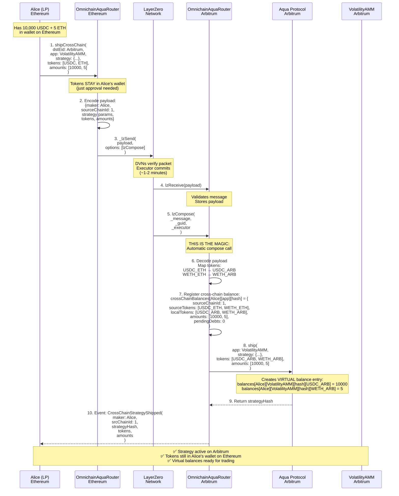
```mermaid
sequenceDiagram
    participant Alice as Alice (LP)<br/>Ethereum
    participant RouterETH as OmnichainAquaRouter<br/>Ethereum
    participant LZ as LayerZero<br/>Network
    participant RouterARB as OmnichainAquaRouter<br/>Arbitrum
    participant AquaARB as Aqua Protocol<br/>Arbitrum
    participant StrategyARB as VolatilityAMM<br/>Arbitrum

    Note over Alice: Has 10,000 USDC + 5 ETH<br/>in wallet on Ethereum

    Alice->>RouterETH: 1. shipCrossChain(<br/>dstEid: Arbitrum,<br/>app: VolatilityAMM,<br/>strategy: {...},<br/>tokens: [USDC, ETH],<br/>amounts: [10000, 5]<br/>)
    
    Note over RouterETH: Tokens STAY in Alice's wallet<br/>(just approval needed)
    
    RouterETH->>RouterETH: 2. Encode payload:<br/>{maker: Alice,<br/>sourceChainId: 1,<br/>strategy params,<br/>tokens, amounts}
    
    RouterETH->>LZ: 3. _lzSend(<br/>payload,<br/>options: [lzCompose]<br/>)
    
    Note over LZ: DVNs verify packet<br/>Executor commits<br/>(~1-2 minutes)
    
    LZ->>RouterARB: 4. lzReceive(payload)
    
    Note over RouterARB: Validates message<br/>Stores payload
    
    LZ->>RouterARB: 5. lzCompose(<br/>_message,<br/>_guid,<br/>_executor<br/>)
    
    Note over RouterARB: THIS IS THE MAGIC:<br/>Automatic compose call
    
    RouterARB->>RouterARB: 6. Decode payload<br/>Map tokens:<br/>USDC_ETH → USDC_ARB<br/>WETH_ETH → WETH_ARB
    
    RouterARB->>RouterARB: 7. Register cross-chain balance:<br/>crossChainBalances[Alice][app][hash] = {<br/>sourceChainId: 1,<br/>sourceTokens: [USDC_ETH, WETH_ETH],<br/>localTokens: [USDC_ARB, WETH_ARB],<br/>amounts: [10000, 5],<br/>pendingDebts: 0<br/>}
    
    RouterARB->>AquaARB: 8. ship(<br/>app: VolatilityAMM,<br/>strategy: {...},<br/>tokens: [USDC_ARB, WETH_ARB],<br/>amounts: [10000, 5]<br/>)
    
    Note over AquaARB: Creates VIRTUAL balance entry:<br/>balances[Alice][VolatilityAMM][hash][USDC_ARB] = 10000<br/>balances[Alice][VolatilityAMM][hash][WETH_ARB] = 5
    
    AquaARB-->>RouterARB: 9. Return strategyHash
    
    RouterARB-->>Alice: 10. Event: CrossChainStrategyShipped(<br/>maker: Alice,<br/>srcChainId: 1,<br/>strategyHash,<br/>tokens,<br/>amounts<br/>)
    
    Note over Alice,StrategyARB: ✅ Strategy active on Arbitrum<br/>✅ Tokens still in Alice's wallet on Ethereum<br/>✅ Virtual balances ready for trading
```

---

## Sequence Diagram 2: Trader Executes Swap Against Cross-Chain Liquidity

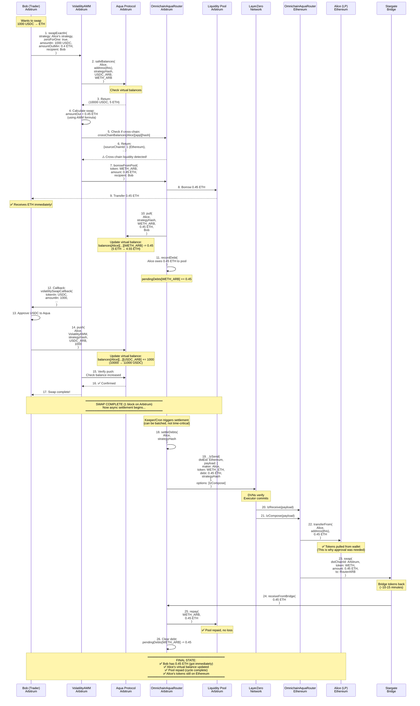
```mermaid
sequenceDiagram
    participant Bob as Bob (Trader)<br/>Arbitrum
    participant StrategyARB as VolatilityAMM<br/>Arbitrum
    participant AquaARB as Aqua Protocol<br/>Arbitrum
    participant RouterARB as OmnichainAquaRouter<br/>Arbitrum
    participant Pool as Liquidity Pool<br/>Arbitrum
    participant LZ as LayerZero<br/>Network
    participant RouterETH as OmnichainAquaRouter<br/>Ethereum
    participant Alice as Alice (LP)<br/>Ethereum
    participant Bridge as Stargate<br/>Bridge

    Note over Bob: Wants to swap<br/>1000 USDC → ETH

    Bob->>StrategyARB: 1. swapExactIn(<br/>strategy: Alice's strategy,<br/>zeroForOne: true,<br/>amountIn: 1000 USDC,<br/>amountOutMin: 0.4 ETH,<br/>recipient: Bob<br/>)
    
    StrategyARB->>AquaARB: 2. safeBalances(<br/>Alice,<br/>address(this),<br/>strategyHash,<br/>USDC_ARB,<br/>WETH_ARB<br/>)
    
    Note over AquaARB: Check virtual balances
    
    AquaARB-->>StrategyARB: 3. Return:<br/>(10000 USDC, 5 ETH)
    
    StrategyARB->>StrategyARB: 4. Calculate swap:<br/>amountOut = 0.45 ETH<br/>(using AMM formula)
    
    StrategyARB->>RouterARB: 5. Check if cross-chain:<br/>crossChainBalances[Alice][app][hash]
    
    RouterARB-->>StrategyARB: 6. Return:<br/>{sourceChainId: 1 (Ethereum),<br/>...}<br/><br/>⚠️ Cross-chain liquidity detected!
    
    StrategyARB->>RouterARB: 7. borrowFromPool(<br/>token: WETH_ARB,<br/>amount: 0.45 ETH,<br/>recipient: Bob<br/>)
    
    RouterARB->>Pool: 8. Borrow 0.45 ETH
    
    Pool-->>Bob: 9. Transfer 0.45 ETH
    
    Note over Bob: ✅ Receives ETH immediately!
    
    RouterARB->>AquaARB: 10. pull(<br/>Alice,<br/>strategyHash,<br/>WETH_ARB,<br/>0.45 ETH,<br/>Bob<br/>)
    
    Note over AquaARB: Update virtual balance:<br/>balances[Alice][...][WETH_ARB] -= 0.45<br/>(5 ETH → 4.55 ETH)
    
    RouterARB->>RouterARB: 11. recordDebt(<br/>Alice owes 0.45 ETH to pool<br/>)
    
    Note over RouterARB: pendingDebts[WETH_ARB] += 0.45
    
    StrategyARB->>Bob: 12. Callback:<br/>volatilitySwapCallback(<br/>tokenIn: USDC,<br/>amountIn: 1000,<br/>...<br/>)
    
    Bob->>Bob: 13. Approve USDC to Aqua
    
    Bob->>AquaARB: 14. push(<br/>Alice,<br/>VolatilityAMM,<br/>strategyHash,<br/>USDC_ARB,<br/>1000<br/>)
    
    Note over AquaARB: Update virtual balance:<br/>balances[Alice][...][USDC_ARB] += 1000<br/>(10000 → 11000 USDC)
    
    StrategyARB->>AquaARB: 15. Verify push:<br/>Check balance increased
    
    AquaARB-->>StrategyARB: 16. ✅ Confirmed
    
    StrategyARB-->>Bob: 17. Swap complete!
    
    Note over Bob,Pool: ═══════════════════════════════════<br/>SWAP COMPLETE (1 block on Arbitrum)<br/>Now async settlement begins...<br/>═══════════════════════════════════
    
    Note over RouterARB: Keeper/Cron triggers settlement<br/>(can be batched, not time-critical)
    
    RouterARB->>RouterARB: 18. settleDebts(<br/>Alice,<br/>strategyHash<br/>)
    
    RouterARB->>LZ: 19. _lzSend(<br/>dstEid: Ethereum,<br/>payload: {<br/>  maker: Alice,<br/>  token: WETH_ETH,<br/>  debt: 0.45 ETH,<br/>  strategyHash<br/>},<br/>options: [lzCompose]<br/>)
    
    Note over LZ: DVNs verify<br/>Executor commits
    
    LZ->>RouterETH: 20. lzReceive(payload)
    
    LZ->>RouterETH: 21. lzCompose(payload)
    
    RouterETH->>Alice: 22. transferFrom(<br/>Alice,<br/>address(this),<br/>0.45 ETH<br/>)
    
    Note over Alice: ✅ Tokens pulled from wallet<br/>(This is why approval was needed)
    
    RouterETH->>Bridge: 23. swap(<br/>dstChainId: Arbitrum,<br/>token: WETH,<br/>amount: 0.45 ETH,<br/>to: RouterARB<br/>)
    
    Note over Bridge: Bridge tokens back<br/>(~10-15 minutes)
    
    Bridge->>RouterARB: 24. receiveFromBridge(<br/>0.45 ETH<br/>)
    
    RouterARB->>Pool: 25. repay(<br/>WETH_ARB,<br/>0.45 ETH<br/>)
    
    Note over Pool: ✅ Pool repaid, no loss
    
    RouterARB->>RouterARB: 26. Clear debt:<br/>pendingDebts[WETH_ARB] -= 0.45
    
    Note over Alice,Bob: ═══════════════════════════════════<br/>FINAL STATE:<br/>✅ Bob has 0.45 ETH (got immediately)<br/>✅ Alice's virtual balance updated<br/>✅ Pool repaid (cycle complete)<br/>✅ Alice's tokens still on Ethereum<br/>═══════════════════════════════════
```

---

## Sequence Diagram 3: LP Docks Strategy and Withdraws

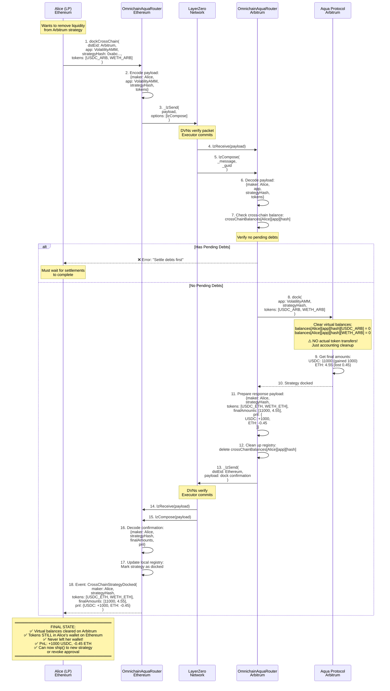
```mermaid
sequenceDiagram
    participant Alice as Alice (LP)<br/>Ethereum
    participant RouterETH as OmnichainAquaRouter<br/>Ethereum
    participant LZ as LayerZero<br/>Network
    participant RouterARB as OmnichainAquaRouter<br/>Arbitrum
    participant AquaARB as Aqua Protocol<br/>Arbitrum

    Note over Alice: Wants to remove liquidity<br/>from Arbitrum strategy

    Alice->>RouterETH: 1. dockCrossChain(<br/>dstEid: Arbitrum,<br/>app: VolatilityAMM,<br/>strategyHash: 0xabc...,<br/>tokens: [USDC_ARB, WETH_ARB]<br/>)
    
    RouterETH->>RouterETH: 2. Encode payload:<br/>{maker: Alice,<br/>app: VolatilityAMM,<br/>strategyHash,<br/>tokens}
    
    RouterETH->>LZ: 3. _lzSend(<br/>payload,<br/>options: [lzCompose]<br/>)
    
    Note over LZ: DVNs verify packet<br/>Executor commits
    
    LZ->>RouterARB: 4. lzReceive(payload)
    
    LZ->>RouterARB: 5. lzCompose(<br/>_message,<br/>_guid<br/>)
    
    RouterARB->>RouterARB: 6. Decode payload:<br/>{maker: Alice,<br/>app,<br/>strategyHash,<br/>tokens}
    
    RouterARB->>RouterARB: 7. Check cross-chain balance:<br/>crossChainBalances[Alice][app][hash]
    
    Note over RouterARB: Verify no pending debts
    
    alt Has Pending Debts
        RouterARB-->>Alice: ❌ Error: "Settle debts first"
        Note over Alice: Must wait for settlements<br/>to complete
    else No Pending Debts
        RouterARB->>AquaARB: 8. dock(<br/>app: VolatilityAMM,<br/>strategyHash,<br/>tokens: [USDC_ARB, WETH_ARB]<br/>)
        
        Note over AquaARB: Clear virtual balances:<br/>balances[Alice][app][hash][USDC_ARB] = 0<br/>balances[Alice][app][hash][WETH_ARB] = 0<br/><br/>⚠️ NO actual token transfers!<br/>Just accounting cleanup
        
        AquaARB->>AquaARB: 9. Get final amounts:<br/>USDC: 11000 (gained 1000)<br/>ETH: 4.55 (lost 0.45)
        
        AquaARB-->>RouterARB: 10. Strategy docked
        
        RouterARB->>RouterARB: 11. Prepare response payload:<br/>{maker: Alice,<br/>strategyHash,<br/>tokens: [USDC_ETH, WETH_ETH],<br/>finalAmounts: [11000, 4.55],<br/>pnl: {<br/>  USDC: +1000,<br/>  ETH: -0.45<br/>}}
        
        RouterARB->>RouterARB: 12. Clean up registry:<br/>delete crossChainBalances[Alice][app][hash]
        
        RouterARB->>LZ: 13. _lzSend(<br/>dstEid: Ethereum,<br/>payload: dock confirmation<br/>)
        
        Note over LZ: DVNs verify<br/>Executor commits
        
        LZ->>RouterETH: 14. lzReceive(payload)
        
        LZ->>RouterETH: 15. lzCompose(payload)
        
        RouterETH->>RouterETH: 16. Decode confirmation:<br/>{maker: Alice,<br/>strategyHash,<br/>finalAmounts,<br/>pnl}
        
        RouterETH->>RouterETH: 17. Update local registry:<br/>Mark strategy as docked
        
        RouterETH-->>Alice: 18. Event: CrossChainStrategyDocked(<br/>maker: Alice,<br/>strategyHash,<br/>tokens: [USDC_ETH, WETH_ETH],<br/>finalAmounts: [11000, 4.55],<br/>pnl: {USDC: +1000, ETH: -0.45}<br/>)
    end
    
    Note over Alice: ═══════════════════════════════════<br/>FINAL STATE:<br/>✅ Virtual balances cleared on Arbitrum<br/>✅ Tokens STILL in Alice's wallet on Ethereum<br/>✅ Never left her wallet!<br/>✅ PnL: +1000 USDC, -0.45 ETH<br/>✅ Can now ship() to new strategy<br/>   or revoke approval<br/>═══════════════════════════════════
```

---

## Bonus: Complete System Overview Sequence Diagram

Here's a high-level view showing all three flows together:

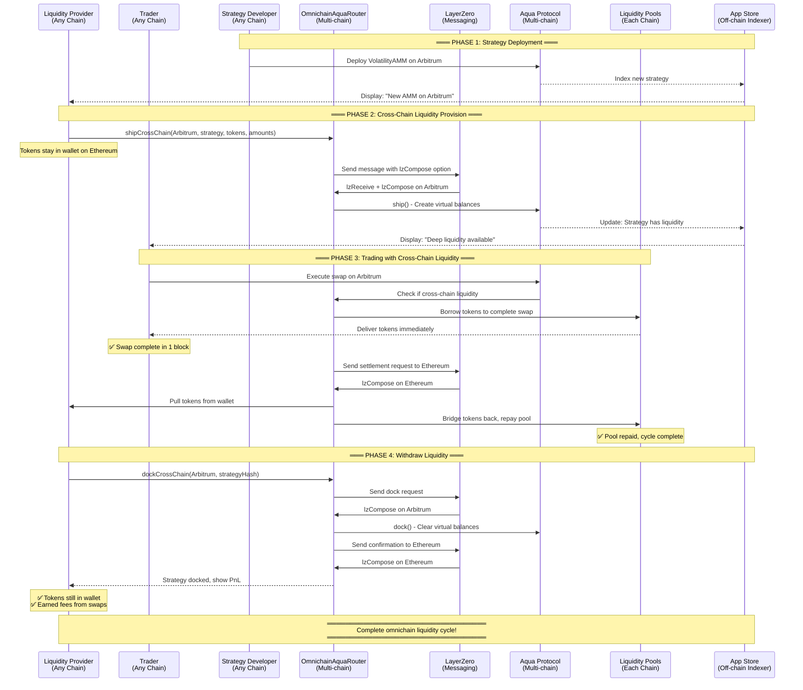
```mermaid
sequenceDiagram
    participant LP as Liquidity Provider<br/>(Any Chain)
    participant Trader as Trader<br/>(Any Chain)
    participant Developer as Strategy Developer<br/>(Any Chain)
    participant Router as OmnichainAquaRouter<br/>(Multi-chain)
    participant LZ as LayerZero<br/>(Messaging)
    participant Aqua as Aqua Protocol<br/>(Multi-chain)
    participant Pool as Liquidity Pools<br/>(Each Chain)
    participant Marketplace as App Store<br/>(Off-chain Indexer)

    Note over Developer,Marketplace: ═══ PHASE 1: Strategy Deployment ═══
    
    Developer->>Aqua: Deploy VolatilityAMM on Arbitrum
    Aqua-->>Marketplace: Index new strategy
    Marketplace-->>LP: Display: "New AMM on Arbitrum"
    
    Note over LP,Marketplace: ═══ PHASE 2: Cross-Chain Liquidity Provision ═══
    
    LP->>Router: shipCrossChain(Arbitrum, strategy, tokens, amounts)
    Note over LP: Tokens stay in wallet on Ethereum
    Router->>LZ: Send message with lzCompose option
    LZ->>Router: lzReceive + lzCompose on Arbitrum
    Router->>Aqua: ship() - Create virtual balances
    Aqua-->>Marketplace: Update: Strategy has liquidity
    Marketplace-->>Trader: Display: "Deep liquidity available"
    
    Note over Trader,Pool: ═══ PHASE 3: Trading with Cross-Chain Liquidity ═══
    
    Trader->>Aqua: Execute swap on Arbitrum
    Aqua->>Router: Check if cross-chain liquidity
    Router->>Pool: Borrow tokens to complete swap
    Pool-->>Trader: Deliver tokens immediately
    Note over Trader: ✅ Swap complete in 1 block
    
    Router->>LZ: Send settlement request to Ethereum
    LZ->>Router: lzCompose on Ethereum
    Router->>LP: Pull tokens from wallet
    Router->>Pool: Bridge tokens back, repay pool
    Note over Pool: ✅ Pool repaid, cycle complete
    
    Note over LP,Marketplace: ═══ PHASE 4: Withdraw Liquidity ═══
    
    LP->>Router: dockCrossChain(Arbitrum, strategyHash)
    Router->>LZ: Send dock request
    LZ->>Router: lzCompose on Arbitrum
    Router->>Aqua: dock() - Clear virtual balances
    Router->>LZ: Send confirmation to Ethereum
    LZ->>Router: lzCompose on Ethereum
    Router-->>LP: Strategy docked, show PnL
    Note over LP: ✅ Tokens still in wallet<br/>✅ Earned fees from swaps
    
    Note over LP,Marketplace: ═══════════════════════════════════<br/>Complete omnichain liquidity cycle!<br/>═══════════════════════════════════
```

---

## Key Insights from the Diagrams

### 1. **The Composer Pattern is Critical**
- Without `lzCompose()`, we'd need manual two-step transactions
- Composer makes cross-chain `ship()` and `dock()` atomic
- Enables seamless UX (feels like single-chain operation)

### 2. **Tokens Never Move (Except Settlements)**
- LP's tokens stay in their wallet throughout
- Only pulled during debt settlements
- Virtual balances do all the heavy lifting

### 3. **Liquidity Pools Enable Instant Swaps**
- Traders get immediate execution
- Settlement happens async in background
- Pools earn fees for providing this service

### 4. **LayerZero Handles All Cross-Chain Coordination**
- DVNs verify messages
- Executors commit and compose
- Reliable state synchronization

### 5. **Three Distinct Message Types**
- **Ship**: Create virtual balance on destination chain
- **Settle**: Pull tokens from source chain for debt repayment
- **Dock**: Clear virtual balance and confirm withdrawal

Would you like me to create any additional diagrams, such as:
- Error handling flows (what if LZ message fails?)
- Multi-hop scenarios (LP on Ethereum → Strategy on Arbitrum → Trader on Base?)
- Pool liquidity management flows?

```plaintext
sequenceDiagram
    participant Alice as Alice (LP)<br/>Ethereum
    participant RouterETH as OmnichainAquaRouter<br/>Ethereum
    participant LZ as LayerZero<br/>Network
    participant RouterARB as OmnichainAquaRouter<br/>Arbitrum
    participant AquaARB as Aqua Protocol<br/>Arbitrum
    participant StrategyARB as VolatilityAMM<br/>Arbitrum

    Note over Alice: Has 10,000 USDC + 5 ETH<br/>in wallet on Ethereum

    Alice->>RouterETH: 1. shipCrossChain(<br/>dstEid: Arbitrum,<br/>app: VolatilityAMM,<br/>strategy: {...},<br/>tokens: [USDC, ETH],<br/>amounts: [10000, 5]<br/>)
    
    Note over RouterETH: Tokens STAY in Alice's wallet<br/>(just approval needed)
    
    RouterETH->>RouterETH: 2. Encode payload:<br/>{maker: Alice,<br/>sourceChainId: 1,<br/>strategy params,<br/>tokens, amounts}
    
    RouterETH->>LZ: 3. _lzSend(<br/>payload,<br/>options: [lzCompose]<br/>)
    
    Note over LZ: DVNs verify packet<br/>Executor commits<br/>(~1-2 minutes)
    
    LZ->>RouterARB: 4. lzReceive(payload)
    
    Note over RouterARB: Validates message<br/>Stores payload
    
    LZ->>RouterARB: 5. lzCompose(<br/>_message,<br/>_guid,<br/>_executor<br/>)
    
    Note over RouterARB: THIS IS THE MAGIC:<br/>Automatic compose call
    
    RouterARB->>RouterARB: 6. Decode payload<br/>Map tokens:<br/>USDC_ETH → USDC_ARB<br/>WETH_ETH → WETH_ARB
    
    RouterARB->>RouterARB: 7. Register cross-chain balance:<br/>crossChainBalances[Alice][app][hash] = {<br/>sourceChainId: 1,<br/>sourceTokens: [USDC_ETH, WETH_ETH],<br/>localTokens: [USDC_ARB, WETH_ARB],<br/>amounts: [10000, 5],<br/>pendingDebts: 0<br/>}
    
    RouterARB->>AquaARB: 8. ship(<br/>app: VolatilityAMM,<br/>strategy: {...},<br/>tokens: [USDC_ARB, WETH_ARB],<br/>amounts: [10000, 5]<br/>)
    
    Note over AquaARB: Creates VIRTUAL balance entry:<br/>balances[Alice][VolatilityAMM][hash][USDC_ARB] = 10000<br/>balances[Alice][VolatilityAMM][hash][WETH_ARB] = 5
    
    AquaARB-->>RouterARB: 9. Return strategyHash
    
    RouterARB-->>Alice: 10. Event: CrossChainStrategyShipped(<br/>maker: Alice,<br/>srcChainId: 1,<br/>strategyHash,<br/>tokens,<br/>amounts<br/>)
    
    Note over Alice,StrategyARB: ✅ Strategy active on Arbitrum<br/>✅ Tokens still in Alice's wallet on Ethereum<br/>✅ Virtual balances ready for trading
```

```plaintext
sequenceDiagram
    participant Bob as Bob (Trader)<br/>Arbitrum
    participant StrategyARB as VolatilityAMM<br/>Arbitrum
    participant AquaARB as Aqua Protocol<br/>Arbitrum
    participant RouterARB as OmnichainAquaRouter<br/>Arbitrum
    participant Pool as Liquidity Pool<br/>Arbitrum
    participant LZ as LayerZero<br/>Network
    participant RouterETH as OmnichainAquaRouter<br/>Ethereum
    participant Alice as Alice (LP)<br/>Ethereum
    participant Bridge as Stargate<br/>Bridge

    Note over Bob: Wants to swap<br/>1000 USDC → ETH

    Bob->>StrategyARB: 1. swapExactIn(<br/>strategy: Alice's strategy,<br/>zeroForOne: true,<br/>amountIn: 1000 USDC,<br/>amountOutMin: 0.4 ETH,<br/>recipient: Bob<br/>)
    
    StrategyARB->>AquaARB: 2. safeBalances(<br/>Alice,<br/>address(this),<br/>strategyHash,<br/>USDC_ARB,<br/>WETH_ARB<br/>)
    
    Note over AquaARB: Check virtual balances
    
    AquaARB-->>StrategyARB: 3. Return:<br/>(10000 USDC, 5 ETH)
    
    StrategyARB->>StrategyARB: 4. Calculate swap:<br/>amountOut = 0.45 ETH<br/>(using AMM formula)
    
    StrategyARB->>RouterARB: 5. Check if cross-chain:<br/>crossChainBalances[Alice][app][hash]
    
    RouterARB-->>StrategyARB: 6. Return:<br/>{sourceChainId: 1 (Ethereum),<br/>...}<br/><br/>⚠️ Cross-chain liquidity detected!
    
    StrategyARB->>RouterARB: 7. borrowFromPool(<br/>token: WETH_ARB,<br/>amount: 0.45 ETH,<br/>recipient: Bob<br/>)
    
    RouterARB->>Pool: 8. Borrow 0.45 ETH
    
    Pool-->>Bob: 9. Transfer 0.45 ETH
    
    Note over Bob: ✅ Receives ETH immediately!
    
    RouterARB->>AquaARB: 10. pull(<br/>Alice,<br/>strategyHash,<br/>WETH_ARB,<br/>0.45 ETH,<br/>Bob<br/>)
    
    Note over AquaARB: Update virtual balance:<br/>balances[Alice][...][WETH_ARB] -= 0.45<br/>(5 ETH → 4.55 ETH)
    
    RouterARB->>RouterARB: 11. recordDebt(<br/>Alice owes 0.45 ETH to pool<br/>)
    
    Note over RouterARB: pendingDebts[WETH_ARB] += 0.45
    
    StrategyARB->>Bob: 12. Callback:<br/>volatilitySwapCallback(<br/>tokenIn: USDC,<br/>amountIn: 1000,<br/>...<br/>)
    
    Bob->>Bob: 13. Approve USDC to Aqua
    
    Bob->>AquaARB: 14. push(<br/>Alice,<br/>VolatilityAMM,<br/>strategyHash,<br/>USDC_ARB,<br/>1000<br/>)
    
    Note over AquaARB: Update virtual balance:<br/>balances[Alice][...][USDC_ARB] += 1000<br/>(10000 → 11000 USDC)
    
    StrategyARB->>AquaARB: 15. Verify push:<br/>Check balance increased
    
    AquaARB-->>StrategyARB: 16. ✅ Confirmed
    
    StrategyARB-->>Bob: 17. Swap complete!
    
    Note over Bob,Pool: ═══════════════════════════════════<br/>SWAP COMPLETE (1 block on Arbitrum)<br/>Now async settlement begins...<br/>═══════════════════════════════════
    
    Note over RouterARB: Keeper/Cron triggers settlement<br/>(can be batched, not time-critical)
    
    RouterARB->>RouterARB: 18. settleDebts(<br/>Alice,<br/>strategyHash<br/>)
    
    RouterARB->>LZ: 19. _lzSend(<br/>dstEid: Ethereum,<br/>payload: {<br/>  maker: Alice,<br/>  token: WETH_ETH,<br/>  debt: 0.45 ETH,<br/>  strategyHash<br/>},<br/>options: [lzCompose]<br/>)
    
    Note over LZ: DVNs verify<br/>Executor commits
    
    LZ->>RouterETH: 20. lzReceive(payload)
    
    LZ->>RouterETH: 21. lzCompose(payload)
    
    RouterETH->>Alice: 22. transferFrom(<br/>Alice,<br/>address(this),<br/>0.45 ETH<br/>)
    
    Note over Alice: ✅ Tokens pulled from wallet<br/>(This is why approval was needed)
    
    RouterETH->>Bridge: 23. swap(<br/>dstChainId: Arbitrum,<br/>token: WETH,<br/>amount: 0.45 ETH,<br/>to: RouterARB<br/>)
    
    Note over Bridge: Bridge tokens back<br/>(~10-15 minutes)
    
    Bridge->>RouterARB: 24. receiveFromBridge(<br/>0.45 ETH<br/>)
    
    RouterARB->>Pool: 25. repay(<br/>WETH_ARB,<br/>0.45 ETH<br/>)
    
    Note over Pool: ✅ Pool repaid, no loss
    
    RouterARB->>RouterARB: 26. Clear debt:<br/>pendingDebts[WETH_ARB] -= 0.45
    
    Note over Alice,Bob: ═══════════════════════════════════<br/>FINAL STATE:<br/>✅ Bob has 0.45 ETH (got immediately)<br/>✅ Alice's virtual balance updated<br/>✅ Pool repaid (cycle complete)<br/>✅ Alice's tokens still on Ethereum<br/>═══════════════════════════════════
```

```plaintext
sequenceDiagram
    participant Alice as Alice (LP)<br/>Ethereum
    participant RouterETH as OmnichainAquaRouter<br/>Ethereum
    participant LZ as LayerZero<br/>Network
    participant RouterARB as OmnichainAquaRouter<br/>Arbitrum
    participant AquaARB as Aqua Protocol<br/>Arbitrum

    Note over Alice: Wants to remove liquidity<br/>from Arbitrum strategy

    Alice->>RouterETH: 1. dockCrossChain(<br/>dstEid: Arbitrum,<br/>app: VolatilityAMM,<br/>strategyHash: 0xabc...,<br/>tokens: [USDC_ARB, WETH_ARB]<br/>)
    
    RouterETH->>RouterETH: 2. Encode payload:<br/>{maker: Alice,<br/>app: VolatilityAMM,<br/>strategyHash,<br/>tokens}
    
    RouterETH->>LZ: 3. _lzSend(<br/>payload,<br/>options: [lzCompose]<br/>)
    
    Note over LZ: DVNs verify packet<br/>Executor commits
    
    LZ->>RouterARB: 4. lzReceive(payload)
    
    LZ->>RouterARB: 5. lzCompose(<br/>_message,<br/>_guid<br/>)
    
    RouterARB->>RouterARB: 6. Decode payload:<br/>{maker: Alice,<br/>app,<br/>strategyHash,<br/>tokens}
    
    RouterARB->>RouterARB: 7. Check cross-chain balance:<br/>crossChainBalances[Alice][app][hash]
    
    Note over RouterARB: Verify no pending debts
    
    alt Has Pending Debts
        RouterARB-->>Alice: ❌ Error: "Settle debts first"
        Note over Alice: Must wait for settlements<br/>to complete
    else No Pending Debts
        RouterARB->>AquaARB: 8. dock(<br/>app: VolatilityAMM,<br/>strategyHash,<br/>tokens: [USDC_ARB, WETH_ARB]<br/>)
        
        Note over AquaARB: Clear virtual balances:<br/>balances[Alice][app][hash][USDC_ARB] = 0<br/>balances[Alice][app][hash][WETH_ARB] = 0<br/><br/>⚠️ NO actual token transfers!<br/>Just accounting cleanup
        
        AquaARB->>AquaARB: 9. Get final amounts:<br/>USDC: 11000 (gained 1000)<br/>ETH: 4.55 (lost 0.45)
        
        AquaARB-->>RouterARB: 10. Strategy docked
        
        RouterARB->>RouterARB: 11. Prepare response payload:<br/>{maker: Alice,<br/>strategyHash,<br/>tokens: [USDC_ETH, WETH_ETH],<br/>finalAmounts: [11000, 4.55],<br/>pnl: {<br/>  USDC: +1000,<br/>  ETH: -0.45<br/>}}
        
        RouterARB->>RouterARB: 12. Clean up registry:<br/>delete crossChainBalances[Alice][app][hash]
        
        RouterARB->>LZ: 13. _lzSend(<br/>dstEid: Ethereum,<br/>payload: dock confirmation<br/>)
        
        Note over LZ: DVNs verify<br/>Executor commits
        
        LZ->>RouterETH: 14. lzReceive(payload)
        
        LZ->>RouterETH: 15. lzCompose(payload)
        
        RouterETH->>RouterETH: 16. Decode confirmation:<br/>{maker: Alice,<br/>strategyHash,<br/>finalAmounts,<br/>pnl}
        
        RouterETH->>RouterETH: 17. Update local registry:<br/>Mark strategy as docked
        
        RouterETH-->>Alice: 18. Event: CrossChainStrategyDocked(<br/>maker: Alice,<br/>strategyHash,<br/>tokens: [USDC_ETH, WETH_ETH],<br/>finalAmounts: [11000, 4.55],<br/>pnl: {USDC: +1000, ETH: -0.45}<br/>)
    end
    
    Note over Alice: ═══════════════════════════════════<br/>FINAL STATE:<br/>✅ Virtual balances cleared on Arbitrum<br/>✅ Tokens STILL in Alice's wallet on Ethereum<br/>✅ Never left her wallet!<br/>✅ PnL: +1000 USDC, -0.45 ETH<br/>✅ Can now ship() to new strategy<br/>   or revoke approval<br/>═══════════════════════════════════
```

```plaintext
sequenceDiagram
    participant LP as Liquidity Provider<br/>(Any Chain)
    participant Trader as Trader<br/>(Any Chain)
    participant Developer as Strategy Developer<br/>(Any Chain)
    participant Router as OmnichainAquaRouter<br/>(Multi-chain)
    participant LZ as LayerZero<br/>(Messaging)
    participant Aqua as Aqua Protocol<br/>(Multi-chain)
    participant Pool as Liquidity Pools<br/>(Each Chain)
    participant Marketplace as App Store<br/>(Off-chain Indexer)

    Note over Developer,Marketplace: ═══ PHASE 1: Strategy Deployment ═══
    
    Developer->>Aqua: Deploy VolatilityAMM on Arbitrum
    Aqua-->>Marketplace: Index new strategy
    Marketplace-->>LP: Display: "New AMM on Arbitrum"
    
    Note over LP,Marketplace: ═══ PHASE 2: Cross-Chain Liquidity Provision ═══
    
    LP->>Router: shipCrossChain(Arbitrum, strategy, tokens, amounts)
    Note over LP: Tokens stay in wallet on Ethereum
    Router->>LZ: Send message with lzCompose option
    LZ->>Router: lzReceive + lzCompose on Arbitrum
    Router->>Aqua: ship() - Create virtual balances
    Aqua-->>Marketplace: Update: Strategy has liquidity
    Marketplace-->>Trader: Display: "Deep liquidity available"
    
    Note over Trader,Pool: ═══ PHASE 3: Trading with Cross-Chain Liquidity ═══
    
    Trader->>Aqua: Execute swap on Arbitrum
    Aqua->>Router: Check if cross-chain liquidity
    Router->>Pool: Borrow tokens to complete swap
    Pool-->>Trader: Deliver tokens immediately
    Note over Trader: ✅ Swap complete in 1 block
    
    Router->>LZ: Send settlement request to Ethereum
    LZ->>Router: lzCompose on Ethereum
    Router->>LP: Pull tokens from wallet
    Router->>Pool: Bridge tokens back, repay pool
    Note over Pool: ✅ Pool repaid, cycle complete
    
    Note over LP,Marketplace: ═══ PHASE 4: Withdraw Liquidity ═══
    
    LP->>Router: dockCrossChain(Arbitrum, strategyHash)
    Router->>LZ: Send dock request
    LZ->>Router: lzCompose on Arbitrum
    Router->>Aqua: dock() - Clear virtual balances
    Router->>LZ: Send confirmation to Ethereum
    LZ->>Router: lzCompose on Ethereum
    Router-->>LP: Strategy docked, show PnL
    Note over LP: ✅ Tokens still in wallet<br/>✅ Earned fees from swaps
    
    Note over LP,Marketplace: ═══════════════════════════════════<br/>Complete omnichain liquidity cycle!<br/>═══════════════════════════════════
```

---

**User**

For diagram 2 and 3, are you sure that your understanding is correct

---

**Cursor**

You're right to question me. Let me reconsider diagrams 2 and 3 more carefully based on Aqua's actual architecture...

## Critical Issues with My Understanding

### Diagram 2 (Trader Swap) - Major Problems:

**Problem 1: Aqua's `pull()` doesn't work the way I described**

Looking at the README again:
```solidity
// Pull tokens from maker to trader during swap
aqua.pull(maker, strategyHash, tokenOut, amountOut, recipient);
```

This `pull()` is supposed to **transfer actual tokens from the maker's wallet** to the recipient. But if Alice's tokens are on Ethereum and we're executing on Arbitrum, `pull()` would fail because:
- Aqua on Arbitrum tries to `transferFrom(Alice, recipient, amount)`
- But Alice's tokens are on Ethereum, not Arbitrum
- **This won't work!**

**Problem 2: The virtual balance concept breaks down**

The README says:
> Aqua doesn't hold tokens - it maintains allowance records. Actual tokens remain in maker wallets until pulled during trades.

So when `pull()` is called, it needs to **actually transfer tokens**. But those tokens don't exist on the destination chain!

### Diagram 3 (Dock) - Conceptual Issues:

**Problem: What does `dock()` actually do?**

From the README:
```solidity
// Deactivate strategy and withdraw all balances
function dock(
    address app,
    bytes32 strategyHash,
    address[] calldata tokens
) external;
```

The `dock()` function is supposed to return tokens to the LP. But if the strategy is on Arbitrum and tokens are on Ethereum, what gets returned?

---

## Let Me Reconsider the Architecture

I think there are **two possible approaches**, and I'm not sure which one you're envisioning:

### Approach A: Tokens Must Be Bridged First (Simpler)

```
LP ships cross-chain:
1. OmnichainRouter on Ethereum locks/bridges tokens to Arbitrum
2. Tokens arrive on Arbitrum
3. LP approves tokens to Aqua on Arbitrum
4. Router calls Aqua.ship() on Arbitrum with REAL tokens
5. Now swaps work normally because tokens are actually there
```

**This means:**
- Cross-chain `ship()` includes actual token bridging
- Aqua on Arbitrum works exactly as designed (tokens in LP wallet on Arbitrum)
- `pull()` works because tokens are actually on Arbitrum
- `dock()` returns tokens to LP's address on Arbitrum
- LP can bridge back to Ethereum separately if desired

### Approach B: Synthetic/Wrapped Tokens (More Complex)

```
LP ships cross-chain:
1. OmnichRouter on Ethereum locks tokens
2. LZ message to Arbitrum
3. OmnichRouter on Arbitrum mints "wrapped" tokens to LP's address
4. LP's wrapped tokens approved to Aqua
5. Aqua.ship() with wrapped tokens
6. Swaps use wrapped tokens
7. Wrapped tokens backed 1:1 by locked tokens on Ethereum
```

**This means:**
- Need a wrapping/minting mechanism
- Wrapped tokens represent claims on real tokens
- More infrastructure but LP doesn't need to bridge manually

### Approach C: Pure Virtual (What I Tried, But Doesn't Work)

```
❌ This is what I described, but it's broken:
- Virtual balances on Arbitrum
- No actual tokens on Arbitrum
- pull() fails because tokens aren't there
```

---

## The Real Question

**For cross-chain liquidity to work with Aqua's architecture, tokens need to actually be on the chain where the strategy lives, right?**

Because:
1. Aqua's `pull()` does `transferFrom(maker, recipient, amount)`
2. This requires tokens to exist in maker's wallet on that chain
3. Virtual balances are just accounting, but `pull()` needs real tokens

So the correct flow should probably be:

## Corrected Diagram 2: Trader Swap (With Actual Bridged Tokens)

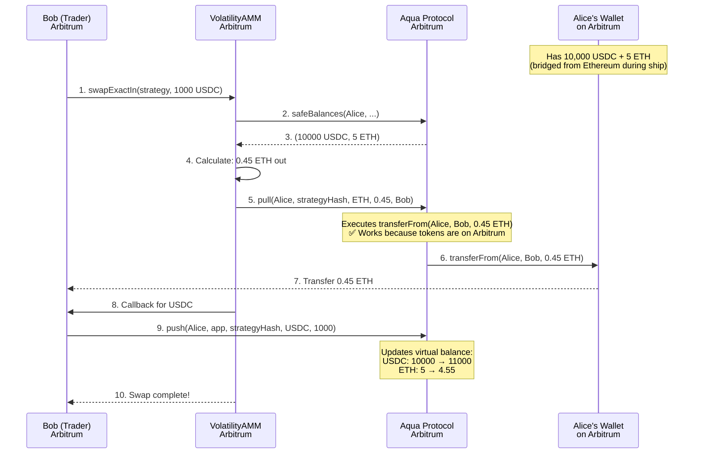
```mermaid
sequenceDiagram
    participant Bob as Bob (Trader)<br/>Arbitrum
    participant StrategyARB as VolatilityAMM<br/>Arbitrum
    participant AquaARB as Aqua Protocol<br/>Arbitrum
    participant Alice_ARB as Alice's Wallet<br/>on Arbitrum

    Note over Alice_ARB: Has 10,000 USDC + 5 ETH<br/>(bridged from Ethereum during ship)

    Bob->>StrategyARB: 1. swapExactIn(strategy, 1000 USDC)
    
    StrategyARB->>AquaARB: 2. safeBalances(Alice, ...)
    AquaARB-->>StrategyARB: 3. (10000 USDC, 5 ETH)
    
    StrategyARB->>StrategyARB: 4. Calculate: 0.45 ETH out
    
    StrategyARB->>AquaARB: 5. pull(Alice, strategyHash, ETH, 0.45, Bob)
    
    Note over AquaARB: Executes transferFrom(Alice, Bob, 0.45 ETH)<br/>✅ Works because tokens are on Arbitrum
    
    AquaARB->>Alice_ARB: 6. transferFrom(Alice, Bob, 0.45 ETH)
    Alice_ARB-->>Bob: 7. Transfer 0.45 ETH
    
    StrategyARB->>Bob: 8. Callback for USDC
    Bob->>AquaARB: 9. push(Alice, app, strategyHash, USDC, 1000)
    
    Note over AquaARB: Updates virtual balance:<br/>USDC: 10000 → 11000<br/>ETH: 5 → 4.55
    
    StrategyARB-->>Bob: 10. Swap complete!
```

## Corrected Diagram 3: LP Docks (Returns Tokens on Arbitrum)

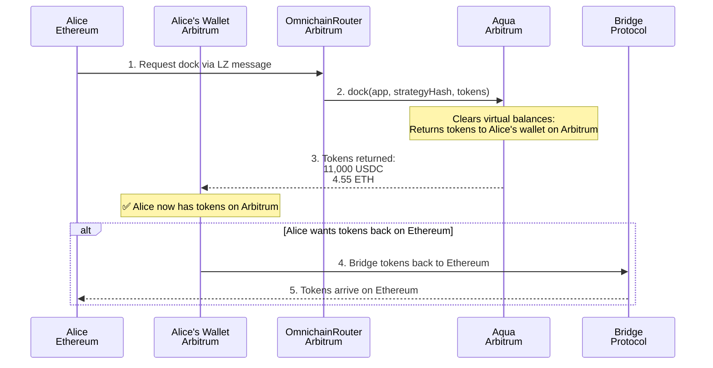
```mermaid
sequenceDiagram
    participant Alice_ETH as Alice<br/>Ethereum
    participant Alice_ARB as Alice's Wallet<br/>Arbitrum
    participant RouterARB as OmnichainRouter<br/>Arbitrum
    participant AquaARB as Aqua<br/>Arbitrum
    participant Bridge as Bridge<br/>Protocol

    Alice_ETH->>RouterARB: 1. Request dock via LZ message
    
    RouterARB->>AquaARB: 2. dock(app, strategyHash, tokens)
    
    Note over AquaARB: Clears virtual balances:<br/>Returns tokens to Alice's wallet on Arbitrum
    
    AquaARB-->>Alice_ARB: 3. Tokens returned:<br/>11,000 USDC<br/>4.55 ETH
    
    Note over Alice_ARB: ✅ Alice now has tokens on Arbitrum
    
    alt Alice wants tokens back on Ethereum
        Alice_ARB->>Bridge: 4. Bridge tokens back to Ethereum
        Bridge-->>Alice_ETH: 5. Tokens arrive on Ethereum
    end
```

---

## So Which Understanding is Correct?

I think the **correct architecture** must be:

1. **Cross-chain `ship()` includes token bridging**
   - LP's tokens get bridged from Ethereum to Arbitrum
   - Tokens end up in LP's wallet on Arbitrum
   - LP approves Aqua on Arbitrum
   - Normal Aqua flow from there

2. **Swaps work normally**
   - Because tokens are actually on Arbitrum
   - `pull()` and `push()` work as designed

3. **`dock()` returns tokens on destination chain**
   - LP gets tokens back on Arbitrum
   - LP can bridge back to Ethereum separately if desired

**Am I closer now? Or is there a different mechanism I'm still missing?**

The key constraint is: **Aqua's `pull()` needs actual tokens in the maker's wallet on that chain**. How do we reconcile that with cross-chain liquidity?

```solidity
// Pull tokens from maker to trader during swap
aqua.pull(maker, strategyHash, tokenOut, amountOut, recipient);
```

```solidity
// Deactivate strategy and withdraw all balances
function dock(
    address app,
    bytes32 strategyHash,
    address[] calldata tokens
) external;
```

```plaintext
LP ships cross-chain:
1. OmnichainRouter on Ethereum locks/bridges tokens to Arbitrum
2. Tokens arrive on Arbitrum
3. LP approves tokens to Aqua on Arbitrum
4. Router calls Aqua.ship() on Arbitrum with REAL tokens
5. Now swaps work normally because tokens are actually there
```

```plaintext
LP ships cross-chain:
1. OmnichRouter on Ethereum locks tokens
2. LZ message to Arbitrum
3. OmnichRouter on Arbitrum mints "wrapped" tokens to LP's address
4. LP's wrapped tokens approved to Aqua
5. Aqua.ship() with wrapped tokens
6. Swaps use wrapped tokens
7. Wrapped tokens backed 1:1 by locked tokens on Ethereum
```

```plaintext
❌ This is what I described, but it's broken:
- Virtual balances on Arbitrum
- No actual tokens on Arbitrum
- pull() fails because tokens aren't there
```

```plaintext
sequenceDiagram
    participant Bob as Bob (Trader)<br/>Arbitrum
    participant StrategyARB as VolatilityAMM<br/>Arbitrum
    participant AquaARB as Aqua Protocol<br/>Arbitrum
    participant Alice_ARB as Alice's Wallet<br/>on Arbitrum

    Note over Alice_ARB: Has 10,000 USDC + 5 ETH<br/>(bridged from Ethereum during ship)

    Bob->>StrategyARB: 1. swapExactIn(strategy, 1000 USDC)
    
    StrategyARB->>AquaARB: 2. safeBalances(Alice, ...)
    AquaARB-->>StrategyARB: 3. (10000 USDC, 5 ETH)
    
    StrategyARB->>StrategyARB: 4. Calculate: 0.45 ETH out
    
    StrategyARB->>AquaARB: 5. pull(Alice, strategyHash, ETH, 0.45, Bob)
    
    Note over AquaARB: Executes transferFrom(Alice, Bob, 0.45 ETH)<br/>✅ Works because tokens are on Arbitrum
    
    AquaARB->>Alice_ARB: 6. transferFrom(Alice, Bob, 0.45 ETH)
    Alice_ARB-->>Bob: 7. Transfer 0.45 ETH
    
    StrategyARB->>Bob: 8. Callback for USDC
    Bob->>AquaARB: 9. push(Alice, app, strategyHash, USDC, 1000)
    
    Note over AquaARB: Updates virtual balance:<br/>USDC: 10000 → 11000<br/>ETH: 5 → 4.55
    
    StrategyARB-->>Bob: 10. Swap complete!
```

```plaintext
sequenceDiagram
    participant Alice_ETH as Alice<br/>Ethereum
    participant Alice_ARB as Alice's Wallet<br/>Arbitrum
    participant RouterARB as OmnichainRouter<br/>Arbitrum
    participant AquaARB as Aqua<br/>Arbitrum
    participant Bridge as Bridge<br/>Protocol

    Alice_ETH->>RouterARB: 1. Request dock via LZ message
    
    RouterARB->>AquaARB: 2. dock(app, strategyHash, tokens)
    
    Note over AquaARB: Clears virtual balances:<br/>Returns tokens to Alice's wallet on Arbitrum
    
    AquaARB-->>Alice_ARB: 3. Tokens returned:<br/>11,000 USDC<br/>4.55 ETH
    
    Note over Alice_ARB: ✅ Alice now has tokens on Arbitrum
    
    alt Alice wants tokens back on Ethereum
        Alice_ARB->>Bridge: 4. Bridge tokens back to Ethereum
        Bridge-->>Alice_ETH: 5. Tokens arrive on Ethereum
    end
```

---

**User**

I was thinking it would be better for the cross-chain stuff to happen first, so that the tokens exist on the chain that's needed, and I only do whatever follow-up actions. Your current one seems a bit complicated.

---

**Cursor**

Ah! That makes WAY more sense! So the flow should be:

## Simplified Architecture: Bridge First, Then Act

The key insight: **Use LayerZero Composer to bridge tokens FIRST, then use the bridged tokens to call Aqua functions.**

---

## Corrected Diagram 1: LP Ships Strategy Cross-Chain (Simplified)

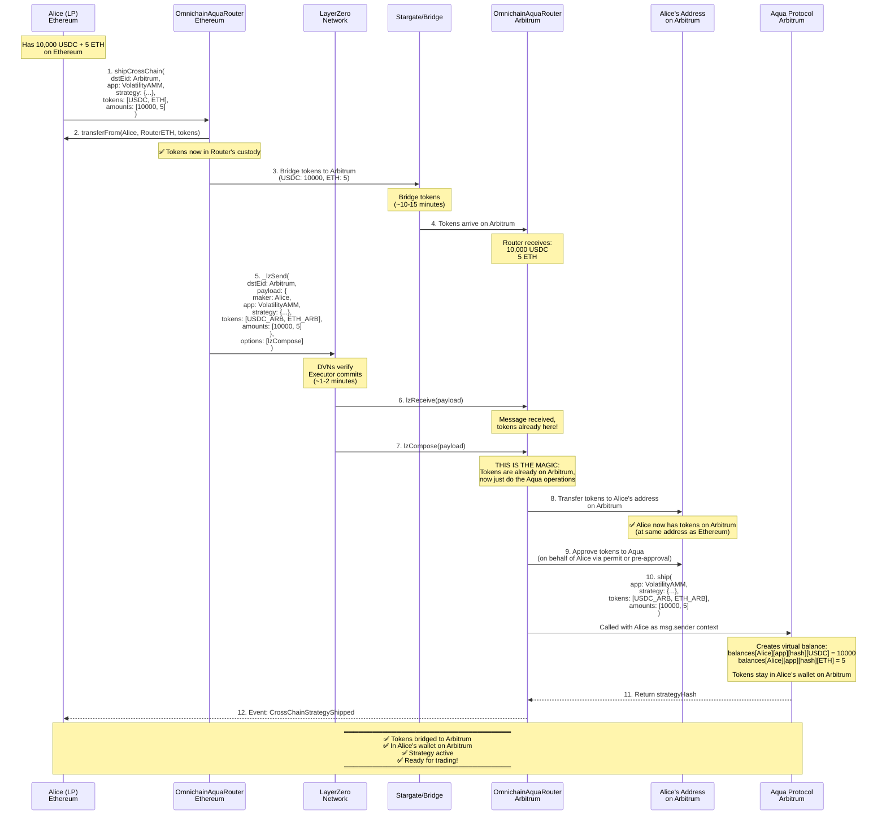
```mermaid
sequenceDiagram
    participant Alice as Alice (LP)<br/>Ethereum
    participant RouterETH as OmnichainAquaRouter<br/>Ethereum
    participant LZ as LayerZero<br/>Network
    participant Bridge as Stargate/Bridge
    participant RouterARB as OmnichainAquaRouter<br/>Arbitrum
    participant Alice_ARB as Alice's Address<br/>on Arbitrum
    participant AquaARB as Aqua Protocol<br/>Arbitrum

    Note over Alice: Has 10,000 USDC + 5 ETH<br/>on Ethereum

    Alice->>RouterETH: 1. shipCrossChain(<br/>dstEid: Arbitrum,<br/>app: VolatilityAMM,<br/>strategy: {...},<br/>tokens: [USDC, ETH],<br/>amounts: [10000, 5]<br/>)
    
    RouterETH->>Alice: 2. transferFrom(Alice, RouterETH, tokens)
    
    Note over RouterETH: ✅ Tokens now in Router's custody
    
    RouterETH->>Bridge: 3. Bridge tokens to Arbitrum<br/>(USDC: 10000, ETH: 5)
    
    Note over Bridge: Bridge tokens<br/>(~10-15 minutes)
    
    Bridge->>RouterARB: 4. Tokens arrive on Arbitrum
    
    Note over RouterARB: Router receives:<br/>10,000 USDC<br/>5 ETH
    
    RouterETH->>LZ: 5. _lzSend(<br/>dstEid: Arbitrum,<br/>payload: {<br/>  maker: Alice,<br/>  app: VolatilityAMM,<br/>  strategy: {...},<br/>  tokens: [USDC_ARB, ETH_ARB],<br/>  amounts: [10000, 5]<br/>},<br/>options: [lzCompose]<br/>)
    
    Note over LZ: DVNs verify<br/>Executor commits<br/>(~1-2 minutes)
    
    LZ->>RouterARB: 6. lzReceive(payload)
    
    Note over RouterARB: Message received,<br/>tokens already here!
    
    LZ->>RouterARB: 7. lzCompose(payload)
    
    Note over RouterARB: THIS IS THE MAGIC:<br/>Tokens are already on Arbitrum,<br/>now just do the Aqua operations
    
    RouterARB->>Alice_ARB: 8. Transfer tokens to Alice's address<br/>on Arbitrum
    
    Note over Alice_ARB: ✅ Alice now has tokens on Arbitrum<br/>(at same address as Ethereum)
    
    RouterARB->>Alice_ARB: 9. Approve tokens to Aqua<br/>(on behalf of Alice via permit or pre-approval)
    
    RouterARB->>AquaARB: 10. ship(<br/>app: VolatilityAMM,<br/>strategy: {...},<br/>tokens: [USDC_ARB, ETH_ARB],<br/>amounts: [10000, 5]<br/>)<br/><br/>Called with Alice as msg.sender context
    
    Note over AquaARB: Creates virtual balance:<br/>balances[Alice][app][hash][USDC] = 10000<br/>balances[Alice][app][hash][ETH] = 5<br/><br/>Tokens stay in Alice's wallet on Arbitrum
    
    AquaARB-->>RouterARB: 11. Return strategyHash
    
    RouterARB-->>Alice: 12. Event: CrossChainStrategyShipped
    
    Note over Alice,AquaARB: ═══════════════════════════════════<br/>✅ Tokens bridged to Arbitrum<br/>✅ In Alice's wallet on Arbitrum<br/>✅ Strategy active<br/>✅ Ready for trading!<br/>═══════════════════════════════════
```

---

## Corrected Diagram 2: Trader Executes Swap (Now Simple!)

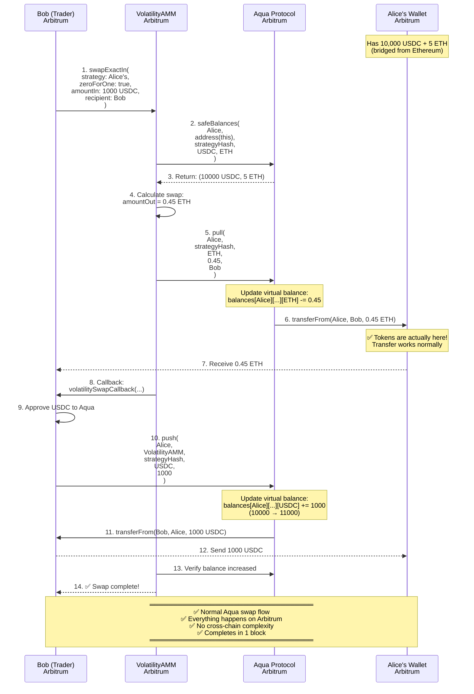
```mermaid
sequenceDiagram
    participant Bob as Bob (Trader)<br/>Arbitrum
    participant StrategyARB as VolatilityAMM<br/>Arbitrum
    participant AquaARB as Aqua Protocol<br/>Arbitrum
    participant Alice_ARB as Alice's Wallet<br/>Arbitrum

    Note over Alice_ARB: Has 10,000 USDC + 5 ETH<br/>(bridged from Ethereum)

    Bob->>StrategyARB: 1. swapExactIn(<br/>strategy: Alice's,<br/>zeroForOne: true,<br/>amountIn: 1000 USDC,<br/>recipient: Bob<br/>)
    
    StrategyARB->>AquaARB: 2. safeBalances(<br/>Alice,<br/>address(this),<br/>strategyHash,<br/>USDC, ETH<br/>)
    
    AquaARB-->>StrategyARB: 3. Return: (10000 USDC, 5 ETH)
    
    StrategyARB->>StrategyARB: 4. Calculate swap:<br/>amountOut = 0.45 ETH
    
    StrategyARB->>AquaARB: 5. pull(<br/>Alice,<br/>strategyHash,<br/>ETH,<br/>0.45,<br/>Bob<br/>)
    
    Note over AquaARB: Update virtual balance:<br/>balances[Alice][...][ETH] -= 0.45
    
    AquaARB->>Alice_ARB: 6. transferFrom(Alice, Bob, 0.45 ETH)
    
    Note over Alice_ARB: ✅ Tokens are actually here!<br/>Transfer works normally
    
    Alice_ARB-->>Bob: 7. Receive 0.45 ETH
    
    StrategyARB->>Bob: 8. Callback:<br/>volatilitySwapCallback(...)
    
    Bob->>Bob: 9. Approve USDC to Aqua
    
    Bob->>AquaARB: 10. push(<br/>Alice,<br/>VolatilityAMM,<br/>strategyHash,<br/>USDC,<br/>1000<br/>)
    
    Note over AquaARB: Update virtual balance:<br/>balances[Alice][...][USDC] += 1000<br/>(10000 → 11000)
    
    AquaARB->>Bob: 11. transferFrom(Bob, Alice, 1000 USDC)
    
    Bob-->>Alice_ARB: 12. Send 1000 USDC
    
    StrategyARB->>AquaARB: 13. Verify balance increased
    
    StrategyARB-->>Bob: 14. ✅ Swap complete!
    
    Note over Bob,Alice_ARB: ═══════════════════════════════════<br/>✅ Normal Aqua swap flow<br/>✅ Everything happens on Arbitrum<br/>✅ No cross-chain complexity<br/>✅ Completes in 1 block<br/>═══════════════════════════════════
```

---

## Corrected Diagram 3: LP Docks and Withdraws Back to Ethereum

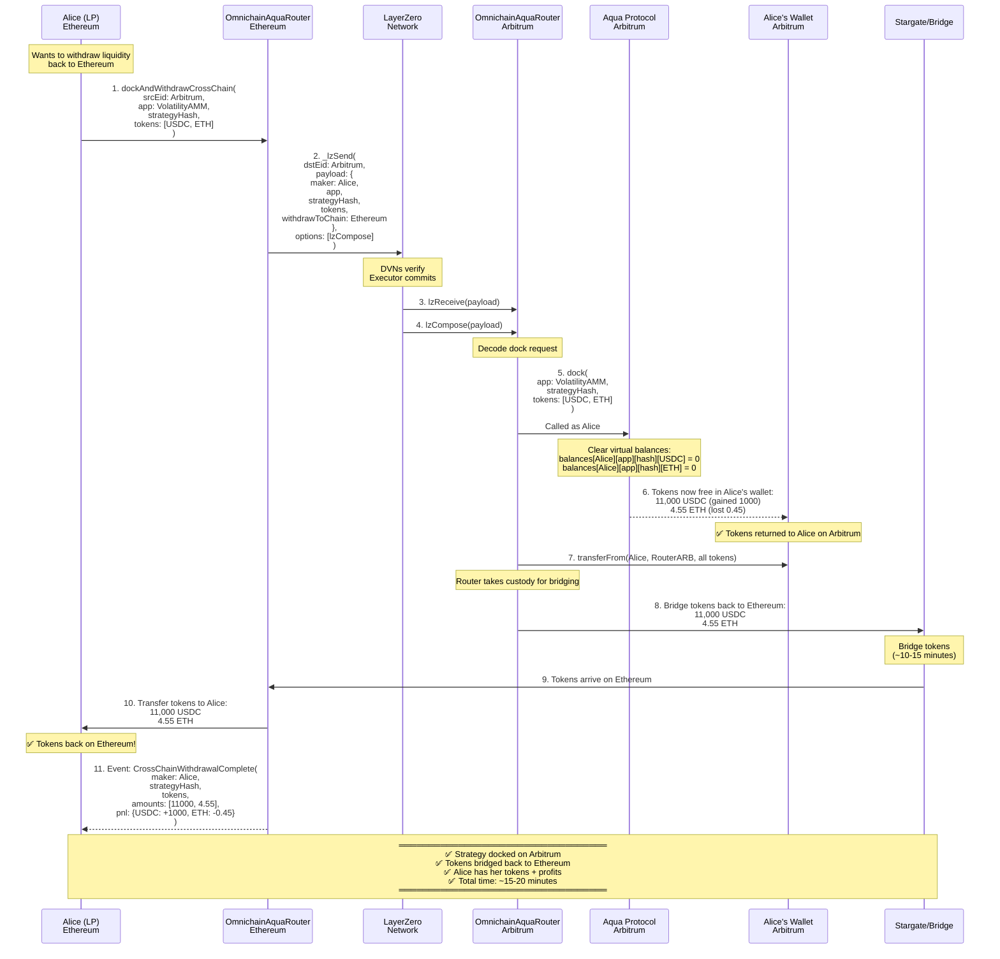
```mermaid
sequenceDiagram
    participant Alice as Alice (LP)<br/>Ethereum
    participant RouterETH as OmnichainAquaRouter<br/>Ethereum
    participant LZ as LayerZero<br/>Network
    participant RouterARB as OmnichainAquaRouter<br/>Arbitrum
    participant AquaARB as Aqua Protocol<br/>Arbitrum
    participant Alice_ARB as Alice's Wallet<br/>Arbitrum
    participant Bridge as Stargate/Bridge

    Note over Alice: Wants to withdraw liquidity<br/>back to Ethereum

    Alice->>RouterETH: 1. dockAndWithdrawCrossChain(<br/>srcEid: Arbitrum,<br/>app: VolatilityAMM,<br/>strategyHash,<br/>tokens: [USDC, ETH]<br/>)
    
    RouterETH->>LZ: 2. _lzSend(<br/>dstEid: Arbitrum,<br/>payload: {<br/>  maker: Alice,<br/>  app,<br/>  strategyHash,<br/>  tokens,<br/>  withdrawToChain: Ethereum<br/>},<br/>options: [lzCompose]<br/>)
    
    Note over LZ: DVNs verify<br/>Executor commits
    
    LZ->>RouterARB: 3. lzReceive(payload)
    
    LZ->>RouterARB: 4. lzCompose(payload)
    
    Note over RouterARB: Decode dock request
    
    RouterARB->>AquaARB: 5. dock(<br/>app: VolatilityAMM,<br/>strategyHash,<br/>tokens: [USDC, ETH]<br/>)<br/><br/>Called as Alice
    
    Note over AquaARB: Clear virtual balances:<br/>balances[Alice][app][hash][USDC] = 0<br/>balances[Alice][app][hash][ETH] = 0
    
    AquaARB-->>Alice_ARB: 6. Tokens now free in Alice's wallet:<br/>11,000 USDC (gained 1000)<br/>4.55 ETH (lost 0.45)
    
    Note over Alice_ARB: ✅ Tokens returned to Alice on Arbitrum
    
    RouterARB->>Alice_ARB: 7. transferFrom(Alice, RouterARB, all tokens)
    
    Note over RouterARB: Router takes custody for bridging
    
    RouterARB->>Bridge: 8. Bridge tokens back to Ethereum:<br/>11,000 USDC<br/>4.55 ETH
    
    Note over Bridge: Bridge tokens<br/>(~10-15 minutes)
    
    Bridge->>RouterETH: 9. Tokens arrive on Ethereum
    
    RouterETH->>Alice: 10. Transfer tokens to Alice:<br/>11,000 USDC<br/>4.55 ETH
    
    Note over Alice: ✅ Tokens back on Ethereum!
    
    RouterETH-->>Alice: 11. Event: CrossChainWithdrawalComplete(<br/>maker: Alice,<br/>strategyHash,<br/>tokens,<br/>amounts: [11000, 4.55],<br/>pnl: {USDC: +1000, ETH: -0.45}<br/>)
    
    Note over Alice,Bridge: ═══════════════════════════════════<br/>✅ Strategy docked on Arbitrum<br/>✅ Tokens bridged back to Ethereum<br/>✅ Alice has her tokens + profits<br/>✅ Total time: ~15-20 minutes<br/>═══════════════════════════════════
```

---

## Key Simplifications

### ✅ What This Approach Fixes:

1. **Bridge First, Act Later**
   - Tokens physically move to destination chain
   - Then Aqua operations happen normally
   - No need for liquidity pools, synthetic tokens, or debt tracking

2. **Aqua Works Exactly as Designed**
   - Tokens are in LP's wallet on the destination chain
   - `pull()` and `push()` work normally
   - No modifications needed to Aqua protocol

3. **Composer Just Orchestrates**
   - `lzCompose()` waits for tokens to arrive
   - Then calls `Aqua.ship()` or `Aqua.dock()`
   - Clean separation of concerns

4. **Trading is Pure Single-Chain**
   - Once strategy is shipped, it's just normal Aqua
   - No cross-chain complexity during swaps
   - Fast execution

### The Flow is Now:

```
Ship:     Bridge tokens → LZ message → lzCompose → Aqua.ship()
Trade:    Normal Aqua swap (single chain)
Withdraw: LZ message → lzCompose → Aqua.dock() → Bridge tokens back
```

**Is this the architecture you had in mind? Much cleaner!**

```plaintext
sequenceDiagram
    participant Alice as Alice (LP)<br/>Ethereum
    participant RouterETH as OmnichainAquaRouter<br/>Ethereum
    participant LZ as LayerZero<br/>Network
    participant Bridge as Stargate/Bridge
    participant RouterARB as OmnichainAquaRouter<br/>Arbitrum
    participant Alice_ARB as Alice's Address<br/>on Arbitrum
    participant AquaARB as Aqua Protocol<br/>Arbitrum

    Note over Alice: Has 10,000 USDC + 5 ETH<br/>on Ethereum

    Alice->>RouterETH: 1. shipCrossChain(<br/>dstEid: Arbitrum,<br/>app: VolatilityAMM,<br/>strategy: {...},<br/>tokens: [USDC, ETH],<br/>amounts: [10000, 5]<br/>)
    
    RouterETH->>Alice: 2. transferFrom(Alice, RouterETH, tokens)
    
    Note over RouterETH: ✅ Tokens now in Router's custody
    
    RouterETH->>Bridge: 3. Bridge tokens to Arbitrum<br/>(USDC: 10000, ETH: 5)
    
    Note over Bridge: Bridge tokens<br/>(~10-15 minutes)
    
    Bridge->>RouterARB: 4. Tokens arrive on Arbitrum
    
    Note over RouterARB: Router receives:<br/>10,000 USDC<br/>5 ETH
    
    RouterETH->>LZ: 5. _lzSend(<br/>dstEid: Arbitrum,<br/>payload: {<br/>  maker: Alice,<br/>  app: VolatilityAMM,<br/>  strategy: {...},<br/>  tokens: [USDC_ARB, ETH_ARB],<br/>  amounts: [10000, 5]<br/>},<br/>options: [lzCompose]<br/>)
    
    Note over LZ: DVNs verify<br/>Executor commits<br/>(~1-2 minutes)
    
    LZ->>RouterARB: 6. lzReceive(payload)
    
    Note over RouterARB: Message received,<br/>tokens already here!
    
    LZ->>RouterARB: 7. lzCompose(payload)
    
    Note over RouterARB: THIS IS THE MAGIC:<br/>Tokens are already on Arbitrum,<br/>now just do the Aqua operations
    
    RouterARB->>Alice_ARB: 8. Transfer tokens to Alice's address<br/>on Arbitrum
    
    Note over Alice_ARB: ✅ Alice now has tokens on Arbitrum<br/>(at same address as Ethereum)
    
    RouterARB->>Alice_ARB: 9. Approve tokens to Aqua<br/>(on behalf of Alice via permit or pre-approval)
    
    RouterARB->>AquaARB: 10. ship(<br/>app: VolatilityAMM,<br/>strategy: {...},<br/>tokens: [USDC_ARB, ETH_ARB],<br/>amounts: [10000, 5]<br/>)<br/><br/>Called with Alice as msg.sender context
    
    Note over AquaARB: Creates virtual balance:<br/>balances[Alice][app][hash][USDC] = 10000<br/>balances[Alice][app][hash][ETH] = 5<br/><br/>Tokens stay in Alice's wallet on Arbitrum
    
    AquaARB-->>RouterARB: 11. Return strategyHash
    
    RouterARB-->>Alice: 12. Event: CrossChainStrategyShipped
    
    Note over Alice,AquaARB: ═══════════════════════════════════<br/>✅ Tokens bridged to Arbitrum<br/>✅ In Alice's wallet on Arbitrum<br/>✅ Strategy active<br/>✅ Ready for trading!<br/>═══════════════════════════════════
```

```plaintext
sequenceDiagram
    participant Bob as Bob (Trader)<br/>Arbitrum
    participant StrategyARB as VolatilityAMM<br/>Arbitrum
    participant AquaARB as Aqua Protocol<br/>Arbitrum
    participant Alice_ARB as Alice's Wallet<br/>Arbitrum

    Note over Alice_ARB: Has 10,000 USDC + 5 ETH<br/>(bridged from Ethereum)

    Bob->>StrategyARB: 1. swapExactIn(<br/>strategy: Alice's,<br/>zeroForOne: true,<br/>amountIn: 1000 USDC,<br/>recipient: Bob<br/>)
    
    StrategyARB->>AquaARB: 2. safeBalances(<br/>Alice,<br/>address(this),<br/>strategyHash,<br/>USDC, ETH<br/>)
    
    AquaARB-->>StrategyARB: 3. Return: (10000 USDC, 5 ETH)
    
    StrategyARB->>StrategyARB: 4. Calculate swap:<br/>amountOut = 0.45 ETH
    
    StrategyARB->>AquaARB: 5. pull(<br/>Alice,<br/>strategyHash,<br/>ETH,<br/>0.45,<br/>Bob<br/>)
    
    Note over AquaARB: Update virtual balance:<br/>balances[Alice][...][ETH] -= 0.45
    
    AquaARB->>Alice_ARB: 6. transferFrom(Alice, Bob, 0.45 ETH)
    
    Note over Alice_ARB: ✅ Tokens are actually here!<br/>Transfer works normally
    
    Alice_ARB-->>Bob: 7. Receive 0.45 ETH
    
    StrategyARB->>Bob: 8. Callback:<br/>volatilitySwapCallback(...)
    
    Bob->>Bob: 9. Approve USDC to Aqua
    
    Bob->>AquaARB: 10. push(<br/>Alice,<br/>VolatilityAMM,<br/>strategyHash,<br/>USDC,<br/>1000<br/>)
    
    Note over AquaARB: Update virtual balance:<br/>balances[Alice][...][USDC] += 1000<br/>(10000 → 11000)
    
    AquaARB->>Bob: 11. transferFrom(Bob, Alice, 1000 USDC)
    
    Bob-->>Alice_ARB: 12. Send 1000 USDC
    
    StrategyARB->>AquaARB: 13. Verify balance increased
    
    StrategyARB-->>Bob: 14. ✅ Swap complete!
    
    Note over Bob,Alice_ARB: ═══════════════════════════════════<br/>✅ Normal Aqua swap flow<br/>✅ Everything happens on Arbitrum<br/>✅ No cross-chain complexity<br/>✅ Completes in 1 block<br/>═══════════════════════════════════
```

```plaintext
sequenceDiagram
    participant Alice as Alice (LP)<br/>Ethereum
    participant RouterETH as OmnichainAquaRouter<br/>Ethereum
    participant LZ as LayerZero<br/>Network
    participant RouterARB as OmnichainAquaRouter<br/>Arbitrum
    participant AquaARB as Aqua Protocol<br/>Arbitrum
    participant Alice_ARB as Alice's Wallet<br/>Arbitrum
    participant Bridge as Stargate/Bridge

    Note over Alice: Wants to withdraw liquidity<br/>back to Ethereum

    Alice->>RouterETH: 1. dockAndWithdrawCrossChain(<br/>srcEid: Arbitrum,<br/>app: VolatilityAMM,<br/>strategyHash,<br/>tokens: [USDC, ETH]<br/>)
    
    RouterETH->>LZ: 2. _lzSend(<br/>dstEid: Arbitrum,<br/>payload: {<br/>  maker: Alice,<br/>  app,<br/>  strategyHash,<br/>  tokens,<br/>  withdrawToChain: Ethereum<br/>},<br/>options: [lzCompose]<br/>)
    
    Note over LZ: DVNs verify<br/>Executor commits
    
    LZ->>RouterARB: 3. lzReceive(payload)
    
    LZ->>RouterARB: 4. lzCompose(payload)
    
    Note over RouterARB: Decode dock request
    
    RouterARB->>AquaARB: 5. dock(<br/>app: VolatilityAMM,<br/>strategyHash,<br/>tokens: [USDC, ETH]<br/>)<br/><br/>Called as Alice
    
    Note over AquaARB: Clear virtual balances:<br/>balances[Alice][app][hash][USDC] = 0<br/>balances[Alice][app][hash][ETH] = 0
    
    AquaARB-->>Alice_ARB: 6. Tokens now free in Alice's wallet:<br/>11,000 USDC (gained 1000)<br/>4.55 ETH (lost 0.45)
    
    Note over Alice_ARB: ✅ Tokens returned to Alice on Arbitrum
    
    RouterARB->>Alice_ARB: 7. transferFrom(Alice, RouterARB, all tokens)
    
    Note over RouterARB: Router takes custody for bridging
    
    RouterARB->>Bridge: 8. Bridge tokens back to Ethereum:<br/>11,000 USDC<br/>4.55 ETH
    
    Note over Bridge: Bridge tokens<br/>(~10-15 minutes)
    
    Bridge->>RouterETH: 9. Tokens arrive on Ethereum
    
    RouterETH->>Alice: 10. Transfer tokens to Alice:<br/>11,000 USDC<br/>4.55 ETH
    
    Note over Alice: ✅ Tokens back on Ethereum!
    
    RouterETH-->>Alice: 11. Event: CrossChainWithdrawalComplete(<br/>maker: Alice,<br/>strategyHash,<br/>tokens,<br/>amounts: [11000, 4.55],<br/>pnl: {USDC: +1000, ETH: -0.45}<br/>)
    
    Note over Alice,Bridge: ═══════════════════════════════════<br/>✅ Strategy docked on Arbitrum<br/>✅ Tokens bridged back to Ethereum<br/>✅ Alice has her tokens + profits<br/>✅ Total time: ~15-20 minutes<br/>═══════════════════════════════════
```

```plaintext
Ship:     Bridge tokens → LZ message → lzCompose → Aqua.ship()
Trade:    Normal Aqua swap (single chain)
Withdraw: LZ message → lzCompose → Aqua.dock() → Bridge tokens back
```

---

**User**

I'm sorry, I mean use the decomposer functionality of LayerZero to execute pull or push operations on the intended chains.


and as a strategy creator -> i only deal with dock/ship ?

---

**Cursor**

OH! Now I understand! You want to use **LayerZero's message decomposition** to handle cross-chain `pull()` and `push()` operations! This is brilliant!

Let me re-think this completely:

## The Correct Architecture: Decompose Messages for Pull/Push

### Key Insight:
- **Tokens stay on their original chains** (just like Aqua intended)
- **`pull()` and `push()` operations are decomposed across chains via LayerZero**
- **Strategy creators only deal with `ship()` and `dock()`** - the cross-chain magic is abstracted away

---

## Corrected Understanding

### For Strategy Creators (Developers):
```solidity
// Deploy your AMM on any chain
contract MyVolatilityAMM is AquaApp {
    // Just implement your swap logic
    // Don't worry about cross-chain stuff
    
    function swap(...) {
        // Normal Aqua operations:
        AQUA.safeBalances(...);
        AQUA.pull(...);  // ← OmnichainAquaRouter handles cross-chain
        AQUA.push(...);  // ← OmnichainAquaRouter handles cross-chain
    }
}

// That's it! Cross-chain is transparent
```

### For LPs:
```solidity
// Ship strategy on Arbitrum, but tokens stay on Ethereum
omnichainRouter.ship(
    chainId: Arbitrum,
    app: MyVolatilityAMM,
    strategy: {...},
    tokens: [USDC, ETH],  // These stay on Ethereum!
    amounts: [10000, 5]
);

// Dock when done
omnichainRouter.dock(
    chainId: Arbitrum,
    strategyHash: 0xabc...
);
```

---

## Revised Diagram 1: LP Ships Strategy (Tokens Stay on Source Chain!)

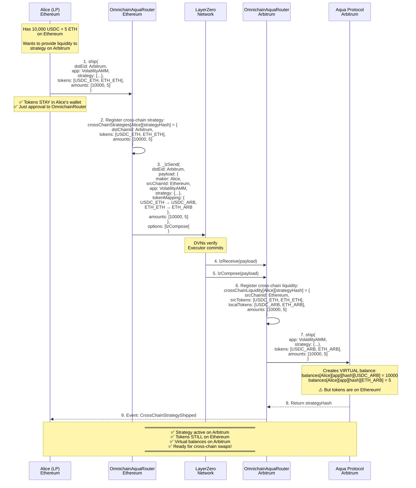
```mermaid
sequenceDiagram
    participant Alice as Alice (LP)<br/>Ethereum
    participant RouterETH as OmnichainAquaRouter<br/>Ethereum
    participant LZ as LayerZero<br/>Network
    participant RouterARB as OmnichainAquaRouter<br/>Arbitrum
    participant AquaARB as Aqua Protocol<br/>Arbitrum

    Note over Alice: Has 10,000 USDC + 5 ETH<br/>on Ethereum<br/><br/>Wants to provide liquidity to<br/>strategy on Arbitrum

    Alice->>RouterETH: 1. ship(<br/>dstEid: Arbitrum,<br/>app: VolatilityAMM,<br/>strategy: {...},<br/>tokens: [USDC_ETH, ETH_ETH],<br/>amounts: [10000, 5]<br/>)
    
    Note over Alice: ✅ Tokens STAY in Alice's wallet<br/>✅ Just approval to OmnichainRouter
    
    RouterETH->>RouterETH: 2. Register cross-chain strategy:<br/>crossChainStrategies[Alice][strategyHash] = {<br/>  dstChainId: Arbitrum,<br/>  tokens: [USDC_ETH, ETH_ETH],<br/>  amounts: [10000, 5]<br/>}
    
    RouterETH->>LZ: 3. _lzSend(<br/>dstEid: Arbitrum,<br/>payload: {<br/>  maker: Alice,<br/>  srcChainId: Ethereum,<br/>  app: VolatilityAMM,<br/>  strategy: {...},<br/>  tokenMapping: {<br/>    USDC_ETH → USDC_ARB,<br/>    ETH_ETH → ETH_ARB<br/>  },<br/>  amounts: [10000, 5]<br/>},<br/>options: [lzCompose]<br/>)
    
    Note over LZ: DVNs verify<br/>Executor commits
    
    LZ->>RouterARB: 4. lzReceive(payload)
    
    LZ->>RouterARB: 5. lzCompose(payload)
    
    RouterARB->>RouterARB: 6. Register cross-chain liquidity:<br/>crossChainLiquidity[Alice][strategyHash] = {<br/>  srcChainId: Ethereum,<br/>  srcTokens: [USDC_ETH, ETH_ETH],<br/>  localTokens: [USDC_ARB, ETH_ARB],<br/>  amounts: [10000, 5]<br/>}
    
    RouterARB->>AquaARB: 7. ship(<br/>app: VolatilityAMM,<br/>strategy: {...},<br/>tokens: [USDC_ARB, ETH_ARB],<br/>amounts: [10000, 5]<br/>)
    
    Note over AquaARB: Creates VIRTUAL balance:<br/>balances[Alice][app][hash][USDC_ARB] = 10000<br/>balances[Alice][app][hash][ETH_ARB] = 5<br/><br/>⚠️ But tokens are on Ethereum!
    
    AquaARB-->>RouterARB: 8. Return strategyHash
    
    RouterARB-->>Alice: 9. Event: CrossChainStrategyShipped
    
    Note over Alice,AquaARB: ═══════════════════════════════════<br/>✅ Strategy active on Arbitrum<br/>✅ Tokens STILL on Ethereum<br/>✅ Virtual balances on Arbitrum<br/>✅ Ready for cross-chain swaps!<br/>═══════════════════════════════════
```

---

## Revised Diagram 2: Trader Swaps (Cross-Chain Pull/Push via LZ)

This is where the magic happens!


```mermaid
sequenceDiagram
    participant Bob as Bob (Trader)<br/>Arbitrum
    participant StrategyARB as VolatilityAMM<br/>Arbitrum
    participant RouterARB as OmnichainAquaRouter<br/>Arbitrum (Aqua Proxy)
    participant LZ as LayerZero<br/>Network
    participant RouterETH as OmnichainAquaRouter<br/>Ethereum
    participant Alice as Alice's Wallet<br/>Ethereum

    Note over Bob: Wants to swap 1000 USDC → ETH<br/>on Arbitrum

    Bob->>StrategyARB: 1. swapExactIn(<br/>strategy: Alice's,<br/>zeroForOne: true,<br/>amountIn: 1000 USDC,<br/>recipient: Bob<br/>)
    
    StrategyARB->>RouterARB: 2. safeBalances(<br/>Alice,<br/>address(this),<br/>strategyHash,<br/>USDC_ARB, ETH_ARB<br/>)
    
    Note over RouterARB: OmnichainRouter acts as<br/>Aqua proxy/wrapper
    
    RouterARB-->>StrategyARB: 3. Return: (10000 USDC, 5 ETH)
    
    StrategyARB->>StrategyARB: 4. Calculate: amountOut = 0.45 ETH
    
    StrategyARB->>RouterARB: 5. pull(<br/>Alice,<br/>strategyHash,<br/>ETH_ARB,<br/>0.45,<br/>Bob<br/>)
    
    Note over RouterARB: Check if cross-chain liquidity
    
    RouterARB->>RouterARB: 6. Lookup:<br/>crossChainLiquidity[Alice][strategyHash]<br/><br/>Found: {<br/>  srcChainId: Ethereum,<br/>  srcToken: ETH_ETH,<br/>  amount: 5<br/>}
    
    Note over RouterARB: ⚠️ Cross-chain pull needed!<br/>Decompose message to Ethereum
    
    RouterARB->>LZ: 7. _lzSend(<br/>dstEid: Ethereum,<br/>payload: {<br/>  operation: "PULL",<br/>  maker: Alice,<br/>  token: ETH_ETH,<br/>  amount: 0.45,<br/>  recipient: Bob,<br/>  recipientChain: Arbitrum,<br/>  strategyHash<br/>},<br/>options: [lzCompose]<br/>)
    
    Note over LZ: DVNs verify<br/>Executor commits<br/>(~1-2 minutes)
    
    LZ->>RouterETH: 8. lzReceive(payload)
    
    LZ->>RouterETH: 9. lzCompose(payload)
    
    Note over RouterETH: Execute PULL on source chain
    
    RouterETH->>Alice: 10. transferFrom(<br/>Alice,<br/>RouterETH,<br/>0.45 ETH<br/>)
    
    Note over Alice: ✅ Tokens pulled from Alice's wallet<br/>on Ethereum
    
    RouterETH->>RouterETH: 11. Update local registry:<br/>crossChainStrategies[Alice][hash].amounts[ETH] -= 0.45
    
    RouterETH->>LZ: 12. Bridge 0.45 ETH to Arbitrum<br/>(via Stargate or native bridge)
    
    Note over LZ: Bridge tokens<br/>(~10-15 minutes)
    
    LZ->>RouterARB: 13. Receive 0.45 ETH on Arbitrum
    
    RouterARB->>Bob: 14. Transfer 0.45 ETH to Bob
    
    Note over Bob: ✅ Receives ETH!
    
    RouterARB->>RouterARB: 15. Update virtual balance:<br/>balances[Alice][...][ETH_ARB] -= 0.45
    
    Note over RouterARB: Now waiting for Bob to send USDC...<br/>(Callback pattern)
    
    StrategyARB->>Bob: 16. Callback:<br/>volatilitySwapCallback(...)
    
    Bob->>Bob: 17. Approve USDC to RouterARB
    
    Bob->>RouterARB: 18. push(<br/>Alice,<br/>VolatilityAMM,<br/>strategyHash,<br/>USDC_ARB,<br/>1000<br/>)
    
    Note over RouterARB: Check if cross-chain liquidity
    
    RouterARB->>RouterARB: 19. Lookup:<br/>crossChainLiquidity[Alice][strategyHash]<br/><br/>Found: srcChainId = Ethereum
    
    Note over RouterARB: ⚠️ Cross-chain push needed!<br/>Decompose message to Ethereum
    
    RouterARB->>Bob: 20. transferFrom(Bob, RouterARB, 1000 USDC)
    
    Note over RouterARB: Router takes custody on Arbitrum
    
    RouterARB->>LZ: 21. _lzSend(<br/>dstEid: Ethereum,<br/>payload: {<br/>  operation: "PUSH",<br/>  maker: Alice,<br/>  token: USDC_ETH,<br/>  amount: 1000,<br/>  strategyHash<br/>},<br/>options: [lzCompose]<br/>)
    
    RouterARB->>LZ: 22. Bridge 1000 USDC to Ethereum
    
    Note over LZ: Bridge tokens + message
    
    LZ->>RouterETH: 23. lzReceive(payload)
    
    LZ->>RouterETH: 24. lzCompose(payload)
    
    LZ->>RouterETH: 25. Receive 1000 USDC
    
    RouterETH->>Alice: 26. Transfer 1000 USDC to Alice
    
    Note over Alice: ✅ Receives USDC in her wallet!
    
    RouterETH->>RouterETH: 27. Update local registry:<br/>crossChainStrategies[Alice][hash].amounts[USDC] += 1000
    
    RouterETH-->>RouterARB: 28. Confirmation message
    
    RouterARB->>RouterARB: 29. Update virtual balance:<br/>balances[Alice][...][USDC_ARB] += 1000
    
    StrategyARB-->>Bob: 30. ✅ Swap complete!
    
    Note over Alice,Bob: ═══════════════════════════════════<br/>FINAL STATE:<br/>✅ Bob has 0.45 ETH on Arbitrum<br/>✅ Alice has 1000 more USDC on Ethereum<br/>✅ Alice has 0.45 less ETH on Ethereum<br/>✅ Virtual balances synced<br/>✅ Tokens never left their home chains<br/>   (except for bridging during swap)<br/>═══════════════════════════════════
```

---

## Revised Diagram 3: LP Docks Strategy (Simple!)

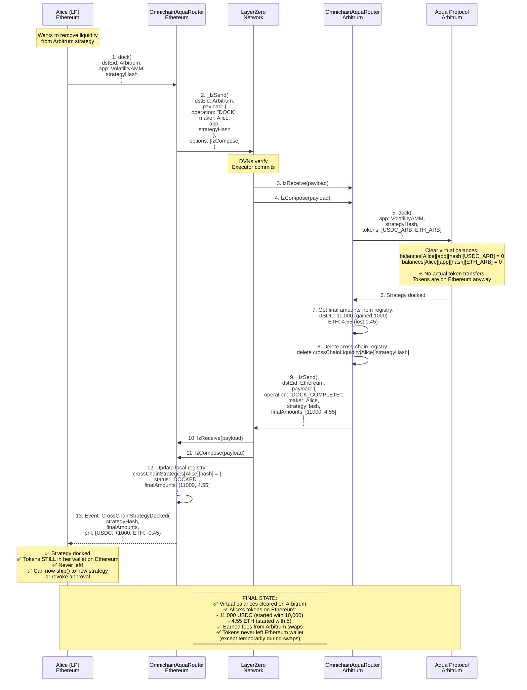
```mermaid
sequenceDiagram
    participant Alice as Alice (LP)<br/>Ethereum
    participant RouterETH as OmnichainAquaRouter<br/>Ethereum
    participant LZ as LayerZero<br/>Network
    participant RouterARB as OmnichainAquaRouter<br/>Arbitrum
    participant AquaARB as Aqua Protocol<br/>Arbitrum

    Note over Alice: Wants to remove liquidity<br/>from Arbitrum strategy

    Alice->>RouterETH: 1. dock(<br/>dstEid: Arbitrum,<br/>app: VolatilityAMM,<br/>strategyHash<br/>)
    
    RouterETH->>LZ: 2. _lzSend(<br/>dstEid: Arbitrum,<br/>payload: {<br/>  operation: "DOCK",<br/>  maker: Alice,<br/>  app,<br/>  strategyHash<br/>},<br/>options: [lzCompose]<br/>)
    
    Note over LZ: DVNs verify<br/>Executor commits
    
    LZ->>RouterARB: 3. lzReceive(payload)
    
    LZ->>RouterARB: 4. lzCompose(payload)
    
    RouterARB->>AquaARB: 5. dock(<br/>app: VolatilityAMM,<br/>strategyHash,<br/>tokens: [USDC_ARB, ETH_ARB]<br/>)
    
    Note over AquaARB: Clear virtual balances:<br/>balances[Alice][app][hash][USDC_ARB] = 0<br/>balances[Alice][app][hash][ETH_ARB] = 0<br/><br/>⚠️ No actual token transfers!<br/>Tokens are on Ethereum anyway
    
    AquaARB-->>RouterARB: 6. Strategy docked
    
    RouterARB->>RouterARB: 7. Get final amounts from registry:<br/>USDC: 11,000 (gained 1000)<br/>ETH: 4.55 (lost 0.45)
    
    RouterARB->>RouterARB: 8. Delete cross-chain registry:<br/>delete crossChainLiquidity[Alice][strategyHash]
    
    RouterARB->>LZ: 9. _lzSend(<br/>dstEid: Ethereum,<br/>payload: {<br/>  operation: "DOCK_COMPLETE",<br/>  maker: Alice,<br/>  strategyHash,<br/>  finalAmounts: [11000, 4.55]<br/>}<br/>)
    
    LZ->>RouterETH: 10. lzReceive(payload)
    
    LZ->>RouterETH: 11. lzCompose(payload)
    
    RouterETH->>RouterETH: 12. Update local registry:<br/>crossChainStrategies[Alice][hash] = {<br/>  status: "DOCKED",<br/>  finalAmounts: [11000, 4.55]<br/>}
    
    RouterETH-->>Alice: 13. Event: CrossChainStrategyDocked(<br/>strategyHash,<br/>finalAmounts,<br/>pnl: {USDC: +1000, ETH: -0.45}<br/>)
    
    Note over Alice: ✅ Strategy docked<br/>✅ Tokens STILL in her wallet on Ethereum<br/>✅ Never left!<br/>✅ Can now ship() to new strategy<br/>   or revoke approval
    
    Note over Alice,AquaARB: ═══════════════════════════════════<br/>FINAL STATE:<br/>✅ Virtual balances cleared on Arbitrum<br/>✅ Alice's tokens on Ethereum:<br/>   - 11,000 USDC (started with 10,000)<br/>   - 4.55 ETH (started with 5)<br/>✅ Earned fees from Arbitrum swaps<br/>✅ Tokens never left Ethereum wallet<br/>   (except temporarily during swaps)<br/>═══════════════════════════════════
```

---

## Key Architecture Points

### For Strategy Creators (You Only Deal With ship/dock):

```solidity
// As a strategy developer, you just build your AMM:
contract MyVolatilityAMM is AquaApp {
    function swap(Strategy calldata strategy, ...) external {
        // Just use normal Aqua operations
        (uint256 balanceIn, uint256 balanceOut) = 
            AQUA.safeBalances(strategy.maker, address(this), strategyHash, tokenIn, tokenOut);
        
        // Calculate swap
        uint256 amountOut = calculateSwap(...);
        
        // Pull and push - OmnichainRouter handles cross-chain magic
        AQUA.pull(strategy.maker, strategyHash, tokenOut, amountOut, recipient);
        
        // Callback for taker to push
        callback(...);
        
        // Verify push
        _safeCheckAquaPush(strategy.maker, strategyHash, tokenIn, expectedBalance);
    }
}

// That's it! You don't need to know about LayerZero at all
```

### The OmnichainAquaRouter Acts as Aqua Proxy:

```solidity
contract OmnichainAquaRouter is OApp {
    IAqua public aqua;
    
    // Wraps Aqua's pull() with cross-chain logic
    function pull(
        address maker,
        bytes32 strategyHash,
        address token,
        uint256 amount,
        address to
    ) external {
        // Check if this is cross-chain liquidity
        CrossChainLiquidity memory ccl = crossChainLiquidity[maker][strategyHash];
        
        if (ccl.srcChainId == 0) {
            // Local liquidity - just call Aqua directly
            aqua.pull(maker, strategyHash, token, amount, to);
        } else {
            // Cross-chain liquidity - decompose via LayerZero
            _lzSend(ccl.srcChainId, abi.encode("PULL", maker, token, amount, to, ...));
            // Wait for tokens to be bridged and delivered
        }
    }
    
    // Wraps Aqua's push() with cross-chain logic
    function push(
        address maker,
        address app,
        bytes32 strategyHash,
        address token,
        uint256 amount
    ) external {
        // Similar decomposition logic
    }
}
```

### Benefits:

1. **Strategy developers don't change anything** - they just use Aqua's API
2. **LPs get cross-chain liquidity** - tokens stay on preferred chain
3. **Traders don't know the difference** - same swap interface
4. **OmnichainRouter handles all complexity** - message decomposition, bridging, state sync

**Is THIS the architecture you were envisioning? Using LZ message decomposition to make pull/push cross-chain transparent?**

```solidity
// Deploy your AMM on any chain
contract MyVolatilityAMM is AquaApp {
    // Just implement your swap logic
    // Don't worry about cross-chain stuff
    
    function swap(...) {
        // Normal Aqua operations:
        AQUA.safeBalances(...);
        AQUA.pull(...);  // ← OmnichainAquaRouter handles cross-chain
        AQUA.push(...);  // ← OmnichainAquaRouter handles cross-chain
    }
}

// That's it! Cross-chain is transparent
```

```solidity
// Ship strategy on Arbitrum, but tokens stay on Ethereum
omnichainRouter.ship(
    chainId: Arbitrum,
    app: MyVolatilityAMM,
    strategy: {...},
    tokens: [USDC, ETH],  // These stay on Ethereum!
    amounts: [10000, 5]
);

// Dock when done
omnichainRouter.dock(
    chainId: Arbitrum,
    strategyHash: 0xabc...
);
```

```plaintext
sequenceDiagram
    participant Alice as Alice (LP)<br/>Ethereum
    participant RouterETH as OmnichainAquaRouter<br/>Ethereum
    participant LZ as LayerZero<br/>Network
    participant RouterARB as OmnichainAquaRouter<br/>Arbitrum
    participant AquaARB as Aqua Protocol<br/>Arbitrum

    Note over Alice: Has 10,000 USDC + 5 ETH<br/>on Ethereum<br/><br/>Wants to provide liquidity to<br/>strategy on Arbitrum

    Alice->>RouterETH: 1. ship(<br/>dstEid: Arbitrum,<br/>app: VolatilityAMM,<br/>strategy: {...},<br/>tokens: [USDC_ETH, ETH_ETH],<br/>amounts: [10000, 5]<br/>)
    
    Note over Alice: ✅ Tokens STAY in Alice's wallet<br/>✅ Just approval to OmnichainRouter
    
    RouterETH->>RouterETH: 2. Register cross-chain strategy:<br/>crossChainStrategies[Alice][strategyHash] = {<br/>  dstChainId: Arbitrum,<br/>  tokens: [USDC_ETH, ETH_ETH],<br/>  amounts: [10000, 5]<br/>}
    
    RouterETH->>LZ: 3. _lzSend(<br/>dstEid: Arbitrum,<br/>payload: {<br/>  maker: Alice,<br/>  srcChainId: Ethereum,<br/>  app: VolatilityAMM,<br/>  strategy: {...},<br/>  tokenMapping: {<br/>    USDC_ETH → USDC_ARB,<br/>    ETH_ETH → ETH_ARB<br/>  },<br/>  amounts: [10000, 5]<br/>},<br/>options: [lzCompose]<br/>)
    
    Note over LZ: DVNs verify<br/>Executor commits
    
    LZ->>RouterARB: 4. lzReceive(payload)
    
    LZ->>RouterARB: 5. lzCompose(payload)
    
    RouterARB->>RouterARB: 6. Register cross-chain liquidity:<br/>crossChainLiquidity[Alice][strategyHash] = {<br/>  srcChainId: Ethereum,<br/>  srcTokens: [USDC_ETH, ETH_ETH],<br/>  localTokens: [USDC_ARB, ETH_ARB],<br/>  amounts: [10000, 5]<br/>}
    
    RouterARB->>AquaARB: 7. ship(<br/>app: VolatilityAMM,<br/>strategy: {...},<br/>tokens: [USDC_ARB, ETH_ARB],<br/>amounts: [10000, 5]<br/>)
    
    Note over AquaARB: Creates VIRTUAL balance:<br/>balances[Alice][app][hash][USDC_ARB] = 10000<br/>balances[Alice][app][hash][ETH_ARB] = 5<br/><br/>⚠️ But tokens are on Ethereum!
    
    AquaARB-->>RouterARB: 8. Return strategyHash
    
    RouterARB-->>Alice: 9. Event: CrossChainStrategyShipped
    
    Note over Alice,AquaARB: ═══════════════════════════════════<br/>✅ Strategy active on Arbitrum<br/>✅ Tokens STILL on Ethereum<br/>✅ Virtual balances on Arbitrum<br/>✅ Ready for cross-chain swaps!<br/>═══════════════════════════════════
```

```plaintext
sequenceDiagram
    participant Bob as Bob (Trader)<br/>Arbitrum
    participant StrategyARB as VolatilityAMM<br/>Arbitrum
    participant RouterARB as OmnichainAquaRouter<br/>Arbitrum (Aqua Proxy)
    participant LZ as LayerZero<br/>Network
    participant RouterETH as OmnichainAquaRouter<br/>Ethereum
    participant Alice as Alice's Wallet<br/>Ethereum

    Note over Bob: Wants to swap 1000 USDC → ETH<br/>on Arbitrum

    Bob->>StrategyARB: 1. swapExactIn(<br/>strategy: Alice's,<br/>zeroForOne: true,<br/>amountIn: 1000 USDC,<br/>recipient: Bob<br/>)
    
    StrategyARB->>RouterARB: 2. safeBalances(<br/>Alice,<br/>address(this),<br/>strategyHash,<br/>USDC_ARB, ETH_ARB<br/>)
    
    Note over RouterARB: OmnichainRouter acts as<br/>Aqua proxy/wrapper
    
    RouterARB-->>StrategyARB: 3. Return: (10000 USDC, 5 ETH)
    
    StrategyARB->>StrategyARB: 4. Calculate: amountOut = 0.45 ETH
    
    StrategyARB->>RouterARB: 5. pull(<br/>Alice,<br/>strategyHash,<br/>ETH_ARB,<br/>0.45,<br/>Bob<br/>)
    
    Note over RouterARB: Check if cross-chain liquidity
    
    RouterARB->>RouterARB: 6. Lookup:<br/>crossChainLiquidity[Alice][strategyHash]<br/><br/>Found: {<br/>  srcChainId: Ethereum,<br/>  srcToken: ETH_ETH,<br/>  amount: 5<br/>}
    
    Note over RouterARB: ⚠️ Cross-chain pull needed!<br/>Decompose message to Ethereum
    
    RouterARB->>LZ: 7. _lzSend(<br/>dstEid: Ethereum,<br/>payload: {<br/>  operation: "PULL",<br/>  maker: Alice,<br/>  token: ETH_ETH,<br/>  amount: 0.45,<br/>  recipient: Bob,<br/>  recipientChain: Arbitrum,<br/>  strategyHash<br/>},<br/>options: [lzCompose]<br/>)
    
    Note over LZ: DVNs verify<br/>Executor commits<br/>(~1-2 minutes)
    
    LZ->>RouterETH: 8. lzReceive(payload)
    
    LZ->>RouterETH: 9. lzCompose(payload)
    
    Note over RouterETH: Execute PULL on source chain
    
    RouterETH->>Alice: 10. transferFrom(<br/>Alice,<br/>RouterETH,<br/>0.45 ETH<br/>)
    
    Note over Alice: ✅ Tokens pulled from Alice's wallet<br/>on Ethereum
    
    RouterETH->>RouterETH: 11. Update local registry:<br/>crossChainStrategies[Alice][hash].amounts[ETH] -= 0.45
    
    RouterETH->>LZ: 12. Bridge 0.45 ETH to Arbitrum<br/>(via Stargate or native bridge)
    
    Note over LZ: Bridge tokens<br/>(~10-15 minutes)
    
    LZ->>RouterARB: 13. Receive 0.45 ETH on Arbitrum
    
    RouterARB->>Bob: 14. Transfer 0.45 ETH to Bob
    
    Note over Bob: ✅ Receives ETH!
    
    RouterARB->>RouterARB: 15. Update virtual balance:<br/>balances[Alice][...][ETH_ARB] -= 0.45
    
    Note over RouterARB: Now waiting for Bob to send USDC...<br/>(Callback pattern)
    
    StrategyARB->>Bob: 16. Callback:<br/>volatilitySwapCallback(...)
    
    Bob->>Bob: 17. Approve USDC to RouterARB
    
    Bob->>RouterARB: 18. push(<br/>Alice,<br/>VolatilityAMM,<br/>strategyHash,<br/>USDC_ARB,<br/>1000<br/>)
    
    Note over RouterARB: Check if cross-chain liquidity
    
    RouterARB->>RouterARB: 19. Lookup:<br/>crossChainLiquidity[Alice][strategyHash]<br/><br/>Found: srcChainId = Ethereum
    
    Note over RouterARB: ⚠️ Cross-chain push needed!<br/>Decompose message to Ethereum
    
    RouterARB->>Bob: 20. transferFrom(Bob, RouterARB, 1000 USDC)
    
    Note over RouterARB: Router takes custody on Arbitrum
    
    RouterARB->>LZ: 21. _lzSend(<br/>dstEid: Ethereum,<br/>payload: {<br/>  operation: "PUSH",<br/>  maker: Alice,<br/>  token: USDC_ETH,<br/>  amount: 1000,<br/>  strategyHash<br/>},<br/>options: [lzCompose]<br/>)
    
    RouterARB->>LZ: 22. Bridge 1000 USDC to Ethereum
    
    Note over LZ: Bridge tokens + message
    
    LZ->>RouterETH: 23. lzReceive(payload)
    
    LZ->>RouterETH: 24. lzCompose(payload)
    
    LZ->>RouterETH: 25. Receive 1000 USDC
    
    RouterETH->>Alice: 26. Transfer 1000 USDC to Alice
    
    Note over Alice: ✅ Receives USDC in her wallet!
    
    RouterETH->>RouterETH: 27. Update local registry:<br/>crossChainStrategies[Alice][hash].amounts[USDC] += 1000
    
    RouterETH-->>RouterARB: 28. Confirmation message
    
    RouterARB->>RouterARB: 29. Update virtual balance:<br/>balances[Alice][...][USDC_ARB] += 1000
    
    StrategyARB-->>Bob: 30. ✅ Swap complete!
    
    Note over Alice,Bob: ═══════════════════════════════════<br/>FINAL STATE:<br/>✅ Bob has 0.45 ETH on Arbitrum<br/>✅ Alice has 1000 more USDC on Ethereum<br/>✅ Alice has 0.45 less ETH on Ethereum<br/>✅ Virtual balances synced<br/>✅ Tokens never left their home chains<br/>   (except for bridging during swap)<br/>═══════════════════════════════════
```

```plaintext
sequenceDiagram
    participant Alice as Alice (LP)<br/>Ethereum
    participant RouterETH as OmnichainAquaRouter<br/>Ethereum
    participant LZ as LayerZero<br/>Network
    participant RouterARB as OmnichainAquaRouter<br/>Arbitrum
    participant AquaARB as Aqua Protocol<br/>Arbitrum

    Note over Alice: Wants to remove liquidity<br/>from Arbitrum strategy

    Alice->>RouterETH: 1. dock(<br/>dstEid: Arbitrum,<br/>app: VolatilityAMM,<br/>strategyHash<br/>)
    
    RouterETH->>LZ: 2. _lzSend(<br/>dstEid: Arbitrum,<br/>payload: {<br/>  operation: "DOCK",<br/>  maker: Alice,<br/>  app,<br/>  strategyHash<br/>},<br/>options: [lzCompose]<br/>)
    
    Note over LZ: DVNs verify<br/>Executor commits
    
    LZ->>RouterARB: 3. lzReceive(payload)
    
    LZ->>RouterARB: 4. lzCompose(payload)
    
    RouterARB->>AquaARB: 5. dock(<br/>app: VolatilityAMM,<br/>strategyHash,<br/>tokens: [USDC_ARB, ETH_ARB]<br/>)
    
    Note over AquaARB: Clear virtual balances:<br/>balances[Alice][app][hash][USDC_ARB] = 0<br/>balances[Alice][app][hash][ETH_ARB] = 0<br/><br/>⚠️ No actual token transfers!<br/>Tokens are on Ethereum anyway
    
    AquaARB-->>RouterARB: 6. Strategy docked
    
    RouterARB->>RouterARB: 7. Get final amounts from registry:<br/>USDC: 11,000 (gained 1000)<br/>ETH: 4.55 (lost 0.45)
    
    RouterARB->>RouterARB: 8. Delete cross-chain registry:<br/>delete crossChainLiquidity[Alice][strategyHash]
    
    RouterARB->>LZ: 9. _lzSend(<br/>dstEid: Ethereum,<br/>payload: {<br/>  operation: "DOCK_COMPLETE",<br/>  maker: Alice,<br/>  strategyHash,<br/>  finalAmounts: [11000, 4.55]<br/>}<br/>)
    
    LZ->>RouterETH: 10. lzReceive(payload)
    
    LZ->>RouterETH: 11. lzCompose(payload)
    
    RouterETH->>RouterETH: 12. Update local registry:<br/>crossChainStrategies[Alice][hash] = {<br/>  status: "DOCKED",<br/>  finalAmounts: [11000, 4.55]<br/>}
    
    RouterETH-->>Alice: 13. Event: CrossChainStrategyDocked(<br/>strategyHash,<br/>finalAmounts,<br/>pnl: {USDC: +1000, ETH: -0.45}<br/>)
    
    Note over Alice: ✅ Strategy docked<br/>✅ Tokens STILL in her wallet on Ethereum<br/>✅ Never left!<br/>✅ Can now ship() to new strategy<br/>   or revoke approval
    
    Note over Alice,AquaARB: ═══════════════════════════════════<br/>FINAL STATE:<br/>✅ Virtual balances cleared on Arbitrum<br/>✅ Alice's tokens on Ethereum:<br/>   - 11,000 USDC (started with 10,000)<br/>   - 4.55 ETH (started with 5)<br/>✅ Earned fees from Arbitrum swaps<br/>✅ Tokens never left Ethereum wallet<br/>   (except temporarily during swaps)<br/>═══════════════════════════════════
```

```solidity
// As a strategy developer, you just build your AMM:
contract MyVolatilityAMM is AquaApp {
    function swap(Strategy calldata strategy, ...) external {
        // Just use normal Aqua operations
        (uint256 balanceIn, uint256 balanceOut) = 
            AQUA.safeBalances(strategy.maker, address(this), strategyHash, tokenIn, tokenOut);
        
        // Calculate swap
        uint256 amountOut = calculateSwap(...);
        
        // Pull and push - OmnichainRouter handles cross-chain magic
        AQUA.pull(strategy.maker, strategyHash, tokenOut, amountOut, recipient);
        
        // Callback for taker to push
        callback(...);
        
        // Verify push
        _safeCheckAquaPush(strategy.maker, strategyHash, tokenIn, expectedBalance);
    }
}

// That's it! You don't need to know about LayerZero at all
```

```solidity
contract OmnichainAquaRouter is OApp {
    IAqua public aqua;
    
    // Wraps Aqua's pull() with cross-chain logic
    function pull(
        address maker,
        bytes32 strategyHash,
        address token,
        uint256 amount,
        address to
    ) external {
        // Check if this is cross-chain liquidity
        CrossChainLiquidity memory ccl = crossChainLiquidity[maker][strategyHash];
        
        if (ccl.srcChainId == 0) {
            // Local liquidity - just call Aqua directly
            aqua.pull(maker, strategyHash, token, amount, to);
        } else {
            // Cross-chain liquidity - decompose via LayerZero
            _lzSend(ccl.srcChainId, abi.encode("PULL", maker, token, amount, to, ...));
            // Wait for tokens to be bridged and delivered
        }
    }
    
    // Wraps Aqua's push() with cross-chain logic
    function push(
        address maker,
        address app,
        bytes32 strategyHash,
        address token,
        uint256 amount
    ) external {
        // Similar decomposition logic
    }
}
```

---

**User**

In the @README.md , it says that liquidity providers are the ones creating the strategies. But then does this mean that it is the funds that comes out of a liquidity provider's wallet in order for the strategies to be executed?

---

**Cursor**

Yes, exactly! Let me clarify this crucial point from the README:

## Liquidity Providers = Strategy Creators = Fund Owners

From the README:

```solidity
struct Strategy {
    address maker; // Must-have to make strategyHash unique per user
    address token0;
    address token1;
    // ... strategy parameters (IMMUTABLE once shipped)
}
```

### The Flow:

1. **LP Creates Their Own Strategy Instance**
   ```solidity
   XYCSwap.Strategy memory strategy = XYCSwap.Strategy({
       maker: msg.sender,  // ← The LP themselves!
       token0: DAI,
       token1: USDC,
       feeBps: 30,
       salt: bytes32(0)
   });
   ```

2. **LP Ships Strategy with THEIR Funds**
   ```solidity
   aqua.ship(
       address(xycSwapApp),
       abi.encode(strategy),
       tokens,
       amounts  // ← These amounts come from LP's wallet
   );
   ```

3. **Funds Stay in LP's Wallet**
   - Aqua just tracks virtual balances
   - When swaps happen, `pull()` takes tokens from LP's wallet
   - When swaps happen, `push()` sends tokens to LP's wallet

---

## So Who Is Who?

### Liquidity Provider (LP):
- **Creates** their own strategy instance
- **Funds** the strategy with their own tokens
- **Earns** fees from swaps
- **Owns** the tokens (they stay in LP's wallet)

### Strategy Developer (App Developer):
- **Builds** the AMM contract (e.g., `XYCSwap`, `VolatilityAMM`)
- **Deploys** the app contract once
- **Doesn't provide liquidity** - just the trading logic
- **May earn** developer fees (if coded into the app)

### Trader (Taker):
- **Executes** swaps against LP's strategies
- **Pays** fees to the LP
- **Doesn't create** strategies

---

## Example to Make it Clear:

### Scenario:
1. **Alice (Developer)** builds and deploys `VolatilityAMM` contract on Arbitrum
2. **Bob (LP)** has 10,000 USDC on Ethereum and wants to use Alice's AMM
3. **Bob creates HIS OWN strategy instance**:
   ```solidity
   VolatilityAMM.Strategy memory bobStrategy = VolatilityAMM.Strategy({
       maker: Bob,  // ← Bob is the maker/LP
       token0: USDC,
       token1: ETH,
       volatilityParam: 2.5,
       salt: bytes32(0)
   });
   ```

4. **Bob ships his strategy** with his funds:
   ```solidity
   aqua.ship(
       address(volatilityAMM),  // Alice's AMM contract
       abi.encode(bobStrategy),
       [USDC, ETH],
       [10000, 5]  // Bob's tokens
   );
   ```

5. **Carol (LP)** also wants to use Alice's AMM, so she creates HER OWN strategy:
   ```solidity
   VolatilityAMM.Strategy memory carolStrategy = VolatilityAMM.Strategy({
       maker: Carol,  // ← Carol is the maker/LP
       token0: USDC,
       token1: ETH,
       volatilityParam: 2.5,
       salt: bytes32(0)
   });
   
   aqua.ship(
       address(volatilityAMM),  // Same AMM contract
       abi.encode(carolStrategy),
       [USDC, ETH],
       [50000, 25]  // Carol's tokens (different amounts)
   );
   ```

6. **Now there are TWO strategies** using the same AMM app:
   - Bob's strategy: `keccak256(abi.encode(bobStrategy))`
   - Carol's strategy: `keccak256(abi.encode(carolStrategy))`
   - Different `strategyHash` because `maker` field is different!

7. **Dave (Trader)** can swap against either:
   ```solidity
   // Swap against Bob's liquidity
   volatilityAMM.swap(bobStrategy, ...);
   
   // Or swap against Carol's liquidity
   volatilityAMM.swap(carolStrategy, ...);
   ```

---

## In the Cross-Chain Context:

### Bob (LP) on Ethereum wants to provide liquidity to Arbitrum:

```solidity
// Bob calls on Ethereum:
omnichainRouter.ship(
    dstEid: Arbitrum,
    app: volatilityAMM,
    strategy: bobStrategy,  // Bob is the maker
    tokens: [USDC_ETH, ETH_ETH],
    amounts: [10000, 5]  // Bob's funds on Ethereum
);
```

**What happens:**
1. Bob's tokens stay in his wallet on Ethereum
2. Virtual balances created on Arbitrum
3. When traders swap on Arbitrum:
   - `pull()` triggers cross-chain message to Ethereum
   - Tokens pulled from Bob's wallet on Ethereum
   - Bridged to Arbitrum for the trader
4. When traders send tokens back:
   - `push()` triggers cross-chain message
   - Tokens bridged to Ethereum
   - Sent to Bob's wallet on Ethereum

---

## The "App Store" Analogy Refined:

Think of it like this:

### Traditional App Store:
- **Developers** build apps
- **Users** download and use apps

### Aqua "Strategy Store":
- **Developers** build AMM apps (the trading logic)
- **LPs** create strategy instances using those apps
- **LPs** fund their own strategies with their own tokens
- **Traders** swap against LPs' strategies

So the "app store" is really a **"strategy marketplace"** where:
- You browse available AMM apps (built by developers)
- You create your own strategy instance
- You fund it with your tokens
- You earn fees when traders use your strategy

---

## Key Takeaway:

**YES, funds come from the LP's wallet.**

The LP is:
- ✅ The strategy creator (creates their instance)
- ✅ The fund provider (their tokens)
- ✅ The fee earner (earns from swaps)
- ✅ The risk taker (impermanent loss, etc.)

The strategy developer just provides the AMM logic/contract. They don't provide liquidity unless they also act as an LP themselves.

**Does this clarify the roles? The LP is both the strategy creator AND the fund provider!**

```solidity
struct Strategy {
    address maker; // Must-have to make strategyHash unique per user
    address token0;
    address token1;
    // ... strategy parameters (IMMUTABLE once shipped)
}
```

```solidity
   XYCSwap.Strategy memory strategy = XYCSwap.Strategy({
       maker: msg.sender,  // ← The LP themselves!
       token0: DAI,
       token1: USDC,
       feeBps: 30,
       salt: bytes32(0)
   });
```

```solidity
   aqua.ship(
       address(xycSwapApp),
       abi.encode(strategy),
       tokens,
       amounts  // ← These amounts come from LP's wallet
   );
```

```solidity
   VolatilityAMM.Strategy memory bobStrategy = VolatilityAMM.Strategy({
       maker: Bob,  // ← Bob is the maker/LP
       token0: USDC,
       token1: ETH,
       volatilityParam: 2.5,
       salt: bytes32(0)
   });
```

```solidity
   aqua.ship(
       address(volatilityAMM),  // Alice's AMM contract
       abi.encode(bobStrategy),
       [USDC, ETH],
       [10000, 5]  // Bob's tokens
   );
```

```solidity
   VolatilityAMM.Strategy memory carolStrategy = VolatilityAMM.Strategy({
       maker: Carol,  // ← Carol is the maker/LP
       token0: USDC,
       token1: ETH,
       volatilityParam: 2.5,
       salt: bytes32(0)
   });
   
   aqua.ship(
       address(volatilityAMM),  // Same AMM contract
       abi.encode(carolStrategy),
       [USDC, ETH],
       [50000, 25]  // Carol's tokens (different amounts)
   );
```

```solidity
   // Swap against Bob's liquidity
   volatilityAMM.swap(bobStrategy, ...);
   
   // Or swap against Carol's liquidity
   volatilityAMM.swap(carolStrategy, ...);
```

```solidity
// Bob calls on Ethereum:
omnichainRouter.ship(
    dstEid: Arbitrum,
    app: volatilityAMM,
    strategy: bobStrategy,  // Bob is the maker
    tokens: [USDC_ETH, ETH_ETH],
    amounts: [10000, 5]  // Bob's funds on Ethereum
);
```

---

**User**

Where does layerzero come in

---

**Cursor**

Great question! Let me trace through where LayerZero comes in at each step:

## Where LayerZero Fits In

LayerZero enables **cross-chain coordination** when the LP's tokens are on a different chain than where the strategy/AMM is deployed.

---

## Scenario 1: No LayerZero Needed (Single Chain)

```solidity
// Bob (LP) on Arbitrum
// VolatilityAMM deployed on Arbitrum
// Bob's tokens on Arbitrum

Bob on Arbitrum:
  ↓
  aqua.ship(volatilityAMM, strategy, tokens, amounts)
  ↓
  ✅ Normal Aqua flow, no cross-chain needed
```

**LayerZero: NOT NEEDED** - everything is on one chain.

---

## Scenario 2: LayerZero Needed (Cross-Chain)

```solidity
// Bob (LP) has tokens on Ethereum
// VolatilityAMM deployed on Arbitrum
// Bob wants to provide liquidity to Arbitrum strategy
// BUT keep tokens on Ethereum

Bob on Ethereum:
  ↓
  omnichainRouter.ship(
    dstEid: Arbitrum,
    app: volatilityAMM,
    strategy: bobStrategy,
    tokens: [USDC_ETH, ETH_ETH],
    amounts: [10000, 5]
  )
  ↓
  🌉 LayerZero comes in HERE
```

---

## LayerZero's Role in Each Operation

### 1. **Ship Operation** (LP Creates Strategy Cross-Chain)

```
Bob (Ethereum) → OmnichainRouter (Ethereum)
                        ↓
                   ╔════════════════════════╗
                   ║   LAYERZERO MESSAGE    ║
                   ║   _lzSend()            ║
                   ║   + lzCompose option   ║
                   ╚════════════════════════╝
                        ↓
         OmnichainRouter (Arbitrum)
                        ↓
                   lzReceive()
                        ↓
                   lzCompose()  ← Composer triggers ship()
                        ↓
         Aqua.ship() on Arbitrum
```

**LayerZero:**
- Sends message from Ethereum → Arbitrum
- Message contains: maker address, strategy params, token mappings, amounts
- Composer automatically calls `Aqua.ship()` on Arbitrum after message received

---

### 2. **Pull Operation** (Trader Swaps, Needs Tokens from LP)

```
Trader (Arbitrum) → VolatilityAMM (Arbitrum)
                        ↓
         OmnichainRouter.pull() on Arbitrum
                        ↓
         Detects: tokens are on Ethereum!
                        ↓
                   ╔════════════════════════╗
                   ║   LAYERZERO MESSAGE    ║
                   ║   _lzSend()            ║
                   ║   + lzCompose option   ║
                   ╚════════════════════════╝
                        ↓
         OmnichainRouter (Ethereum)
                        ↓
                   lzReceive()
                        ↓
                   lzCompose()  ← Composer triggers pull from LP wallet
                        ↓
         transferFrom(Bob, router, 0.45 ETH)
                        ↓
         Bridge tokens to Arbitrum
                        ↓
         Deliver to trader on Arbitrum
```

**LayerZero:**
- Sends "PULL" message from Arbitrum → Ethereum
- Composer triggers token withdrawal from LP's wallet on Ethereum
- Coordinates bridging tokens back to Arbitrum
- Delivers to trader

---

### 3. **Push Operation** (Trader Sends Tokens Back to LP)

```
Trader (Arbitrum) → OmnichainRouter.push() on Arbitrum
                        ↓
         transferFrom(Trader, router, 1000 USDC)
                        ↓
         Detects: LP's home chain is Ethereum!
                        ↓
                   ╔════════════════════════╗
                   ║   LAYERZERO MESSAGE    ║
                   ║   _lzSend()            ║
                   ║   + lzCompose option   ║
                   ╚════════════════════════╝
                        ↓
         Bridge 1000 USDC to Ethereum
                        ↓
         OmnichainRouter (Ethereum)
                        ↓
                   lzReceive()
                        ↓
                   lzCompose()  ← Composer triggers push to LP wallet
                        ↓
         transfer(Bob, 1000 USDC)
                        ↓
         Update Bob's virtual balance registry
```

**LayerZero:**
- Sends "PUSH" message from Arbitrum → Ethereum
- Coordinates bridging tokens to Ethereum
- Composer triggers delivery to LP's wallet on Ethereum
- Syncs virtual balance state

---

### 4. **Dock Operation** (LP Withdraws Strategy)

```
Bob (Ethereum) → OmnichainRouter (Ethereum)
                        ↓
                   ╔════════════════════════╗
                   ║   LAYERZERO MESSAGE    ║
                   ║   _lzSend()            ║
                   ║   + lzCompose option   ║
                   ╚════════════════════════╝
                        ↓
         OmnichainRouter (Arbitrum)
                        ↓
                   lzReceive()
                        ↓
                   lzCompose()  ← Composer triggers dock()
                        ↓
         Aqua.dock() on Arbitrum
                        ↓
         Clear virtual balances
                        ↓
                   ╔════════════════════════╗
                   ║   LAYERZERO MESSAGE    ║
                   ║   (confirmation back)  ║
                   ╚════════════════════════╝
                        ↓
         OmnichainRouter (Ethereum)
                        ↓
         Update Bob's registry
                        ↓
         Emit: StrategyDocked event
```

**LayerZero:**
- Sends "DOCK" message from Ethereum → Arbitrum
- Composer triggers `Aqua.dock()` on Arbitrum
- Sends confirmation message back to Ethereum
- Syncs final state

---

## The Composer Pattern is Key

Without Composer:
```
❌ Message arrives → Stored in contract → Manual call needed → 2 transactions
```

With Composer:
```
✅ Message arrives → lzReceive() → lzCompose() → Aqua operation → Atomic!
```

### Example with Composer:

```solidity
// On Arbitrum OmnichainRouter
function lzCompose(
    address _from,
    bytes32 _guid,
    bytes calldata _message,
    address _executor,
    bytes calldata _extraData
) external payable override {
    (string memory operation, bytes memory data) = abi.decode(_message, (string, bytes));
    
    if (operation == "SHIP") {
        (address maker, address app, bytes memory strategy, 
         address[] memory tokens, uint256[] memory amounts) = 
            abi.decode(data, (...));
        
        // THIS IS THE MAGIC: Automatically call Aqua.ship()
        aqua.ship(app, strategy, tokens, amounts);
        
    } else if (operation == "DOCK") {
        (address maker, address app, bytes32 strategyHash, 
         address[] memory tokens) = abi.decode(data, (...));
        
        // Automatically call Aqua.dock()
        aqua.dock(app, strategyHash, tokens);
    }
}
```

---

## Summary: LayerZero's 3 Roles

### 1. **Messaging Layer**
- Sends cross-chain messages between OmnichainRouters
- Verified by DVNs (Decentralized Verifier Networks)
- Executed by Executors

### 2. **Composer Automation**
- `lzCompose()` automatically triggers Aqua operations
- Makes cross-chain `ship()` and `dock()` atomic
- No manual intervention needed

### 3. **State Synchronization**
- Keeps virtual balances in sync across chains
- Coordinates pull/push operations
- Ensures LP's tokens and strategy state stay consistent

---

## Visual: Complete Flow with LayerZero

```
┌─────────────────────────────────────────────────────────────┐
│ ETHEREUM (LP's Home Chain)                                  │
│                                                             │
│  Bob's Wallet                                               │
│  ├─ 10,000 USDC  ←─────┐                                   │
│  └─ 5 ETH               │                                   │
│                         │                                   │
│  OmnichainRouter        │                                   │
│  ├─ Tracks Bob's strategies                                │
│  └─ Can pull from Bob's wallet                             │
│                         │                                   │
└─────────────────────────┼───────────────────────────────────┘
                          │
                          │ LayerZero Messages
                          │ ═══════════════════
                          │ • ship()
                          │ • pull()  
                          │ • push()
                          │ • dock()
                          │
┌─────────────────────────┼───────────────────────────────────┐
│ ARBITRUM (Strategy Chain)                                   │
│                         │                                   │
│  OmnichainRouter        │                                   │
│  ├─ lzCompose() ←───────┘                                   │
│  └─ Proxies to Aqua                                         │
│                                                             │
│  Aqua Protocol                                              │
│  └─ Virtual Balances:                                       │
│      balances[Bob][VolatilityAMM][hash][USDC] = 10000      │
│      balances[Bob][VolatilityAMM][hash][ETH] = 5           │
│                                                             │
│  VolatilityAMM (Strategy App)                               │
│  └─ Traders swap here                                       │
│                                                             │
└─────────────────────────────────────────────────────────────┘
```

**LayerZero is the bridge that makes Bob's Ethereum tokens work with Arbitrum strategies!**

Does this clarify where and how LayerZero fits into the architecture?

```solidity
// Bob (LP) on Arbitrum
// VolatilityAMM deployed on Arbitrum
// Bob's tokens on Arbitrum

Bob on Arbitrum:
  ↓
  aqua.ship(volatilityAMM, strategy, tokens, amounts)
  ↓
  ✅ Normal Aqua flow, no cross-chain needed
```

```solidity
// Bob (LP) has tokens on Ethereum
// VolatilityAMM deployed on Arbitrum
// Bob wants to provide liquidity to Arbitrum strategy
// BUT keep tokens on Ethereum

Bob on Ethereum:
  ↓
  omnichainRouter.ship(
    dstEid: Arbitrum,
    app: volatilityAMM,
    strategy: bobStrategy,
    tokens: [USDC_ETH, ETH_ETH],
    amounts: [10000, 5]
  )
  ↓
  🌉 LayerZero comes in HERE
```

```plaintext
Bob (Ethereum) → OmnichainRouter (Ethereum)
                        ↓
                   ╔════════════════════════╗
                   ║   LAYERZERO MESSAGE    ║
                   ║   _lzSend()            ║
                   ║   + lzCompose option   ║
                   ╚════════════════════════╝
                        ↓
         OmnichainRouter (Arbitrum)
                        ↓
                   lzReceive()
                        ↓
                   lzCompose()  ← Composer triggers ship()
                        ↓
         Aqua.ship() on Arbitrum
```

```plaintext
Trader (Arbitrum) → VolatilityAMM (Arbitrum)
                        ↓
         OmnichainRouter.pull() on Arbitrum
                        ↓
         Detects: tokens are on Ethereum!
                        ↓
                   ╔════════════════════════╗
                   ║   LAYERZERO MESSAGE    ║
                   ║   _lzSend()            ║
                   ║   + lzCompose option   ║
                   ╚════════════════════════╝
                        ↓
         OmnichainRouter (Ethereum)
                        ↓
                   lzReceive()
                        ↓
                   lzCompose()  ← Composer triggers pull from LP wallet
                        ↓
         transferFrom(Bob, router, 0.45 ETH)
                        ↓
         Bridge tokens to Arbitrum
                        ↓
         Deliver to trader on Arbitrum
```

```plaintext
Trader (Arbitrum) → OmnichainRouter.push() on Arbitrum
                        ↓
         transferFrom(Trader, router, 1000 USDC)
                        ↓
         Detects: LP's home chain is Ethereum!
                        ↓
                   ╔════════════════════════╗
                   ║   LAYERZERO MESSAGE    ║
                   ║   _lzSend()            ║
                   ║   + lzCompose option   ║
                   ╚════════════════════════╝
                        ↓
         Bridge 1000 USDC to Ethereum
                        ↓
         OmnichainRouter (Ethereum)
                        ↓
                   lzReceive()
                        ↓
                   lzCompose()  ← Composer triggers push to LP wallet
                        ↓
         transfer(Bob, 1000 USDC)
                        ↓
         Update Bob's virtual balance registry
```

```plaintext
Bob (Ethereum) → OmnichainRouter (Ethereum)
                        ↓
                   ╔════════════════════════╗
                   ║   LAYERZERO MESSAGE    ║
                   ║   _lzSend()            ║
                   ║   + lzCompose option   ║
                   ╚════════════════════════╝
                        ↓
         OmnichainRouter (Arbitrum)
                        ↓
                   lzReceive()
                        ↓
                   lzCompose()  ← Composer triggers dock()
                        ↓
         Aqua.dock() on Arbitrum
                        ↓
         Clear virtual balances
                        ↓
                   ╔════════════════════════╗
                   ║   LAYERZERO MESSAGE    ║
                   ║   (confirmation back)  ║
                   ╚════════════════════════╝
                        ↓
         OmnichainRouter (Ethereum)
                        ↓
         Update Bob's registry
                        ↓
         Emit: StrategyDocked event
```

```plaintext
❌ Message arrives → Stored in contract → Manual call needed → 2 transactions
```

```plaintext
✅ Message arrives → lzReceive() → lzCompose() → Aqua operation → Atomic!
```

```solidity
// On Arbitrum OmnichainRouter
function lzCompose(
    address _from,
    bytes32 _guid,
    bytes calldata _message,
    address _executor,
    bytes calldata _extraData
) external payable override {
    (string memory operation, bytes memory data) = abi.decode(_message, (string, bytes));
    
    if (operation == "SHIP") {
        (address maker, address app, bytes memory strategy, 
         address[] memory tokens, uint256[] memory amounts) = 
            abi.decode(data, (...));
        
        // THIS IS THE MAGIC: Automatically call Aqua.ship()
        aqua.ship(app, strategy, tokens, amounts);
        
    } else if (operation == "DOCK") {
        (address maker, address app, bytes32 strategyHash, 
         address[] memory tokens) = abi.decode(data, (...));
        
        // Automatically call Aqua.dock()
        aqua.dock(app, strategyHash, tokens);
    }
}
```

```plaintext
┌─────────────────────────────────────────────────────────────┐
│ ETHEREUM (LP's Home Chain)                                  │
│                                                             │
│  Bob's Wallet                                               │
│  ├─ 10,000 USDC  ←─────┐                                   │
│  └─ 5 ETH               │                                   │
│                         │                                   │
│  OmnichainRouter        │                                   │
│  ├─ Tracks Bob's strategies                                │
│  └─ Can pull from Bob's wallet                             │
│                         │                                   │
└─────────────────────────┼───────────────────────────────────┘
                          │
                          │ LayerZero Messages
                          │ ═══════════════════
                          │ • ship()
                          │ • pull()  
                          │ • push()
                          │ • dock()
                          │
┌─────────────────────────┼───────────────────────────────────┐
│ ARBITRUM (Strategy Chain)                                   │
│                         │                                   │
│  OmnichainRouter        │                                   │
│  ├─ lzCompose() ←───────┘                                   │
│  └─ Proxies to Aqua                                         │
│                                                             │
│  Aqua Protocol                                              │
│  └─ Virtual Balances:                                       │
│      balances[Bob][VolatilityAMM][hash][USDC] = 10000      │
│      balances[Bob][VolatilityAMM][hash][ETH] = 5           │
│                                                             │
│  VolatilityAMM (Strategy App)                               │
│  └─ Traders swap here                                       │
│                                                             │
└─────────────────────────────────────────────────────────────┘
```

---

**User**

What if I'm an LP and I want to be able to supply liquidity to another strategy? Is there a flow like that? Please check @README.md 

---

**Cursor**

Great question! Let me check the README to see how an LP can manage multiple strategies.

Perfect! Now let me check the key concepts about virtual balances and strategy immutability:

Perfect! Now I understand. Let me explain the flow for an LP who wants to supply liquidity to multiple strategies:

## YES! An LP Can Supply Liquidity to Multiple Strategies

The key insight from the README: **Tokens stay in your wallet, and you just allocate virtual balances across different strategies.**

---

## Flow: LP Supplies Liquidity to Multiple Strategies

### Scenario:
Alice has 100,000 USDC and 50 ETH on Ethereum. She wants to:
1. Provide liquidity to a **VolatilityAMM** strategy on Arbitrum
2. Provide liquidity to a **ConcentratedLiquidityAMM** strategy on Base
3. Provide liquidity to a **StablecoinAMM** strategy on Optimism

---

## Single-Chain Example (From README)

```solidity
// Alice on Ethereum with 100,000 USDC and 50 ETH

// Step 1: One-time approval
USDC.approve(address(aqua), type(uint256).max);
WETH.approve(address(aqua), type(uint256).max);

// Step 2: Ship Strategy 1 - XYC AMM (30,000 USDC + 15 ETH)
XYCSwap.Strategy memory strategy1 = XYCSwap.Strategy({
    maker: Alice,
    token0: USDC,
    token1: WETH,
    feeBps: 30,
    salt: bytes32(0)
});

bytes32 hash1 = aqua.ship(
    address(xycSwapApp),
    abi.encode(strategy1),
    [USDC, WETH],
    [30000e6, 15e18]  // Allocate 30k USDC + 15 ETH
);

// Step 3: Ship Strategy 2 - Concentrated Liquidity (40,000 USDC + 20 ETH)
ConcentratedAMM.Strategy memory strategy2 = ConcentratedAMM.Strategy({
    maker: Alice,
    token0: USDC,
    token1: WETH,
    tickLower: -1000,
    tickUpper: 1000,
    salt: bytes32(0)
});

bytes32 hash2 = aqua.ship(
    address(concentratedAMM),
    abi.encode(strategy2),
    [USDC, WETH],
    [40000e6, 20e18]  // Allocate 40k USDC + 20 ETH
);

// Step 4: Ship Strategy 3 - Stablecoin AMM (30,000 USDC + 15 ETH)
StablecoinAMM.Strategy memory strategy3 = StablecoinAMM.Strategy({
    maker: Alice,
    token0: USDC,
    token1: WETH,
    amplification: 100,
    salt: bytes32(0)
});

bytes32 hash3 = aqua.ship(
    address(stablecoinAMM),
    abi.encode(strategy3),
    [USDC, WETH],
    [30000e6, 15e18]  // Allocate 30k USDC + 15 ETH
);
```

### What Happens:

```
Alice's Wallet (Ethereum):
  100,000 USDC  ← Still here!
  50 ETH        ← Still here!
  
  Approval to Aqua: ✅

Aqua Virtual Balances:
  balances[Alice][XYCSwap][hash1][USDC] = 30,000
  balances[Alice][XYCSwap][hash1][WETH] = 15
  
  balances[Alice][ConcentratedAMM][hash2][USDC] = 40,000
  balances[Alice][ConcentratedAMM][hash2][WETH] = 20
  
  balances[Alice][StablecoinAMM][hash3][USDC] = 30,000
  balances[Alice][StablecoinAMM][hash3][WETH] = 15
  
  Total Virtual Allocation:
    USDC: 30k + 40k + 30k = 100,000 ✅
    WETH: 15 + 20 + 15 = 50 ✅
```

**Key Point:** Alice's tokens are allocated across 3 strategies, but they're all still in her wallet! When swaps happen, `pull()` takes from her wallet.

---

## Cross-Chain Example (With LayerZero)

Now let's do the same but across multiple chains:

```solidity
// Alice on Ethereum with 100,000 USDC and 50 ETH

// Step 1: One-time approval to OmnichainRouter
USDC.approve(address(omnichainRouter), type(uint256).max);
WETH.approve(address(omnichainRouter), type(uint256).max);

// Step 2: Ship Strategy 1 - VolatilityAMM on Arbitrum
VolatilityAMM.Strategy memory strategy1 = VolatilityAMM.Strategy({
    maker: Alice,
    token0: USDC,
    token1: WETH,
    volatilityParam: 2.5,
    salt: bytes32(0)
});

omnichainRouter.shipCrossChain(
    dstEid: 42161,  // Arbitrum
    app: volatilityAMM,
    strategy: abi.encode(strategy1),
    tokens: [USDC_ETH, WETH_ETH],
    amounts: [30000e6, 15e18]
);
// ↑ LayerZero message → Arbitrum → lzCompose → Aqua.ship()

// Step 3: Ship Strategy 2 - ConcentratedAMM on Base
ConcentratedAMM.Strategy memory strategy2 = ConcentratedAMM.Strategy({
    maker: Alice,
    token0: USDC,
    token1: WETH,
    tickLower: -1000,
    tickUpper: 1000,
    salt: bytes32(0)
});

omnichainRouter.shipCrossChain(
    dstEid: 8453,  // Base
    app: concentratedAMM,
    strategy: abi.encode(strategy2),
    tokens: [USDC_ETH, WETH_ETH],
    amounts: [40000e6, 20e18]
);
// ↑ LayerZero message → Base → lzCompose → Aqua.ship()

// Step 4: Ship Strategy 3 - StablecoinAMM on Optimism
StablecoinAMM.Strategy memory strategy3 = StablecoinAMM.Strategy({
    maker: Alice,
    token0: USDC,
    token1: WETH,
    amplification: 100,
    salt: bytes32(0)
});

omnichainRouter.shipCrossChain(
    dstEid: 10,  // Optimism
    app: stablecoinAMM,
    strategy: abi.encode(strategy3),
    tokens: [USDC_ETH, WETH_ETH],
    amounts: [30000e6, 15e18]
);
// ↑ LayerZero message → Optimism → lzCompose → Aqua.ship()
```

### What Happens:

```
┌─────────────────────────────────────────┐
│ ETHEREUM (Alice's Home)                 │
│                                         │
│ Alice's Wallet:                         │
│   100,000 USDC  ← Still here!          │
│   50 ETH        ← Still here!          │
│                                         │
│ OmnichainRouter Registry:               │
│   Strategy 1 → Arbitrum (30k, 15)      │
│   Strategy 2 → Base (40k, 20)          │
│   Strategy 3 → Optimism (30k, 15)      │
└─────────────────────────────────────────┘
                    │
        ┌───────────┼───────────┐
        │           │           │
        ▼           ▼           ▼
┌─────────┐  ┌─────────┐  ┌─────────┐
│ARBITRUM │  │  BASE   │  │OPTIMISM │
│         │  │         │  │         │
│ Aqua:   │  │ Aqua:   │  │ Aqua:   │
│ [Alice] │  │ [Alice] │  │ [Alice] │
│ [Vol]   │  │ [Conc]  │  │ [Stable]│
│ [hash1] │  │ [hash2] │  │ [hash3] │
│ USDC:30k│  │ USDC:40k│  │ USDC:30k│
│ WETH:15 │  │ WETH:20 │  │ WETH:15 │
└─────────┘  └─────────┘  └─────────┘
```

**Alice's tokens are STILL on Ethereum, but she has virtual balances on 3 different chains!**

---

## Sequence Diagram: LP Supplies to Multiple Strategies

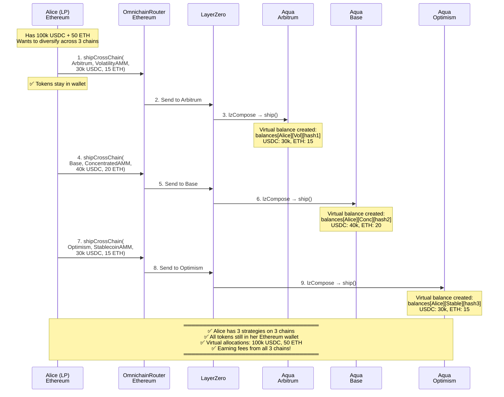
```mermaid
sequenceDiagram
    participant Alice as Alice (LP)<br/>Ethereum
    participant RouterETH as OmnichainRouter<br/>Ethereum
    participant LZ as LayerZero
    participant AquaARB as Aqua<br/>Arbitrum
    participant AquaBASE as Aqua<br/>Base
    participant AquaOP as Aqua<br/>Optimism

    Note over Alice: Has 100k USDC + 50 ETH<br/>Wants to diversify across 3 chains

    Alice->>RouterETH: 1. shipCrossChain(<br/>Arbitrum, VolatilityAMM,<br/>30k USDC, 15 ETH)
    
    Note over Alice: ✅ Tokens stay in wallet
    
    RouterETH->>LZ: 2. Send to Arbitrum
    LZ->>AquaARB: 3. lzCompose → ship()
    
    Note over AquaARB: Virtual balance created:<br/>balances[Alice][Vol][hash1]<br/>USDC: 30k, ETH: 15
    
    Alice->>RouterETH: 4. shipCrossChain(<br/>Base, ConcentratedAMM,<br/>40k USDC, 20 ETH)
    
    RouterETH->>LZ: 5. Send to Base
    LZ->>AquaBASE: 6. lzCompose → ship()
    
    Note over AquaBASE: Virtual balance created:<br/>balances[Alice][Conc][hash2]<br/>USDC: 40k, ETH: 20
    
    Alice->>RouterETH: 7. shipCrossChain(<br/>Optimism, StablecoinAMM,<br/>30k USDC, 15 ETH)
    
    RouterETH->>LZ: 8. Send to Optimism
    LZ->>AquaOP: 9. lzCompose → ship()
    
    Note over AquaOP: Virtual balance created:<br/>balances[Alice][Stable][hash3]<br/>USDC: 30k, ETH: 15
    
    Note over Alice,AquaOP: ═══════════════════════════════════<br/>✅ Alice has 3 strategies on 3 chains<br/>✅ All tokens still in her Ethereum wallet<br/>✅ Virtual allocations: 100k USDC, 50 ETH<br/>✅ Earning fees from all 3 chains!<br/>═══════════════════════════════════
```

---

## Managing Multiple Strategies

### Check Balances Across Strategies:

```solidity
// On Arbitrum
(uint256 usdc1, uint256 eth1) = aqua.safeBalances(
    Alice, volatilityAMM, hash1, USDC_ARB, WETH_ARB
);

// On Base
(uint256 usdc2, uint256 eth2) = aqua.safeBalances(
    Alice, concentratedAMM, hash2, USDC_BASE, WETH_BASE
);

// On Optimism
(uint256 usdc3, uint256 eth3) = aqua.safeBalances(
    Alice, stablecoinAMM, hash3, USDC_OP, WETH_OP
);
```

### Rebalance: Dock One, Ship Another

```solidity
// Alice wants to move liquidity from Arbitrum to a new strategy on Base

// Step 1: Dock Arbitrum strategy
omnichainRouter.dockCrossChain(
    dstEid: 42161,  // Arbitrum
    app: volatilityAMM,
    strategyHash: hash1
);
// ↑ LZ message → Arbitrum → lzCompose → Aqua.dock()
// Virtual balances cleared on Arbitrum

// Step 2: Ship new strategy on Base with freed-up allocation
omnichainRouter.shipCrossChain(
    dstEid: 8453,  // Base
    app: newAMM,
    strategy: newStrategy,
    tokens: [USDC_ETH, WETH_ETH],
    amounts: [30000e6, 15e18]  // Same amounts, different strategy
);
// ↑ LZ message → Base → lzCompose → Aqua.ship()
```

**Key Point:** Since tokens never left Alice's wallet, rebalancing is just updating virtual allocations!

---

## Summary: LP Multi-Strategy Flow

### ✅ What You Can Do:

1. **Ship multiple strategies on same chain**
   - Different AMM apps
   - Different parameters
   - All using same tokens in your wallet

2. **Ship multiple strategies across different chains**
   - Tokens stay on home chain (e.g., Ethereum)
   - Virtual balances on multiple destination chains
   - LayerZero handles cross-chain coordination

3. **Rebalance easily**
   - `dock()` one strategy (frees virtual allocation)
   - `ship()` new strategy (reallocates)
   - No actual token transfers needed (unless cross-chain swaps happen)

4. **Earn fees from all strategies simultaneously**
   - Traders on Arbitrum pay you fees
   - Traders on Base pay you fees
   - Traders on Optimism pay you fees
   - All profits accumulate in your Ethereum wallet

### The Magic:
**Your tokens are shared across unlimited strategies without fragmentation!** This is the core innovation of Aqua + LayerZero.

Does this answer your question about supplying liquidity to multiple strategies?

```solidity
// Alice on Ethereum with 100,000 USDC and 50 ETH

// Step 1: One-time approval
USDC.approve(address(aqua), type(uint256).max);
WETH.approve(address(aqua), type(uint256).max);

// Step 2: Ship Strategy 1 - XYC AMM (30,000 USDC + 15 ETH)
XYCSwap.Strategy memory strategy1 = XYCSwap.Strategy({
    maker: Alice,
    token0: USDC,
    token1: WETH,
    feeBps: 30,
    salt: bytes32(0)
});

bytes32 hash1 = aqua.ship(
    address(xycSwapApp),
    abi.encode(strategy1),
    [USDC, WETH],
    [30000e6, 15e18]  // Allocate 30k USDC + 15 ETH
);

// Step 3: Ship Strategy 2 - Concentrated Liquidity (40,000 USDC + 20 ETH)
ConcentratedAMM.Strategy memory strategy2 = ConcentratedAMM.Strategy({
    maker: Alice,
    token0: USDC,
    token1: WETH,
    tickLower: -1000,
    tickUpper: 1000,
    salt: bytes32(0)
});

bytes32 hash2 = aqua.ship(
    address(concentratedAMM),
    abi.encode(strategy2),
    [USDC, WETH],
    [40000e6, 20e18]  // Allocate 40k USDC + 20 ETH
);

// Step 4: Ship Strategy 3 - Stablecoin AMM (30,000 USDC + 15 ETH)
StablecoinAMM.Strategy memory strategy3 = StablecoinAMM.Strategy({
    maker: Alice,
    token0: USDC,
    token1: WETH,
    amplification: 100,
    salt: bytes32(0)
});

bytes32 hash3 = aqua.ship(
    address(stablecoinAMM),
    abi.encode(strategy3),
    [USDC, WETH],
    [30000e6, 15e18]  // Allocate 30k USDC + 15 ETH
);
```

```plaintext
Alice's Wallet (Ethereum):
  100,000 USDC  ← Still here!
  50 ETH        ← Still here!
  
  Approval to Aqua: ✅

Aqua Virtual Balances:
  balances[Alice][XYCSwap][hash1][USDC] = 30,000
  balances[Alice][XYCSwap][hash1][WETH] = 15
  
  balances[Alice][ConcentratedAMM][hash2][USDC] = 40,000
  balances[Alice][ConcentratedAMM][hash2][WETH] = 20
  
  balances[Alice][StablecoinAMM][hash3][USDC] = 30,000
  balances[Alice][StablecoinAMM][hash3][WETH] = 15
  
  Total Virtual Allocation:
    USDC: 30k + 40k + 30k = 100,000 ✅
    WETH: 15 + 20 + 15 = 50 ✅
```

```solidity
// Alice on Ethereum with 100,000 USDC and 50 ETH

// Step 1: One-time approval to OmnichainRouter
USDC.approve(address(omnichainRouter), type(uint256).max);
WETH.approve(address(omnichainRouter), type(uint256).max);

// Step 2: Ship Strategy 1 - VolatilityAMM on Arbitrum
VolatilityAMM.Strategy memory strategy1 = VolatilityAMM.Strategy({
    maker: Alice,
    token0: USDC,
    token1: WETH,
    volatilityParam: 2.5,
    salt: bytes32(0)
});

omnichainRouter.shipCrossChain(
    dstEid: 42161,  // Arbitrum
    app: volatilityAMM,
    strategy: abi.encode(strategy1),
    tokens: [USDC_ETH, WETH_ETH],
    amounts: [30000e6, 15e18]
);
// ↑ LayerZero message → Arbitrum → lzCompose → Aqua.ship()

// Step 3: Ship Strategy 2 - ConcentratedAMM on Base
ConcentratedAMM.Strategy memory strategy2 = ConcentratedAMM.Strategy({
    maker: Alice,
    token0: USDC,
    token1: WETH,
    tickLower: -1000,
    tickUpper: 1000,
    salt: bytes32(0)
});

omnichainRouter.shipCrossChain(
    dstEid: 8453,  // Base
    app: concentratedAMM,
    strategy: abi.encode(strategy2),
    tokens: [USDC_ETH, WETH_ETH],
    amounts: [40000e6, 20e18]
);
// ↑ LayerZero message → Base → lzCompose → Aqua.ship()

// Step 4: Ship Strategy 3 - StablecoinAMM on Optimism
StablecoinAMM.Strategy memory strategy3 = StablecoinAMM.Strategy({
    maker: Alice,
    token0: USDC,
    token1: WETH,
    amplification: 100,
    salt: bytes32(0)
});

omnichainRouter.shipCrossChain(
    dstEid: 10,  // Optimism
    app: stablecoinAMM,
    strategy: abi.encode(strategy3),
    tokens: [USDC_ETH, WETH_ETH],
    amounts: [30000e6, 15e18]
);
// ↑ LayerZero message → Optimism → lzCompose → Aqua.ship()
```

```plaintext
┌─────────────────────────────────────────┐
│ ETHEREUM (Alice's Home)                 │
│                                         │
│ Alice's Wallet:                         │
│   100,000 USDC  ← Still here!          │
│   50 ETH        ← Still here!          │
│                                         │
│ OmnichainRouter Registry:               │
│   Strategy 1 → Arbitrum (30k, 15)      │
│   Strategy 2 → Base (40k, 20)          │
│   Strategy 3 → Optimism (30k, 15)      │
└─────────────────────────────────────────┘
                    │
        ┌───────────┼───────────┐
        │           │           │
        ▼           ▼           ▼
┌─────────┐  ┌─────────┐  ┌─────────┐
│ARBITRUM │  │  BASE   │  │OPTIMISM │
│         │  │         │  │         │
│ Aqua:   │  │ Aqua:   │  │ Aqua:   │
│ [Alice] │  │ [Alice] │  │ [Alice] │
│ [Vol]   │  │ [Conc]  │  │ [Stable]│
│ [hash1] │  │ [hash2] │  │ [hash3] │
│ USDC:30k│  │ USDC:40k│  │ USDC:30k│
│ WETH:15 │  │ WETH:20 │  │ WETH:15 │
└─────────┘  └─────────┘  └─────────┘
```

```plaintext
sequenceDiagram
    participant Alice as Alice (LP)<br/>Ethereum
    participant RouterETH as OmnichainRouter<br/>Ethereum
    participant LZ as LayerZero
    participant AquaARB as Aqua<br/>Arbitrum
    participant AquaBASE as Aqua<br/>Base
    participant AquaOP as Aqua<br/>Optimism

    Note over Alice: Has 100k USDC + 50 ETH<br/>Wants to diversify across 3 chains

    Alice->>RouterETH: 1. shipCrossChain(<br/>Arbitrum, VolatilityAMM,<br/>30k USDC, 15 ETH)
    
    Note over Alice: ✅ Tokens stay in wallet
    
    RouterETH->>LZ: 2. Send to Arbitrum
    LZ->>AquaARB: 3. lzCompose → ship()
    
    Note over AquaARB: Virtual balance created:<br/>balances[Alice][Vol][hash1]<br/>USDC: 30k, ETH: 15
    
    Alice->>RouterETH: 4. shipCrossChain(<br/>Base, ConcentratedAMM,<br/>40k USDC, 20 ETH)
    
    RouterETH->>LZ: 5. Send to Base
    LZ->>AquaBASE: 6. lzCompose → ship()
    
    Note over AquaBASE: Virtual balance created:<br/>balances[Alice][Conc][hash2]<br/>USDC: 40k, ETH: 20
    
    Alice->>RouterETH: 7. shipCrossChain(<br/>Optimism, StablecoinAMM,<br/>30k USDC, 15 ETH)
    
    RouterETH->>LZ: 8. Send to Optimism
    LZ->>AquaOP: 9. lzCompose → ship()
    
    Note over AquaOP: Virtual balance created:<br/>balances[Alice][Stable][hash3]<br/>USDC: 30k, ETH: 15
    
    Note over Alice,AquaOP: ═══════════════════════════════════<br/>✅ Alice has 3 strategies on 3 chains<br/>✅ All tokens still in her Ethereum wallet<br/>✅ Virtual allocations: 100k USDC, 50 ETH<br/>✅ Earning fees from all 3 chains!<br/>═══════════════════════════════════
```

```solidity
// On Arbitrum
(uint256 usdc1, uint256 eth1) = aqua.safeBalances(
    Alice, volatilityAMM, hash1, USDC_ARB, WETH_ARB
);

// On Base
(uint256 usdc2, uint256 eth2) = aqua.safeBalances(
    Alice, concentratedAMM, hash2, USDC_BASE, WETH_BASE
);

// On Optimism
(uint256 usdc3, uint256 eth3) = aqua.safeBalances(
    Alice, stablecoinAMM, hash3, USDC_OP, WETH_OP
);
```

```solidity
// Alice wants to move liquidity from Arbitrum to a new strategy on Base

// Step 1: Dock Arbitrum strategy
omnichainRouter.dockCrossChain(
    dstEid: 42161,  // Arbitrum
    app: volatilityAMM,
    strategyHash: hash1
);
// ↑ LZ message → Arbitrum → lzCompose → Aqua.dock()
// Virtual balances cleared on Arbitrum

// Step 2: Ship new strategy on Base with freed-up allocation
omnichainRouter.shipCrossChain(
    dstEid: 8453,  // Base
    app: newAMM,
    strategy: newStrategy,
    tokens: [USDC_ETH, WETH_ETH],
    amounts: [30000e6, 15e18]  // Same amounts, different strategy
);
// ↑ LZ message → Base → lzCompose → Aqua.ship()
```

---

**User**

I thought ship functions are immutable and it's only a one-time process, but what if it's already been shipped before? Does this mean that Alice is creating new strategies every time?

---

**Cursor**

Excellent catch! You're absolutely right to question this. Let me clarify the immutability concept:

## Yes, Alice Creates NEW Strategies Each Time!

From the README:

> **Once a strategy is shipped, it becomes completely immutable:**
> - ✗ Parameters cannot be changed (e.g., fee rates, token pairs, weights)
> - ✗ Initial liquidity amounts cannot be modified
> - ✓ Token balances change ONLY through swap execution via `pull()`/`push()`

---

## What "Immutable" Actually Means

### Each `ship()` Creates a NEW Strategy Instance

```solidity
// Alice ships Strategy 1
XYCSwap.Strategy memory strategy1 = XYCSwap.Strategy({
    maker: Alice,
    token0: USDC,
    token1: WETH,
    feeBps: 30,
    salt: bytes32(0)  // ← This makes it unique
});

bytes32 hash1 = aqua.ship(app, abi.encode(strategy1), tokens, amounts);
// hash1 = keccak256(abi.encode(strategy1))

// Later, Alice wants different parameters...
// She CANNOT modify strategy1!
// She must create a NEW strategy:

XYCSwap.Strategy memory strategy2 = XYCSwap.Strategy({
    maker: Alice,
    token0: USDC,
    token1: WETH,
    feeBps: 50,  // ← Different fee!
    salt: bytes32(1)  // ← Different salt!
});

bytes32 hash2 = aqua.ship(app, abi.encode(strategy2), tokens, amounts);
// hash2 = keccak256(abi.encode(strategy2))
// hash2 ≠ hash1 (different strategy!)
```

**Result:** Alice now has TWO separate strategies running simultaneously!

---

## Multiple Strategies vs. Modifying a Strategy

### Scenario 1: Alice Wants Multiple Strategies (Diversification)

```solidity
// Alice has 100k USDC + 50 ETH

// Strategy 1: Low fee, high volume
XYCSwap.Strategy memory lowFeeStrategy = XYCSwap.Strategy({
    maker: Alice,
    token0: USDC,
    token1: WETH,
    feeBps: 10,  // 0.1% fee
    salt: bytes32(0)
});

aqua.ship(xycSwap, abi.encode(lowFeeStrategy), [USDC, WETH], [50000e6, 25e18]);

// Strategy 2: High fee, low volume
XYCSwap.Strategy memory highFeeStrategy = XYCSwap.Strategy({
    maker: Alice,
    token0: USDC,
    token1: WETH,
    feeBps: 100,  // 1% fee
    salt: bytes32(1)  // ← Different salt = different hash
});

aqua.ship(xycSwap, abi.encode(highFeeStrategy), [USDC, WETH], [50000e6, 25e18]);
```

**Result:**
- Alice has 2 strategies running at the same time
- Both use the same token pair
- Different fee structures
- Traders can choose which to swap against
- Alice's tokens are allocated across both (100k USDC total, 50 ETH total)

---

### Scenario 2: Alice Wants to Change Parameters (Rebalance)

From the README:

> **Easy Re-parameterization:**
>
> Since strategies don't own funds (tokens remain in your wallet with approval), you can easily adjust parameters:
> 1. `dock(strategyHash)` - Withdraws virtual balances (no token transfers, just accounting)
> 2. `ship(newStrategy)` - Creates new strategy with updated parameters and/or liquidity allocations

```solidity
// Alice has Strategy 1 with 30 bps fee
XYCSwap.Strategy memory oldStrategy = XYCSwap.Strategy({
    maker: Alice,
    token0: USDC,
    token1: WETH,
    feeBps: 30,
    salt: bytes32(0)
});

bytes32 oldHash = aqua.ship(xycSwap, abi.encode(oldStrategy), [USDC, WETH], [50000e6, 25e18]);

// After some time, Alice wants to change to 50 bps fee
// She CANNOT modify oldStrategy!
// She must dock and ship new:

// Step 1: Dock old strategy
aqua.dock(xycSwap, oldHash, [USDC, WETH]);
// Virtual balances cleared: balances[Alice][xycSwap][oldHash] = 0
// Tokens still in Alice's wallet!

// Step 2: Ship new strategy with different parameters
XYCSwap.Strategy memory newStrategy = XYCSwap.Strategy({
    maker: Alice,
    token0: USDC,
    token1: WETH,
    feeBps: 50,  // ← Changed fee
    salt: bytes32(0)  // Can reuse same salt since old one is docked
});

bytes32 newHash = aqua.ship(xycSwap, abi.encode(newStrategy), [USDC, WETH], [50000e6, 25e18]);
// newHash ≠ oldHash (different feeBps)
```

**Result:**
- Old strategy is deactivated (docked)
- New strategy is active with new parameters
- Alice's tokens never moved (stayed in wallet)
- Just virtual accounting changes

---

## Why This Design?

From the README:

> Immutable data structures significantly reduce bugs in concurrent and distributed systems. As noted in the seminal paper ["Out of the Tar Pit"](https://curtclifton.net/papers/MoseleyMarks06a.pdf) by Ben Moseley and Peter Marks, immutability eliminates entire classes of bugs related to state management and makes systems vastly easier to reason about.

### Benefits:

1. **No race conditions**: Traders know parameters won't change mid-swap
2. **Simpler code**: No need to handle parameter updates during swaps
3. **Easier auditing**: Strategy hash uniquely identifies immutable configuration
4. **Cross-chain safety**: Especially important when coordinating via LayerZero

---

## Back to Your Original Question

### When Alice Ships Multiple Strategies:

```solidity
// Ship to Arbitrum
omnichainRouter.shipCrossChain(
    dstEid: 42161,
    app: volatilityAMM,
    strategy: abi.encode(strategy1),  // ← NEW strategy instance
    tokens: [USDC, WETH],
    amounts: [30000e6, 15e18]
);

// Ship to Base
omnichainRouter.shipCrossChain(
    dstEid: 8453,
    app: concentratedAMM,
    strategy: abi.encode(strategy2),  // ← DIFFERENT strategy instance
    tokens: [USDC, WETH],
    amounts: [40000e6, 20e18]
);

// Ship to Optimism
omnichainRouter.shipCrossChain(
    dstEid: 10,
    app: stablecoinAMM,
    strategy: abi.encode(strategy3),  // ← ANOTHER strategy instance
    tokens: [USDC, WETH],
    amounts: [30000e6, 15e18]
);
```

**Yes, Alice is creating 3 NEW, SEPARATE, IMMUTABLE strategy instances!**

Each has:
- Different `strategyHash` (because different app, parameters, or salt)
- Different virtual balance allocations
- Independent lifecycle (can dock one without affecting others)

---

## Visual: Multiple Strategies

```
Alice's Wallet (Ethereum):
  100,000 USDC  ← Physical tokens
  50 ETH        ← Physical tokens
  
  ↓ Virtual allocations (just accounting)
  
┌─────────────────────────────────────────────────────┐
│ Strategy 1 (Arbitrum - VolatilityAMM)               │
│ hash1 = keccak256(abi.encode(strategy1))           │
│ Status: ACTIVE                                      │
│ Virtual: 30k USDC, 15 ETH                          │
└─────────────────────────────────────────────────────┘

┌─────────────────────────────────────────────────────┐
│ Strategy 2 (Base - ConcentratedAMM)                 │
│ hash2 = keccak256(abi.encode(strategy2))           │
│ Status: ACTIVE                                      │
│ Virtual: 40k USDC, 20 ETH                          │
└─────────────────────────────────────────────────────┘

┌─────────────────────────────────────────────────────┐
│ Strategy 3 (Optimism - StablecoinAMM)               │
│ hash3 = keccak256(abi.encode(strategy3))           │
│ Status: ACTIVE                                      │
│ Virtual: 30k USDC, 15 ETH                          │
└─────────────────────────────────────────────────────┘

Total Virtual Allocations: 100k USDC, 50 ETH ✅
Actual Tokens in Wallet: 100k USDC, 50 ETH ✅
```

---

## What If Alice Ships the SAME Strategy Twice?

```solidity
XYCSwap.Strategy memory strategy = XYCSwap.Strategy({
    maker: Alice,
    token0: USDC,
    token1: WETH,
    feeBps: 30,
    salt: bytes32(0)
});

// First ship
bytes32 hash1 = aqua.ship(xycSwap, abi.encode(strategy), tokens, [1000e6, 1e18]);

// Try to ship again with EXACT same parameters
bytes32 hash2 = aqua.ship(xycSwap, abi.encode(strategy), tokens, [2000e6, 2e18]);

// hash1 == hash2 (same strategy hash!)
// This would likely REVERT because strategy already exists!
```

**To ship multiple times, you MUST change something:**
- Different `salt`
- Different parameters (feeBps, etc.)
- Different token pair
- Different app

---

## Summary

### ✅ Correct Understanding:

1. **Each `ship()` creates a NEW strategy instance**
2. **Strategies are immutable once created**
3. **Alice can have multiple strategies simultaneously**
4. **To change parameters: `dock()` old, `ship()` new**
5. **Tokens stay in wallet, only virtual allocations change**

### The Strategy Lifecycle:

```
ship() → ACTIVE → dock() → INACTIVE

Can then:
  - ship() new strategy with different params (rebalance)
  - ship() new strategy on different chain (diversify)
  - ship() new strategy with same app but different params (multiple positions)
```

**Does this clarify the immutability and multi-strategy concept?**

```solidity
// Alice ships Strategy 1
XYCSwap.Strategy memory strategy1 = XYCSwap.Strategy({
    maker: Alice,
    token0: USDC,
    token1: WETH,
    feeBps: 30,
    salt: bytes32(0)  // ← This makes it unique
});

bytes32 hash1 = aqua.ship(app, abi.encode(strategy1), tokens, amounts);
// hash1 = keccak256(abi.encode(strategy1))

// Later, Alice wants different parameters...
// She CANNOT modify strategy1!
// She must create a NEW strategy:

XYCSwap.Strategy memory strategy2 = XYCSwap.Strategy({
    maker: Alice,
    token0: USDC,
    token1: WETH,
    feeBps: 50,  // ← Different fee!
    salt: bytes32(1)  // ← Different salt!
});

bytes32 hash2 = aqua.ship(app, abi.encode(strategy2), tokens, amounts);
// hash2 = keccak256(abi.encode(strategy2))
// hash2 ≠ hash1 (different strategy!)
```

```solidity
// Alice has 100k USDC + 50 ETH

// Strategy 1: Low fee, high volume
XYCSwap.Strategy memory lowFeeStrategy = XYCSwap.Strategy({
    maker: Alice,
    token0: USDC,
    token1: WETH,
    feeBps: 10,  // 0.1% fee
    salt: bytes32(0)
});

aqua.ship(xycSwap, abi.encode(lowFeeStrategy), [USDC, WETH], [50000e6, 25e18]);

// Strategy 2: High fee, low volume
XYCSwap.Strategy memory highFeeStrategy = XYCSwap.Strategy({
    maker: Alice,
    token0: USDC,
    token1: WETH,
    feeBps: 100,  // 1% fee
    salt: bytes32(1)  // ← Different salt = different hash
});

aqua.ship(xycSwap, abi.encode(highFeeStrategy), [USDC, WETH], [50000e6, 25e18]);
```

```solidity
// Alice has Strategy 1 with 30 bps fee
XYCSwap.Strategy memory oldStrategy = XYCSwap.Strategy({
    maker: Alice,
    token0: USDC,
    token1: WETH,
    feeBps: 30,
    salt: bytes32(0)
});

bytes32 oldHash = aqua.ship(xycSwap, abi.encode(oldStrategy), [USDC, WETH], [50000e6, 25e18]);

// After some time, Alice wants to change to 50 bps fee
// She CANNOT modify oldStrategy!
// She must dock and ship new:

// Step 1: Dock old strategy
aqua.dock(xycSwap, oldHash, [USDC, WETH]);
// Virtual balances cleared: balances[Alice][xycSwap][oldHash] = 0
// Tokens still in Alice's wallet!

// Step 2: Ship new strategy with different parameters
XYCSwap.Strategy memory newStrategy = XYCSwap.Strategy({
    maker: Alice,
    token0: USDC,
    token1: WETH,
    feeBps: 50,  // ← Changed fee
    salt: bytes32(0)  // Can reuse same salt since old one is docked
});

bytes32 newHash = aqua.ship(xycSwap, abi.encode(newStrategy), [USDC, WETH], [50000e6, 25e18]);
// newHash ≠ oldHash (different feeBps)
```

```solidity
// Ship to Arbitrum
omnichainRouter.shipCrossChain(
    dstEid: 42161,
    app: volatilityAMM,
    strategy: abi.encode(strategy1),  // ← NEW strategy instance
    tokens: [USDC, WETH],
    amounts: [30000e6, 15e18]
);

// Ship to Base
omnichainRouter.shipCrossChain(
    dstEid: 8453,
    app: concentratedAMM,
    strategy: abi.encode(strategy2),  // ← DIFFERENT strategy instance
    tokens: [USDC, WETH],
    amounts: [40000e6, 20e18]
);

// Ship to Optimism
omnichainRouter.shipCrossChain(
    dstEid: 10,
    app: stablecoinAMM,
    strategy: abi.encode(strategy3),  // ← ANOTHER strategy instance
    tokens: [USDC, WETH],
    amounts: [30000e6, 15e18]
);
```

```plaintext
Alice's Wallet (Ethereum):
  100,000 USDC  ← Physical tokens
  50 ETH        ← Physical tokens
  
  ↓ Virtual allocations (just accounting)
  
┌─────────────────────────────────────────────────────┐
│ Strategy 1 (Arbitrum - VolatilityAMM)               │
│ hash1 = keccak256(abi.encode(strategy1))           │
│ Status: ACTIVE                                      │
│ Virtual: 30k USDC, 15 ETH                          │
└─────────────────────────────────────────────────────┘

┌─────────────────────────────────────────────────────┐
│ Strategy 2 (Base - ConcentratedAMM)                 │
│ hash2 = keccak256(abi.encode(strategy2))           │
│ Status: ACTIVE                                      │
│ Virtual: 40k USDC, 20 ETH                          │
└─────────────────────────────────────────────────────┘

┌─────────────────────────────────────────────────────┐
│ Strategy 3 (Optimism - StablecoinAMM)               │
│ hash3 = keccak256(abi.encode(strategy3))           │
│ Status: ACTIVE                                      │
│ Virtual: 30k USDC, 15 ETH                          │
└─────────────────────────────────────────────────────┘

Total Virtual Allocations: 100k USDC, 50 ETH ✅
Actual Tokens in Wallet: 100k USDC, 50 ETH ✅
```

```solidity
XYCSwap.Strategy memory strategy = XYCSwap.Strategy({
    maker: Alice,
    token0: USDC,
    token1: WETH,
    feeBps: 30,
    salt: bytes32(0)
});

// First ship
bytes32 hash1 = aqua.ship(xycSwap, abi.encode(strategy), tokens, [1000e6, 1e18]);

// Try to ship again with EXACT same parameters
bytes32 hash2 = aqua.ship(xycSwap, abi.encode(strategy), tokens, [2000e6, 2e18]);

// hash1 == hash2 (same strategy hash!)
// This would likely REVERT because strategy already exists!
```

```plaintext
ship() → ACTIVE → dock() → INACTIVE

Can then:
  - ship() new strategy with different params (rebalance)
  - ship() new strategy on different chain (diversify)
  - ship() new strategy with same app but different params (multiple positions)
```

---

**User**

Is this because each app is a specific trading logic, and basically you can have multiple LPs supporting that one strategy?

---

**Cursor**

YES! Exactly! You've got it! Let me clarify this crucial distinction:

## App vs Strategy vs LP

### The Hierarchy:

```
App (Trading Logic)
  ├─ Strategy Instance 1 (LP Alice)
  ├─ Strategy Instance 2 (LP Bob)
  ├─ Strategy Instance 3 (LP Carol)
  └─ Strategy Instance N (LP ...)
```

---

## Breaking It Down

### 1. **App = Trading Logic** (Deployed Once by Developer)

```solidity
// Developer deploys XYCSwap contract ONCE on Arbitrum
contract XYCSwap is AquaApp {
    struct Strategy {
        address maker;  // ← This makes each LP's strategy unique!
        address token0;
        address token1;
        uint256 feeBps;
        bytes32 salt;
    }
    
    function swap(Strategy calldata strategy, ...) external {
        // Trading logic here (constant product formula, etc.)
        // This code is shared by ALL LPs using this app
    }
}

// Deployed at: 0xXYCSwapAddress
```

**Key Point:** The app contract is deployed ONCE and contains the trading algorithm.

---

### 2. **Strategy = LP's Configuration** (Created by Each LP)

```solidity
// Alice creates HER strategy using XYCSwap app
XYCSwap.Strategy memory aliceStrategy = XYCSwap.Strategy({
    maker: Alice,  // ← Alice's address
    token0: USDC,
    token1: WETH,
    feeBps: 30,
    salt: bytes32(0)
});

bytes32 aliceHash = aqua.ship(
    0xXYCSwapAddress,  // ← Same app
    abi.encode(aliceStrategy),
    [USDC, WETH],
    [10000e6, 5e18]  // Alice's liquidity
);

// Bob creates HIS strategy using SAME XYCSwap app
XYCSwap.Strategy memory bobStrategy = XYCSwap.Strategy({
    maker: Bob,  // ← Bob's address (DIFFERENT!)
    token0: USDC,
    token1: WETH,
    feeBps: 30,  // Same parameters as Alice
    salt: bytes32(0)
});

bytes32 bobHash = aqua.ship(
    0xXYCSwapAddress,  // ← Same app
    abi.encode(bobStrategy),
    [USDC, WETH],
    [50000e6, 25e18]  // Bob's liquidity (DIFFERENT amounts!)
);

// aliceHash ≠ bobHash because maker field is different!
```

**Key Point:** Each LP creates their own strategy instance with their own liquidity.

---

## Visual Representation

```
┌─────────────────────────────────────────────────────────┐
│ XYCSwap App (Deployed Once on Arbitrum)                │
│ Contract Address: 0xXYCSwapAddress                      │
│                                                         │
│ Trading Logic:                                          │
│   - Constant product formula (x * y = k)               │
│   - Fee calculation                                     │
│   - Swap execution                                      │
└─────────────────────────────────────────────────────────┘
                          │
                          │ Multiple LPs use this app
                          │
        ┌─────────────────┼─────────────────┐
        │                 │                 │
        ▼                 ▼                 ▼
┌─────────────┐   ┌─────────────┐   ┌─────────────┐
│ Alice's     │   │ Bob's       │   │ Carol's     │
│ Strategy    │   │ Strategy    │   │ Strategy    │
│             │   │             │   │             │
│ maker:Alice │   │ maker:Bob   │   │ maker:Carol │
│ USDC: 10k   │   │ USDC: 50k   │   │ USDC: 100k  │
│ WETH: 5     │   │ WETH: 25    │   │ WETH: 50    │
│ feeBps: 30  │   │ feeBps: 30  │   │ feeBps: 50  │
│             │   │             │   │             │
│ hash1       │   │ hash2       │   │ hash3       │
└─────────────┘   └─────────────┘   └─────────────┘
```

---

## How Traders Interact

### Trader Chooses Which LP to Swap Against:

```solidity
// Trader wants to swap 1000 USDC → WETH

// Option 1: Swap against Alice's liquidity
xycSwap.swap(
    aliceStrategy,  // ← Alice's strategy
    true,           // zeroForOne
    1000e6,
    ...
);
// Pulls WETH from Alice's wallet
// Pushes USDC to Alice's wallet
// Alice earns 0.3% fee

// Option 2: Swap against Bob's liquidity
xycSwap.swap(
    bobStrategy,  // ← Bob's strategy
    true,
    1000e6,
    ...
);
// Pulls WETH from Bob's wallet
// Pushes USDC to Bob's wallet
// Bob earns 0.3% fee

// Option 3: Swap against Carol's liquidity
xycSwap.swap(
    carolStrategy,  // ← Carol's strategy
    true,
    1000e6,
    ...
);
// Pulls WETH from Carol's wallet
// Pushes USDC to Carol's wallet
// Carol earns 0.5% fee (higher fee!)
```

---

## In Practice: Aggregators Route to Best LP

```solidity
// Smart router finds best price across all LPs using XYCSwap

function findBestPrice(uint256 amountIn) returns (Strategy memory bestStrategy) {
    // Check Alice's strategy
    uint256 aliceOut = xycSwap.quoteSwap(aliceStrategy, amountIn);
    
    // Check Bob's strategy
    uint256 bobOut = xycSwap.quoteSwap(bobStrategy, amountIn);
    
    // Check Carol's strategy
    uint256 carolOut = xycSwap.quoteSwap(carolStrategy, amountIn);
    
    // Return strategy with best output
    if (bobOut > aliceOut && bobOut > carolOut) {
        return bobStrategy;  // Bob has most liquidity, best price
    }
    // ...
}
```

---

## The "App Store" Marketplace

### What Users See:

```
┌─────────────────────────────────────────────────────────┐
│ Aqua Strategy Marketplace                               │
├─────────────────────────────────────────────────────────┤
│                                                         │
│ XYCSwap (Constant Product AMM)                         │
│ ├─ 156 LPs providing liquidity                         │
│ ├─ Total TVL: $12.5M                                   │
│ ├─ 24h Volume: $2.3M                                   │
│ └─ Chains: Arbitrum, Base, Optimism                    │
│                                                         │
│ VolatilityAMM (Dynamic Fee AMM)                        │
│ ├─ 43 LPs providing liquidity                          │
│ ├─ Total TVL: $3.2M                                    │
│ ├─ 24h Volume: $890K                                   │
│ └─ Chains: Arbitrum, Base                              │
│                                                         │
│ ConcentratedLiquidityAMM (Uniswap V3 style)            │
│ ├─ 89 LPs providing liquidity                          │
│ ├─ Total TVL: $8.7M                                    │
│ ├─ 24h Volume: $1.8M                                   │
│ └─ Chains: Arbitrum, Optimism, Base                    │
│                                                         │
└─────────────────────────────────────────────────────────┘
```

### What Happens When LP Clicks "Provide Liquidity":

```
User: Alice
Clicks: "Provide Liquidity to XYCSwap on Arbitrum"

Flow:
1. Alice creates HER OWN strategy instance
2. Alice specifies HER liquidity amounts
3. Alice ships HER strategy
4. Alice's strategy joins the pool of other LPs using XYCSwap
5. Traders can now swap against Alice's liquidity
```

---

## Cross-Chain Example

### One App, Multiple Chains, Multiple LPs:

```
XYCSwap App Deployed on 3 Chains:
  - Arbitrum: 0xXYC_ARB
  - Base: 0xXYC_BASE
  - Optimism: 0xXYC_OP

Alice (LP on Ethereum):
  ├─ Ships strategy to XYCSwap on Arbitrum (30k USDC, 15 ETH)
  ├─ Ships strategy to XYCSwap on Base (40k USDC, 20 ETH)
  └─ Ships strategy to XYCSwap on Optimism (30k USDC, 15 ETH)

Bob (LP on Ethereum):
  ├─ Ships strategy to XYCSwap on Arbitrum (100k USDC, 50 ETH)
  └─ Ships strategy to XYCSwap on Base (50k USDC, 25 ETH)

Carol (LP on Ethereum):
  └─ Ships strategy to XYCSwap on Arbitrum (200k USDC, 100 ETH)
```

**Result:**
- XYCSwap on Arbitrum has liquidity from Alice, Bob, and Carol
- XYCSwap on Base has liquidity from Alice and Bob
- XYCSwap on Optimism has liquidity from Alice only
- Each LP's tokens stay on Ethereum
- Each LP earns fees independently

---

## Aqua's Mapping Structure

```solidity
mapping(
    address maker =>           // ← LP's address (Alice, Bob, Carol)
    mapping(
        address app =>         // ← App address (XYCSwap, VolatilityAMM, etc.)
        mapping(
            bytes32 strategyHash =>  // ← Unique strategy instance
            mapping(
                address token => Balance  // ← Token balances
            )
        )
    )
) private _balances;
```

**Example:**
```
_balances[Alice][XYCSwap][aliceHash1][USDC] = 10000
_balances[Alice][XYCSwap][aliceHash2][USDC] = 5000  // Alice's 2nd strategy
_balances[Bob][XYCSwap][bobHash][USDC] = 50000
_balances[Carol][XYCSwap][carolHash][USDC] = 100000
```

---

## Summary

### ✅ Correct Understanding:

1. **App = Trading Logic** (deployed once by developer)
   - Example: XYCSwap, VolatilityAMM, ConcentratedAMM

2. **Strategy = LP's Instance** (created by each LP)
   - Each LP creates their own strategy using the app
   - Strategy hash includes `maker` address (makes it unique per LP)

3. **Multiple LPs can use the same app**
   - Alice, Bob, Carol all use XYCSwap
   - Each has their own liquidity
   - Each earns their own fees
   - Traders choose which LP to swap against (or router finds best price)

4. **One LP can have multiple strategies**
   - Alice can have multiple strategies using XYCSwap
   - Alice can use different apps (XYCSwap, VolatilityAMM, etc.)
   - Alice can deploy on multiple chains

### The Innovation:

**Aqua enables multiple LPs to share the same trading logic (app) while maintaining independent liquidity positions, all without fragmenting their capital!**

**Does this clarify the app vs strategy vs LP relationship?**

```plaintext
App (Trading Logic)
  ├─ Strategy Instance 1 (LP Alice)
  ├─ Strategy Instance 2 (LP Bob)
  ├─ Strategy Instance 3 (LP Carol)
  └─ Strategy Instance N (LP ...)
```

```solidity
// Developer deploys XYCSwap contract ONCE on Arbitrum
contract XYCSwap is AquaApp {
    struct Strategy {
        address maker;  // ← This makes each LP's strategy unique!
        address token0;
        address token1;
        uint256 feeBps;
        bytes32 salt;
    }
    
    function swap(Strategy calldata strategy, ...) external {
        // Trading logic here (constant product formula, etc.)
        // This code is shared by ALL LPs using this app
    }
}

// Deployed at: 0xXYCSwapAddress
```

```solidity
// Alice creates HER strategy using XYCSwap app
XYCSwap.Strategy memory aliceStrategy = XYCSwap.Strategy({
    maker: Alice,  // ← Alice's address
    token0: USDC,
    token1: WETH,
    feeBps: 30,
    salt: bytes32(0)
});

bytes32 aliceHash = aqua.ship(
    0xXYCSwapAddress,  // ← Same app
    abi.encode(aliceStrategy),
    [USDC, WETH],
    [10000e6, 5e18]  // Alice's liquidity
);

// Bob creates HIS strategy using SAME XYCSwap app
XYCSwap.Strategy memory bobStrategy = XYCSwap.Strategy({
    maker: Bob,  // ← Bob's address (DIFFERENT!)
    token0: USDC,
    token1: WETH,
    feeBps: 30,  // Same parameters as Alice
    salt: bytes32(0)
});

bytes32 bobHash = aqua.ship(
    0xXYCSwapAddress,  // ← Same app
    abi.encode(bobStrategy),
    [USDC, WETH],
    [50000e6, 25e18]  // Bob's liquidity (DIFFERENT amounts!)
);

// aliceHash ≠ bobHash because maker field is different!
```

```plaintext
┌─────────────────────────────────────────────────────────┐
│ XYCSwap App (Deployed Once on Arbitrum)                │
│ Contract Address: 0xXYCSwapAddress                      │
│                                                         │
│ Trading Logic:                                          │
│   - Constant product formula (x * y = k)               │
│   - Fee calculation                                     │
│   - Swap execution                                      │
└─────────────────────────────────────────────────────────┘
                          │
                          │ Multiple LPs use this app
                          │
        ┌─────────────────┼─────────────────┐
        │                 │                 │
        ▼                 ▼                 ▼
┌─────────────┐   ┌─────────────┐   ┌─────────────┐
│ Alice's     │   │ Bob's       │   │ Carol's     │
│ Strategy    │   │ Strategy    │   │ Strategy    │
│             │   │             │   │             │
│ maker:Alice │   │ maker:Bob   │   │ maker:Carol │
│ USDC: 10k   │   │ USDC: 50k   │   │ USDC: 100k  │
│ WETH: 5     │   │ WETH: 25    │   │ WETH: 50    │
│ feeBps: 30  │   │ feeBps: 30  │   │ feeBps: 50  │
│             │   │             │   │             │
│ hash1       │   │ hash2       │   │ hash3       │
└─────────────┘   └─────────────┘   └─────────────┘
```

```solidity
// Trader wants to swap 1000 USDC → WETH

// Option 1: Swap against Alice's liquidity
xycSwap.swap(
    aliceStrategy,  // ← Alice's strategy
    true,           // zeroForOne
    1000e6,
    ...
);
// Pulls WETH from Alice's wallet
// Pushes USDC to Alice's wallet
// Alice earns 0.3% fee

// Option 2: Swap against Bob's liquidity
xycSwap.swap(
    bobStrategy,  // ← Bob's strategy
    true,
    1000e6,
    ...
);
// Pulls WETH from Bob's wallet
// Pushes USDC to Bob's wallet
// Bob earns 0.3% fee

// Option 3: Swap against Carol's liquidity
xycSwap.swap(
    carolStrategy,  // ← Carol's strategy
    true,
    1000e6,
    ...
);
// Pulls WETH from Carol's wallet
// Pushes USDC to Carol's wallet
// Carol earns 0.5% fee (higher fee!)
```

```solidity
// Smart router finds best price across all LPs using XYCSwap

function findBestPrice(uint256 amountIn) returns (Strategy memory bestStrategy) {
    // Check Alice's strategy
    uint256 aliceOut = xycSwap.quoteSwap(aliceStrategy, amountIn);
    
    // Check Bob's strategy
    uint256 bobOut = xycSwap.quoteSwap(bobStrategy, amountIn);
    
    // Check Carol's strategy
    uint256 carolOut = xycSwap.quoteSwap(carolStrategy, amountIn);
    
    // Return strategy with best output
    if (bobOut > aliceOut && bobOut > carolOut) {
        return bobStrategy;  // Bob has most liquidity, best price
    }
    // ...
}
```

```plaintext
┌─────────────────────────────────────────────────────────┐
│ Aqua Strategy Marketplace                               │
├─────────────────────────────────────────────────────────┤
│                                                         │
│ XYCSwap (Constant Product AMM)                         │
│ ├─ 156 LPs providing liquidity                         │
│ ├─ Total TVL: $12.5M                                   │
│ ├─ 24h Volume: $2.3M                                   │
│ └─ Chains: Arbitrum, Base, Optimism                    │
│                                                         │
│ VolatilityAMM (Dynamic Fee AMM)                        │
│ ├─ 43 LPs providing liquidity                          │
│ ├─ Total TVL: $3.2M                                    │
│ ├─ 24h Volume: $890K                                   │
│ └─ Chains: Arbitrum, Base                              │
│                                                         │
│ ConcentratedLiquidityAMM (Uniswap V3 style)            │
│ ├─ 89 LPs providing liquidity                          │
│ ├─ Total TVL: $8.7M                                    │
│ ├─ 24h Volume: $1.8M                                   │
│ └─ Chains: Arbitrum, Optimism, Base                    │
│                                                         │
└─────────────────────────────────────────────────────────┘
```

```plaintext
User: Alice
Clicks: "Provide Liquidity to XYCSwap on Arbitrum"

Flow:
1. Alice creates HER OWN strategy instance
2. Alice specifies HER liquidity amounts
3. Alice ships HER strategy
4. Alice's strategy joins the pool of other LPs using XYCSwap
5. Traders can now swap against Alice's liquidity
```

```plaintext
XYCSwap App Deployed on 3 Chains:
  - Arbitrum: 0xXYC_ARB
  - Base: 0xXYC_BASE
  - Optimism: 0xXYC_OP

Alice (LP on Ethereum):
  ├─ Ships strategy to XYCSwap on Arbitrum (30k USDC, 15 ETH)
  ├─ Ships strategy to XYCSwap on Base (40k USDC, 20 ETH)
  └─ Ships strategy to XYCSwap on Optimism (30k USDC, 15 ETH)

Bob (LP on Ethereum):
  ├─ Ships strategy to XYCSwap on Arbitrum (100k USDC, 50 ETH)
  └─ Ships strategy to XYCSwap on Base (50k USDC, 25 ETH)

Carol (LP on Ethereum):
  └─ Ships strategy to XYCSwap on Arbitrum (200k USDC, 100 ETH)
```

```solidity
mapping(
    address maker =>           // ← LP's address (Alice, Bob, Carol)
    mapping(
        address app =>         // ← App address (XYCSwap, VolatilityAMM, etc.)
        mapping(
            bytes32 strategyHash =>  // ← Unique strategy instance
            mapping(
                address token => Balance  // ← Token balances
            )
        )
    )
) private _balances;
```

```plaintext
_balances[Alice][XYCSwap][aliceHash1][USDC] = 10000
_balances[Alice][XYCSwap][aliceHash2][USDC] = 5000  // Alice's 2nd strategy
_balances[Bob][XYCSwap][bobHash][USDC] = 50000
_balances[Carol][XYCSwap][carolHash][USDC] = 100000
```

---

**User**

So, it's going to be slightly different where the LP could be on Arbitrum and they want to supply liquidity to two different strategy logics on World Chain as well as Base. That should be the flow.

---

**Cursor**

Ah yes! Now I understand the flow you want. Let me correct it:

## Correct Flow: LP on One Chain, Multiple Strategy Apps on Different Chains

### Scenario:
**Alice (LP) has tokens on Arbitrum** and wants to provide liquidity to:
1. **XYCSwap app** on World Chain
2. **VolatilityAMM app** on Base

---

## Sequence Diagram: LP Supplies to Multiple Apps on Different Chains

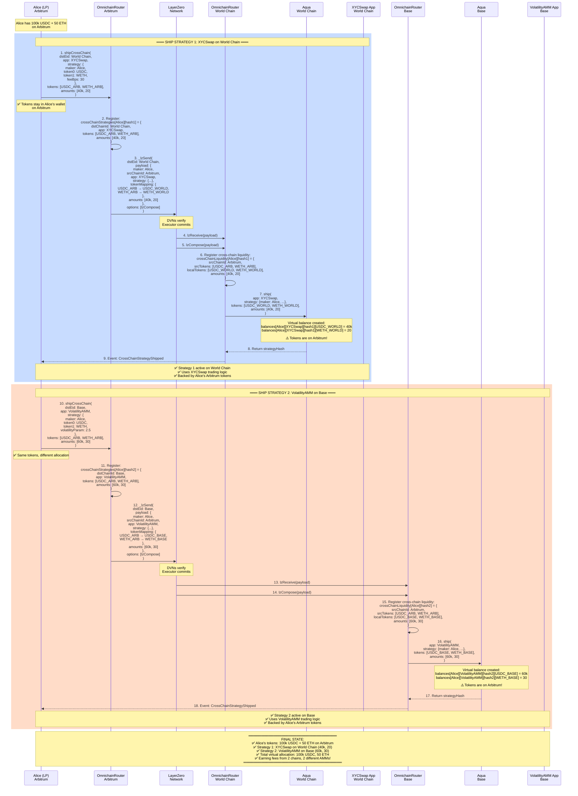
```mermaid
sequenceDiagram
    participant Alice as Alice (LP)<br/>Arbitrum
    participant RouterARB as OmnichainRouter<br/>Arbitrum
    participant LZ as LayerZero<br/>Network
    participant RouterWORLD as OmnichainRouter<br/>World Chain
    participant AquaWORLD as Aqua<br/>World Chain
    participant XYCSwap as XYCSwap App<br/>World Chain
    participant RouterBASE as OmnichainRouter<br/>Base
    participant AquaBASE as Aqua<br/>Base
    participant VolAMM as VolatilityAMM App<br/>Base

    Note over Alice: Alice has 100k USDC + 50 ETH<br/>on Arbitrum

    rect rgb(200, 220, 255)
        Note over Alice,XYCSwap: ═══ SHIP STRATEGY 1: XYCSwap on World Chain ═══
        
        Alice->>RouterARB: 1. shipCrossChain(<br/>dstEid: World Chain,<br/>app: XYCSwap,<br/>strategy: {<br/>  maker: Alice,<br/>  token0: USDC,<br/>  token1: WETH,<br/>  feeBps: 30<br/>},<br/>tokens: [USDC_ARB, WETH_ARB],<br/>amounts: [40k, 20]<br/>)
        
        Note over Alice: ✅ Tokens stay in Alice's wallet<br/>on Arbitrum
        
        RouterARB->>RouterARB: 2. Register:<br/>crossChainStrategies[Alice][hash1] = {<br/>  dstChainId: World Chain,<br/>  app: XYCSwap,<br/>  tokens: [USDC_ARB, WETH_ARB],<br/>  amounts: [40k, 20]<br/>}
        
        RouterARB->>LZ: 3. _lzSend(<br/>dstEid: World Chain,<br/>payload: {<br/>  maker: Alice,<br/>  srcChainId: Arbitrum,<br/>  app: XYCSwap,<br/>  strategy: {...},<br/>  tokenMapping: {<br/>    USDC_ARB → USDC_WORLD,<br/>    WETH_ARB → WETH_WORLD<br/>  },<br/>  amounts: [40k, 20]<br/>},<br/>options: [lzCompose]<br/>)
        
        Note over LZ: DVNs verify<br/>Executor commits
        
        LZ->>RouterWORLD: 4. lzReceive(payload)
        
        LZ->>RouterWORLD: 5. lzCompose(payload)
        
        RouterWORLD->>RouterWORLD: 6. Register cross-chain liquidity:<br/>crossChainLiquidity[Alice][hash1] = {<br/>  srcChainId: Arbitrum,<br/>  srcTokens: [USDC_ARB, WETH_ARB],<br/>  localTokens: [USDC_WORLD, WETH_WORLD],<br/>  amounts: [40k, 20]<br/>}
        
        RouterWORLD->>AquaWORLD: 7. ship(<br/>app: XYCSwap,<br/>strategy: {maker: Alice, ...},<br/>tokens: [USDC_WORLD, WETH_WORLD],<br/>amounts: [40k, 20]<br/>)
        
        Note over AquaWORLD: Virtual balance created:<br/>balances[Alice][XYCSwap][hash1][USDC_WORLD] = 40k<br/>balances[Alice][XYCSwap][hash1][WETH_WORLD] = 20<br/><br/>⚠️ Tokens are on Arbitrum!
        
        AquaWORLD-->>RouterWORLD: 8. Return strategyHash
        
        RouterWORLD-->>Alice: 9. Event: CrossChainStrategyShipped
        
        Note over Alice,XYCSwap: ✅ Strategy 1 active on World Chain<br/>✅ Uses XYCSwap trading logic<br/>✅ Backed by Alice's Arbitrum tokens
    end

    rect rgb(255, 220, 200)
        Note over Alice,VolAMM: ═══ SHIP STRATEGY 2: VolatilityAMM on Base ═══
        
        Alice->>RouterARB: 10. shipCrossChain(<br/>dstEid: Base,<br/>app: VolatilityAMM,<br/>strategy: {<br/>  maker: Alice,<br/>  token0: USDC,<br/>  token1: WETH,<br/>  volatilityParam: 2.5<br/>},<br/>tokens: [USDC_ARB, WETH_ARB],<br/>amounts: [60k, 30]<br/>)
        
        Note over Alice: ✅ Same tokens, different allocation
        
        RouterARB->>RouterARB: 11. Register:<br/>crossChainStrategies[Alice][hash2] = {<br/>  dstChainId: Base,<br/>  app: VolatilityAMM,<br/>  tokens: [USDC_ARB, WETH_ARB],<br/>  amounts: [60k, 30]<br/>}
        
        RouterARB->>LZ: 12. _lzSend(<br/>dstEid: Base,<br/>payload: {<br/>  maker: Alice,<br/>  srcChainId: Arbitrum,<br/>  app: VolatilityAMM,<br/>  strategy: {...},<br/>  tokenMapping: {<br/>    USDC_ARB → USDC_BASE,<br/>    WETH_ARB → WETH_BASE<br/>  },<br/>  amounts: [60k, 30]<br/>},<br/>options: [lzCompose]<br/>)
        
        Note over LZ: DVNs verify<br/>Executor commits
        
        LZ->>RouterBASE: 13. lzReceive(payload)
        
        LZ->>RouterBASE: 14. lzCompose(payload)
        
        RouterBASE->>RouterBASE: 15. Register cross-chain liquidity:<br/>crossChainLiquidity[Alice][hash2] = {<br/>  srcChainId: Arbitrum,<br/>  srcTokens: [USDC_ARB, WETH_ARB],<br/>  localTokens: [USDC_BASE, WETH_BASE],<br/>  amounts: [60k, 30]<br/>}
        
        RouterBASE->>AquaBASE: 16. ship(<br/>app: VolatilityAMM,<br/>strategy: {maker: Alice, ...},<br/>tokens: [USDC_BASE, WETH_BASE],<br/>amounts: [60k, 30]<br/>)
        
        Note over AquaBASE: Virtual balance created:<br/>balances[Alice][VolatilityAMM][hash2][USDC_BASE] = 60k<br/>balances[Alice][VolatilityAMM][hash2][WETH_BASE] = 30<br/><br/>⚠️ Tokens are on Arbitrum!
        
        AquaBASE-->>RouterBASE: 17. Return strategyHash
        
        RouterBASE-->>Alice: 18. Event: CrossChainStrategyShipped
        
        Note over Alice,VolAMM: ✅ Strategy 2 active on Base<br/>✅ Uses VolatilityAMM trading logic<br/>✅ Backed by Alice's Arbitrum tokens
    end

    Note over Alice,VolAMM: ═══════════════════════════════════<br/>FINAL STATE:<br/>✅ Alice's tokens: 100k USDC + 50 ETH on Arbitrum<br/>✅ Strategy 1: XYCSwap on World Chain (40k, 20)<br/>✅ Strategy 2: VolatilityAMM on Base (60k, 30)<br/>✅ Total virtual allocation: 100k USDC, 50 ETH<br/>✅ Earning fees from 2 chains, 2 different AMMs!<br/>═══════════════════════════════════════
```

---

## Visual Representation

```
┌─────────────────────────────────────────────────────────┐
│ ARBITRUM (Alice's Home Chain)                           │
│                                                         │
│ Alice's Wallet:                                         │
│   100,000 USDC  ← Physical tokens stay here!          │
│   50 ETH        ← Physical tokens stay here!          │
│                                                         │
│ OmnichainRouter Registry:                              │
│   Strategy 1 → World Chain, XYCSwap (40k, 20)         │
│   Strategy 2 → Base, VolatilityAMM (60k, 30)          │
└─────────────────────────────────────────────────────────┘
                          │
              ┌───────────┴───────────┐
              │                       │
              ▼                       ▼
┌───────────────────────┐   ┌───────────────────────┐
│ WORLD CHAIN           │   │ BASE                  │
│                       │   │                       │
│ XYCSwap App           │   │ VolatilityAMM App     │
│ (Constant Product)    │   │ (Dynamic Fee)         │
│                       │   │                       │
│ Aqua Protocol:        │   │ Aqua Protocol:        │
│ balances[Alice]       │   │ balances[Alice]       │
│   [XYCSwap]           │   │   [VolatilityAMM]     │
│   [hash1]             │   │   [hash2]             │
│   USDC: 40k           │   │   USDC: 60k           │
│   WETH: 20            │   │   WETH: 30            │
│                       │   │                       │
│ Traders swap here →   │   │ Traders swap here →   │
│ Alice earns fees      │   │ Alice earns fees      │
└───────────────────────┘   └───────────────────────┘
```

---

## Code Example: Alice's Flow

```solidity
// Alice on Arbitrum
contract AliceLP {
    OmnichainAquaRouter public router;
    
    function provideLiquidityToMultipleChains() external {
        // Alice has 100k USDC + 50 ETH on Arbitrum
        
        // Step 1: Approve tokens to OmnichainRouter (one-time)
        USDC.approve(address(router), type(uint256).max);
        WETH.approve(address(router), type(uint256).max);
        
        // Step 2: Ship to XYCSwap on World Chain
        XYCSwap.Strategy memory xycStrategy = XYCSwap.Strategy({
            maker: address(this),  // Alice
            token0: USDC,
            token1: WETH,
            feeBps: 30,
            salt: bytes32(0)
        });
        
        router.shipCrossChain{value: lzFee1}(
            dstEid: WORLD_CHAIN_EID,
            app: xycSwapWorldChain,
            strategy: abi.encode(xycStrategy),
            tokens: [USDC_ARB, WETH_ARB],
            amounts: [40000e6, 20e18]
        );
        
        // Step 3: Ship to VolatilityAMM on Base
        VolatilityAMM.Strategy memory volStrategy = VolatilityAMM.Strategy({
            maker: address(this),  // Alice
            token0: USDC,
            token1: WETH,
            volatilityParam: 2.5e18,
            salt: bytes32(0)
        });
        
        router.shipCrossChain{value: lzFee2}(
            dstEid: BASE_EID,
            app: volatilityAMMBase,
            strategy: abi.encode(volStrategy),
            tokens: [USDC_ARB, WETH_ARB],
            amounts: [60000e6, 30e18]
        );
        
        // Done! Alice now has:
        // - Strategy on World Chain using XYCSwap logic
        // - Strategy on Base using VolatilityAMM logic
        // - All tokens still on Arbitrum
    }
}
```

---

## When Traders Swap

### Trader on World Chain:

```solidity
// Trader on World Chain swaps against Alice's XYCSwap strategy
xycSwap.swap(aliceStrategy, ...);

// What happens:
// 1. XYCSwap calculates output using constant product formula
// 2. Calls AQUA.pull() for Alice's tokens
// 3. OmnichainRouter detects cross-chain liquidity
// 4. LZ message to Arbitrum → pull from Alice's wallet
// 5. Bridge tokens to World Chain
// 6. Deliver to trader
// 7. Trader sends tokens back via push()
// 8. Bridge back to Arbitrum → Alice's wallet
```

### Trader on Base:

```solidity
// Trader on Base swaps against Alice's VolatilityAMM strategy
volatilityAMM.swap(aliceStrategy, ...);

// What happens:
// 1. VolatilityAMM calculates output using dynamic fee formula
// 2. Calls AQUA.pull() for Alice's tokens
// 3. OmnichainRouter detects cross-chain liquidity
// 4. LZ message to Arbitrum → pull from Alice's wallet
// 5. Bridge tokens to Base
// 6. Deliver to trader
// 7. Trader sends tokens back via push()
// 8. Bridge back to Arbitrum → Alice's wallet
```

---

## Alice's Dashboard View

```
┌─────────────────────────────────────────────────────────┐
│ Alice's Omnichain Liquidity Dashboard                   │
├─────────────────────────────────────────────────────────┤
│                                                         │
│ Home Chain: Arbitrum                                    │
│ Wallet Balance: 100,000 USDC, 50 ETH                   │
│                                                         │
│ Active Strategies:                                      │
│                                                         │
│ ┌─────────────────────────────────────────────────┐   │
│ │ Strategy 1: XYCSwap on World Chain              │   │
│ │ ├─ Allocated: 40,000 USDC, 20 ETH              │   │
│ │ ├─ Current: 41,234 USDC, 19.8 ETH              │   │
│ │ ├─ PnL: +1,234 USDC, -0.2 ETH                  │   │
│ │ ├─ 24h Volume: $45,000                          │   │
│ │ ├─ 24h Fees Earned: $135                        │   │
│ │ └─ APY: 12.3%                                   │   │
│ └─────────────────────────────────────────────────┘   │
│                                                         │
│ ┌─────────────────────────────────────────────────┐   │
│ │ Strategy 2: VolatilityAMM on Base               │   │
│ │ ├─ Allocated: 60,000 USDC, 30 ETH              │   │
│ │ ├─ Current: 62,890 USDC, 29.5 ETH              │   │
│ │ ├─ PnL: +2,890 USDC, -0.5 ETH                  │   │
│ │ ├─ 24h Volume: $120,000                         │   │
│ │ ├─ 24h Fees Earned: $450                        │   │
│ │ └─ APY: 18.7%                                   │   │
│ └─────────────────────────────────────────────────┘   │
│                                                         │
│ Total PnL: +4,124 USDC, -0.7 ETH                      │
│ Total Fees (24h): $585                                 │
│ Combined APY: 16.2%                                    │
│                                                         │
│ [Rebalance] [Add Strategy] [Withdraw]                  │
└─────────────────────────────────────────────────────────┘
```

---

## Key Points

### ✅ Correct Flow:

1. **LP's tokens stay on their home chain** (Arbitrum in this case)
2. **LP ships to different apps on different chains**
   - XYCSwap on World Chain
   - VolatilityAMM on Base
3. **Each app has different trading logic**
   - XYCSwap: Constant product (x*y=k)
   - VolatilityAMM: Dynamic fees based on volatility
4. **Virtual balances created on each destination chain**
5. **LayerZero handles cross-chain pull/push during swaps**
6. **LP earns fees from both chains**

### The Innovation:

**Alice can provide liquidity to multiple different AMM apps across multiple chains, all while keeping her tokens on Arbitrum!**

**Is this the flow you were envisioning?**

```plaintext
sequenceDiagram
    participant Alice as Alice (LP)<br/>Arbitrum
    participant RouterARB as OmnichainRouter<br/>Arbitrum
    participant LZ as LayerZero<br/>Network
    participant RouterWORLD as OmnichainRouter<br/>World Chain
    participant AquaWORLD as Aqua<br/>World Chain
    participant XYCSwap as XYCSwap App<br/>World Chain
    participant RouterBASE as OmnichainRouter<br/>Base
    participant AquaBASE as Aqua<br/>Base
    participant VolAMM as VolatilityAMM App<br/>Base

    Note over Alice: Alice has 100k USDC + 50 ETH<br/>on Arbitrum

    rect rgb(200, 220, 255)
        Note over Alice,XYCSwap: ═══ SHIP STRATEGY 1: XYCSwap on World Chain ═══
        
        Alice->>RouterARB: 1. shipCrossChain(<br/>dstEid: World Chain,<br/>app: XYCSwap,<br/>strategy: {<br/>  maker: Alice,<br/>  token0: USDC,<br/>  token1: WETH,<br/>  feeBps: 30<br/>},<br/>tokens: [USDC_ARB, WETH_ARB],<br/>amounts: [40k, 20]<br/>)
        
        Note over Alice: ✅ Tokens stay in Alice's wallet<br/>on Arbitrum
        
        RouterARB->>RouterARB: 2. Register:<br/>crossChainStrategies[Alice][hash1] = {<br/>  dstChainId: World Chain,<br/>  app: XYCSwap,<br/>  tokens: [USDC_ARB, WETH_ARB],<br/>  amounts: [40k, 20]<br/>}
        
        RouterARB->>LZ: 3. _lzSend(<br/>dstEid: World Chain,<br/>payload: {<br/>  maker: Alice,<br/>  srcChainId: Arbitrum,<br/>  app: XYCSwap,<br/>  strategy: {...},<br/>  tokenMapping: {<br/>    USDC_ARB → USDC_WORLD,<br/>    WETH_ARB → WETH_WORLD<br/>  },<br/>  amounts: [40k, 20]<br/>},<br/>options: [lzCompose]<br/>)
        
        Note over LZ: DVNs verify<br/>Executor commits
        
        LZ->>RouterWORLD: 4. lzReceive(payload)
        
        LZ->>RouterWORLD: 5. lzCompose(payload)
        
        RouterWORLD->>RouterWORLD: 6. Register cross-chain liquidity:<br/>crossChainLiquidity[Alice][hash1] = {<br/>  srcChainId: Arbitrum,<br/>  srcTokens: [USDC_ARB, WETH_ARB],<br/>  localTokens: [USDC_WORLD, WETH_WORLD],<br/>  amounts: [40k, 20]<br/>}
        
        RouterWORLD->>AquaWORLD: 7. ship(<br/>app: XYCSwap,<br/>strategy: {maker: Alice, ...},<br/>tokens: [USDC_WORLD, WETH_WORLD],<br/>amounts: [40k, 20]<br/>)
        
        Note over AquaWORLD: Virtual balance created:<br/>balances[Alice][XYCSwap][hash1][USDC_WORLD] = 40k<br/>balances[Alice][XYCSwap][hash1][WETH_WORLD] = 20<br/><br/>⚠️ Tokens are on Arbitrum!
        
        AquaWORLD-->>RouterWORLD: 8. Return strategyHash
        
        RouterWORLD-->>Alice: 9. Event: CrossChainStrategyShipped
        
        Note over Alice,XYCSwap: ✅ Strategy 1 active on World Chain<br/>✅ Uses XYCSwap trading logic<br/>✅ Backed by Alice's Arbitrum tokens
    end

    rect rgb(255, 220, 200)
        Note over Alice,VolAMM: ═══ SHIP STRATEGY 2: VolatilityAMM on Base ═══
        
        Alice->>RouterARB: 10. shipCrossChain(<br/>dstEid: Base,<br/>app: VolatilityAMM,<br/>strategy: {<br/>  maker: Alice,<br/>  token0: USDC,<br/>  token1: WETH,<br/>  volatilityParam: 2.5<br/>},<br/>tokens: [USDC_ARB, WETH_ARB],<br/>amounts: [60k, 30]<br/>)
        
        Note over Alice: ✅ Same tokens, different allocation
        
        RouterARB->>RouterARB: 11. Register:<br/>crossChainStrategies[Alice][hash2] = {<br/>  dstChainId: Base,<br/>  app: VolatilityAMM,<br/>  tokens: [USDC_ARB, WETH_ARB],<br/>  amounts: [60k, 30]<br/>}
        
        RouterARB->>LZ: 12. _lzSend(<br/>dstEid: Base,<br/>payload: {<br/>  maker: Alice,<br/>  srcChainId: Arbitrum,<br/>  app: VolatilityAMM,<br/>  strategy: {...},<br/>  tokenMapping: {<br/>    USDC_ARB → USDC_BASE,<br/>    WETH_ARB → WETH_BASE<br/>  },<br/>  amounts: [60k, 30]<br/>},<br/>options: [lzCompose]<br/>)
        
        Note over LZ: DVNs verify<br/>Executor commits
        
        LZ->>RouterBASE: 13. lzReceive(payload)
        
        LZ->>RouterBASE: 14. lzCompose(payload)
        
        RouterBASE->>RouterBASE: 15. Register cross-chain liquidity:<br/>crossChainLiquidity[Alice][hash2] = {<br/>  srcChainId: Arbitrum,<br/>  srcTokens: [USDC_ARB, WETH_ARB],<br/>  localTokens: [USDC_BASE, WETH_BASE],<br/>  amounts: [60k, 30]<br/>}
        
        RouterBASE->>AquaBASE: 16. ship(<br/>app: VolatilityAMM,<br/>strategy: {maker: Alice, ...},<br/>tokens: [USDC_BASE, WETH_BASE],<br/>amounts: [60k, 30]<br/>)
        
        Note over AquaBASE: Virtual balance created:<br/>balances[Alice][VolatilityAMM][hash2][USDC_BASE] = 60k<br/>balances[Alice][VolatilityAMM][hash2][WETH_BASE] = 30<br/><br/>⚠️ Tokens are on Arbitrum!
        
        AquaBASE-->>RouterBASE: 17. Return strategyHash
        
        RouterBASE-->>Alice: 18. Event: CrossChainStrategyShipped
        
        Note over Alice,VolAMM: ✅ Strategy 2 active on Base<br/>✅ Uses VolatilityAMM trading logic<br/>✅ Backed by Alice's Arbitrum tokens
    end

    Note over Alice,VolAMM: ═══════════════════════════════════<br/>FINAL STATE:<br/>✅ Alice's tokens: 100k USDC + 50 ETH on Arbitrum<br/>✅ Strategy 1: XYCSwap on World Chain (40k, 20)<br/>✅ Strategy 2: VolatilityAMM on Base (60k, 30)<br/>✅ Total virtual allocation: 100k USDC, 50 ETH<br/>✅ Earning fees from 2 chains, 2 different AMMs!<br/>═══════════════════════════════════════
```

```plaintext
┌─────────────────────────────────────────────────────────┐
│ ARBITRUM (Alice's Home Chain)                           │
│                                                         │
│ Alice's Wallet:                                         │
│   100,000 USDC  ← Physical tokens stay here!          │
│   50 ETH        ← Physical tokens stay here!          │
│                                                         │
│ OmnichainRouter Registry:                              │
│   Strategy 1 → World Chain, XYCSwap (40k, 20)         │
│   Strategy 2 → Base, VolatilityAMM (60k, 30)          │
└─────────────────────────────────────────────────────────┘
                          │
              ┌───────────┴───────────┐
              │                       │
              ▼                       ▼
┌───────────────────────┐   ┌───────────────────────┐
│ WORLD CHAIN           │   │ BASE                  │
│                       │   │                       │
│ XYCSwap App           │   │ VolatilityAMM App     │
│ (Constant Product)    │   │ (Dynamic Fee)         │
│                       │   │                       │
│ Aqua Protocol:        │   │ Aqua Protocol:        │
│ balances[Alice]       │   │ balances[Alice]       │
│   [XYCSwap]           │   │   [VolatilityAMM]     │
│   [hash1]             │   │   [hash2]             │
│   USDC: 40k           │   │   USDC: 60k           │
│   WETH: 20            │   │   WETH: 30            │
│                       │   │                       │
│ Traders swap here →   │   │ Traders swap here →   │
│ Alice earns fees      │   │ Alice earns fees      │
└───────────────────────┘   └───────────────────────┘
```

```solidity
// Alice on Arbitrum
contract AliceLP {
    OmnichainAquaRouter public router;
    
    function provideLiquidityToMultipleChains() external {
        // Alice has 100k USDC + 50 ETH on Arbitrum
        
        // Step 1: Approve tokens to OmnichainRouter (one-time)
        USDC.approve(address(router), type(uint256).max);
        WETH.approve(address(router), type(uint256).max);
        
        // Step 2: Ship to XYCSwap on World Chain
        XYCSwap.Strategy memory xycStrategy = XYCSwap.Strategy({
            maker: address(this),  // Alice
            token0: USDC,
            token1: WETH,
            feeBps: 30,
            salt: bytes32(0)
        });
        
        router.shipCrossChain{value: lzFee1}(
            dstEid: WORLD_CHAIN_EID,
            app: xycSwapWorldChain,
            strategy: abi.encode(xycStrategy),
            tokens: [USDC_ARB, WETH_ARB],
            amounts: [40000e6, 20e18]
        );
        
        // Step 3: Ship to VolatilityAMM on Base
        VolatilityAMM.Strategy memory volStrategy = VolatilityAMM.Strategy({
            maker: address(this),  // Alice
            token0: USDC,
            token1: WETH,
            volatilityParam: 2.5e18,
            salt: bytes32(0)
        });
        
        router.shipCrossChain{value: lzFee2}(
            dstEid: BASE_EID,
            app: volatilityAMMBase,
            strategy: abi.encode(volStrategy),
            tokens: [USDC_ARB, WETH_ARB],
            amounts: [60000e6, 30e18]
        );
        
        // Done! Alice now has:
        // - Strategy on World Chain using XYCSwap logic
        // - Strategy on Base using VolatilityAMM logic
        // - All tokens still on Arbitrum
    }
}
```

```solidity
// Trader on World Chain swaps against Alice's XYCSwap strategy
xycSwap.swap(aliceStrategy, ...);

// What happens:
// 1. XYCSwap calculates output using constant product formula
// 2. Calls AQUA.pull() for Alice's tokens
// 3. OmnichainRouter detects cross-chain liquidity
// 4. LZ message to Arbitrum → pull from Alice's wallet
// 5. Bridge tokens to World Chain
// 6. Deliver to trader
// 7. Trader sends tokens back via push()
// 8. Bridge back to Arbitrum → Alice's wallet
```

```solidity
// Trader on Base swaps against Alice's VolatilityAMM strategy
volatilityAMM.swap(aliceStrategy, ...);

// What happens:
// 1. VolatilityAMM calculates output using dynamic fee formula
// 2. Calls AQUA.pull() for Alice's tokens
// 3. OmnichainRouter detects cross-chain liquidity
// 4. LZ message to Arbitrum → pull from Alice's wallet
// 5. Bridge tokens to Base
// 6. Deliver to trader
// 7. Trader sends tokens back via push()
// 8. Bridge back to Arbitrum → Alice's wallet
```

```plaintext
┌─────────────────────────────────────────────────────────┐
│ Alice's Omnichain Liquidity Dashboard                   │
├─────────────────────────────────────────────────────────┤
│                                                         │
│ Home Chain: Arbitrum                                    │
│ Wallet Balance: 100,000 USDC, 50 ETH                   │
│                                                         │
│ Active Strategies:                                      │
│                                                         │
│ ┌─────────────────────────────────────────────────┐   │
│ │ Strategy 1: XYCSwap on World Chain              │   │
│ │ ├─ Allocated: 40,000 USDC, 20 ETH              │   │
│ │ ├─ Current: 41,234 USDC, 19.8 ETH              │   │
│ │ ├─ PnL: +1,234 USDC, -0.2 ETH                  │   │
│ │ ├─ 24h Volume: $45,000                          │   │
│ │ ├─ 24h Fees Earned: $135                        │   │
│ │ └─ APY: 12.3%                                   │   │
│ └─────────────────────────────────────────────────┘   │
│                                                         │
│ ┌─────────────────────────────────────────────────┐   │
│ │ Strategy 2: VolatilityAMM on Base               │   │
│ │ ├─ Allocated: 60,000 USDC, 30 ETH              │   │
│ │ ├─ Current: 62,890 USDC, 29.5 ETH              │   │
│ │ ├─ PnL: +2,890 USDC, -0.5 ETH                  │   │
│ │ ├─ 24h Volume: $120,000                         │   │
│ │ ├─ 24h Fees Earned: $450                        │   │
│ │ └─ APY: 18.7%                                   │   │
│ └─────────────────────────────────────────────────┘   │
│                                                         │
│ Total PnL: +4,124 USDC, -0.7 ETH                      │
│ Total Fees (24h): $585                                 │
│ Combined APY: 16.2%                                    │
│                                                         │
│ [Rebalance] [Add Strategy] [Withdraw]                  │
└─────────────────────────────────────────────────────────┘
```

---

**User**

I need more clarity on pull and push operations. Who implemented and how is it being done? How will it come into the level 0 flow?

---

**Cursor**

Great question! Let me break down the `pull()` and `push()` operations in detail, showing who implements them and how they integrate with LayerZero.

Perfect! Now let me explain `pull()` and `push()` in detail with LayerZero integration:

## Pull and Push Operations: Complete Breakdown

---

## 1. Who Implements What?

### Three Layers of Implementation:

```
┌─────────────────────────────────────────────────────────┐
│ Layer 1: Aqua Protocol (Core)                          │
│ - Implements pull() and push()                         │
│ - Handles single-chain token transfers                 │
│ - Updates virtual balances                             │
└─────────────────────────────────────────────────────────┘
                          ↑
                          │ wraps/proxies
                          │
┌─────────────────────────────────────────────────────────┐
│ Layer 2: OmnichainAquaRouter (Cross-chain wrapper)     │
│ - Wraps Aqua's pull() and push()                       │
│ - Detects cross-chain liquidity                        │
│ - Triggers LayerZero messages                          │
└─────────────────────────────────────────────────────────┘
                          ↑
                          │ calls
                          │
┌─────────────────────────────────────────────────────────┐
│ Layer 3: Strategy Apps (XYCSwap, VolatilityAMM, etc.)  │
│ - Call pull() to get tokens for trader                 │
│ - Call push() to receive tokens from trader            │
│ - Don't know about cross-chain complexity              │
└─────────────────────────────────────────────────────────┘
```

---

## 2. Single-Chain Implementation (Aqua Core)

### Aqua.sol (Simplified)

```solidity
contract Aqua {
    // Virtual balance storage
    mapping(address maker =>
        mapping(address app =>
            mapping(bytes32 strategyHash =>
                mapping(address token => uint256)))) private _balances;

    /// @notice Pull tokens from maker to recipient during swap
    function pull(
        address maker,
        bytes32 strategyHash,
        address token,
        uint256 amount,
        address to
    ) external {
        // Only the registered app can pull
        require(msg.sender == app, "Only app can pull");
        
        // Update virtual balance
        _balances[maker][msg.sender][strategyHash][token] -= amount;
        
        // Transfer actual tokens from maker's wallet to recipient
        IERC20(token).transferFrom(maker, to, amount);
        
        emit Pulled(maker, msg.sender, strategyHash, token, amount, to);
    }

    /// @notice Push tokens from trader to maker's strategy balance
    function push(
        address maker,
        address app,
        bytes32 strategyHash,
        address token,
        uint256 amount
    ) external {
        // Transfer tokens from caller to maker
        IERC20(token).transferFrom(msg.sender, maker, amount);
        
        // Update virtual balance
        _balances[maker][app][strategyHash][token] += amount;
        
        emit Pushed(maker, app, strategyHash, token, amount);
    }
}
```

**Key Points:**
- `pull()`: Decreases virtual balance, transfers tokens FROM maker TO recipient
- `push()`: Increases virtual balance, transfers tokens FROM caller TO maker
- Both operate on same chain only

---

## 3. Cross-Chain Implementation (OmnichainAquaRouter)

### OmnichainAquaRouter.sol

```solidity
contract OmnichainAquaRouter is OApp {
    IAqua public aqua;
    
    // Track which strategies have cross-chain liquidity
    struct CrossChainLiquidity {
        uint32 srcChainId;           // Where tokens actually are
        address[] srcTokens;          // Token addresses on source chain
        address[] localTokens;        // Token addresses on this chain
        uint256[] amounts;            // Virtual amounts
    }
    
    mapping(address maker => 
        mapping(bytes32 strategyHash => CrossChainLiquidity)) 
    public crossChainLiquidity;

    /// @notice Wrapped pull() that handles cross-chain
    function pull(
        address maker,
        bytes32 strategyHash,
        address token,
        uint256 amount,
        address to
    ) external {
        CrossChainLiquidity memory ccl = crossChainLiquidity[maker][strategyHash];
        
        if (ccl.srcChainId == 0) {
            // LOCAL LIQUIDITY: Just call Aqua directly
            aqua.pull(maker, strategyHash, token, amount, to);
            
        } else {
            // CROSS-CHAIN LIQUIDITY: Need to pull from source chain
            
            // Step 1: Map local token to source chain token
            address srcToken = _mapToSourceToken(token, ccl);
            
            // Step 2: Send LayerZero message to source chain
            bytes memory payload = abi.encode(
                "PULL",
                maker,
                strategyHash,
                srcToken,
                amount,
                to,
                block.chainid  // Recipient chain
            );
            
            bytes memory options = OptionsBuilder
                .newOptions()
                .addExecutorLzComposeOption(0, 500000, 0);
            
            _lzSend(
                ccl.srcChainId,
                payload,
                options,
                MessagingFee(msg.value, 0),
                payable(msg.sender)
            );
            
            // Step 3: Update local virtual balance
            aqua.updateBalance(maker, msg.sender, strategyHash, token, -int256(amount));
            
            // Note: Actual tokens will arrive later via bridge
            // For now, we might use a liquidity pool to front the tokens
        }
    }

    /// @notice Wrapped push() that handles cross-chain
    function push(
        address maker,
        address app,
        bytes32 strategyHash,
        address token,
        uint256 amount
    ) external {
        CrossChainLiquidity memory ccl = crossChainLiquidity[maker][strategyHash];
        
        if (ccl.srcChainId == 0) {
            // LOCAL LIQUIDITY: Just call Aqua directly
            // Caller must approve tokens to this contract first
            IERC20(token).transferFrom(msg.sender, address(this), amount);
            IERC20(token).approve(address(aqua), amount);
            aqua.push(maker, app, strategyHash, token, amount);
            
        } else {
            // CROSS-CHAIN LIQUIDITY: Need to push to source chain
            
            // Step 1: Take tokens from caller
            IERC20(token).transferFrom(msg.sender, address(this), amount);
            
            // Step 2: Map local token to source chain token
            address srcToken = _mapToSourceToken(token, ccl);
            
            // Step 3: Send LayerZero message to source chain
            bytes memory payload = abi.encode(
                "PUSH",
                maker,
                app,
                strategyHash,
                srcToken,
                amount
            );
            
            bytes memory options = OptionsBuilder
                .newOptions()
                .addExecutorLzComposeOption(0, 300000, 0);
            
            _lzSend(
                ccl.srcChainId,
                payload,
                options,
                MessagingFee(msg.value, 0),
                payable(msg.sender)
            );
            
            // Step 4: Bridge tokens to source chain
            _bridgeTokens(token, amount, ccl.srcChainId);
            
            // Step 5: Update local virtual balance
            aqua.updateBalance(maker, app, strategyHash, token, int256(amount));
        }
    }

    /// @notice Receive LayerZero messages
    function lzCompose(
        address _from,
        bytes32 _guid,
        bytes calldata _message,
        address _executor,
        bytes calldata _extraData
    ) external payable override {
        (string memory operation, bytes memory data) = 
            abi.decode(_message, (string, bytes));
        
        if (keccak256(bytes(operation)) == keccak256(bytes("PULL"))) {
            _handlePullRequest(data);
        } else if (keccak256(bytes(operation)) == keccak256(bytes("PUSH"))) {
            _handlePushRequest(data);
        }
    }

    /// @notice Handle pull request from another chain
    function _handlePullRequest(bytes memory data) internal {
        (address maker, bytes32 strategyHash, address token, 
         uint256 amount, address recipient, uint32 recipientChain) = 
            abi.decode(data, (address, bytes32, address, uint256, address, uint32));
        
        // Pull tokens from maker's wallet on THIS chain
        IERC20(token).transferFrom(maker, address(this), amount);
        
        // Bridge tokens to recipient chain
        _bridgeTokens(token, amount, recipientChain, recipient);
        
        emit CrossChainPullExecuted(maker, strategyHash, token, amount, recipientChain);
    }

    /// @notice Handle push request from another chain
    function _handlePushRequest(bytes memory data) internal {
        (address maker, address app, bytes32 strategyHash, 
         address token, uint256 amount) = 
            abi.decode(data, (address, address, bytes32, address, uint256));
        
        // Tokens arrive via bridge (handled separately)
        // Once received, transfer to maker
        IERC20(token).transfer(maker, amount);
        
        emit CrossChainPushExecuted(maker, app, strategyHash, token, amount);
    }
}
```

---

## 4. How Strategy Apps Use Pull/Push

### XYCSwap.sol (Strategy App)

```solidity
contract XYCSwap is AquaApp {
    // Strategy app doesn't know about cross-chain!
    // It just calls AQUA.pull() and AQUA.push()
    
    function swap(
        Strategy calldata strategy,
        bool zeroForOne,
        uint256 amountIn,
        uint256 amountOutMin,
        address recipient,
        bytes calldata takerData
    ) external returns (uint256 amountOut) {
        bytes32 strategyHash = keccak256(abi.encode(strategy));
        
        address tokenIn = zeroForOne ? strategy.token0 : strategy.token1;
        address tokenOut = zeroForOne ? strategy.token1 : strategy.token0;
        
        // Get virtual balances
        (uint256 balanceIn, uint256 balanceOut) = 
            AQUA.safeBalances(strategy.maker, address(this), strategyHash, tokenIn, tokenOut);
        
        // Calculate output
        amountOut = (balanceOut * amountIn) / (balanceIn + amountIn);
        require(amountOut >= amountOutMin, "Slippage");
        
        // ═══════════════════════════════════════════════════════
        // PULL: Get tokenOut from maker to recipient
        // ═══════════════════════════════════════════════════════
        AQUA.pull(strategy.maker, strategyHash, tokenOut, amountOut, recipient);
        // ↑ If cross-chain, OmnichainRouter intercepts this
        //   and sends LZ message to source chain
        
        // Callback for trader to send tokenIn
        IXYCSwapCallback(msg.sender).xycSwapCallback(
            tokenIn, tokenOut, amountIn, amountOut,
            strategy.maker, address(this), strategyHash, takerData
        );
        
        // ═══════════════════════════════════════════════════════
        // PUSH: Verify trader sent tokenIn to maker
        // ═══════════════════════════════════════════════════════
        uint256 expectedBalance = balanceIn + amountIn;
        _safeCheckAquaPush(strategy.maker, strategyHash, tokenIn, expectedBalance);
        // ↑ If cross-chain, OmnichainRouter intercepts this
        //   and sends LZ message to source chain
    }
}
```

**Key Point:** Strategy apps call `AQUA.pull()` and `AQUA.push()` without knowing if it's cross-chain!

---

## 5. Complete Cross-Chain Pull/Push Flow

### Detailed Sequence Diagram

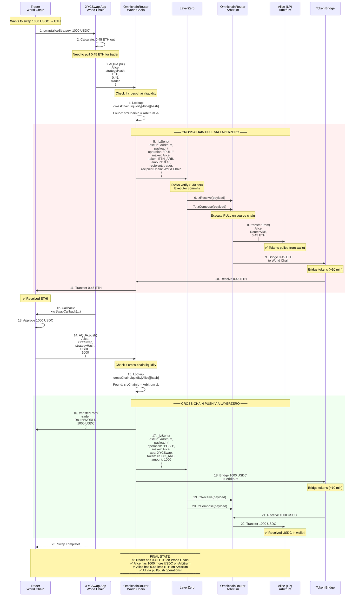
```mermaid
sequenceDiagram
    participant Trader as Trader<br/>World Chain
    participant XYCSwap as XYCSwap App<br/>World Chain
    participant RouterWORLD as OmnichainRouter<br/>World Chain
    participant LZ as LayerZero
    participant RouterARB as OmnichainRouter<br/>Arbitrum
    participant Alice as Alice (LP)<br/>Arbitrum
    participant Bridge as Token Bridge

    Note over Trader: Wants to swap 1000 USDC → ETH

    Trader->>XYCSwap: 1. swap(aliceStrategy, 1000 USDC)
    
    XYCSwap->>XYCSwap: 2. Calculate: 0.45 ETH out
    
    Note over XYCSwap: Need to pull 0.45 ETH for trader
    
    XYCSwap->>RouterWORLD: 3. AQUA.pull(<br/>Alice,<br/>strategyHash,<br/>ETH,<br/>0.45,<br/>trader<br/>)
    
    Note over RouterWORLD: Check if cross-chain liquidity
    
    RouterWORLD->>RouterWORLD: 4. Lookup:<br/>crossChainLiquidity[Alice][hash]<br/><br/>Found: srcChainId = Arbitrum ⚠️
    
    rect rgb(255, 240, 240)
        Note over RouterWORLD,Alice: ═══ CROSS-CHAIN PULL VIA LAYERZERO ═══
        
        RouterWORLD->>LZ: 5. _lzSend(<br/>dstEid: Arbitrum,<br/>payload: {<br/>  operation: "PULL",<br/>  maker: Alice,<br/>  token: ETH_ARB,<br/>  amount: 0.45,<br/>  recipient: trader,<br/>  recipientChain: World Chain<br/>}<br/>)
        
        Note over LZ: DVNs verify (~30 sec)<br/>Executor commits
        
        LZ->>RouterARB: 6. lzReceive(payload)
        
        LZ->>RouterARB: 7. lzCompose(payload)
        
        Note over RouterARB: Execute PULL on source chain
        
        RouterARB->>Alice: 8. transferFrom(<br/>Alice,<br/>RouterARB,<br/>0.45 ETH<br/>)
        
        Note over Alice: ✅ Tokens pulled from wallet
        
        RouterARB->>Bridge: 9. Bridge 0.45 ETH<br/>to World Chain
        
        Note over Bridge: Bridge tokens (~10 min)
        
        Bridge->>RouterWORLD: 10. Receive 0.45 ETH
        
        RouterWORLD->>Trader: 11. Transfer 0.45 ETH
    end
    
    Note over Trader: ✅ Received ETH!
    
    XYCSwap->>Trader: 12. Callback:<br/>xycSwapCallback(...)
    
    Trader->>Trader: 13. Approve 1000 USDC
    
    Trader->>RouterWORLD: 14. AQUA.push(<br/>Alice,<br/>XYCSwap,<br/>strategyHash,<br/>USDC,<br/>1000<br/>)
    
    Note over RouterWORLD: Check if cross-chain liquidity
    
    RouterWORLD->>RouterWORLD: 15. Lookup:<br/>crossChainLiquidity[Alice][hash]<br/><br/>Found: srcChainId = Arbitrum ⚠️
    
    rect rgb(240, 255, 240)
        Note over RouterWORLD,Alice: ═══ CROSS-CHAIN PUSH VIA LAYERZERO ═══
        
        RouterWORLD->>Trader: 16. transferFrom(<br/>trader,<br/>RouterWORLD,<br/>1000 USDC<br/>)
        
        RouterWORLD->>LZ: 17. _lzSend(<br/>dstEid: Arbitrum,<br/>payload: {<br/>  operation: "PUSH",<br/>  maker: Alice,<br/>  app: XYCSwap,<br/>  token: USDC_ARB,<br/>  amount: 1000<br/>}<br/>)
        
        RouterWORLD->>Bridge: 18. Bridge 1000 USDC<br/>to Arbitrum
        
        Note over Bridge: Bridge tokens (~10 min)
        
        LZ->>RouterARB: 19. lzReceive(payload)
        
        LZ->>RouterARB: 20. lzCompose(payload)
        
        Bridge->>RouterARB: 21. Receive 1000 USDC
        
        RouterARB->>Alice: 22. Transfer 1000 USDC
        
        Note over Alice: ✅ Received USDC in wallet!
    end
    
    XYCSwap-->>Trader: 23. Swap complete!
    
    Note over Trader,Alice: ═══════════════════════════════════<br/>FINAL STATE:<br/>✅ Trader has 0.45 ETH on World Chain<br/>✅ Alice has 1000 more USDC on Arbitrum<br/>✅ Alice has 0.45 less ETH on Arbitrum<br/>✅ All via pull/push operations!<br/>═══════════════════════════════════
```

---

## 6. Key Implementation Details

### Who Calls What:

```
Strategy App (XYCSwap)
  │
  ├─ Calls: AQUA.pull(maker, strategyHash, token, amount, recipient)
  │          ↓
  │          OmnichainRouter intercepts
  │          ↓
  │          Detects cross-chain → sends LZ message
  │
  └─ Calls: AQUA.push(maker, app, strategyHash, token, amount)
             ↓
             OmnichainRouter intercepts
             ↓
             Detects cross-chain → sends LZ message
```

### LayerZero Integration Points:

1. **Pull Operation:**
   - Strategy app calls `pull()`
   - OmnichainRouter detects cross-chain
   - Sends LZ message: "PULL tokens from source chain"
   - Source chain's `lzCompose()` executes pull from LP wallet
   - Bridges tokens to destination
   - Delivers to trader

2. **Push Operation:**
   - Strategy app expects trader to `push()`
   - Trader calls `push()` via callback
   - OmnichainRouter detects cross-chain
   - Takes tokens from trader
   - Sends LZ message: "PUSH tokens to source chain"
   - Bridges tokens to source chain
   - Source chain's `lzCompose()` delivers to LP wallet

---

## Summary

### Implementation Layers:

1. **Aqua Core**: Implements basic `pull()` and `push()` for single-chain
2. **OmnichainRouter**: Wraps Aqua, adds cross-chain detection and LZ messaging
3. **Strategy Apps**: Just call `pull()` and `push()`, unaware of cross-chain complexity

### LayerZero's Role:

- **Messaging**: Sends pull/push requests between chains
- **Composer**: Automatically executes token transfers on source chain
- **Coordination**: Keeps virtual balances in sync across chains

### The Magic:

**Strategy developers write code as if everything is single-chain. OmnichainRouter + LayerZero handle all cross-chain complexity transparently!**

Does this clarify how pull/push work and integrate with LayerZero?

```plaintext
┌─────────────────────────────────────────────────────────┐
│ Layer 1: Aqua Protocol (Core)                          │
│ - Implements pull() and push()                         │
│ - Handles single-chain token transfers                 │
│ - Updates virtual balances                             │
└─────────────────────────────────────────────────────────┘
                          ↑
                          │ wraps/proxies
                          │
┌─────────────────────────────────────────────────────────┐
│ Layer 2: OmnichainAquaRouter (Cross-chain wrapper)     │
│ - Wraps Aqua's pull() and push()                       │
│ - Detects cross-chain liquidity                        │
│ - Triggers LayerZero messages                          │
└─────────────────────────────────────────────────────────┘
                          ↑
                          │ calls
                          │
┌─────────────────────────────────────────────────────────┐
│ Layer 3: Strategy Apps (XYCSwap, VolatilityAMM, etc.)  │
│ - Call pull() to get tokens for trader                 │
│ - Call push() to receive tokens from trader            │
│ - Don't know about cross-chain complexity              │
└─────────────────────────────────────────────────────────┘
```

```solidity
contract Aqua {
    // Virtual balance storage
    mapping(address maker =>
        mapping(address app =>
            mapping(bytes32 strategyHash =>
                mapping(address token => uint256)))) private _balances;

    /// @notice Pull tokens from maker to recipient during swap
    function pull(
        address maker,
        bytes32 strategyHash,
        address token,
        uint256 amount,
        address to
    ) external {
        // Only the registered app can pull
        require(msg.sender == app, "Only app can pull");
        
        // Update virtual balance
        _balances[maker][msg.sender][strategyHash][token] -= amount;
        
        // Transfer actual tokens from maker's wallet to recipient
        IERC20(token).transferFrom(maker, to, amount);
        
        emit Pulled(maker, msg.sender, strategyHash, token, amount, to);
    }

    /// @notice Push tokens from trader to maker's strategy balance
    function push(
        address maker,
        address app,
        bytes32 strategyHash,
        address token,
        uint256 amount
    ) external {
        // Transfer tokens from caller to maker
        IERC20(token).transferFrom(msg.sender, maker, amount);
        
        // Update virtual balance
        _balances[maker][app][strategyHash][token] += amount;
        
        emit Pushed(maker, app, strategyHash, token, amount);
    }
}
```

```solidity
contract OmnichainAquaRouter is OApp {
    IAqua public aqua;
    
    // Track which strategies have cross-chain liquidity
    struct CrossChainLiquidity {
        uint32 srcChainId;           // Where tokens actually are
        address[] srcTokens;          // Token addresses on source chain
        address[] localTokens;        // Token addresses on this chain
        uint256[] amounts;            // Virtual amounts
    }
    
    mapping(address maker => 
        mapping(bytes32 strategyHash => CrossChainLiquidity)) 
    public crossChainLiquidity;

    /// @notice Wrapped pull() that handles cross-chain
    function pull(
        address maker,
        bytes32 strategyHash,
        address token,
        uint256 amount,
        address to
    ) external {
        CrossChainLiquidity memory ccl = crossChainLiquidity[maker][strategyHash];
        
        if (ccl.srcChainId == 0) {
            // LOCAL LIQUIDITY: Just call Aqua directly
            aqua.pull(maker, strategyHash, token, amount, to);
            
        } else {
            // CROSS-CHAIN LIQUIDITY: Need to pull from source chain
            
            // Step 1: Map local token to source chain token
            address srcToken = _mapToSourceToken(token, ccl);
            
            // Step 2: Send LayerZero message to source chain
            bytes memory payload = abi.encode(
                "PULL",
                maker,
                strategyHash,
                srcToken,
                amount,
                to,
                block.chainid  // Recipient chain
            );
            
            bytes memory options = OptionsBuilder
                .newOptions()
                .addExecutorLzComposeOption(0, 500000, 0);
            
            _lzSend(
                ccl.srcChainId,
                payload,
                options,
                MessagingFee(msg.value, 0),
                payable(msg.sender)
            );
            
            // Step 3: Update local virtual balance
            aqua.updateBalance(maker, msg.sender, strategyHash, token, -int256(amount));
            
            // Note: Actual tokens will arrive later via bridge
            // For now, we might use a liquidity pool to front the tokens
        }
    }

    /// @notice Wrapped push() that handles cross-chain
    function push(
        address maker,
        address app,
        bytes32 strategyHash,
        address token,
        uint256 amount
    ) external {
        CrossChainLiquidity memory ccl = crossChainLiquidity[maker][strategyHash];
        
        if (ccl.srcChainId == 0) {
            // LOCAL LIQUIDITY: Just call Aqua directly
            // Caller must approve tokens to this contract first
            IERC20(token).transferFrom(msg.sender, address(this), amount);
            IERC20(token).approve(address(aqua), amount);
            aqua.push(maker, app, strategyHash, token, amount);
            
        } else {
            // CROSS-CHAIN LIQUIDITY: Need to push to source chain
            
            // Step 1: Take tokens from caller
            IERC20(token).transferFrom(msg.sender, address(this), amount);
            
            // Step 2: Map local token to source chain token
            address srcToken = _mapToSourceToken(token, ccl);
            
            // Step 3: Send LayerZero message to source chain
            bytes memory payload = abi.encode(
                "PUSH",
                maker,
                app,
                strategyHash,
                srcToken,
                amount
            );
            
            bytes memory options = OptionsBuilder
                .newOptions()
                .addExecutorLzComposeOption(0, 300000, 0);
            
            _lzSend(
                ccl.srcChainId,
                payload,
                options,
                MessagingFee(msg.value, 0),
                payable(msg.sender)
            );
            
            // Step 4: Bridge tokens to source chain
            _bridgeTokens(token, amount, ccl.srcChainId);
            
            // Step 5: Update local virtual balance
            aqua.updateBalance(maker, app, strategyHash, token, int256(amount));
        }
    }

    /// @notice Receive LayerZero messages
    function lzCompose(
        address _from,
        bytes32 _guid,
        bytes calldata _message,
        address _executor,
        bytes calldata _extraData
    ) external payable override {
        (string memory operation, bytes memory data) = 
            abi.decode(_message, (string, bytes));
        
        if (keccak256(bytes(operation)) == keccak256(bytes("PULL"))) {
            _handlePullRequest(data);
        } else if (keccak256(bytes(operation)) == keccak256(bytes("PUSH"))) {
            _handlePushRequest(data);
        }
    }

    /// @notice Handle pull request from another chain
    function _handlePullRequest(bytes memory data) internal {
        (address maker, bytes32 strategyHash, address token, 
         uint256 amount, address recipient, uint32 recipientChain) = 
            abi.decode(data, (address, bytes32, address, uint256, address, uint32));
        
        // Pull tokens from maker's wallet on THIS chain
        IERC20(token).transferFrom(maker, address(this), amount);
        
        // Bridge tokens to recipient chain
        _bridgeTokens(token, amount, recipientChain, recipient);
        
        emit CrossChainPullExecuted(maker, strategyHash, token, amount, recipientChain);
    }

    /// @notice Handle push request from another chain
    function _handlePushRequest(bytes memory data) internal {
        (address maker, address app, bytes32 strategyHash, 
         address token, uint256 amount) = 
            abi.decode(data, (address, address, bytes32, address, uint256));
        
        // Tokens arrive via bridge (handled separately)
        // Once received, transfer to maker
        IERC20(token).transfer(maker, amount);
        
        emit CrossChainPushExecuted(maker, app, strategyHash, token, amount);
    }
}
```

```solidity
contract XYCSwap is AquaApp {
    // Strategy app doesn't know about cross-chain!
    // It just calls AQUA.pull() and AQUA.push()
    
    function swap(
        Strategy calldata strategy,
        bool zeroForOne,
        uint256 amountIn,
        uint256 amountOutMin,
        address recipient,
        bytes calldata takerData
    ) external returns (uint256 amountOut) {
        bytes32 strategyHash = keccak256(abi.encode(strategy));
        
        address tokenIn = zeroForOne ? strategy.token0 : strategy.token1;
        address tokenOut = zeroForOne ? strategy.token1 : strategy.token0;
        
        // Get virtual balances
        (uint256 balanceIn, uint256 balanceOut) = 
            AQUA.safeBalances(strategy.maker, address(this), strategyHash, tokenIn, tokenOut);
        
        // Calculate output
        amountOut = (balanceOut * amountIn) / (balanceIn + amountIn);
        require(amountOut >= amountOutMin, "Slippage");
        
        // ═══════════════════════════════════════════════════════
        // PULL: Get tokenOut from maker to recipient
        // ═══════════════════════════════════════════════════════
        AQUA.pull(strategy.maker, strategyHash, tokenOut, amountOut, recipient);
        // ↑ If cross-chain, OmnichainRouter intercepts this
        //   and sends LZ message to source chain
        
        // Callback for trader to send tokenIn
        IXYCSwapCallback(msg.sender).xycSwapCallback(
            tokenIn, tokenOut, amountIn, amountOut,
            strategy.maker, address(this), strategyHash, takerData
        );
        
        // ═══════════════════════════════════════════════════════
        // PUSH: Verify trader sent tokenIn to maker
        // ═══════════════════════════════════════════════════════
        uint256 expectedBalance = balanceIn + amountIn;
        _safeCheckAquaPush(strategy.maker, strategyHash, tokenIn, expectedBalance);
        // ↑ If cross-chain, OmnichainRouter intercepts this
        //   and sends LZ message to source chain
    }
}
```

```plaintext
sequenceDiagram
    participant Trader as Trader<br/>World Chain
    participant XYCSwap as XYCSwap App<br/>World Chain
    participant RouterWORLD as OmnichainRouter<br/>World Chain
    participant LZ as LayerZero
    participant RouterARB as OmnichainRouter<br/>Arbitrum
    participant Alice as Alice (LP)<br/>Arbitrum
    participant Bridge as Token Bridge

    Note over Trader: Wants to swap 1000 USDC → ETH

    Trader->>XYCSwap: 1. swap(aliceStrategy, 1000 USDC)
    
    XYCSwap->>XYCSwap: 2. Calculate: 0.45 ETH out
    
    Note over XYCSwap: Need to pull 0.45 ETH for trader
    
    XYCSwap->>RouterWORLD: 3. AQUA.pull(<br/>Alice,<br/>strategyHash,<br/>ETH,<br/>0.45,<br/>trader<br/>)
    
    Note over RouterWORLD: Check if cross-chain liquidity
    
    RouterWORLD->>RouterWORLD: 4. Lookup:<br/>crossChainLiquidity[Alice][hash]<br/><br/>Found: srcChainId = Arbitrum ⚠️
    
    rect rgb(255, 240, 240)
        Note over RouterWORLD,Alice: ═══ CROSS-CHAIN PULL VIA LAYERZERO ═══
        
        RouterWORLD->>LZ: 5. _lzSend(<br/>dstEid: Arbitrum,<br/>payload: {<br/>  operation: "PULL",<br/>  maker: Alice,<br/>  token: ETH_ARB,<br/>  amount: 0.45,<br/>  recipient: trader,<br/>  recipientChain: World Chain<br/>}<br/>)
        
        Note over LZ: DVNs verify (~30 sec)<br/>Executor commits
        
        LZ->>RouterARB: 6. lzReceive(payload)
        
        LZ->>RouterARB: 7. lzCompose(payload)
        
        Note over RouterARB: Execute PULL on source chain
        
        RouterARB->>Alice: 8. transferFrom(<br/>Alice,<br/>RouterARB,<br/>0.45 ETH<br/>)
        
        Note over Alice: ✅ Tokens pulled from wallet
        
        RouterARB->>Bridge: 9. Bridge 0.45 ETH<br/>to World Chain
        
        Note over Bridge: Bridge tokens (~10 min)
        
        Bridge->>RouterWORLD: 10. Receive 0.45 ETH
        
        RouterWORLD->>Trader: 11. Transfer 0.45 ETH
    end
    
    Note over Trader: ✅ Received ETH!
    
    XYCSwap->>Trader: 12. Callback:<br/>xycSwapCallback(...)
    
    Trader->>Trader: 13. Approve 1000 USDC
    
    Trader->>RouterWORLD: 14. AQUA.push(<br/>Alice,<br/>XYCSwap,<br/>strategyHash,<br/>USDC,<br/>1000<br/>)
    
    Note over RouterWORLD: Check if cross-chain liquidity
    
    RouterWORLD->>RouterWORLD: 15. Lookup:<br/>crossChainLiquidity[Alice][hash]<br/><br/>Found: srcChainId = Arbitrum ⚠️
    
    rect rgb(240, 255, 240)
        Note over RouterWORLD,Alice: ═══ CROSS-CHAIN PUSH VIA LAYERZERO ═══
        
        RouterWORLD->>Trader: 16. transferFrom(<br/>trader,<br/>RouterWORLD,<br/>1000 USDC<br/>)
        
        RouterWORLD->>LZ: 17. _lzSend(<br/>dstEid: Arbitrum,<br/>payload: {<br/>  operation: "PUSH",<br/>  maker: Alice,<br/>  app: XYCSwap,<br/>  token: USDC_ARB,<br/>  amount: 1000<br/>}<br/>)
        
        RouterWORLD->>Bridge: 18. Bridge 1000 USDC<br/>to Arbitrum
        
        Note over Bridge: Bridge tokens (~10 min)
        
        LZ->>RouterARB: 19. lzReceive(payload)
        
        LZ->>RouterARB: 20. lzCompose(payload)
        
        Bridge->>RouterARB: 21. Receive 1000 USDC
        
        RouterARB->>Alice: 22. Transfer 1000 USDC
        
        Note over Alice: ✅ Received USDC in wallet!
    end
    
    XYCSwap-->>Trader: 23. Swap complete!
    
    Note over Trader,Alice: ═══════════════════════════════════<br/>FINAL STATE:<br/>✅ Trader has 0.45 ETH on World Chain<br/>✅ Alice has 1000 more USDC on Arbitrum<br/>✅ Alice has 0.45 less ETH on Arbitrum<br/>✅ All via pull/push operations!<br/>═══════════════════════════════════
```

```plaintext
Strategy App (XYCSwap)
  │
  ├─ Calls: AQUA.pull(maker, strategyHash, token, amount, recipient)
  │          ↓
  │          OmnichainRouter intercepts
  │          ↓
  │          Detects cross-chain → sends LZ message
  │
  └─ Calls: AQUA.push(maker, app, strategyHash, token, amount)
             ↓
             OmnichainRouter intercepts
             ↓
             Detects cross-chain → sends LZ message
```

---

**User**

And what is pull and push form?

---

**Cursor**

Let me check the actual Aqua implementation to see the exact form of `pull()` and `push()`:

Perfect! Now I can show you the exact form of `pull()` and `push()` from the actual Aqua implementation:

## Pull and Push - Actual Implementation

### From Aqua.sol

```solidity
/// @notice Pull tokens from maker during swap
/// Line 69-76
function pull(
    address maker,          // LP's address
    bytes32 strategyHash,   // Strategy identifier
    address token,          // Token to pull
    uint256 amount,         // Amount to pull
    address to              // Recipient (usually trader)
) external {
    // Only the app (msg.sender) can pull from strategies it owns
    Balance storage balance = _balances[maker][msg.sender][strategyHash][token];
    
    // Decrease virtual balance
    (uint248 prevBalance, uint8 tokensCount) = balance.load();
    balance.store(prevBalance - amount.toUint248(), tokensCount);
    
    // Transfer actual tokens from maker's wallet to recipient
    IERC20(token).safeTransferFrom(maker, to, amount);
    
    emit Pulled(maker, msg.sender, strategyHash, token, amount);
}

/// @notice Push tokens to maker's strategy balance
/// Line 78-86
function push(
    address maker,          // LP's address
    address app,            // App address
    bytes32 strategyHash,   // Strategy identifier
    address token,          // Token to push
    uint256 amount          // Amount to push
) external {
    Balance storage balance = _balances[maker][app][strategyHash][token];
    
    // Check strategy is active (not docked)
    (uint248 prevBalance, uint8 tokensCount) = balance.load();
    require(tokensCount > 0 && tokensCount != _DOCKED, 
        PushToNonActiveStrategyPrevented(maker, app, strategyHash, token));
    
    // Increase virtual balance
    balance.store(prevBalance + amount.toUint248(), tokensCount);
    
    // Transfer actual tokens from caller to maker's wallet
    IERC20(token).safeTransferFrom(msg.sender, maker, amount);
    
    emit Pushed(maker, app, strategyHash, token, amount);
}
```

---

## What Pull and Push Actually Do

### Pull Form:

```
┌─────────────────────────────────────────────────────────┐
│ pull(maker, strategyHash, token, amount, to)            │
├─────────────────────────────────────────────────────────┤
│                                                         │
│ 1. Decrease virtual balance:                           │
│    balances[maker][app][strategyHash][token] -= amount │
│                                                         │
│ 2. Transfer actual tokens:                             │
│    token.transferFrom(maker → to)                      │
│                                                         │
│ Flow:                                                   │
│    Maker's Wallet → Recipient (Trader)                 │
│                                                         │
└─────────────────────────────────────────────────────────┘
```

**Example:**
```solidity
// Alice has virtual balance: 10,000 USDC
// Trader wants to buy 1000 USDC

AQUA.pull(
    Alice,           // maker
    strategyHash,    // Alice's strategy
    USDC,            // token
    1000e6,          // amount
    trader           // recipient
);

// Result:
// - Virtual balance: 10,000 → 9,000 USDC
// - Actual transfer: Alice's wallet → Trader's wallet (1000 USDC)
```

---

### Push Form:

```
┌─────────────────────────────────────────────────────────┐
│ push(maker, app, strategyHash, token, amount)           │
├─────────────────────────────────────────────────────────┤
│                                                         │
│ 1. Check strategy is active (not docked)               │
│                                                         │
│ 2. Increase virtual balance:                           │
│    balances[maker][app][strategyHash][token] += amount │
│                                                         │
│ 3. Transfer actual tokens:                             │
│    token.transferFrom(msg.sender → maker)              │
│                                                         │
│ Flow:                                                   │
│    Caller (Trader) → Maker's Wallet                    │
│                                                         │
└─────────────────────────────────────────────────────────┘
```

**Example:**
```solidity
// Trader needs to send 500 ETH to Alice's strategy
// Alice's virtual balance: 5 ETH

// Trader approves first
WETH.approve(address(AQUA), 500e18);

// Then calls push
AQUA.push(
    Alice,           // maker
    XYCSwap,         // app
    strategyHash,    // Alice's strategy
    WETH,            // token
    500e18           // amount
);

// Result:
// - Virtual balance: 5 → 505 ETH
// - Actual transfer: Trader's wallet → Alice's wallet (500 ETH)
```

---

## Key Observations from the Code

### 1. **Pull is Called by App (msg.sender)**

```solidity
function pull(address maker, bytes32 strategyHash, address token, uint256 amount, address to) external {
    Balance storage balance = _balances[maker][msg.sender][strategyHash][token];
    //                                          ^^^^^^^^^^
    //                                          App address (caller)
```

- Only the app can pull from its own strategies
- `msg.sender` is the app address (e.g., XYCSwap)
- This prevents unauthorized pulls

### 2. **Push Can Be Called by Anyone**

```solidity
function push(address maker, address app, bytes32 strategyHash, address token, uint256 amount) external {
    Balance storage balance = _balances[maker][app][strategyHash][token];
    //                                          ^^^
    //                                          Explicitly passed
```

- Anyone can push tokens to a strategy
- But they must have tokens and approval
- Usually called by traders during swaps

### 3. **Actual Token Transfers**

```solidity
// Pull: FROM maker TO recipient
IERC20(token).safeTransferFrom(maker, to, amount);

// Push: FROM caller TO maker
IERC20(token).safeTransferFrom(msg.sender, maker, amount);
```

**This is crucial:** Tokens move between actual wallets, not to/from Aqua contract!

---

## How It Works in a Swap

### Complete Swap Flow with Pull/Push:

```solidity
// XYCSwap.swap() implementation
function swap(Strategy calldata strategy, bool zeroForOne, uint256 amountIn) external {
    bytes32 strategyHash = keccak256(abi.encode(strategy));
    
    address tokenIn = zeroForOne ? strategy.token0 : strategy.token1;
    address tokenOut = zeroForOne ? strategy.token1 : strategy.token0;
    
    // Get virtual balances
    (uint256 balanceIn, uint256 balanceOut) = 
        AQUA.safeBalances(strategy.maker, address(this), strategyHash, tokenIn, tokenOut);
    
    // Calculate output
    uint256 amountOut = (balanceOut * amountIn) / (balanceIn + amountIn);
    
    // ═══════════════════════════════════════════════════════
    // PULL: Give trader their output tokens
    // ═══════════════════════════════════════════════════════
    AQUA.pull(
        strategy.maker,     // Alice (LP)
        strategyHash,       // Alice's strategy
        tokenOut,           // ETH
        amountOut,          // 0.45 ETH
        msg.sender          // Trader
    );
    // What happens:
    // 1. Virtual balance: balances[Alice][XYCSwap][hash][ETH] -= 0.45
    // 2. Actual transfer: Alice's wallet → Trader's wallet (0.45 ETH)
    
    // ═══════════════════════════════════════════════════════
    // CALLBACK: Trader sends input tokens
    // ═══════════════════════════════════════════════════════
    IXYCSwapCallback(msg.sender).xycSwapCallback(
        tokenIn, tokenOut, amountIn, amountOut,
        strategy.maker, address(this), strategyHash, takerData
    );
    // Trader implements this callback:
    // function xycSwapCallback(...) external {
    //     USDC.approve(address(AQUA), amountIn);
    //     AQUA.push(maker, app, strategyHash, tokenIn, amountIn);
    // }
    
    // ═══════════════════════════════════════════════════════
    // VERIFY: Check trader actually pushed tokens
    // ═══════════════════════════════════════════════════════
    uint256 expectedBalance = balanceIn + amountIn;
    _safeCheckAquaPush(strategy.maker, strategyHash, tokenIn, expectedBalance);
    // Verifies: balances[Alice][XYCSwap][hash][USDC] == expectedBalance
}
```

---

## Visual: Pull and Push in Action

```
Before Swap:
┌─────────────────────────────────────────────────────────┐
│ Alice's Wallet (Ethereum)                               │
│   10,000 USDC  ← Physical tokens                       │
│   5 ETH        ← Physical tokens                       │
└─────────────────────────────────────────────────────────┘

┌─────────────────────────────────────────────────────────┐
│ Aqua Virtual Balances                                   │
│   balances[Alice][XYCSwap][hash][USDC] = 10,000        │
│   balances[Alice][XYCSwap][hash][ETH] = 5              │
└─────────────────────────────────────────────────────────┘

┌─────────────────────────────────────────────────────────┐
│ Trader's Wallet                                         │
│   1,000 USDC                                            │
│   0 ETH                                                 │
└─────────────────────────────────────────────────────────┘


During Swap (Trader swaps 1000 USDC → 0.45 ETH):

Step 1: PULL
┌─────────────────────────────────────────────────────────┐
│ AQUA.pull(Alice, hash, ETH, 0.45, trader)              │
├─────────────────────────────────────────────────────────┤
│ Virtual: balances[Alice][...][ETH] = 5 → 4.55         │
│ Actual:  Alice's wallet → Trader's wallet (0.45 ETH)  │
└─────────────────────────────────────────────────────────┘

Step 2: PUSH (in callback)
┌─────────────────────────────────────────────────────────┐
│ AQUA.push(Alice, XYCSwap, hash, USDC, 1000)           │
├─────────────────────────────────────────────────────────┤
│ Virtual: balances[Alice][...][USDC] = 10000 → 11000   │
│ Actual:  Trader's wallet → Alice's wallet (1000 USDC) │
└─────────────────────────────────────────────────────────┘


After Swap:
┌─────────────────────────────────────────────────────────┐
│ Alice's Wallet (Ethereum)                               │
│   11,000 USDC  ← Gained 1000                           │
│   4.55 ETH     ← Lost 0.45                             │
└─────────────────────────────────────────────────────────┘

┌─────────────────────────────────────────────────────────┐
│ Aqua Virtual Balances                                   │
│   balances[Alice][XYCSwap][hash][USDC] = 11,000        │
│   balances[Alice][XYCSwap][hash][ETH] = 4.55           │
└─────────────────────────────────────────────────────────┘

┌─────────────────────────────────────────────────────────┐
│ Trader's Wallet                                         │
│   0 USDC       ← Spent 1000                            │
│   0.45 ETH     ← Gained 0.45                           │
└─────────────────────────────────────────────────────────┘
```

---

## Summary: Pull and Push Forms

### Pull:
```solidity
function pull(
    address maker,        // LP who owns the liquidity
    bytes32 strategyHash, // Which strategy
    address token,        // Which token to pull
    uint256 amount,       // How much
    address to            // Where to send (trader)
) external
```
- **Called by:** App (XYCSwap, VolatilityAMM, etc.)
- **Effect:** Decreases virtual balance, transfers FROM maker TO recipient
- **Use case:** Give trader their output tokens during swap

### Push:
```solidity
function push(
    address maker,        // LP who owns the liquidity
    address app,          // Which app
    bytes32 strategyHash, // Which strategy
    address token,        // Which token to push
    uint256 amount        // How much
) external
```
- **Called by:** Anyone (usually trader via callback)
- **Effect:** Increases virtual balance, transfers FROM caller TO maker
- **Use case:** Trader sends input tokens to LP during swap

### Key Insight:
**Both functions update virtual balances AND transfer actual tokens between wallets. Aqua never holds the tokens - it just tracks the accounting!**

Does this clarify the exact form and function of pull/push?

```solidity
/// @notice Pull tokens from maker during swap
/// Line 69-76
function pull(
    address maker,          // LP's address
    bytes32 strategyHash,   // Strategy identifier
    address token,          // Token to pull
    uint256 amount,         // Amount to pull
    address to              // Recipient (usually trader)
) external {
    // Only the app (msg.sender) can pull from strategies it owns
    Balance storage balance = _balances[maker][msg.sender][strategyHash][token];
    
    // Decrease virtual balance
    (uint248 prevBalance, uint8 tokensCount) = balance.load();
    balance.store(prevBalance - amount.toUint248(), tokensCount);
    
    // Transfer actual tokens from maker's wallet to recipient
    IERC20(token).safeTransferFrom(maker, to, amount);
    
    emit Pulled(maker, msg.sender, strategyHash, token, amount);
}

/// @notice Push tokens to maker's strategy balance
/// Line 78-86
function push(
    address maker,          // LP's address
    address app,            // App address
    bytes32 strategyHash,   // Strategy identifier
    address token,          // Token to push
    uint256 amount          // Amount to push
) external {
    Balance storage balance = _balances[maker][app][strategyHash][token];
    
    // Check strategy is active (not docked)
    (uint248 prevBalance, uint8 tokensCount) = balance.load();
    require(tokensCount > 0 && tokensCount != _DOCKED, 
        PushToNonActiveStrategyPrevented(maker, app, strategyHash, token));
    
    // Increase virtual balance
    balance.store(prevBalance + amount.toUint248(), tokensCount);
    
    // Transfer actual tokens from caller to maker's wallet
    IERC20(token).safeTransferFrom(msg.sender, maker, amount);
    
    emit Pushed(maker, app, strategyHash, token, amount);
}
```

```plaintext
┌─────────────────────────────────────────────────────────┐
│ pull(maker, strategyHash, token, amount, to)            │
├─────────────────────────────────────────────────────────┤
│                                                         │
│ 1. Decrease virtual balance:                           │
│    balances[maker][app][strategyHash][token] -= amount │
│                                                         │
│ 2. Transfer actual tokens:                             │
│    token.transferFrom(maker → to)                      │
│                                                         │
│ Flow:                                                   │
│    Maker's Wallet → Recipient (Trader)                 │
│                                                         │
└─────────────────────────────────────────────────────────┘
```

```solidity
// Alice has virtual balance: 10,000 USDC
// Trader wants to buy 1000 USDC

AQUA.pull(
    Alice,           // maker
    strategyHash,    // Alice's strategy
    USDC,            // token
    1000e6,          // amount
    trader           // recipient
);

// Result:
// - Virtual balance: 10,000 → 9,000 USDC
// - Actual transfer: Alice's wallet → Trader's wallet (1000 USDC)
```

```plaintext
┌─────────────────────────────────────────────────────────┐
│ push(maker, app, strategyHash, token, amount)           │
├─────────────────────────────────────────────────────────┤
│                                                         │
│ 1. Check strategy is active (not docked)               │
│                                                         │
│ 2. Increase virtual balance:                           │
│    balances[maker][app][strategyHash][token] += amount │
│                                                         │
│ 3. Transfer actual tokens:                             │
│    token.transferFrom(msg.sender → maker)              │
│                                                         │
│ Flow:                                                   │
│    Caller (Trader) → Maker's Wallet                    │
│                                                         │
└─────────────────────────────────────────────────────────┘
```

```solidity
// Trader needs to send 500 ETH to Alice's strategy
// Alice's virtual balance: 5 ETH

// Trader approves first
WETH.approve(address(AQUA), 500e18);

// Then calls push
AQUA.push(
    Alice,           // maker
    XYCSwap,         // app
    strategyHash,    // Alice's strategy
    WETH,            // token
    500e18           // amount
);

// Result:
// - Virtual balance: 5 → 505 ETH
// - Actual transfer: Trader's wallet → Alice's wallet (500 ETH)
```

```solidity
function pull(address maker, bytes32 strategyHash, address token, uint256 amount, address to) external {
    Balance storage balance = _balances[maker][msg.sender][strategyHash][token];
    //                                          ^^^^^^^^^^
    //                                          App address (caller)
```

```solidity
function push(address maker, address app, bytes32 strategyHash, address token, uint256 amount) external {
    Balance storage balance = _balances[maker][app][strategyHash][token];
    //                                          ^^^
    //                                          Explicitly passed
```

```solidity
// Pull: FROM maker TO recipient
IERC20(token).safeTransferFrom(maker, to, amount);

// Push: FROM caller TO maker
IERC20(token).safeTransferFrom(msg.sender, maker, amount);
```

```solidity
// XYCSwap.swap() implementation
function swap(Strategy calldata strategy, bool zeroForOne, uint256 amountIn) external {
    bytes32 strategyHash = keccak256(abi.encode(strategy));
    
    address tokenIn = zeroForOne ? strategy.token0 : strategy.token1;
    address tokenOut = zeroForOne ? strategy.token1 : strategy.token0;
    
    // Get virtual balances
    (uint256 balanceIn, uint256 balanceOut) = 
        AQUA.safeBalances(strategy.maker, address(this), strategyHash, tokenIn, tokenOut);
    
    // Calculate output
    uint256 amountOut = (balanceOut * amountIn) / (balanceIn + amountIn);
    
    // ═══════════════════════════════════════════════════════
    // PULL: Give trader their output tokens
    // ═══════════════════════════════════════════════════════
    AQUA.pull(
        strategy.maker,     // Alice (LP)
        strategyHash,       // Alice's strategy
        tokenOut,           // ETH
        amountOut,          // 0.45 ETH
        msg.sender          // Trader
    );
    // What happens:
    // 1. Virtual balance: balances[Alice][XYCSwap][hash][ETH] -= 0.45
    // 2. Actual transfer: Alice's wallet → Trader's wallet (0.45 ETH)
    
    // ═══════════════════════════════════════════════════════
    // CALLBACK: Trader sends input tokens
    // ═══════════════════════════════════════════════════════
    IXYCSwapCallback(msg.sender).xycSwapCallback(
        tokenIn, tokenOut, amountIn, amountOut,
        strategy.maker, address(this), strategyHash, takerData
    );
    // Trader implements this callback:
    // function xycSwapCallback(...) external {
    //     USDC.approve(address(AQUA), amountIn);
    //     AQUA.push(maker, app, strategyHash, tokenIn, amountIn);
    // }
    
    // ═══════════════════════════════════════════════════════
    // VERIFY: Check trader actually pushed tokens
    // ═══════════════════════════════════════════════════════
    uint256 expectedBalance = balanceIn + amountIn;
    _safeCheckAquaPush(strategy.maker, strategyHash, tokenIn, expectedBalance);
    // Verifies: balances[Alice][XYCSwap][hash][USDC] == expectedBalance
}
```

```plaintext
Before Swap:
┌─────────────────────────────────────────────────────────┐
│ Alice's Wallet (Ethereum)                               │
│   10,000 USDC  ← Physical tokens                       │
│   5 ETH        ← Physical tokens                       │
└─────────────────────────────────────────────────────────┘

┌─────────────────────────────────────────────────────────┐
│ Aqua Virtual Balances                                   │
│   balances[Alice][XYCSwap][hash][USDC] = 10,000        │
│   balances[Alice][XYCSwap][hash][ETH] = 5              │
└─────────────────────────────────────────────────────────┘

┌─────────────────────────────────────────────────────────┐
│ Trader's Wallet                                         │
│   1,000 USDC                                            │
│   0 ETH                                                 │
└─────────────────────────────────────────────────────────┘


During Swap (Trader swaps 1000 USDC → 0.45 ETH):

Step 1: PULL
┌─────────────────────────────────────────────────────────┐
│ AQUA.pull(Alice, hash, ETH, 0.45, trader)              │
├─────────────────────────────────────────────────────────┤
│ Virtual: balances[Alice][...][ETH] = 5 → 4.55         │
│ Actual:  Alice's wallet → Trader's wallet (0.45 ETH)  │
└─────────────────────────────────────────────────────────┘

Step 2: PUSH (in callback)
┌─────────────────────────────────────────────────────────┐
│ AQUA.push(Alice, XYCSwap, hash, USDC, 1000)           │
├─────────────────────────────────────────────────────────┤
│ Virtual: balances[Alice][...][USDC] = 10000 → 11000   │
│ Actual:  Trader's wallet → Alice's wallet (1000 USDC) │
└─────────────────────────────────────────────────────────┘


After Swap:
┌─────────────────────────────────────────────────────────┐
│ Alice's Wallet (Ethereum)                               │
│   11,000 USDC  ← Gained 1000                           │
│   4.55 ETH     ← Lost 0.45                             │
└─────────────────────────────────────────────────────────┘

┌─────────────────────────────────────────────────────────┐
│ Aqua Virtual Balances                                   │
│   balances[Alice][XYCSwap][hash][USDC] = 11,000        │
│   balances[Alice][XYCSwap][hash][ETH] = 4.55           │
└─────────────────────────────────────────────────────────┘

┌─────────────────────────────────────────────────────────┐
│ Trader's Wallet                                         │
│   0 USDC       ← Spent 1000                            │
│   0.45 ETH     ← Gained 0.45                           │
└─────────────────────────────────────────────────────────┘
```

```solidity
function pull(
    address maker,        // LP who owns the liquidity
    bytes32 strategyHash, // Which strategy
    address token,        // Which token to pull
    uint256 amount,       // How much
    address to            // Where to send (trader)
) external
```

```solidity
function push(
    address maker,        // LP who owns the liquidity
    address app,          // Which app
    bytes32 strategyHash, // Which strategy
    address token,        // Which token to push
    uint256 amount        // How much
) external
```

---

**User**

Can you output a PRD based on the things we need to build here, keep it simple. 


i want to do a monorepo, containing the aqua contracts, web-app, backend (if needed)

---

**Cursor**

# Product Requirements Document (PRD)
## Omnichain Aqua: Cross-Chain Liquidity Layer

**Version:** 1.0  
**Date:** November 22, 2025  
**Status:** Draft

---

## 1. Executive Summary

Build an omnichain extension to Aqua Protocol that enables liquidity providers to supply liquidity to AMM strategies across multiple chains while keeping their tokens on a single home chain. Uses LayerZero for cross-chain messaging and coordination.

**Core Value Proposition:**
- LPs keep tokens on preferred chain (e.g., Ethereum for security)
- Provide liquidity to strategies on any chain (Arbitrum, Base, World Chain, etc.)
- Earn fees from multiple chains without bridging tokens manually
- Strategy developers deploy once, access global liquidity

---

## 2. User Personas

### 2.1 Liquidity Provider (Alice)
- Has 100k USDC + 50 ETH on Arbitrum
- Wants to provide liquidity to multiple AMM strategies
- Prefers keeping tokens on Arbitrum (familiar, trusted)
- Seeks best returns across all chains
- Wants simple UX (no manual bridging)

### 2.2 Strategy Developer (Bob)
- Builds custom AMM logic (volatility-based, concentrated liquidity, etc.)
- Deploys on optimal chain (low gas, fast execution)
- Needs liquidity to make strategy viable
- Doesn't want to bootstrap liquidity themselves

### 2.3 Trader (Carol)
- Wants best swap prices
- Doesn't care where liquidity comes from
- Expects fast execution
- Normal swap UX

---

## 3. Core Features

### 3.1 Cross-Chain Strategy Shipping
**User Story:** As an LP, I want to ship liquidity to strategies on other chains without moving my tokens.

**Acceptance Criteria:**
- LP calls `shipCrossChain(dstChain, app, strategy, tokens, amounts)`
- Tokens stay in LP's wallet on source chain
- LayerZero message creates virtual balance on destination chain
- Strategy becomes active and tradeable on destination chain
- LP receives confirmation event

### 3.2 Cross-Chain Pull Operation
**User Story:** As a trader, I want to swap against cross-chain liquidity seamlessly.

**Acceptance Criteria:**
- Trader calls normal swap function on strategy app
- App calls `pull()` to get tokens for trader
- OmnichainRouter detects cross-chain liquidity
- LayerZero message triggers token pull from LP's home chain
- Tokens bridged and delivered to trader
- Swap completes (may take 10-15 min for bridging)

### 3.3 Cross-Chain Push Operation
**User Story:** As a trader, I want to send tokens back to cross-chain LP.

**Acceptance Criteria:**
- Trader sends tokens via callback
- OmnichainRouter detects cross-chain liquidity
- Tokens bridged to LP's home chain
- LayerZero message updates virtual balances
- Tokens delivered to LP's wallet on home chain

### 3.4 Cross-Chain Strategy Docking
**User Story:** As an LP, I want to withdraw my liquidity from cross-chain strategies.

**Acceptance Criteria:**
- LP calls `dockCrossChain(dstChain, app, strategyHash)`
- LayerZero message clears virtual balances on destination chain
- Confirmation sent back to source chain
- LP's tokens remain in their wallet (never left)
- Strategy deactivated

### 3.5 Strategy Marketplace (Web App)
**User Story:** As an LP, I want to browse and provide liquidity to strategies across all chains.

**Acceptance Criteria:**
- Browse strategies by chain, TVL, APY, volume
- Filter by token pairs, strategy type
- See detailed strategy info (app logic, parameters, performance)
- One-click "Provide Liquidity" flow
- Dashboard showing all active positions
- Real-time PnL tracking

---

## 4. Technical Architecture

### 4.1 Monorepo Structure

```
aqua-omnichain/
├── packages/
│   ├── contracts/              # Smart contracts
│   │   ├── src/
│   │   │   ├── Aqua.sol       # Core Aqua (existing)
│   │   │   ├── AquaApp.sol    # Base app (existing)
│   │   │   └── omnichain/
│   │   │       ├── OmnichainAquaRouter.sol
│   │   │       └── interfaces/
│   │   ├── test/
│   │   ├── script/             # Deployment scripts
│   │   └── foundry.toml
│   │
│   ├── indexer/                # Off-chain indexer
│   │   ├── src/
│   │   │   ├── listeners/      # Event listeners
│   │   │   ├── processors/     # Data processing
│   │   │   ├── database/       # DB models
│   │   │   └── api/            # GraphQL/REST API
│   │   ├── package.json
│   │   └── tsconfig.json
│   │
│   └── webapp/                 # Frontend
│       ├── src/
│       │   ├── components/     # React components
│       │   ├── pages/          # Next.js pages
│       │   ├── hooks/          # Web3 hooks
│       │   ├── utils/          # Helpers
│       │   └── styles/         # CSS/Tailwind
│       ├── package.json
│       └── next.config.js
│
├── package.json                # Root package.json
├── turbo.json                  # Turborepo config
└── README.md
```

### 4.2 Smart Contracts

#### OmnichainAquaRouter.sol
```solidity
contract OmnichainAquaRouter is OApp {
    IAqua public aqua;
    
    // Cross-chain strategy registry
    mapping(address maker => 
        mapping(bytes32 strategyHash => CrossChainLiquidity)) 
    public crossChainLiquidity;
    
    // Ship strategy to another chain
    function shipCrossChain(
        uint32 dstEid,
        address app,
        bytes calldata strategy,
        address[] calldata tokens,
        uint256[] calldata amounts
    ) external payable;
    
    // Dock strategy on another chain
    function dockCrossChain(
        uint32 dstEid,
        address app,
        bytes32 strategyHash
    ) external payable;
    
    // Wrapped pull (handles cross-chain)
    function pull(
        address maker,
        bytes32 strategyHash,
        address token,
        uint256 amount,
        address to
    ) external;
    
    // Wrapped push (handles cross-chain)
    function push(
        address maker,
        address app,
        bytes32 strategyHash,
        address token,
        uint256 amount
    ) external;
    
    // LayerZero receive handler
    function lzCompose(
        address _from,
        bytes32 _guid,
        bytes calldata _message,
        address _executor,
        bytes calldata _extraData
    ) external payable override;
}
```

**Key Functions:**
- `shipCrossChain`: Send LZ message to create strategy on destination
- `dockCrossChain`: Send LZ message to remove strategy
- `pull/push`: Intercept Aqua calls, handle cross-chain if needed
- `lzCompose`: Receive and execute cross-chain operations

### 4.3 Indexer (Backend)

**Technology:** Node.js + TypeScript + PostgreSQL + GraphQL

**Responsibilities:**
1. Listen to events on all supported chains
2. Index strategies, LPs, trades, balances
3. Calculate APYs, volumes, TVLs
4. Provide API for frontend
5. Track LayerZero message status

**Key Events to Index:**
- `Shipped(maker, app, strategyHash, strategy)`
- `Docked(maker, app, strategyHash)`
- `Pulled(maker, app, strategyHash, token, amount)`
- `Pushed(maker, app, strategyHash, token, amount)`
- `CrossChainStrategyShipped(...)`
- `CrossChainStrategyDocked(...)`

**Database Schema:**
```sql
-- Strategies
CREATE TABLE strategies (
    id SERIAL PRIMARY KEY,
    chain_id INTEGER NOT NULL,
    maker_address VARCHAR(42) NOT NULL,
    app_address VARCHAR(42) NOT NULL,
    strategy_hash VARCHAR(66) NOT NULL,
    strategy_data JSONB NOT NULL,
    status VARCHAR(20) NOT NULL, -- active, docked
    is_cross_chain BOOLEAN DEFAULT false,
    source_chain_id INTEGER,
    created_at TIMESTAMP DEFAULT NOW(),
    updated_at TIMESTAMP DEFAULT NOW()
);

-- Balances
CREATE TABLE balances (
    id SERIAL PRIMARY KEY,
    strategy_id INTEGER REFERENCES strategies(id),
    token_address VARCHAR(42) NOT NULL,
    amount NUMERIC(78, 0) NOT NULL,
    updated_at TIMESTAMP DEFAULT NOW()
);

-- Trades
CREATE TABLE trades (
    id SERIAL PRIMARY KEY,
    strategy_id INTEGER REFERENCES strategies(id),
    trader_address VARCHAR(42) NOT NULL,
    token_in VARCHAR(42) NOT NULL,
    token_out VARCHAR(42) NOT NULL,
    amount_in NUMERIC(78, 0) NOT NULL,
    amount_out NUMERIC(78, 0) NOT NULL,
    tx_hash VARCHAR(66) NOT NULL,
    block_number BIGINT NOT NULL,
    timestamp TIMESTAMP NOT NULL
);

-- Apps
CREATE TABLE apps (
    id SERIAL PRIMARY KEY,
    chain_id INTEGER NOT NULL,
    address VARCHAR(42) NOT NULL,
    name VARCHAR(100) NOT NULL,
    description TEXT,
    app_type VARCHAR(50), -- xyc, volatility, concentrated, etc.
    deployed_at TIMESTAMP
);
```

**API Endpoints:**
```graphql
type Query {
  # Get all strategies across all chains
  strategies(
    chainId: Int
    maker: String
    appType: String
    status: String
    limit: Int
    offset: Int
  ): [Strategy!]!
  
  # Get single strategy details
  strategy(
    chainId: Int!
    strategyHash: String!
  ): Strategy
  
  # Get LP's positions
  lpPositions(
    maker: String!
  ): [Position!]!
  
  # Get strategy performance
  strategyStats(
    strategyHash: String!
    chainId: Int!
    timeframe: String! # 24h, 7d, 30d
  ): StrategyStats!
  
  # Get all apps
  apps(
    chainId: Int
    appType: String
  ): [App!]!
}

type Strategy {
  id: ID!
  chainId: Int!
  maker: String!
  app: App!
  strategyHash: String!
  strategyData: JSON!
  status: String!
  isCrossChain: Boolean!
  sourceChainId: Int
  balances: [Balance!]!
  tvl: Float!
  volume24h: Float!
  fees24h: Float!
  apy: Float!
  createdAt: String!
}

type Position {
  strategy: Strategy!
  balances: [Balance!]!
  pnl: PnL!
  feesEarned: Float!
}
```

### 4.4 Web App (Frontend)

**Technology:** Next.js + React + TypeScript + Tailwind + wagmi + viem

**Pages:**

#### 1. Home / Marketplace (`/`)
```
┌─────────────────────────────────────────────────────────┐
│ Omnichain Aqua                          [Connect Wallet]│
├─────────────────────────────────────────────────────────┤
│                                                         │
│ Total Value Locked: $45.2M                             │
│ Total Strategies: 1,247                                │
│ Supported Chains: 8                                    │
│                                                         │
│ ┌─────────────────────────────────────────────────┐   │
│ │ Filters:                                        │   │
│ │ [All Chains ▼] [All Apps ▼] [All Tokens ▼]    │   │
│ │ Sort by: [TVL ▼]                               │   │
│ └─────────────────────────────────────────────────┘   │
│                                                         │
│ ┌─────────────────────────────────────────────────┐   │
│ │ XYCSwap (Constant Product AMM)                  │   │
│ │ ├─ Chain: Arbitrum                              │   │
│ │ ├─ TVL: $12.5M                                  │   │
│ │ ├─ Volume (24h): $2.3M                          │   │
│ │ ├─ APY: 12.4%                                   │   │
│ │ ├─ LPs: 156                                     │   │
│ │ └─ [Provide Liquidity]                          │   │
│ └─────────────────────────────────────────────────┘   │
│                                                         │
│ ┌─────────────────────────────────────────────────┐   │
│ │ VolatilityAMM (Dynamic Fee AMM)                 │   │
│ │ ├─ Chain: Base                                  │   │
│ │ ├─ TVL: $3.2M                                   │   │
│ │ ├─ Volume (24h): $890K                          │   │
│ │ ├─ APY: 18.7%                                   │   │
│ │ ├─ LPs: 43                                      │   │
│ │ └─ [Provide Liquidity]                          │   │
│ └─────────────────────────────────────────────────┘   │
│                                                         │
└─────────────────────────────────────────────────────────┘
```

#### 2. LP Dashboard (`/dashboard`)
```
┌─────────────────────────────────────────────────────────┐
│ My Positions                            [0x123...abc]  │
├─────────────────────────────────────────────────────────┤
│                                                         │
│ Home Chain: Arbitrum                                   │
│ Total Value: $125,450                                  │
│ Total PnL: +$4,230 (3.5%)                             │
│ Fees Earned (24h): $145                               │
│                                                         │
│ [Add Position] [Rebalance]                            │
│                                                         │
│ Active Strategies:                                     │
│                                                         │
│ ┌─────────────────────────────────────────────────┐   │
│ │ XYCSwap on World Chain                          │   │
│ │ ├─ Allocated: 40,000 USDC, 20 ETH              │   │
│ │ ├─ Current: 41,234 USDC, 19.8 ETH              │   │
│ │ ├─ PnL: +$1,234 (3.1%)                         │   │
│ │ ├─ APY: 12.3%                                   │   │
│ │ ├─ Status: 🟢 Active                            │   │
│ │ └─ [View Details] [Dock]                        │   │
│ └─────────────────────────────────────────────────┘   │
│                                                         │
│ ┌─────────────────────────────────────────────────┐   │
│ │ VolatilityAMM on Base                           │   │
│ │ ├─ Allocated: 60,000 USDC, 30 ETH              │   │
│ │ ├─ Current: 62,890 USDC, 29.5 ETH              │   │
│ │ ├─ PnL: +$2,996 (5.0%)                         │   │
│ │ ├─ APY: 18.7%                                   │   │
│ │ ├─ Status: 🟢 Active                            │   │
│ │ └─ [View Details] [Dock]                        │   │
│ └─────────────────────────────────────────────────┘   │
│                                                         │
└─────────────────────────────────────────────────────────┘
```

#### 3. Provide Liquidity Modal
```
┌─────────────────────────────────────────────────────────┐
│ Provide Liquidity to XYCSwap                      [×]  │
├─────────────────────────────────────────────────────────┤
│                                                         │
│ Your Home Chain: Arbitrum                              │
│ Strategy Chain: World Chain                            │
│                                                         │
│ Token Pair: USDC / ETH                                 │
│                                                         │
│ Amount:                                                │
│ ┌─────────────────────────────────────────────────┐   │
│ │ USDC: [10000        ] Max: 100,000             │   │
│ │ ETH:  [5            ] Max: 50                  │   │
│ └─────────────────────────────────────────────────┘   │
│                                                         │
│ Strategy Parameters:                                   │
│ ├─ Fee: 0.3%                                          │
│ └─ Type: Constant Product (x*y=k)                    │
│                                                         │
│ Estimated APY: 12.4%                                  │
│ LayerZero Fee: ~$2.50                                 │
│                                                         │
│ ⚠️ Your tokens will stay on Arbitrum                  │
│                                                         │
│ [Cancel] [Approve USDC] [Approve ETH] [Ship Strategy]│
└─────────────────────────────────────────────────────────┘
```

**Key Components:**
- `StrategyCard.tsx`: Display strategy info
- `ProveLiquidityModal.tsx`: Ship strategy flow
- `PositionCard.tsx`: LP's position display
- `DockModal.tsx`: Withdraw liquidity flow
- `ChainSelector.tsx`: Select chains
- `TokenInput.tsx`: Token amount input with balance

---

## 5. User Flows

### 5.1 LP Provides Liquidity (Cross-Chain)

```
1. LP visits marketplace
2. Connects wallet (Arbitrum)
3. Browses strategies, finds XYCSwap on World Chain
4. Clicks "Provide Liquidity"
5. Modal opens:
   - Shows home chain (Arbitrum)
   - Shows strategy chain (World Chain)
   - Inputs amounts (40k USDC, 20 ETH)
   - Reviews parameters
6. Clicks "Approve USDC" → signs tx
7. Clicks "Approve ETH" → signs tx
8. Clicks "Ship Strategy" → signs tx
9. Transaction submitted:
   - Shows pending state
   - "Sending LayerZero message..."
10. After ~2 min:
    - "Strategy active on World Chain!"
    - Redirects to dashboard
11. Dashboard shows new position
```

### 5.2 Trader Swaps (Cross-Chain Liquidity)

```
1. Trader visits XYCSwap on World Chain
2. Connects wallet (World Chain)
3. Inputs swap: 1000 USDC → ETH
4. Sees quote: 0.45 ETH
5. Clicks "Swap"
6. Signs transaction
7. Transaction submitted:
   - "Executing swap..."
   - "Pulling liquidity from Arbitrum..." (background)
8. After ~15 min:
   - "Swap complete!"
   - Trader receives 0.45 ETH
9. LP's dashboard updates:
   - USDC balance increased
   - ETH balance decreased
   - Fees earned updated
```

### 5.3 LP Withdraws Liquidity

```
1. LP visits dashboard
2. Finds position (XYCSwap on World Chain)
3. Clicks "Dock"
4. Modal shows:
   - Current balances
   - PnL
   - Confirmation
5. Clicks "Withdraw"
6. Signs transaction
7. Transaction submitted:
   - "Sending LayerZero message..."
8. After ~2 min:
   - "Strategy docked!"
   - Virtual balances cleared
   - Tokens still in LP's wallet on Arbitrum
9. Dashboard updates:
   - Position removed
   - Shows final PnL
```

---

## 6. Technical Requirements

### 6.1 Smart Contracts

**Must Have:**
- ✅ OmnichainAquaRouter contract
- ✅ LayerZero OApp integration
- ✅ Cross-chain ship/dock functions
- ✅ Cross-chain pull/push wrapping
- ✅ Token bridging integration (Stargate or native)
- ✅ Event emissions for indexer

**Nice to Have:**
- ⭐ Liquidity pool for instant swaps (front tokens)
- ⭐ Batch operations (ship multiple strategies)
- ⭐ Emergency pause mechanism

### 6.2 Indexer

**Must Have:**
- ✅ Listen to events on all chains
- ✅ Index strategies, balances, trades
- ✅ Calculate TVL, volume, APY
- ✅ GraphQL API
- ✅ Real-time updates (WebSocket)

**Nice to Have:**
- ⭐ Historical data / charts
- ⭐ Analytics dashboard
- ⭐ Notifications (Discord/Telegram)

### 6.3 Web App

**Must Have:**
- ✅ Strategy marketplace
- ✅ LP dashboard
- ✅ Provide liquidity flow
- ✅ Withdraw liquidity flow
- ✅ Multi-chain support (wagmi)
- ✅ Responsive design

**Nice to Have:**
- ⭐ Strategy comparison tool
- ⭐ APY calculator
- ⭐ Transaction history
- ⭐ Portfolio analytics

---

## 7. Supported Chains (MVP)

1. **Arbitrum** (Home chain example)
2. **Base** (Strategy chain)
3. **World Chain** (Strategy chain)
4. **Optimism** (Strategy chain)

---

## 8. Development Phases

### Phase 1: Core Contracts (Week 1-2)
- [ ] Implement OmnichainAquaRouter
- [ ] LayerZero integration
- [ ] Cross-chain ship/dock
- [ ] Cross-chain pull/push
- [ ] Unit tests
- [ ] Deploy to testnets

### Phase 2: Indexer (Week 2-3)
- [ ] Event listeners for all chains
- [ ] Database setup
- [ ] Data processing logic
- [ ] GraphQL API
- [ ] Deploy to staging

### Phase 3: Frontend (Week 3-4)
- [ ] Marketplace page
- [ ] LP dashboard
- [ ] Provide liquidity modal
- [ ] Withdraw liquidity modal
- [ ] Multi-chain wallet connection
- [ ] Deploy to Vercel

### Phase 4: Integration & Testing (Week 4-5)
- [ ] End-to-end testing
- [ ] Testnet deployment
- [ ] Bug fixes
- [ ] Performance optimization

### Phase 5: Mainnet Launch (Week 6)
- [ ] Security audit
- [ ] Mainnet deployment
- [ ] Documentation
- [ ] Launch announcement

---

## 9. Success Metrics

### MVP Success:
- ✅ 10+ LPs providing cross-chain liquidity
- ✅ $100k+ TVL
- ✅ 100+ cross-chain swaps executed
- ✅ <1% failed transactions
- ✅ Average swap completion: <20 minutes

### Long-term Success:
- 🎯 1000+ LPs
- 🎯 $10M+ TVL
- 🎯 10k+ daily swaps
- 🎯 Support 10+ chains

---

## 10. Risks & Mitigations

| Risk | Impact | Mitigation |
|------|--------|------------|
| LayerZero message failure | High | Implement retry logic, refund mechanism |
| Bridge delays | Medium | Use liquidity pools to front tokens |
| Gas costs too high | Medium | Batch operations, optimize contracts |
| Low LP adoption | High | Incentive program, clear UX |
| Security vulnerabilities | Critical | Multiple audits, bug bounty |

---

## 11. Open Questions

1. **Bridging:** Use Stargate, native bridges, or both?
2. **Liquidity Pools:** Implement instant swap pools or accept delays?
3. **Fees:** How to split fees between LPs, apps, protocol?
4. **Governance:** Who decides which chains to support?

---

## 12. Out of Scope (V1)

- ❌ Mobile app
- ❌ Limit orders
- ❌ Leverage trading
- ❌ NFT support
- ❌ Governance token

---

**End of PRD**

```plaintext
aqua-omnichain/
├── packages/
│   ├── contracts/              # Smart contracts
│   │   ├── src/
│   │   │   ├── Aqua.sol       # Core Aqua (existing)
│   │   │   ├── AquaApp.sol    # Base app (existing)
│   │   │   └── omnichain/
│   │   │       ├── OmnichainAquaRouter.sol
│   │   │       └── interfaces/
│   │   ├── test/
│   │   ├── script/             # Deployment scripts
│   │   └── foundry.toml
│   │
│   ├── indexer/                # Off-chain indexer
│   │   ├── src/
│   │   │   ├── listeners/      # Event listeners
│   │   │   ├── processors/     # Data processing
│   │   │   ├── database/       # DB models
│   │   │   └── api/            # GraphQL/REST API
│   │   ├── package.json
│   │   └── tsconfig.json
│   │
│   └── webapp/                 # Frontend
│       ├── src/
│       │   ├── components/     # React components
│       │   ├── pages/          # Next.js pages
│       │   ├── hooks/          # Web3 hooks
│       │   ├── utils/          # Helpers
│       │   └── styles/         # CSS/Tailwind
│       ├── package.json
│       └── next.config.js
│
├── package.json                # Root package.json
├── turbo.json                  # Turborepo config
└── README.md
```

```solidity
contract OmnichainAquaRouter is OApp {
    IAqua public aqua;
    
    // Cross-chain strategy registry
    mapping(address maker => 
        mapping(bytes32 strategyHash => CrossChainLiquidity)) 
    public crossChainLiquidity;
    
    // Ship strategy to another chain
    function shipCrossChain(
        uint32 dstEid,
        address app,
        bytes calldata strategy,
        address[] calldata tokens,
        uint256[] calldata amounts
    ) external payable;
    
    // Dock strategy on another chain
    function dockCrossChain(
        uint32 dstEid,
        address app,
        bytes32 strategyHash
    ) external payable;
    
    // Wrapped pull (handles cross-chain)
    function pull(
        address maker,
        bytes32 strategyHash,
        address token,
        uint256 amount,
        address to
    ) external;
    
    // Wrapped push (handles cross-chain)
    function push(
        address maker,
        address app,
        bytes32 strategyHash,
        address token,
        uint256 amount
    ) external;
    
    // LayerZero receive handler
    function lzCompose(
        address _from,
        bytes32 _guid,
        bytes calldata _message,
        address _executor,
        bytes calldata _extraData
    ) external payable override;
}
```

```sql
-- Strategies
CREATE TABLE strategies (
    id SERIAL PRIMARY KEY,
    chain_id INTEGER NOT NULL,
    maker_address VARCHAR(42) NOT NULL,
    app_address VARCHAR(42) NOT NULL,
    strategy_hash VARCHAR(66) NOT NULL,
    strategy_data JSONB NOT NULL,
    status VARCHAR(20) NOT NULL, -- active, docked
    is_cross_chain BOOLEAN DEFAULT false,
    source_chain_id INTEGER,
    created_at TIMESTAMP DEFAULT NOW(),
    updated_at TIMESTAMP DEFAULT NOW()
);

-- Balances
CREATE TABLE balances (
    id SERIAL PRIMARY KEY,
    strategy_id INTEGER REFERENCES strategies(id),
    token_address VARCHAR(42) NOT NULL,
    amount NUMERIC(78, 0) NOT NULL,
    updated_at TIMESTAMP DEFAULT NOW()
);

-- Trades
CREATE TABLE trades (
    id SERIAL PRIMARY KEY,
    strategy_id INTEGER REFERENCES strategies(id),
    trader_address VARCHAR(42) NOT NULL,
    token_in VARCHAR(42) NOT NULL,
    token_out VARCHAR(42) NOT NULL,
    amount_in NUMERIC(78, 0) NOT NULL,
    amount_out NUMERIC(78, 0) NOT NULL,
    tx_hash VARCHAR(66) NOT NULL,
    block_number BIGINT NOT NULL,
    timestamp TIMESTAMP NOT NULL
);

-- Apps
CREATE TABLE apps (
    id SERIAL PRIMARY KEY,
    chain_id INTEGER NOT NULL,
    address VARCHAR(42) NOT NULL,
    name VARCHAR(100) NOT NULL,
    description TEXT,
    app_type VARCHAR(50), -- xyc, volatility, concentrated, etc.
    deployed_at TIMESTAMP
);
```

```graphql
type Query {
  # Get all strategies across all chains
  strategies(
    chainId: Int
    maker: String
    appType: String
    status: String
    limit: Int
    offset: Int
  ): [Strategy!]!
  
  # Get single strategy details
  strategy(
    chainId: Int!
    strategyHash: String!
  ): Strategy
  
  # Get LP's positions
  lpPositions(
    maker: String!
  ): [Position!]!
  
  # Get strategy performance
  strategyStats(
    strategyHash: String!
    chainId: Int!
    timeframe: String! # 24h, 7d, 30d
  ): StrategyStats!
  
  # Get all apps
  apps(
    chainId: Int
    appType: String
  ): [App!]!
}

type Strategy {
  id: ID!
  chainId: Int!
  maker: String!
  app: App!
  strategyHash: String!
  strategyData: JSON!
  status: String!
  isCrossChain: Boolean!
  sourceChainId: Int
  balances: [Balance!]!
  tvl: Float!
  volume24h: Float!
  fees24h: Float!
  apy: Float!
  createdAt: String!
}

type Position {
  strategy: Strategy!
  balances: [Balance!]!
  pnl: PnL!
  feesEarned: Float!
}
```

```plaintext
┌─────────────────────────────────────────────────────────┐
│ Omnichain Aqua                          [Connect Wallet]│
├─────────────────────────────────────────────────────────┤
│                                                         │
│ Total Value Locked: $45.2M                             │
│ Total Strategies: 1,247                                │
│ Supported Chains: 8                                    │
│                                                         │
│ ┌─────────────────────────────────────────────────┐   │
│ │ Filters:                                        │   │
│ │ [All Chains ▼] [All Apps ▼] [All Tokens ▼]    │   │
│ │ Sort by: [TVL ▼]                               │   │
│ └─────────────────────────────────────────────────┘   │
│                                                         │
│ ┌─────────────────────────────────────────────────┐   │
│ │ XYCSwap (Constant Product AMM)                  │   │
│ │ ├─ Chain: Arbitrum                              │   │
│ │ ├─ TVL: $12.5M                                  │   │
│ │ ├─ Volume (24h): $2.3M                          │   │
│ │ ├─ APY: 12.4%                                   │   │
│ │ ├─ LPs: 156                                     │   │
│ │ └─ [Provide Liquidity]                          │   │
│ └─────────────────────────────────────────────────┘   │
│                                                         │
│ ┌─────────────────────────────────────────────────┐   │
│ │ VolatilityAMM (Dynamic Fee AMM)                 │   │
│ │ ├─ Chain: Base                                  │   │
│ │ ├─ TVL: $3.2M                                   │   │
│ │ ├─ Volume (24h): $890K                          │   │
│ │ ├─ APY: 18.7%                                   │   │
│ │ ├─ LPs: 43                                      │   │
│ │ └─ [Provide Liquidity]                          │   │
│ └─────────────────────────────────────────────────┘   │
│                                                         │
└─────────────────────────────────────────────────────────┘
```

```plaintext
┌─────────────────────────────────────────────────────────┐
│ My Positions                            [0x123...abc]  │
├─────────────────────────────────────────────────────────┤
│                                                         │
│ Home Chain: Arbitrum                                   │
│ Total Value: $125,450                                  │
│ Total PnL: +$4,230 (3.5%)                             │
│ Fees Earned (24h): $145                               │
│                                                         │
│ [Add Position] [Rebalance]                            │
│                                                         │
│ Active Strategies:                                     │
│                                                         │
│ ┌─────────────────────────────────────────────────┐   │
│ │ XYCSwap on World Chain                          │   │
│ │ ├─ Allocated: 40,000 USDC, 20 ETH              │   │
│ │ ├─ Current: 41,234 USDC, 19.8 ETH              │   │
│ │ ├─ PnL: +$1,234 (3.1%)                         │   │
│ │ ├─ APY: 12.3%                                   │   │
│ │ ├─ Status: 🟢 Active                            │   │
│ │ └─ [View Details] [Dock]                        │   │
│ └─────────────────────────────────────────────────┘   │
│                                                         │
│ ┌─────────────────────────────────────────────────┐   │
│ │ VolatilityAMM on Base                           │   │
│ │ ├─ Allocated: 60,000 USDC, 30 ETH              │   │
│ │ ├─ Current: 62,890 USDC, 29.5 ETH              │   │
│ │ ├─ PnL: +$2,996 (5.0%)                         │   │
│ │ ├─ APY: 18.7%                                   │   │
│ │ ├─ Status: 🟢 Active                            │   │
│ │ └─ [View Details] [Dock]                        │   │
│ └─────────────────────────────────────────────────┘   │
│                                                         │
└─────────────────────────────────────────────────────────┘
```

```plaintext
┌─────────────────────────────────────────────────────────┐
│ Provide Liquidity to XYCSwap                      [×]  │
├─────────────────────────────────────────────────────────┤
│                                                         │
│ Your Home Chain: Arbitrum                              │
│ Strategy Chain: World Chain                            │
│                                                         │
│ Token Pair: USDC / ETH                                 │
│                                                         │
│ Amount:                                                │
│ ┌─────────────────────────────────────────────────┐   │
│ │ USDC: [10000        ] Max: 100,000             │   │
│ │ ETH:  [5            ] Max: 50                  │   │
│ └─────────────────────────────────────────────────┘   │
│                                                         │
│ Strategy Parameters:                                   │
│ ├─ Fee: 0.3%                                          │
│ └─ Type: Constant Product (x*y=k)                    │
│                                                         │
│ Estimated APY: 12.4%                                  │
│ LayerZero Fee: ~$2.50                                 │
│                                                         │
│ ⚠️ Your tokens will stay on Arbitrum                  │
│                                                         │
│ [Cancel] [Approve USDC] [Approve ETH] [Ship Strategy]│
└─────────────────────────────────────────────────────────┘
```

```plaintext
1. LP visits marketplace
2. Connects wallet (Arbitrum)
3. Browses strategies, finds XYCSwap on World Chain
4. Clicks "Provide Liquidity"
5. Modal opens:
   - Shows home chain (Arbitrum)
   - Shows strategy chain (World Chain)
   - Inputs amounts (40k USDC, 20 ETH)
   - Reviews parameters
6. Clicks "Approve USDC" → signs tx
7. Clicks "Approve ETH" → signs tx
8. Clicks "Ship Strategy" → signs tx
9. Transaction submitted:
   - Shows pending state
   - "Sending LayerZero message..."
10. After ~2 min:
    - "Strategy active on World Chain!"
    - Redirects to dashboard
11. Dashboard shows new position
```

```plaintext
1. Trader visits XYCSwap on World Chain
2. Connects wallet (World Chain)
3. Inputs swap: 1000 USDC → ETH
4. Sees quote: 0.45 ETH
5. Clicks "Swap"
6. Signs transaction
7. Transaction submitted:
   - "Executing swap..."
   - "Pulling liquidity from Arbitrum..." (background)
8. After ~15 min:
   - "Swap complete!"
   - Trader receives 0.45 ETH
9. LP's dashboard updates:
   - USDC balance increased
   - ETH balance decreased
   - Fees earned updated
```

```plaintext
1. LP visits dashboard
2. Finds position (XYCSwap on World Chain)
3. Clicks "Dock"
4. Modal shows:
   - Current balances
   - PnL
   - Confirmation
5. Clicks "Withdraw"
6. Signs transaction
7. Transaction submitted:
   - "Sending LayerZero message..."
8. After ~2 min:
   - "Strategy docked!"
   - Virtual balances cleared
   - Tokens still in LP's wallet on Arbitrum
9. Dashboard updates:
   - Position removed
   - Shows final PnL
```

---

**User**

At the end of the day, who implements pull and push? Is it on the app level?

---

**Cursor**

Great question! Let me clarify the implementation hierarchy:

## Who Implements Pull and Push?

### Short Answer:
**Pull and Push are implemented at THREE levels, each wrapping the previous:**

```
Level 1: Aqua.sol (Core Protocol)
   ↓ wraps
Level 2: OmnichainAquaRouter.sol (Cross-chain wrapper)
   ↓ calls
Level 3: Strategy Apps (XYCSwap, VolatilityAMM, etc.)
```

---

## Detailed Breakdown

### Level 1: Aqua.sol (Already Implemented)

**Who:** Aqua Protocol (core team)  
**What:** Basic single-chain `pull()` and `push()`

```solidity
// src/Aqua.sol (ALREADY EXISTS)
contract Aqua is IAqua {
    function pull(address maker, bytes32 strategyHash, address token, uint256 amount, address to) external {
        // Update virtual balance
        _balances[maker][msg.sender][strategyHash][token] -= amount;
        
        // Transfer tokens: maker → recipient
        IERC20(token).safeTransferFrom(maker, to, amount);
    }

    function push(address maker, address app, bytes32 strategyHash, address token, uint256 amount) external {
        // Update virtual balance
        _balances[maker][app][strategyHash][token] += amount;
        
        // Transfer tokens: caller → maker
        IERC20(token).safeTransferFrom(msg.sender, maker, amount);
    }
}
```

**Status:** ✅ Already implemented, works for single-chain only

---

### Level 2: OmnichainAquaRouter.sol (NEW - You Build This)

**Who:** You (building the omnichain extension)  
**What:** Wraps Aqua's `pull()` and `push()`, adds cross-chain logic

```solidity
// NEW CONTRACT YOU NEED TO BUILD
contract OmnichainAquaRouter is OApp {
    IAqua public aqua;  // Reference to Aqua.sol
    
    // Wrapped pull - adds cross-chain detection
    function pull(
        address maker,
        bytes32 strategyHash,
        address token,
        uint256 amount,
        address to
    ) external {
        // Check if this is cross-chain liquidity
        CrossChainLiquidity memory ccl = crossChainLiquidity[maker][strategyHash];
        
        if (ccl.srcChainId == 0) {
            // LOCAL: Just call Aqua directly
            aqua.pull(maker, strategyHash, token, amount, to);
        } else {
            // CROSS-CHAIN: Send LayerZero message
            _lzSend(ccl.srcChainId, abi.encode("PULL", maker, token, amount, to, ...));
        }
    }
    
    // Wrapped push - adds cross-chain detection
    function push(
        address maker,
        address app,
        bytes32 strategyHash,
        address token,
        uint256 amount
    ) external {
        // Check if this is cross-chain liquidity
        CrossChainLiquidity memory ccl = crossChainLiquidity[maker][strategyHash];
        
        if (ccl.srcChainId == 0) {
            // LOCAL: Just call Aqua directly
            aqua.push(maker, app, strategyHash, token, amount);
        } else {
            // CROSS-CHAIN: Send LayerZero message
            IERC20(token).transferFrom(msg.sender, address(this), amount);
            _lzSend(ccl.srcChainId, abi.encode("PUSH", maker, app, token, amount, ...));
        }
    }
}
```

**Status:** ❌ You need to build this

---

### Level 3: Strategy Apps (Call Pull/Push)

**Who:** Strategy developers (anyone can build these)  
**What:** Call `pull()` and `push()` during swaps

```solidity
// Example: XYCSwap.sol (Strategy App)
contract XYCSwap is AquaApp {
    // Strategy app just calls AQUA.pull() and AQUA.push()
    // It doesn't know if it's single-chain or cross-chain!
    
    function swap(Strategy calldata strategy, ...) external {
        bytes32 strategyHash = keccak256(abi.encode(strategy));
        
        // Calculate swap amounts...
        
        // PULL: Get tokens for trader
        AQUA.pull(strategy.maker, strategyHash, tokenOut, amountOut, recipient);
        // ↑ This calls OmnichainRouter.pull() if configured
        //   OmnichainRouter decides: local or cross-chain?
        
        // Callback for trader to send tokens
        IXYCSwapCallback(msg.sender).xycSwapCallback(...);
        
        // PUSH: Verify trader sent tokens
        _safeCheckAquaPush(strategy.maker, strategyHash, tokenIn, expectedBalance);
        // ↑ This internally calls AQUA.push()
    }
}
```

**Status:** ✅ Already exists (examples in repo), developers build more

---

## How They Work Together

### Scenario: Trader swaps on World Chain against Alice's Arbitrum liquidity

```
┌─────────────────────────────────────────────────────────┐
│ 1. Trader calls XYCSwap.swap() on World Chain           │
└─────────────────────────────────────────────────────────┘
                          ↓
┌─────────────────────────────────────────────────────────┐
│ 2. XYCSwap calls AQUA.pull(Alice, hash, ETH, 0.45, ...) │
│    (XYCSwap thinks it's calling Aqua directly)          │
└─────────────────────────────────────────────────────────┘
                          ↓
┌─────────────────────────────────────────────────────────┐
│ 3. But AQUA is actually OmnichainAquaRouter!            │
│    (configured during deployment)                        │
└─────────────────────────────────────────────────────────┘
                          ↓
┌─────────────────────────────────────────────────────────┐
│ 4. OmnichainRouter.pull() checks:                       │
│    - Is this cross-chain? YES (Alice is on Arbitrum)    │
│    - Send LayerZero message to Arbitrum                 │
└─────────────────────────────────────────────────────────┘
                          ↓
┌─────────────────────────────────────────────────────────┐
│ 5. LayerZero message arrives on Arbitrum                │
│    OmnichainRouter.lzCompose() executes:                │
│    - Calls Aqua.pull() on Arbitrum                      │
│    - Pulls from Alice's wallet                          │
│    - Bridges tokens to World Chain                      │
└─────────────────────────────────────────────────────────┘
                          ↓
┌─────────────────────────────────────────────────────────┐
│ 6. Tokens delivered to trader on World Chain            │
└─────────────────────────────────────────────────────────┘
```

---

## The Key Configuration

### On Each Chain, You Deploy:

```solidity
// World Chain deployment
Aqua aqua = new Aqua();
OmnichainAquaRouter router = new OmnichainAquaRouter(address(aqua));

// XYCSwap is configured to use OmnichainRouter instead of Aqua directly
XYCSwap xycSwap = new XYCSwap(address(router));  // ← Router, not Aqua!
//                                    ^^^^^^
//                                    This is the magic!
```

### AquaApp.sol Base Contract:

```solidity
// src/AquaApp.sol (EXISTING)
abstract contract AquaApp {
    IAqua public immutable AQUA;  // This can be Aqua OR OmnichainRouter!
    
    constructor(address _aqua) {
        AQUA = IAqua(_aqua);
    }
    
    // Strategy apps use AQUA.pull() and AQUA.push()
    // They don't know if it's the real Aqua or OmnichainRouter
}
```

**Key Point:** `OmnichainAquaRouter` implements the same `IAqua` interface, so apps can't tell the difference!

---

## Interface Compatibility

```solidity
// src/interfaces/IAqua.sol (EXISTING)
interface IAqua {
    function pull(address maker, bytes32 strategyHash, address token, uint256 amount, address to) external;
    function push(address maker, address app, bytes32 strategyHash, address token, uint256 amount) external;
    function ship(address app, bytes calldata strategy, address[] calldata tokens, uint256[] calldata amounts) external returns(bytes32);
    function dock(address app, bytes32 strategyHash, address[] calldata tokens) external;
    function safeBalances(address maker, address app, bytes32 strategyHash, address token0, address token1) external view returns (uint256, uint256);
}
```

**Both `Aqua.sol` and `OmnichainAquaRouter.sol` implement this interface!**

---

## Summary: Who Does What?

| Component | Who Implements | What They Do | Status |
|-----------|---------------|--------------|---------|
| **Aqua.sol** | Core team (existing) | Single-chain pull/push | ✅ Done |
| **OmnichainAquaRouter.sol** | You (new) | Wraps Aqua, adds cross-chain | ❌ Build this |
| **Strategy Apps** | Developers | Call pull/push during swaps | ✅ Examples exist |

### The Implementation Answer:

**At the app level, developers just call `AQUA.pull()` and `AQUA.push()`.**

**They don't implement pull/push themselves.**

**They don't know if it's single-chain or cross-chain.**

**The magic happens in OmnichainAquaRouter, which you build!**

---

## Visual: The Abstraction Layers

```
┌─────────────────────────────────────────────────────────┐
│ Strategy App (XYCSwap, VolatilityAMM, etc.)             │
│                                                         │
│ Just calls:                                             │
│   AQUA.pull(...)                                        │
│   AQUA.push(...)                                        │
│                                                         │
│ Doesn't know about:                                     │
│   ❌ Cross-chain                                        │
│   ❌ LayerZero                                          │
│   ❌ Bridging                                           │
└─────────────────────────────────────────────────────────┘
                          │
                          │ calls IAqua interface
                          ↓
┌─────────────────────────────────────────────────────────┐
│ OmnichainAquaRouter (YOU BUILD THIS)                    │
│                                                         │
│ Implements IAqua interface                              │
│ Detects: local or cross-chain?                         │
│                                                         │
│ If local:                                               │
│   → Call Aqua.pull() directly                          │
│                                                         │
│ If cross-chain:                                         │
│   → Send LayerZero message                             │
│   → Trigger pull on source chain                       │
│   → Bridge tokens                                       │
└─────────────────────────────────────────────────────────┘
                          │
                          │ wraps
                          ↓
┌─────────────────────────────────────────────────────────┐
│ Aqua.sol (EXISTING)                                     │
│                                                         │
│ Core implementation:                                    │
│   - Update virtual balances                            │
│   - Transfer tokens                                     │
│   - Single chain only                                   │
└─────────────────────────────────────────────────────────┘
```

---

## Deployment Configuration

### Single-Chain (Current):
```solidity
Aqua aqua = new Aqua();
XYCSwap xycSwap = new XYCSwap(address(aqua));
// Apps use Aqua directly
```

### Omnichain (Your Build):
```solidity
Aqua aqua = new Aqua();
OmnichainAquaRouter router = new OmnichainAquaRouter(address(aqua));
XYCSwap xycSwap = new XYCSwap(address(router));
// Apps use OmnichainRouter, which wraps Aqua
```

**Strategy apps don't change! Just point them to OmnichainRouter instead of Aqua.**

---

**Final Answer: Apps call pull/push, but don't implement them. You implement OmnichainAquaRouter which wraps Aqua's pull/push and adds cross-chain logic via LayerZero.**

```plaintext
Level 1: Aqua.sol (Core Protocol)
   ↓ wraps
Level 2: OmnichainAquaRouter.sol (Cross-chain wrapper)
   ↓ calls
Level 3: Strategy Apps (XYCSwap, VolatilityAMM, etc.)
```

```solidity
// src/Aqua.sol (ALREADY EXISTS)
contract Aqua is IAqua {
    function pull(address maker, bytes32 strategyHash, address token, uint256 amount, address to) external {
        // Update virtual balance
        _balances[maker][msg.sender][strategyHash][token] -= amount;
        
        // Transfer tokens: maker → recipient
        IERC20(token).safeTransferFrom(maker, to, amount);
    }

    function push(address maker, address app, bytes32 strategyHash, address token, uint256 amount) external {
        // Update virtual balance
        _balances[maker][app][strategyHash][token] += amount;
        
        // Transfer tokens: caller → maker
        IERC20(token).safeTransferFrom(msg.sender, maker, amount);
    }
}
```

```solidity
// NEW CONTRACT YOU NEED TO BUILD
contract OmnichainAquaRouter is OApp {
    IAqua public aqua;  // Reference to Aqua.sol
    
    // Wrapped pull - adds cross-chain detection
    function pull(
        address maker,
        bytes32 strategyHash,
        address token,
        uint256 amount,
        address to
    ) external {
        // Check if this is cross-chain liquidity
        CrossChainLiquidity memory ccl = crossChainLiquidity[maker][strategyHash];
        
        if (ccl.srcChainId == 0) {
            // LOCAL: Just call Aqua directly
            aqua.pull(maker, strategyHash, token, amount, to);
        } else {
            // CROSS-CHAIN: Send LayerZero message
            _lzSend(ccl.srcChainId, abi.encode("PULL", maker, token, amount, to, ...));
        }
    }
    
    // Wrapped push - adds cross-chain detection
    function push(
        address maker,
        address app,
        bytes32 strategyHash,
        address token,
        uint256 amount
    ) external {
        // Check if this is cross-chain liquidity
        CrossChainLiquidity memory ccl = crossChainLiquidity[maker][strategyHash];
        
        if (ccl.srcChainId == 0) {
            // LOCAL: Just call Aqua directly
            aqua.push(maker, app, strategyHash, token, amount);
        } else {
            // CROSS-CHAIN: Send LayerZero message
            IERC20(token).transferFrom(msg.sender, address(this), amount);
            _lzSend(ccl.srcChainId, abi.encode("PUSH", maker, app, token, amount, ...));
        }
    }
}
```

```solidity
// Example: XYCSwap.sol (Strategy App)
contract XYCSwap is AquaApp {
    // Strategy app just calls AQUA.pull() and AQUA.push()
    // It doesn't know if it's single-chain or cross-chain!
    
    function swap(Strategy calldata strategy, ...) external {
        bytes32 strategyHash = keccak256(abi.encode(strategy));
        
        // Calculate swap amounts...
        
        // PULL: Get tokens for trader
        AQUA.pull(strategy.maker, strategyHash, tokenOut, amountOut, recipient);
        // ↑ This calls OmnichainRouter.pull() if configured
        //   OmnichainRouter decides: local or cross-chain?
        
        // Callback for trader to send tokens
        IXYCSwapCallback(msg.sender).xycSwapCallback(...);
        
        // PUSH: Verify trader sent tokens
        _safeCheckAquaPush(strategy.maker, strategyHash, tokenIn, expectedBalance);
        // ↑ This internally calls AQUA.push()
    }
}
```

```plaintext
┌─────────────────────────────────────────────────────────┐
│ 1. Trader calls XYCSwap.swap() on World Chain           │
└─────────────────────────────────────────────────────────┘
                          ↓
┌─────────────────────────────────────────────────────────┐
│ 2. XYCSwap calls AQUA.pull(Alice, hash, ETH, 0.45, ...) │
│    (XYCSwap thinks it's calling Aqua directly)          │
└─────────────────────────────────────────────────────────┘
                          ↓
┌─────────────────────────────────────────────────────────┐
│ 3. But AQUA is actually OmnichainAquaRouter!            │
│    (configured during deployment)                        │
└─────────────────────────────────────────────────────────┘
                          ↓
┌─────────────────────────────────────────────────────────┐
│ 4. OmnichainRouter.pull() checks:                       │
│    - Is this cross-chain? YES (Alice is on Arbitrum)    │
│    - Send LayerZero message to Arbitrum                 │
└─────────────────────────────────────────────────────────┘
                          ↓
┌─────────────────────────────────────────────────────────┐
│ 5. LayerZero message arrives on Arbitrum                │
│    OmnichainRouter.lzCompose() executes:                │
│    - Calls Aqua.pull() on Arbitrum                      │
│    - Pulls from Alice's wallet                          │
│    - Bridges tokens to World Chain                      │
└─────────────────────────────────────────────────────────┘
                          ↓
┌─────────────────────────────────────────────────────────┐
│ 6. Tokens delivered to trader on World Chain            │
└─────────────────────────────────────────────────────────┘
```

```solidity
// World Chain deployment
Aqua aqua = new Aqua();
OmnichainAquaRouter router = new OmnichainAquaRouter(address(aqua));

// XYCSwap is configured to use OmnichainRouter instead of Aqua directly
XYCSwap xycSwap = new XYCSwap(address(router));  // ← Router, not Aqua!
//                                    ^^^^^^
//                                    This is the magic!
```

```solidity
// src/AquaApp.sol (EXISTING)
abstract contract AquaApp {
    IAqua public immutable AQUA;  // This can be Aqua OR OmnichainRouter!
    
    constructor(address _aqua) {
        AQUA = IAqua(_aqua);
    }
    
    // Strategy apps use AQUA.pull() and AQUA.push()
    // They don't know if it's the real Aqua or OmnichainRouter
}
```

```solidity
// src/interfaces/IAqua.sol (EXISTING)
interface IAqua {
    function pull(address maker, bytes32 strategyHash, address token, uint256 amount, address to) external;
    function push(address maker, address app, bytes32 strategyHash, address token, uint256 amount) external;
    function ship(address app, bytes calldata strategy, address[] calldata tokens, uint256[] calldata amounts) external returns(bytes32);
    function dock(address app, bytes32 strategyHash, address[] calldata tokens) external;
    function safeBalances(address maker, address app, bytes32 strategyHash, address token0, address token1) external view returns (uint256, uint256);
}
```

```plaintext
┌─────────────────────────────────────────────────────────┐
│ Strategy App (XYCSwap, VolatilityAMM, etc.)             │
│                                                         │
│ Just calls:                                             │
│   AQUA.pull(...)                                        │
│   AQUA.push(...)                                        │
│                                                         │
│ Doesn't know about:                                     │
│   ❌ Cross-chain                                        │
│   ❌ LayerZero                                          │
│   ❌ Bridging                                           │
└─────────────────────────────────────────────────────────┘
                          │
                          │ calls IAqua interface
                          ↓
┌─────────────────────────────────────────────────────────┐
│ OmnichainAquaRouter (YOU BUILD THIS)                    │
│                                                         │
│ Implements IAqua interface                              │
│ Detects: local or cross-chain?                         │
│                                                         │
│ If local:                                               │
│   → Call Aqua.pull() directly                          │
│                                                         │
│ If cross-chain:                                         │
│   → Send LayerZero message                             │
│   → Trigger pull on source chain                       │
│   → Bridge tokens                                       │
└─────────────────────────────────────────────────────────┘
                          │
                          │ wraps
                          ↓
┌─────────────────────────────────────────────────────────┐
│ Aqua.sol (EXISTING)                                     │
│                                                         │
│ Core implementation:                                    │
│   - Update virtual balances                            │
│   - Transfer tokens                                     │
│   - Single chain only                                   │
└─────────────────────────────────────────────────────────┘
```

```solidity
Aqua aqua = new Aqua();
XYCSwap xycSwap = new XYCSwap(address(aqua));
// Apps use Aqua directly
```

```solidity
Aqua aqua = new Aqua();
OmnichainAquaRouter router = new OmnichainAquaRouter(address(aqua));
XYCSwap xycSwap = new XYCSwap(address(router));
// Apps use OmnichainRouter, which wraps Aqua
```

---

**User**

Can you walk me through what purpose that @AquaRouter.sol solves

---

**Cursor**

Let me check the imported libraries to understand what `AquaRouter` does:

Perfect! Now I can explain what `AquaRouter` does:

## AquaRouter.sol - Purpose and Functionality

```solidity
contract AquaRouter is Aqua, Simulator, Multicall { }
```

`AquaRouter` is a **convenience wrapper** that combines three functionalities into one contract:

---

## 1. Aqua (Core Functionality)

**What it provides:** All the core Aqua functions
- `ship()` - Create strategies
- `dock()` - Remove strategies  
- `pull()` - Pull tokens during swaps
- `push()` - Push tokens during swaps
- `safeBalances()` - Query balances

**Why:** This is the main protocol functionality.

---

## 2. Simulator (Testing/Simulation)

```solidity
contract Simulator {
    error Simulated(address delegatee, bytes data, bool success, bytes result);

    function simulate(address delegatee, bytes calldata data) external payable {
        (bool success, bytes memory result) = delegatee.delegatecall(data);
        revert Simulated(delegatee, data, success, result);
    }
}
```

**What it does:** Allows **off-chain simulation** of transactions without actually executing them.

**How it works:**
1. You call `simulate(target, calldata)` 
2. It executes the call via `delegatecall`
3. **Always reverts** with the result
4. The revert contains the result data

**Why this is useful:**
- Test transactions before sending them
- Preview swap outcomes without gas costs
- Frontend can show "estimated output" by simulating
- No state changes (always reverts)

**Example Usage:**
```solidity
// Frontend wants to preview: "What if I swap 1000 USDC?"
try aquaRouter.simulate(
    address(xycSwap),
    abi.encodeCall(XYCSwap.swap, (strategy, true, 1000e6, ...))
) {
    // Never reaches here
} catch (bytes memory reason) {
    // Decode the Simulated error
    (address delegatee, bytes memory data, bool success, bytes memory result) = 
        abi.decode(reason, (address, bytes, bool, bytes));
    
    if (success) {
        // Decode the result to get amountOut
        uint256 amountOut = abi.decode(result, (uint256));
        // Show user: "You'll get ~0.45 ETH"
    }
}
```

---

## 3. Multicall (Batch Operations)

```solidity
contract Multicall {
    function multicall(bytes[] calldata data) external {
        for (uint256 i = 0; i < data.length; i++) {
            (bool success,) = address(this).delegatecall(data[i]);
            if (!success) {
                // Revert with original error
            }
        }
    }
}
```

**What it does:** Execute **multiple calls in a single transaction**.

**Why this is useful:**
- Save gas (one transaction instead of many)
- Atomic operations (all succeed or all fail)
- Better UX (one signature instead of multiple)

**Example Usage:**

### Scenario 1: Ship Multiple Strategies at Once
```solidity
// Alice wants to ship 3 strategies in one transaction

bytes[] memory calls = new bytes[](3);

// Strategy 1: XYCSwap
calls[0] = abi.encodeCall(
    aquaRouter.ship,
    (xycSwap, abi.encode(strategy1), [USDC, ETH], [10000e6, 5e18])
);

// Strategy 2: VolatilityAMM
calls[1] = abi.encodeCall(
    aquaRouter.ship,
    (volatilityAMM, abi.encode(strategy2), [USDC, ETH], [20000e6, 10e18])
);

// Strategy 3: ConcentratedAMM
calls[2] = abi.encodeCall(
    aquaRouter.ship,
    (concentratedAMM, abi.encode(strategy3), [USDC, ETH], [30000e6, 15e18])
);

// Execute all 3 ships in one transaction!
aquaRouter.multicall(calls);
```

### Scenario 2: Dock Multiple Strategies
```solidity
// Alice wants to withdraw from all strategies at once

bytes[] memory calls = new bytes[](3);

calls[0] = abi.encodeCall(aquaRouter.dock, (xycSwap, hash1, [USDC, ETH]));
calls[1] = abi.encodeCall(aquaRouter.dock, (volatilityAMM, hash2, [USDC, ETH]));
calls[2] = abi.encodeCall(aquaRouter.dock, (concentratedAMM, hash3, [USDC, ETH]));

// Dock all 3 in one transaction!
aquaRouter.multicall(calls);
```

### Scenario 3: Complex Operations
```solidity
// Rebalance: Dock old strategy, ship new strategy

bytes[] memory calls = new bytes[](2);

// 1. Dock old strategy
calls[0] = abi.encodeCall(
    aquaRouter.dock,
    (xycSwap, oldHash, [USDC, ETH])
);

// 2. Ship new strategy with different parameters
calls[1] = abi.encodeCall(
    aquaRouter.ship,
    (xycSwap, abi.encode(newStrategy), [USDC, ETH], [10000e6, 5e18])
);

// Atomic rebalance!
aquaRouter.multicall(calls);
```

---

## Visual: AquaRouter Architecture

```
┌─────────────────────────────────────────────────────────┐
│ AquaRouter                                              │
│                                                         │
│ Inherits from:                                          │
│ ├─ Aqua (Core Protocol)                                │
│ ├─ Simulator (Off-chain Testing)                       │
│ └─ Multicall (Batch Operations)                        │
└─────────────────────────────────────────────────────────┘
                          │
        ┌─────────────────┼─────────────────┐
        │                 │                 │
        ▼                 ▼                 ▼
┌──────────────┐  ┌──────────────┐  ┌──────────────┐
│ Core Aqua    │  │ Simulator    │  │ Multicall    │
│              │  │              │  │              │
│ ship()       │  │ simulate()   │  │ multicall()  │
│ dock()       │  │              │  │              │
│ pull()       │  │ (Preview     │  │ (Batch       │
│ push()       │  │  swaps)      │  │  operations) │
│ balances()   │  │              │  │              │
└──────────────┘  └──────────────┘  └──────────────┘
```

---

## Comparison: Aqua vs AquaRouter

| Feature | Aqua.sol | AquaRouter.sol |
|---------|----------|----------------|
| Core functions (ship, dock, pull, push) | ✅ Yes | ✅ Yes (inherited) |
| Simulation | ❌ No | ✅ Yes |
| Multicall | ❌ No | ✅ Yes |
| Use case | Basic protocol | Production deployment |
| Gas cost | Lower | Slightly higher (more code) |

---

## When to Use Each?

### Use `Aqua.sol` when:
- You only need core functionality
- Minimizing contract size
- Building custom wrappers

### Use `AquaRouter.sol` when:
- Production deployment
- Need simulation for frontend
- Want batch operations
- Better UX for users

**In practice:** Most deployments should use `AquaRouter` because the extra features are very useful.

---

## For Your Omnichain Build

You'll likely create:

```solidity
contract OmnichainAquaRouter is AquaRouter, OApp {
    // Inherits:
    // - Aqua core functions
    // - Simulator
    // - Multicall
    // - OApp (LayerZero)
    
    // Add cross-chain functions:
    function shipCrossChain(...) external payable { }
    function dockCrossChain(...) external payable { }
    
    // Override pull/push to add cross-chain logic:
    function pull(...) external override { }
    function push(...) external override { }
    
    // LayerZero handler:
    function lzCompose(...) external payable override { }
}
```

This way you get:
- ✅ Core Aqua functionality
- ✅ Simulation (for frontend previews)
- ✅ Multicall (batch cross-chain operations!)
- ✅ Cross-chain via LayerZero

---

## Real-World Example: Frontend Integration

```typescript
// Frontend code using Simulator

// Preview swap before executing
async function previewSwap(strategy, amountIn) {
  try {
    await aquaRouter.simulate(
      xycSwapAddress,
      encodeFunctionData({
        abi: XYCSwapABI,
        functionName: 'swap',
        args: [strategy, true, amountIn, 0, trader, '0x']
      })
    );
  } catch (error) {
    // Decode Simulated error
    const result = decodeErrorResult({
      abi: SimulatorABI,
      data: error.data
    });
    
    if (result.success) {
      const amountOut = decodeAbiParameters(
        [{ type: 'uint256' }],
        result.result
      )[0];
      
      return amountOut; // Show user: "You'll get ~0.45 ETH"
    }
  }
}

// Batch operations using Multicall
async function shipMultipleStrategies(strategies) {
  const calls = strategies.map(s => 
    encodeFunctionData({
      abi: AquaRouterABI,
      functionName: 'ship',
      args: [s.app, s.strategy, s.tokens, s.amounts]
    })
  );
  
  await aquaRouter.multicall(calls); // One transaction!
}
```

---

## Summary

**AquaRouter = Aqua + Simulator + Multicall**

| Component | Purpose |
|-----------|---------|
| **Aqua** | Core protocol (ship, dock, pull, push) |
| **Simulator** | Off-chain testing & previews |
| **Multicall** | Batch multiple operations in one tx |

**Why it exists:** Convenience wrapper that adds useful features for production use without modifying core Aqua logic.

**For your omnichain build:** You'll extend `AquaRouter` (or compose with it) to add LayerZero cross-chain functionality while keeping all these useful features!

```solidity
contract AquaRouter is Aqua, Simulator, Multicall { }
```

```solidity
contract Simulator {
    error Simulated(address delegatee, bytes data, bool success, bytes result);

    function simulate(address delegatee, bytes calldata data) external payable {
        (bool success, bytes memory result) = delegatee.delegatecall(data);
        revert Simulated(delegatee, data, success, result);
    }
}
```

```solidity
// Frontend wants to preview: "What if I swap 1000 USDC?"
try aquaRouter.simulate(
    address(xycSwap),
    abi.encodeCall(XYCSwap.swap, (strategy, true, 1000e6, ...))
) {
    // Never reaches here
} catch (bytes memory reason) {
    // Decode the Simulated error
    (address delegatee, bytes memory data, bool success, bytes memory result) = 
        abi.decode(reason, (address, bytes, bool, bytes));
    
    if (success) {
        // Decode the result to get amountOut
        uint256 amountOut = abi.decode(result, (uint256));
        // Show user: "You'll get ~0.45 ETH"
    }
}
```

```solidity
contract Multicall {
    function multicall(bytes[] calldata data) external {
        for (uint256 i = 0; i < data.length; i++) {
            (bool success,) = address(this).delegatecall(data[i]);
            if (!success) {
                // Revert with original error
            }
        }
    }
}
```

```solidity
// Alice wants to ship 3 strategies in one transaction

bytes[] memory calls = new bytes[](3);

// Strategy 1: XYCSwap
calls[0] = abi.encodeCall(
    aquaRouter.ship,
    (xycSwap, abi.encode(strategy1), [USDC, ETH], [10000e6, 5e18])
);

// Strategy 2: VolatilityAMM
calls[1] = abi.encodeCall(
    aquaRouter.ship,
    (volatilityAMM, abi.encode(strategy2), [USDC, ETH], [20000e6, 10e18])
);

// Strategy 3: ConcentratedAMM
calls[2] = abi.encodeCall(
    aquaRouter.ship,
    (concentratedAMM, abi.encode(strategy3), [USDC, ETH], [30000e6, 15e18])
);

// Execute all 3 ships in one transaction!
aquaRouter.multicall(calls);
```

```solidity
// Alice wants to withdraw from all strategies at once

bytes[] memory calls = new bytes[](3);

calls[0] = abi.encodeCall(aquaRouter.dock, (xycSwap, hash1, [USDC, ETH]));
calls[1] = abi.encodeCall(aquaRouter.dock, (volatilityAMM, hash2, [USDC, ETH]));
calls[2] = abi.encodeCall(aquaRouter.dock, (concentratedAMM, hash3, [USDC, ETH]));

// Dock all 3 in one transaction!
aquaRouter.multicall(calls);
```

```solidity
// Rebalance: Dock old strategy, ship new strategy

bytes[] memory calls = new bytes[](2);

// 1. Dock old strategy
calls[0] = abi.encodeCall(
    aquaRouter.dock,
    (xycSwap, oldHash, [USDC, ETH])
);

// 2. Ship new strategy with different parameters
calls[1] = abi.encodeCall(
    aquaRouter.ship,
    (xycSwap, abi.encode(newStrategy), [USDC, ETH], [10000e6, 5e18])
);

// Atomic rebalance!
aquaRouter.multicall(calls);
```

```plaintext
┌─────────────────────────────────────────────────────────┐
│ AquaRouter                                              │
│                                                         │
│ Inherits from:                                          │
│ ├─ Aqua (Core Protocol)                                │
│ ├─ Simulator (Off-chain Testing)                       │
│ └─ Multicall (Batch Operations)                        │
└─────────────────────────────────────────────────────────┘
                          │
        ┌─────────────────┼─────────────────┐
        │                 │                 │
        ▼                 ▼                 ▼
┌──────────────┐  ┌──────────────┐  ┌──────────────┐
│ Core Aqua    │  │ Simulator    │  │ Multicall    │
│              │  │              │  │              │
│ ship()       │  │ simulate()   │  │ multicall()  │
│ dock()       │  │              │  │              │
│ pull()       │  │ (Preview     │  │ (Batch       │
│ push()       │  │  swaps)      │  │  operations) │
│ balances()   │  │              │  │              │
└──────────────┘  └──────────────┘  └──────────────┘
```

```solidity
contract OmnichainAquaRouter is AquaRouter, OApp {
    // Inherits:
    // - Aqua core functions
    // - Simulator
    // - Multicall
    // - OApp (LayerZero)
    
    // Add cross-chain functions:
    function shipCrossChain(...) external payable { }
    function dockCrossChain(...) external payable { }
    
    // Override pull/push to add cross-chain logic:
    function pull(...) external override { }
    function push(...) external override { }
    
    // LayerZero handler:
    function lzCompose(...) external payable override { }
}
```

```typescript
// Frontend code using Simulator

// Preview swap before executing
async function previewSwap(strategy, amountIn) {
  try {
    await aquaRouter.simulate(
      xycSwapAddress,
      encodeFunctionData({
        abi: XYCSwapABI,
        functionName: 'swap',
        args: [strategy, true, amountIn, 0, trader, '0x']
      })
    );
  } catch (error) {
    // Decode Simulated error
    const result = decodeErrorResult({
      abi: SimulatorABI,
      data: error.data
    });
    
    if (result.success) {
      const amountOut = decodeAbiParameters(
        [{ type: 'uint256' }],
        result.result
      )[0];
      
      return amountOut; // Show user: "You'll get ~0.45 ETH"
    }
  }
}

// Batch operations using Multicall
async function shipMultipleStrategies(strategies) {
  const calls = strategies.map(s => 
    encodeFunctionData({
      abi: AquaRouterABI,
      functionName: 'ship',
      args: [s.app, s.strategy, s.tokens, s.amounts]
    })
  );
  
  await aquaRouter.multicall(calls); // One transaction!
}
```

---

**User**

And also go through the @test  folder to see what purpose it solves.


Would you say that the AquaApp is mostly for trading strategy deployments, and AquaRouter is for the facilitation of the trader side?

---

**Cursor**

Let me check the test folder to understand what it tests, then answer your question about AquaApp vs AquaRouter:

Now let me check the AquaApp to answer your question:

Perfect! Now I can give you a comprehensive answer:

## Test Folder Purpose

The test folder contains **two types of tests**:

### 1. **Aqua.t.sol** - Functional/Behavioral Tests

**What it tests:**

#### Ship Consistency Tests
- ✅ Strategy immutability (can't ship same strategy twice)
- ✅ No duplicate tokens in a strategy
- ✅ Strategy hash uniqueness

#### Dock Consistency Tests
- ✅ Must dock with ALL tokens from ship
- ✅ Must dock with EXACT tokens (can't substitute)
- ✅ Must provide correct token count

#### Push Consistency Tests
- ✅ Can only push to active strategies
- ✅ Can't push after dock
- ✅ Can only push tokens that were shipped

#### Lifecycle Tests
- ✅ Full lifecycle: ship → push → pull → dock
- ✅ Multiple strategies with same tokens work independently
- ✅ Strategies are isolated from each other

#### Balance Query Tests
- ✅ `rawBalances()` returns zero for non-existent strategies
- ✅ `safeBalances()` reverts if token not in active strategy
- ✅ Balance queries return correct amounts

**Purpose:** Ensure Aqua protocol behaves correctly and enforces all invariants.

---

### 2. **AquaStorageTest.t.sol** - Gas Optimization Tests

**What it tests:**

#### Storage Efficiency
- ✅ Push uses exactly **1 SLOAD + 1 SSTORE**
- ✅ Pull uses exactly **1 SLOAD + 1 SSTORE**
- ✅ Ship with N tokens uses **N SLOADs + N SSTOREs**
- ✅ Dock with N tokens uses **N SLOADs + N SSTOREs**

**Purpose:** Ensure Aqua is **gas-optimized** by minimizing storage operations. This is critical for production use where gas costs matter.

**Why this matters:**
```
Traditional AMM:
- Multiple storage reads/writes per swap
- Higher gas costs

Aqua (optimized):
- Single storage read/write per token
- Minimal gas costs
```

---

## Your Question: AquaApp vs AquaRouter

> Would you say that the AquaApp is mostly for trading strategy deployments, and AquaRouter is for the facilitation of the trader side?

**Not quite! Let me clarify:**

### AquaApp (Base Contract for Strategy Developers)

```solidity
abstract contract AquaApp {
    IAqua public immutable AQUA;
    
    mapping(bytes32 strategyHash => TransientLock) internal _reentrancyLocks;
    
    modifier nonReentrantStrategy(bytes32 strategyHash) { ... }
    
    function _safeCheckAquaPush(...) internal view { ... }
}
```

**Purpose:** Base contract that **strategy developers inherit** to build their AMMs.

**Who uses it:** Strategy developers (people building XYCSwap, VolatilityAMM, etc.)

**What it provides:**
1. **Reference to Aqua** - `AQUA` variable to call pull/push
2. **Reentrancy protection** - `nonReentrantStrategy` modifier
3. **Push verification helper** - `_safeCheckAquaPush()` to verify trader sent tokens

**Example:**
```solidity
contract XYCSwap is AquaApp {
    constructor(IAqua aqua) AquaApp(aqua) {}
    
    function swap(Strategy calldata strategy, ...) 
        external 
        nonReentrantStrategy(keccak256(abi.encode(strategy)))  // ← From AquaApp
    {
        // Use AQUA.pull() and AQUA.push()
        AQUA.pull(...);  // ← From AquaApp
        
        // Callback for trader to send tokens
        callback(...);
        
        // Verify trader sent tokens
        _safeCheckAquaPush(...);  // ← From AquaApp
    }
}
```

---

### AquaRouter (Convenience Wrapper)

```solidity
contract AquaRouter is Aqua, Simulator, Multicall { }
```

**Purpose:** Production-ready deployment that adds convenience features to core Aqua.

**Who uses it:** 
- **LPs** (for batch operations)
- **Frontends** (for simulations)
- **Everyone** (it's just a better version of Aqua)

**What it provides:**
1. **All Aqua functions** (ship, dock, pull, push)
2. **Simulation** - Preview transactions without executing
3. **Multicall** - Batch multiple operations

**Example:**
```solidity
// LP uses AquaRouter to batch ship 3 strategies
bytes[] memory calls = new bytes[](3);
calls[0] = abi.encodeCall(aquaRouter.ship, (app1, strategy1, ...));
calls[1] = abi.encodeCall(aquaRouter.ship, (app2, strategy2, ...));
calls[2] = abi.encodeCall(aquaRouter.ship, (app3, strategy3, ...));

aquaRouter.multicall(calls);  // One transaction!

// Frontend uses AquaRouter to preview swap
aquaRouter.simulate(xycSwap, abi.encodeCall(XYCSwap.swap, (...)));
```

---

## The Correct Mental Model

```
┌─────────────────────────────────────────────────────────┐
│ Aqua.sol (Core Protocol)                                │
│ - ship(), dock(), pull(), push()                        │
│ - Virtual balance tracking                              │
│ - Used by: Everyone                                     │
└─────────────────────────────────────────────────────────┘
                          │
                          │ extends
                          ▼
┌─────────────────────────────────────────────────────────┐
│ AquaRouter.sol (Production Deployment)                  │
│ = Aqua + Simulator + Multicall                          │
│ - All Aqua functions                                    │
│ - Plus: simulate() for previews                         │
│ - Plus: multicall() for batching                        │
│ - Used by: LPs, Traders, Frontends                      │
└─────────────────────────────────────────────────────────┘
                          │
                          │ used by
                          ▼
┌─────────────────────────────────────────────────────────┐
│ AquaApp.sol (Base for Strategy Developers)              │
│ - Reference to AQUA (could be Aqua or AquaRouter)       │
│ - Reentrancy protection                                 │
│ - Helper functions                                      │
│ - Used by: Strategy developers                          │
└─────────────────────────────────────────────────────────┘
                          │
                          │ inherited by
                          ▼
┌─────────────────────────────────────────────────────────┐
│ Strategy Apps (XYCSwap, VolatilityAMM, etc.)            │
│ - Inherit from AquaApp                                  │
│ - Implement trading logic                               │
│ - Call AQUA.pull() and AQUA.push()                      │
│ - Used by: Traders                                      │
└─────────────────────────────────────────────────────────┘
```

---

## Corrected Understanding

| Component | Purpose | Users |
|-----------|---------|-------|
| **Aqua.sol** | Core protocol (virtual balances, pull/push) | Everyone (indirectly) |
| **AquaRouter.sol** | Production deployment (Aqua + extras) | LPs, Traders, Frontends |
| **AquaApp.sol** | Base contract for building strategies | Strategy developers |
| **Strategy Apps** | Specific AMM implementations | Traders |

### The Flow:

1. **Strategy Developer** builds XYCSwap by inheriting `AquaApp`
2. **Strategy Developer** configures XYCSwap to use `AquaRouter` (not raw Aqua)
3. **LP** uses `AquaRouter.ship()` to create their strategy
4. **Trader** calls `XYCSwap.swap()` which uses `AQUA.pull()` and `AQUA.push()`
5. **Frontend** uses `AquaRouter.simulate()` to preview swaps

---

## Summary

**Your statement was close but not quite right:**

❌ "AquaApp is for strategy deployments, AquaRouter is for traders"

✅ **Correct:**
- **AquaApp** = Base contract for **strategy developers** to build AMMs
- **AquaRouter** = Enhanced Aqua for **everyone** (LPs, traders, frontends)
- **Strategy Apps** (XYCSwap, etc.) = What **traders** actually interact with

**Both LPs and Traders use AquaRouter, but for different functions:**
- LPs use: `ship()`, `dock()`, `multicall()`
- Traders use: Strategy apps (which internally use AquaRouter's `pull()`/`push()`)
- Frontends use: `simulate()` for previews

Does this clarify the roles?

```plaintext
Traditional AMM:
- Multiple storage reads/writes per swap
- Higher gas costs

Aqua (optimized):
- Single storage read/write per token
- Minimal gas costs
```

```solidity
abstract contract AquaApp {
    IAqua public immutable AQUA;
    
    mapping(bytes32 strategyHash => TransientLock) internal _reentrancyLocks;
    
    modifier nonReentrantStrategy(bytes32 strategyHash) { ... }
    
    function _safeCheckAquaPush(...) internal view { ... }
}
```

```solidity
contract XYCSwap is AquaApp {
    constructor(IAqua aqua) AquaApp(aqua) {}
    
    function swap(Strategy calldata strategy, ...) 
        external 
        nonReentrantStrategy(keccak256(abi.encode(strategy)))  // ← From AquaApp
    {
        // Use AQUA.pull() and AQUA.push()
        AQUA.pull(...);  // ← From AquaApp
        
        // Callback for trader to send tokens
        callback(...);
        
        // Verify trader sent tokens
        _safeCheckAquaPush(...);  // ← From AquaApp
    }
}
```

```solidity
contract AquaRouter is Aqua, Simulator, Multicall { }
```

```solidity
// LP uses AquaRouter to batch ship 3 strategies
bytes[] memory calls = new bytes[](3);
calls[0] = abi.encodeCall(aquaRouter.ship, (app1, strategy1, ...));
calls[1] = abi.encodeCall(aquaRouter.ship, (app2, strategy2, ...));
calls[2] = abi.encodeCall(aquaRouter.ship, (app3, strategy3, ...));

aquaRouter.multicall(calls);  // One transaction!

// Frontend uses AquaRouter to preview swap
aquaRouter.simulate(xycSwap, abi.encodeCall(XYCSwap.swap, (...)));
```

```plaintext
┌─────────────────────────────────────────────────────────┐
│ Aqua.sol (Core Protocol)                                │
│ - ship(), dock(), pull(), push()                        │
│ - Virtual balance tracking                              │
│ - Used by: Everyone                                     │
└─────────────────────────────────────────────────────────┘
                          │
                          │ extends
                          ▼
┌─────────────────────────────────────────────────────────┐
│ AquaRouter.sol (Production Deployment)                  │
│ = Aqua + Simulator + Multicall                          │
│ - All Aqua functions                                    │
│ - Plus: simulate() for previews                         │
│ - Plus: multicall() for batching                        │
│ - Used by: LPs, Traders, Frontends                      │
└─────────────────────────────────────────────────────────┘
                          │
                          │ used by
                          ▼
┌─────────────────────────────────────────────────────────┐
│ AquaApp.sol (Base for Strategy Developers)              │
│ - Reference to AQUA (could be Aqua or AquaRouter)       │
│ - Reentrancy protection                                 │
│ - Helper functions                                      │
│ - Used by: Strategy developers                          │
└─────────────────────────────────────────────────────────┘
                          │
                          │ inherited by
                          ▼
┌─────────────────────────────────────────────────────────┐
│ Strategy Apps (XYCSwap, VolatilityAMM, etc.)            │
│ - Inherit from AquaApp                                  │
│ - Implement trading logic                               │
│ - Call AQUA.pull() and AQUA.push()                      │
│ - Used by: Traders                                      │
└─────────────────────────────────────────────────────────┘
```

---

**User**

How does Aqua handle LPs not having enough funds at all, is there some sort of a fallback or emergency recovery function?

---

**Cursor**

Great question! Let me check the Aqua implementation to see how it handles insufficient LP funds:

Now let me check what `safeTransferFrom` does (it's from 1inch's SafeERC20):

Perfect! Now I can answer your question comprehensively:

## How Aqua Handles Insufficient LP Funds

### Short Answer: **It Reverts - No Fallback, By Design**

---

## What Happens When LP Doesn't Have Enough Tokens?

### The Pull Flow:

```solidity
function pull(address maker, bytes32 strategyHash, address token, uint256 amount, address to) external {
    Balance storage balance = _balances[maker][msg.sender][strategyHash][token];
    (uint248 prevBalance, uint8 tokensCount) = balance.load();
    
    // 1. Update virtual balance (this will succeed even if LP has no tokens)
    balance.store(prevBalance - amount.toUint248(), tokensCount);
    
    // 2. Transfer actual tokens from LP's wallet
    IERC20(token).safeTransferFrom(maker, to, amount);  // ← REVERTS HERE if insufficient
    
    emit Pulled(maker, msg.sender, strategyHash, token, amount);
}
```

**What happens:**
1. Virtual balance is updated first (optimistic)
2. `safeTransferFrom` attempts to pull tokens from LP's wallet
3. **If LP has insufficient tokens or approval, the entire transaction REVERTS**
4. Virtual balance update is rolled back (transaction atomicity)

---

## Why No Fallback?

### Design Philosophy: **Fail Fast, Fail Loud**

```
❌ NO Fallback/Recovery because:
1. Virtual balances should ALWAYS match available tokens
2. LPs are responsible for maintaining sufficient balance
3. Swaps should be atomic (all or nothing)
4. No partial fills or degraded states
```

---

## Scenarios Where This Could Happen

### Scenario 1: LP Withdraws Tokens Directly

```solidity
// LP ships strategy with 1000 USDC
aqua.ship(app, strategy, [USDC], [1000e6]);

// Virtual balance: 1000 USDC
// Actual wallet: 1000 USDC ✅

// LP transfers USDC out of their wallet (bypassing Aqua)
USDC.transfer(someAddress, 500e6);

// Virtual balance: 1000 USDC
// Actual wallet: 500 USDC ❌ MISMATCH!

// Trader tries to swap 600 USDC worth
xycSwap.swap(...);
  → aqua.pull(LP, hash, USDC, 600, trader)
  → safeTransferFrom(LP, trader, 600)
  → REVERTS! (LP only has 500 USDC)
```

**Result:** Swap fails, trader gets error, LP's strategy becomes unusable.

---

### Scenario 2: LP Revokes Approval

```solidity
// LP ships strategy
aqua.ship(app, strategy, [USDC], [1000e6]);

// LP revokes approval (accidentally or intentionally)
USDC.approve(address(aqua), 0);

// Trader tries to swap
xycSwap.swap(...);
  → aqua.pull(LP, hash, USDC, 100, trader)
  → safeTransferFrom(LP, trader, 100)
  → REVERTS! (No approval)
```

**Result:** Swap fails, strategy becomes unusable.

---

### Scenario 3: Cross-Chain Mismatch (Your Omnichain Build)

```solidity
// LP on Arbitrum ships to World Chain
omnichainRouter.shipCrossChain(worldChain, app, strategy, [USDC], [1000e6]);

// Virtual balance on World Chain: 1000 USDC
// Actual tokens on Arbitrum: 1000 USDC ✅

// LP transfers USDC on Arbitrum
USDC.transfer(someAddress, 500e6);

// Virtual balance on World Chain: 1000 USDC
// Actual tokens on Arbitrum: 500 USDC ❌

// Trader swaps on World Chain
xycSwap.swap(...);
  → OmnichainRouter.pull() on World Chain
  → LayerZero message to Arbitrum
  → OmnichainRouter.lzCompose() on Arbitrum
  → safeTransferFrom(LP, router, 600)
  → REVERTS! (LP only has 500 USDC)
```

**Result:** LayerZero message fails, swap fails, trader waits ~15 min for nothing.

---

## What Aqua DOES Provide: Virtual Balance Checks

### Strategy Apps Should Check Before Pulling

```solidity
contract XYCSwap is AquaApp {
    function swap(Strategy calldata strategy, ...) external {
        bytes32 strategyHash = keccak256(abi.encode(strategy));
        
        // CHECK VIRTUAL BALANCES FIRST
        (uint256 balanceIn, uint256 balanceOut) = 
            AQUA.safeBalances(strategy.maker, address(this), strategyHash, tokenIn, tokenOut);
        
        // Calculate swap
        uint256 amountOut = calculateSwap(amountIn, balanceIn, balanceOut);
        
        // Verify virtual balance is sufficient
        require(amountOut <= balanceOut, "Insufficient virtual balance");
        
        // Now pull (will still revert if actual tokens insufficient)
        AQUA.pull(strategy.maker, strategyHash, tokenOut, amountOut, recipient);
    }
}
```

**This catches:**
- ✅ Virtual balance insufficient (before attempting pull)
- ❌ Actual balance insufficient (still reverts during pull)

---

## What You Should Add for Omnichain

### For Your OmnichainAquaRouter, Consider:

### 1. **Pre-flight Balance Check**

```solidity
contract OmnichainAquaRouter is OApp {
    
    function pull(
        address maker,
        bytes32 strategyHash,
        address token,
        uint256 amount,
        address to
    ) external {
        CrossChainLiquidity memory ccl = crossChainLiquidity[maker][strategyHash];
        
        if (ccl.srcChainId != 0) {
            // CROSS-CHAIN: Check if LP has sufficient tokens on source chain
            // (This would require a separate query mechanism)
            
            // Option A: Optimistic (current approach)
            // Send LZ message, let it fail on source chain if insufficient
            
            // Option B: Pessimistic (safer but slower)
            // Query LP's balance on source chain first via LZ
            // Only proceed if sufficient
            
            _lzSend(ccl.srcChainId, abi.encode("PULL", maker, token, amount, ...));
        } else {
            // LOCAL: Will revert if insufficient
            aqua.pull(maker, strategyHash, token, amount, to);
        }
    }
}
```

### 2. **Liquidity Pool Fallback** (For Better UX)

```solidity
contract OmnichainAquaRouter is OApp {
    ILiquidityPool public liquidityPool;
    
    function pull(
        address maker,
        bytes32 strategyHash,
        address token,
        uint256 amount,
        address to
    ) external {
        CrossChainLiquidity memory ccl = crossChainLiquidity[maker][strategyHash];
        
        if (ccl.srcChainId != 0) {
            // CROSS-CHAIN: Use liquidity pool to front tokens
            
            // 1. Borrow from pool immediately
            liquidityPool.borrow(token, amount, to);
            
            // 2. Send LZ message to pull from LP on source chain
            _lzSend(ccl.srcChainId, abi.encode("PULL", maker, token, amount, ...));
            
            // 3. If LP pull fails on source chain:
            //    - Pool takes the loss (covered by insurance/fees)
            //    - OR mark LP's strategy as "bad debt"
            //    - OR liquidate LP's other positions
        }
    }
}
```

### 3. **Health Check Function**

```solidity
contract OmnichainAquaRouter is OApp {
    
    // Check if LP's actual balance matches virtual balance
    function checkLPHealth(
        address maker,
        bytes32 strategyHash,
        address token
    ) external view returns (
        uint256 virtualBalance,
        uint256 actualBalance,
        bool isHealthy
    ) {
        // Get virtual balance
        (virtualBalance,) = aqua.rawBalances(maker, address(this), strategyHash, token);
        
        // Get actual balance in LP's wallet
        actualBalance = IERC20(token).balanceOf(maker);
        
        // Check if LP has enough
        isHealthy = actualBalance >= virtualBalance;
    }
    
    // Emergency dock if LP is unhealthy
    function emergencyDock(
        address maker,
        address app,
        bytes32 strategyHash,
        address[] calldata tokens
    ) external {
        // Only allow if LP is unhealthy
        for (uint256 i = 0; i < tokens.length; i++) {
            (uint256 virtual, uint256 actual, bool healthy) = 
                checkLPHealth(maker, strategyHash, tokens[i]);
            require(!healthy, "LP is healthy, use normal dock");
        }
        
        // Force dock to prevent further failed swaps
        aqua.dock(app, strategyHash, tokens);
        
        emit EmergencyDock(maker, strategyHash);
    }
}
```

---

## Best Practices for LPs

### To Avoid Insufficient Funds:

```
✅ DO:
1. Keep sufficient token balance in wallet
2. Maintain approval to Aqua/OmnichainRouter
3. Monitor virtual vs actual balance
4. Dock strategy before withdrawing tokens
5. Use separate wallet for Aqua strategies

❌ DON'T:
1. Transfer tokens out while strategy is active
2. Revoke approvals while strategy is active
3. Use same wallet for trading and LP'ing
4. Over-allocate (ship more than you have)
```

---

## For Your Omnichain Build: Recommendations

### 1. **Add Health Monitoring**
```typescript
// Frontend: Check LP health before allowing ship
async function checkLPHealth(maker, tokens, amounts) {
  for (let i = 0; i < tokens.length; i++) {
    const balance = await tokens[i].balanceOf(maker);
    if (balance < amounts[i]) {
      throw new Error(`Insufficient ${tokens[i].symbol()}`);
    }
  }
}
```

### 2. **Add Liquidity Pools**
- Front tokens for instant swaps
- Settle with LP later
- Pool absorbs risk of LP insolvency

### 3. **Add Insurance/Collateral**
```solidity
// Require LPs to post collateral
function shipCrossChain(...) external payable {
    require(msg.value >= minCollateral, "Insufficient collateral");
    // Use collateral to cover potential losses
}
```

### 4. **Add Reputation System**
```solidity
// Track LP reliability
mapping(address => uint256) public lpReliabilityScore;

// Penalize LPs whose pulls fail
function _handleFailedPull(address maker) internal {
    lpReliabilityScore[maker] -= 10;
    if (lpReliabilityScore[maker] < threshold) {
        // Auto-dock their strategies
        // Prevent new ships
    }
}
```

---

## Summary

### Current Aqua Behavior:
- ❌ **No fallback or recovery**
- ❌ **Transactions revert if LP has insufficient funds**
- ✅ **By design: fail fast, maintain consistency**

### Why This Design:
1. Virtual balances should always be backed by real tokens
2. Atomic transactions (no partial states)
3. LP responsibility to maintain sufficient balance
4. Simpler, more predictable behavior

### For Your Omnichain Build:
1. **Add health checks** (prevent shipping more than LP has)
2. **Add liquidity pools** (front tokens, settle later)
3. **Add monitoring** (detect and handle unhealthy LPs)
4. **Add emergency functions** (force dock bad LPs)

### The Trade-off:
```
Simple (Current):
✅ Clear failure modes
✅ No complex recovery logic
❌ Poor UX if LP misbehaves

Complex (With Fallbacks):
✅ Better UX
✅ Handles edge cases
❌ More attack surface
❌ Higher gas costs
```

**For MVP, I'd recommend starting with Aqua's simple approach + health checks, then add liquidity pools in V2 if needed.**

Does this answer your question about handling insufficient LP funds?

```solidity
function pull(address maker, bytes32 strategyHash, address token, uint256 amount, address to) external {
    Balance storage balance = _balances[maker][msg.sender][strategyHash][token];
    (uint248 prevBalance, uint8 tokensCount) = balance.load();
    
    // 1. Update virtual balance (this will succeed even if LP has no tokens)
    balance.store(prevBalance - amount.toUint248(), tokensCount);
    
    // 2. Transfer actual tokens from LP's wallet
    IERC20(token).safeTransferFrom(maker, to, amount);  // ← REVERTS HERE if insufficient
    
    emit Pulled(maker, msg.sender, strategyHash, token, amount);
}
```

```plaintext
❌ NO Fallback/Recovery because:
1. Virtual balances should ALWAYS match available tokens
2. LPs are responsible for maintaining sufficient balance
3. Swaps should be atomic (all or nothing)
4. No partial fills or degraded states
```

```solidity
// LP ships strategy with 1000 USDC
aqua.ship(app, strategy, [USDC], [1000e6]);

// Virtual balance: 1000 USDC
// Actual wallet: 1000 USDC ✅

// LP transfers USDC out of their wallet (bypassing Aqua)
USDC.transfer(someAddress, 500e6);

// Virtual balance: 1000 USDC
// Actual wallet: 500 USDC ❌ MISMATCH!

// Trader tries to swap 600 USDC worth
xycSwap.swap(...);
  → aqua.pull(LP, hash, USDC, 600, trader)
  → safeTransferFrom(LP, trader, 600)
  → REVERTS! (LP only has 500 USDC)
```

```solidity
// LP ships strategy
aqua.ship(app, strategy, [USDC], [1000e6]);

// LP revokes approval (accidentally or intentionally)
USDC.approve(address(aqua), 0);

// Trader tries to swap
xycSwap.swap(...);
  → aqua.pull(LP, hash, USDC, 100, trader)
  → safeTransferFrom(LP, trader, 100)
  → REVERTS! (No approval)
```

```solidity
// LP on Arbitrum ships to World Chain
omnichainRouter.shipCrossChain(worldChain, app, strategy, [USDC], [1000e6]);

// Virtual balance on World Chain: 1000 USDC
// Actual tokens on Arbitrum: 1000 USDC ✅

// LP transfers USDC on Arbitrum
USDC.transfer(someAddress, 500e6);

// Virtual balance on World Chain: 1000 USDC
// Actual tokens on Arbitrum: 500 USDC ❌

// Trader swaps on World Chain
xycSwap.swap(...);
  → OmnichainRouter.pull() on World Chain
  → LayerZero message to Arbitrum
  → OmnichainRouter.lzCompose() on Arbitrum
  → safeTransferFrom(LP, router, 600)
  → REVERTS! (LP only has 500 USDC)
```

```solidity
contract XYCSwap is AquaApp {
    function swap(Strategy calldata strategy, ...) external {
        bytes32 strategyHash = keccak256(abi.encode(strategy));
        
        // CHECK VIRTUAL BALANCES FIRST
        (uint256 balanceIn, uint256 balanceOut) = 
            AQUA.safeBalances(strategy.maker, address(this), strategyHash, tokenIn, tokenOut);
        
        // Calculate swap
        uint256 amountOut = calculateSwap(amountIn, balanceIn, balanceOut);
        
        // Verify virtual balance is sufficient
        require(amountOut <= balanceOut, "Insufficient virtual balance");
        
        // Now pull (will still revert if actual tokens insufficient)
        AQUA.pull(strategy.maker, strategyHash, tokenOut, amountOut, recipient);
    }
}
```

```solidity
contract OmnichainAquaRouter is OApp {
    
    function pull(
        address maker,
        bytes32 strategyHash,
        address token,
        uint256 amount,
        address to
    ) external {
        CrossChainLiquidity memory ccl = crossChainLiquidity[maker][strategyHash];
        
        if (ccl.srcChainId != 0) {
            // CROSS-CHAIN: Check if LP has sufficient tokens on source chain
            // (This would require a separate query mechanism)
            
            // Option A: Optimistic (current approach)
            // Send LZ message, let it fail on source chain if insufficient
            
            // Option B: Pessimistic (safer but slower)
            // Query LP's balance on source chain first via LZ
            // Only proceed if sufficient
            
            _lzSend(ccl.srcChainId, abi.encode("PULL", maker, token, amount, ...));
        } else {
            // LOCAL: Will revert if insufficient
            aqua.pull(maker, strategyHash, token, amount, to);
        }
    }
}
```

```solidity
contract OmnichainAquaRouter is OApp {
    ILiquidityPool public liquidityPool;
    
    function pull(
        address maker,
        bytes32 strategyHash,
        address token,
        uint256 amount,
        address to
    ) external {
        CrossChainLiquidity memory ccl = crossChainLiquidity[maker][strategyHash];
        
        if (ccl.srcChainId != 0) {
            // CROSS-CHAIN: Use liquidity pool to front tokens
            
            // 1. Borrow from pool immediately
            liquidityPool.borrow(token, amount, to);
            
            // 2. Send LZ message to pull from LP on source chain
            _lzSend(ccl.srcChainId, abi.encode("PULL", maker, token, amount, ...));
            
            // 3. If LP pull fails on source chain:
            //    - Pool takes the loss (covered by insurance/fees)
            //    - OR mark LP's strategy as "bad debt"
            //    - OR liquidate LP's other positions
        }
    }
}
```

```solidity
contract OmnichainAquaRouter is OApp {
    
    // Check if LP's actual balance matches virtual balance
    function checkLPHealth(
        address maker,
        bytes32 strategyHash,
        address token
    ) external view returns (
        uint256 virtualBalance,
        uint256 actualBalance,
        bool isHealthy
    ) {
        // Get virtual balance
        (virtualBalance,) = aqua.rawBalances(maker, address(this), strategyHash, token);
        
        // Get actual balance in LP's wallet
        actualBalance = IERC20(token).balanceOf(maker);
        
        // Check if LP has enough
        isHealthy = actualBalance >= virtualBalance;
    }
    
    // Emergency dock if LP is unhealthy
    function emergencyDock(
        address maker,
        address app,
        bytes32 strategyHash,
        address[] calldata tokens
    ) external {
        // Only allow if LP is unhealthy
        for (uint256 i = 0; i < tokens.length; i++) {
            (uint256 virtual, uint256 actual, bool healthy) = 
                checkLPHealth(maker, strategyHash, tokens[i]);
            require(!healthy, "LP is healthy, use normal dock");
        }
        
        // Force dock to prevent further failed swaps
        aqua.dock(app, strategyHash, tokens);
        
        emit EmergencyDock(maker, strategyHash);
    }
}
```

```plaintext
✅ DO:
1. Keep sufficient token balance in wallet
2. Maintain approval to Aqua/OmnichainRouter
3. Monitor virtual vs actual balance
4. Dock strategy before withdrawing tokens
5. Use separate wallet for Aqua strategies

❌ DON'T:
1. Transfer tokens out while strategy is active
2. Revoke approvals while strategy is active
3. Use same wallet for trading and LP'ing
4. Over-allocate (ship more than you have)
```

```typescript
// Frontend: Check LP health before allowing ship
async function checkLPHealth(maker, tokens, amounts) {
  for (let i = 0; i < tokens.length; i++) {
    const balance = await tokens[i].balanceOf(maker);
    if (balance < amounts[i]) {
      throw new Error(`Insufficient ${tokens[i].symbol()}`);
    }
  }
}
```

```solidity
// Require LPs to post collateral
function shipCrossChain(...) external payable {
    require(msg.value >= minCollateral, "Insufficient collateral");
    // Use collateral to cover potential losses
}
```

```solidity
// Track LP reliability
mapping(address => uint256) public lpReliabilityScore;

// Penalize LPs whose pulls fail
function _handleFailedPull(address maker) internal {
    lpReliabilityScore[maker] -= 10;
    if (lpReliabilityScore[maker] < threshold) {
        // Auto-dock their strategies
        // Prevent new ships
    }
}
```

```plaintext
Simple (Current):
✅ Clear failure modes
✅ No complex recovery logic
❌ Poor UX if LP misbehaves

Complex (With Fallbacks):
✅ Better UX
✅ Handles edge cases
❌ More attack surface
❌ Higher gas costs
```

